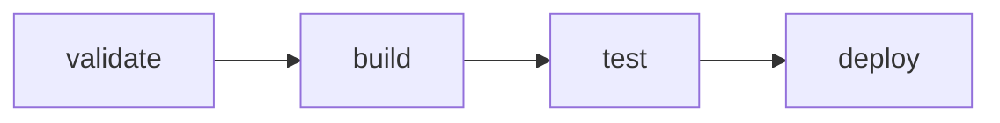

## CI/CD Pipeline Changes

<!-- Template for changes to GitLab CI/CD configuration -->

## Pipeline Information

| Field | Value |
|-------|-------|
| Files Changed | `.gitlab-ci.yml` / `.gitlab/ci/*.yml` |
| Component | |
| Affected Environments | `development` / `staging` / `production` |

## Type of Change

- [ ] New pipeline/job
- [ ] Job modification
- [ ] Variable/secret changes
- [ ] Runner configuration
- [ ] Artifact configuration
- [ ] External integration
- [ ] Security scan configuration
- [ ] Performance optimization
- [ ] Cache optimization

## Related Issues

Closes #

## Pipeline Changes

<!-- Include the key changes to the CI configuration -->
```yaml
# Key changes
```

## Agent Validation

### Enabled by Default
- [x] `@bot-mr-reviewer` - Code review
- [x] `@bot-gitlab-ci-fixer` - CI/CD validation

### CI Commands
```
/ci validate              - Validate CI YAML syntax
/ci lint                  - Lint CI configuration
/ci simulate              - Simulate pipeline execution
/fix pipeline             - Auto-fix common issues
/fix pipeline --aggressive - Aggressive auto-fix
```

## CI/CD Checklist

### Syntax & Structure
- [ ] YAML syntax is valid
- [ ] Job names follow naming convention
- [ ] Stage ordering is correct
- [ ] Dependencies are properly defined

### Security
- [ ] No secrets hardcoded in pipeline
- [ ] Sensitive variables are masked
- [ ] Runner tags are appropriate
- [ ] Protected branch rules respected

### Performance
- [ ] Caching configured appropriately
- [ ] Artifacts have proper expiration
- [ ] Jobs run in parallel where possible
- [ ] Unnecessary jobs are conditional

### Testing
- [ ] Pipeline passes on feature branch
- [ ] All jobs complete successfully
- [ ] No timeout issues

## Pipeline Diagram

<!-- Visualize the pipeline flow -->


## Environment Variables

| Variable | Environment | Purpose |
|----------|-------------|---------|
| | | |

## Affected Jobs

| Job Name | Stage | Changes |
|----------|-------|---------|
| | | |

## Local Testing

```bash
# Validate CI syntax locally
gitlab-ci-lint .gitlab-ci.yml

# Or use GitLab API
curl --header "PRIVATE-TOKEN: $GITLAB_TOKEN" \
  --data-urlencode "content=$(cat .gitlab-ci.yml)" \
  "https://gitlab.com/api/v4/ci/lint"
```

## Rollback Plan

<!-- How to revert if pipeline breaks -->
```bash
# Revert to previous working configuration
git revert <commit-sha>
```

## Documentation

- [ ] Pipeline documentation updated
- [ ] Variable documentation updated
- [ ] Runbook updated (if applicable)

/label ~ci-cd ~pipeline ~needs-review ~agent-assisted
/assign_reviewer @bot-gitlab-ci-fixer @bot-mr-reviewer
