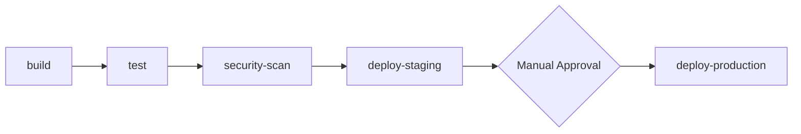

## ⚙️ CI/CD Pipeline Change

### Pipeline Information

| Field | Value |
|-------|-------|
| **File(s) Changed** | <!-- .gitlab-ci.yml, .gitlab/ci/*.yml --> |
| **Component** | <!-- If modifying a CI component --> |
| **Environment** | <!-- dev / staging / production / all --> |

### Change Type

- [ ] 🆕 New pipeline/job
- [ ] 📝 Job modification
- [ ] 🔧 Variable/secret change
- [ ] 🏃 Runner configuration
- [ ] 📦 Artifact/cache change
- [ ] 🔌 Integration update
- [ ] 🛡️ Security scan update
- [ ] ♻️ Pipeline optimization

## Summary

<!-- Describe the CI/CD changes -->

## Pipeline Changes

```yaml
# Key changes (paste relevant YAML)
```

---

## 🤖 CI/CD Agent Suite

### Automated Validation
- [x] `@bot-mr-reviewer` — General review
- [x] `@bot-gitlab-ci-fixer` — CI syntax validation (auto-enabled)
- [ ] `@bot-ossa-validator` — Validate OSSA manifests in pipeline
- [ ] `@bot-component-builder` — Generate/update CI component

### Agent Commands

```
/ci validate                 # Validate .gitlab-ci.yml syntax
/ci lint                     # Full CI linting
/ci simulate                 # Dry-run pipeline simulation
/fix pipeline               # Auto-fix common CI issues
/fix pipeline --aggressive   # Aggressive auto-fix
/component build <n>      # Generate CI component
/component validate          # Validate component syntax
/component publish           # Publish to component registry
```

---

## CI/CD Checklist

### Syntax & Structure
- [ ] YAML syntax valid
- [ ] Job names follow conventions
- [ ] Stages properly defined
- [ ] Dependencies correctly specified
- [ ] Rules/only/except logic correct

### Security
- [ ] No secrets in plain text
- [ ] CI variables used for sensitive data
- [ ] Proper variable masking
- [ ] Runner tags appropriate
- [ ] No privilege escalation

### Performance
- [ ] Appropriate caching strategy
- [ ] Artifacts properly scoped
- [ ] Parallel jobs where possible
- [ ] Timeout values set
- [ ] Resource tags appropriate

### Components (if applicable)
- [ ] Component inputs documented
- [ ] Defaults sensible
- [ ] Version pinned appropriately
- [ ] Backwards compatible

---

## Pipeline Diagram



---

## Environment Variables

| Variable | Environment | Description |
|----------|-------------|-------------|
| `MY_VAR` | All | Description |

## Affected Jobs

| Job | Stage | Change |
|-----|-------|--------|
| `build` | build | Modified |
| `test:unit` | test | New |

---

## Testing

### Local Testing
```bash
# Validate locally
gitlab-ci-lint .gitlab-ci.yml

# Simulate pipeline
gitlab-ci-local --list
```

### Pipeline Run
- [ ] Pipeline passes on this MR
- [ ] No regression in existing jobs
- [ ] New jobs execute correctly

---

## Rollback Plan

```yaml
# Previous working configuration
# (paste relevant YAML for quick rollback)
```

---

## Related Documentation

- [ ] CI/CD documentation updated
- [ ] README updated (if new workflows)
- [ ] Runbook updated (production changes)

---

/label ~"ci-cd" ~"infrastructure" ~"needs-validation"
/assign_reviewer @bot-mr-reviewer @bot-gitlab-ci-fixer
