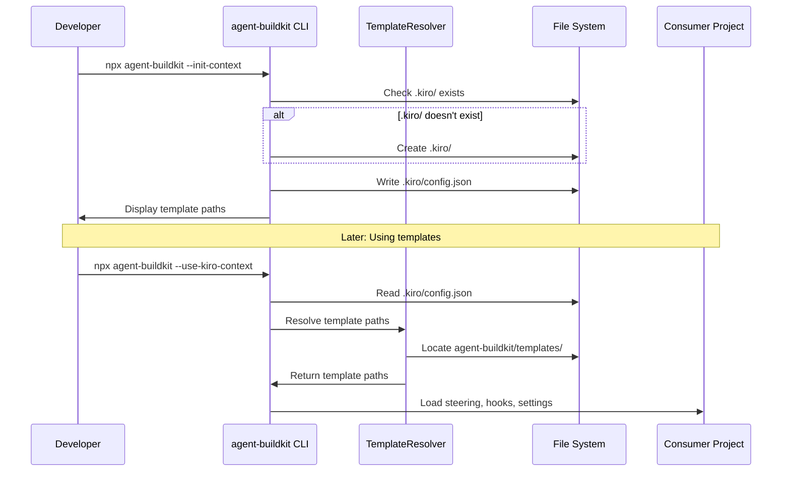

# Design Document

## Overview

This design extends agent-buildkit with a centralized template management system that eliminates the need to copy configuration files across 40+ ecosystem projects. The solution adds a `templates/` directory to agent-buildkit containing reusable steering rules, hooks, MCP server configurations, spec templates, and test templates. Projects initialize with a minimal `.kiro/config.json` pointer file, and the existing `--use-kiro-context` flag is enhanced to resolve templates from agent-buildkit's package directory.

The design follows the DRY principle by making agent-buildkit the single source of truth for IDE configurations across the entire ecosystem, including OSSA, Drupal modules, npm packages, and agent-studio.

## Architecture

### High-Level Architecture

```
agent-buildkit (npm package)
├── templates/                    # NEW: Template directory
│   ├── steering/                 # Steering rules
│   ├── hooks/                    # Agent hooks
│   ├── settings/                 # IDE settings (mcp.json, context.json)
│   ├── specs/                    # Spec templates
│   ├── tests/                    # Test templates
│   └── mcp-servers/              # MCP server configs
├── src/
│   ├── cli/
│   │   └── commands/
│   │       └── init-context.ts   # NEW: Context initialization command
│   ├── lib/
│   │   ├── template-resolver.ts  # NEW: Template path resolution
│   │   └── context-loader.ts     # ENHANCED: Load templates
│   └── types/
│       └── templates.ts          # NEW: Template type definitions
└── docs/
    └── templates.md              # NEW: Template documentation

Consumer Project
├── .kiro/
│   └── config.json               # Pointer to agent-buildkit templates
└── package.json                  # Depends on @bluefly/agent-buildkit
```

### Component Interaction Flow



## Components and Interfaces

### 1. Template Directory Structure

The `templates/` directory organizes reusable configurations by category:

```
templates/
├── README.md                     # Overview of template system
├── steering/
│   ├── README.md
│   ├── api-first.md              # OSSA/OpenAPI patterns
│   ├── react-components.md       # React/studio-ui patterns
│   ├── drupal-modules.md         # Drupal 10+ development
│   ├── npm-packages.md           # npm package patterns
│   └── zod-validation.md         # Zod schema validation
├── hooks/
│   ├── README.md
│   ├── openapi-validate.json     # OpenAPI schema validation
│   ├── drupal-standards.json     # Drupal coding standards
│   └── test-on-save.json         # Run tests on file save
├── settings/
│   ├── README.md
│   ├── mcp-gitlab.json           # GitLab MCP config
│   ├── mcp-kubernetes.json       # K8s MCP config
│   ├── mcp-orbstack.json         # OrbStack local K8s
│   └── context-defaults.json     # Default context settings
├── specs/
│   ├── README.md
│   ├── api-endpoint.md           # OpenAPI endpoint spec template
│   ├── drupal-module.md          # Drupal module spec template
│   ├── npm-package.md            # npm package spec template
│   └── react-component.md        # React component spec template
├── tests/
│   ├── README.md
│   ├── api-test.template.ts      # API test template
│   ├── zod-validation.template.ts # Zod validation test
│   └── drupal-unit.template.php  # Drupal unit test
└── mcp-servers/
    ├── README.md
    ├── gitlab-ci.json            # GitLab CI/CD MCP
    ├── kubernetes-prod.json      # Production K8s MCP
    ├── kubernetes-local.json     # OrbStack local K8s MCP
    └── drupal-agents.json        # Drupal AI agent MCP configs
```

### 2. CLI Command: init-context

**File:** `src/cli/commands/init-context.ts`

**Purpose:** Initialize a consumer project with minimal configuration

**Interface:**
```typescript
interface InitContextOptions {
  force?: boolean;           // Overwrite existing config
  template?: string[];       // Copy specific templates
  interactive?: boolean;     // Interactive template selection
}

export async function initContext(options: InitContextOptions): Promise<void>
```

**Behavior:**
1. Check if `.kiro/` directory exists, create if missing
2. Check if `.kiro/config.json` exists
3. If exists and no `--force`, prompt for confirmation
4. Write `.kiro/config.json` with agent-buildkit template reference
5. If `--template` flag provided, copy specified templates to project
6. Display available template paths and usage instructions

### 3. Template Resolver

**File:** `src/lib/template-resolver.ts`

**Purpose:** Resolve template paths from agent-buildkit package

**Interface:**
```typescript
interface TemplateResolverOptions {
  projectRoot: string;
  configPath?: string;
}

interface ResolvedTemplates {
  steering: string[];
  hooks: string[];
  settings: string[];
  specs: string[];
  tests: string[];
  mcpServers: string[];
}

export class TemplateResolver {
  constructor(options: TemplateResolverOptions);
  
  // Resolve all template paths
  resolveAll(): Promise<ResolvedTemplates>;
  
  // Resolve specific template category
  resolveCategory(category: TemplateCategory): Promise<string[]>;
  
  // Get template content
  getTemplate(category: TemplateCategory, name: string): Promise<string>;
  
  // Check for local overrides
  hasLocalOverride(category: TemplateCategory, name: string): Promise<boolean>;
}

type TemplateCategory = 'steering' | 'hooks' | 'settings' | 'specs' | 'tests' | 'mcp-servers';
```

### 4. Context Loader (Enhanced)

**File:** `src/lib/context-loader.ts`

**Purpose:** Load templates when `--use-kiro-context` flag is used

**Interface:**
```typescript
interface ContextLoaderOptions {
  projectRoot: string;
  useLocalOverrides?: boolean;
}

interface LoadedContext {
  steering: SteeringRule[];
  hooks: Hook[];
  settings: Settings;
  mcpServers: MCPServerConfig[];
}

export class ContextLoader {
  constructor(options: ContextLoaderOptions);
  
  // Load all context
  loadAll(): Promise<LoadedContext>;
  
  // Load specific category
  loadCategory(category: TemplateCategory): Promise<any[]>;
  
  // Merge local overrides with package templates
  mergeWithOverrides(templates: any[], category: TemplateCategory): Promise<any[]>;
}
```

### 5. Configuration File Format

**File:** `.kiro/config.json` (in consumer projects)

```json
{
  "version": "1.0",
  "templateSource": "@bluefly/agent-buildkit",
  "templateVersion": "^2.0.0",
  "overrides": {
    "steering": ["./custom-steering.md"],
    "hooks": [],
    "settings": ["./custom-mcp.json"]
  },
  "disabled": {
    "steering": [],
    "hooks": ["test-on-save"],
    "mcpServers": []
  }
}
```

## Data Models

### Template Metadata

```typescript
interface TemplateMetadata {
  name: string;
  category: TemplateCategory;
  description: string;
  version: string;
  tags: string[];
  applicableTo: ProjectType[];
  dependencies?: string[];
}

type ProjectType = 
  | 'drupal-module'
  | 'npm-package'
  | 'react-app'
  | 'openapi-service'
  | 'drupal-recipe';
```

### Steering Rule

```typescript
interface SteeringRule {
  name: string;
  content: string;
  inclusion: 'always' | 'conditional' | 'manual';
  fileMatchPattern?: string;
  priority: number;
}
```

### Hook Configuration

```typescript
interface Hook {
  name: string;
  trigger: HookTrigger;
  action: HookAction;
  enabled: boolean;
}

type HookTrigger = 
  | 'on-save'
  | 'on-message'
  | 'on-session-start'
  | 'on-agent-complete';

interface HookAction {
  type: 'send-message' | 'execute-command';
  payload: string;
}
```

### MCP Server Configuration

```typescript
interface MCPServerConfig {
  name: string;
  command: string;
  args: string[];
  env?: Record<string, string>;
  disabled: boolean;
  autoApprove: string[];
}
```

## Error Handling

### Error Types

```typescript
enum TemplateErrorCode {
  CONFIG_NOT_FOUND = 'CONFIG_NOT_FOUND',
  TEMPLATE_NOT_FOUND = 'TEMPLATE_NOT_FOUND',
  INVALID_CONFIG = 'INVALID_CONFIG',
  PERMISSION_DENIED = 'PERMISSION_DENIED',
  TEMPLATE_PARSE_ERROR = 'TEMPLATE_PARSE_ERROR',
}

class TemplateError extends Error {
  constructor(
    public code: TemplateErrorCode,
    message: string,
    public details?: any
  ) {
    super(message);
  }
}
```

### Error Handling Strategy

1. **Missing Configuration**: If `.kiro/config.json` not found, provide helpful message suggesting `--init-context`
2. **Template Not Found**: Fall back to default behavior, log warning
3. **Invalid Configuration**: Validate config schema, provide specific error messages
4. **Permission Errors**: Check file permissions, suggest fixes
5. **Parse Errors**: Catch JSON/YAML parse errors, show line numbers

## Testing Strategy

### Unit Testing

We'll use Jest for unit testing with the following focus areas:

1. **Template Resolver Tests**
   - Test path resolution for all template categories
   - Test local override detection
   - Test template content retrieval
   - Test error handling for missing templates

2. **Context Loader Tests**
   - Test loading all context categories
   - Test merging local overrides with package templates
   - Test priority ordering of steering rules
   - Test disabled template filtering

3. **CLI Command Tests**
   - Test `--init-context` creates correct directory structure
   - Test `--init-context --force` overwrites existing config
   - Test `--template` flag copies specific templates
   - Test interactive mode prompts

4. **Configuration Validation Tests**
   - Test valid config.json parsing
   - Test invalid config.json error handling
   - Test schema validation

### Property-Based Testing

We'll use fast-check for property-based testing. The testing strategy will focus on universal properties that should hold across all inputs.

**Property-Based Testing Library:** fast-check (for TypeScript/JavaScript)

**Configuration:** Each property-based test will run a minimum of 100 iterations.

**Tagging Convention:** Each property-based test will include a comment with the format:
`// Feature: agent-buildkit-templates, Property {number}: {property_text}`


## Correctness Properties

*A property is a characteristic or behavior that should hold true across all valid executions of a system-essentially, a formal statement about what the system should do. Properties serve as the bridge between human-readable specifications and machine-verifiable correctness guarantees.*

### Property 1: Template directory structure completeness

*For any* installation of agent-buildkit, all required template subdirectories (steering, hooks, settings, specs, tests, mcp-servers) should exist in the templates/ directory.

**Validates: Requirements 1.2, 8.2**

### Property 2: Template accessibility via node_modules

*For any* consumer project with agent-buildkit installed, the templates directory should be resolvable via standard Node.js module resolution.

**Validates: Requirements 1.5**

### Property 3: Template persistence across updates

*For any* version update of agent-buildkit, the template resolution mechanism should continue to work without requiring manual file copying.

**Validates: Requirements 2.3**

### Property 4: Config file template reference

*For any* initialization via `--init-context`, the created `.kiro/config.json` file should contain a valid reference to agent-buildkit's template directory.

**Validates: Requirements 3.3**

### Property 5: Config preservation without force flag

*For any* existing `.kiro/config.json` file, running `--init-context` without `--force` should preserve the existing configuration.

**Validates: Requirements 3.5**

### Property 6: Config file discovery with context flag

*For any* project with a `.kiro/config.json` file, invoking `--use-kiro-context` should successfully locate the configuration file.

**Validates: Requirements 4.1**

### Property 7: Template path resolution from config

*For any* valid `.kiro/config.json` file, the template resolver should resolve paths to agent-buildkit's templates directory.

**Validates: Requirements 4.2**

### Property 8: Complete template category loading

*For any* resolved template configuration, all template categories (steering, hooks, settings) should be loaded.

**Validates: Requirements 4.3**

### Property 9: MCP template JSON validity

*For any* MCP server template file in templates/mcp-servers/, the file content should parse as valid JSON.

**Validates: Requirements 5.4**

### Property 10: Template documentation completeness

*For any* MCP server template, corresponding documentation should exist either in the template directory README or the docs directory.

**Validates: Requirements 5.5**

### Property 11: README presence in template directories

*For any* template category subdirectory, a README.md file should exist providing documentation for that category.

**Validates: Requirements 8.3**

### Property 12: Template copy structure preservation

*For any* template copied to a consumer project using `--template`, the copied file structure should match the original template structure in agent-buildkit.

**Validates: Requirements 9.3**

### Property 13: Local override priority

*For any* template file that exists both in agent-buildkit and locally in the consumer project, the local file should be loaded instead of the package template.

**Validates: Requirements 9.4, 9.5**

### Property 14: OSSA schema reference resolution

*For any* OSSA schema reference in templates, the path should resolve to a valid location when `--use-kiro-context` is used.

**Validates: Requirements 10.5**

### Integration Tests

Integration tests will verify end-to-end workflows:

1. **Full Initialization Workflow**
   - Install agent-buildkit in a new project
   - Run `--init-context`
   - Verify `.kiro/config.json` created
   - Run `--use-kiro-context`
   - Verify templates loaded correctly

2. **Template Override Workflow**
   - Initialize project with templates
   - Copy a template locally and modify it
   - Run `--use-kiro-context`
   - Verify local template used instead of package template

3. **Update Workflow**
   - Initialize project with agent-buildkit v1
   - Update to agent-buildkit v2
   - Run `--use-kiro-context`
   - Verify new templates accessible

4. **Selective Template Copy Workflow**
   - Run `--init-context --template steering,hooks`
   - Verify only steering and hooks copied
   - Verify other templates still accessible from package

