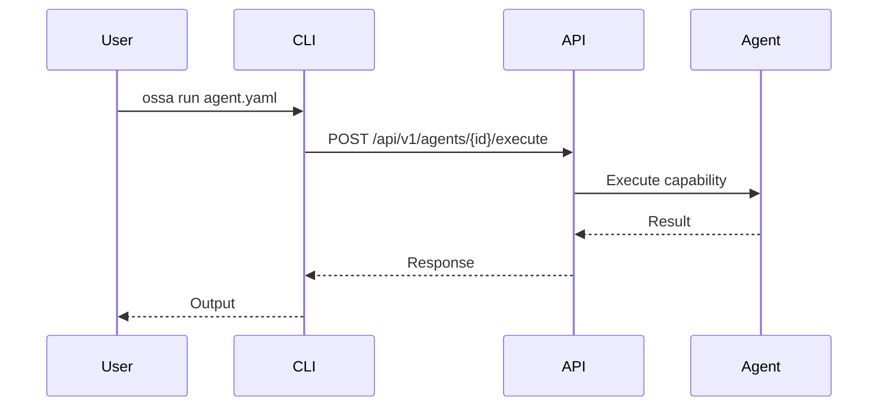

# Documentation Implementation Guide

**Quick Start**: Transform OSSA documentation into a showcase project

## Executive Summary

This guide provides step-by-step instructions to:
1. Restructure all documentation into a single source of truth
2. Auto-generate API, CLI, and schema documentation
3. Set up GitLab agents for self-healing documentation
4. Implement CI/CD pipelines for documentation validation

**Time Estimate**: 2-3 weeks for complete implementation

---

## Phase 1: Setup & Foundation (Days 1-2)

### Step 1: Review Current State

```bash
# Run the documentation audit
cat DOCUMENTATION_AUDIT.md

# Check current documentation locations
find . -name "*.md" -not -path "*/node_modules/*" | wc -l
```

### Step 2: Install Dependencies

```bash
# Install documentation generation tools
npm install --save-dev \
  @redocly/cli \
  markdown-link-check \
  remark \
  remark-lint \
  js-yaml

# Make scripts executable
chmod +x scripts/generate-*.ts
```

### Step 3: Create Directory Structure

```bash
# Create documentation directories
mkdir -p website/content/docs/{cli-reference,api-reference,schema-reference,guides,architecture}

# Create GitLab wiki structure
mkdir -p .gitlab/wiki/{Development,Infrastructure,Operations,Architecture}
```

---

## Phase 2: CLI Documentation (Days 3-5)

### Step 1: Generate CLI Documentation

```bash
# Generate CLI docs from source
npm run docs:cli:generate

# Review generated files
ls -la website/content/docs/cli-reference/
```

### Step 2: Enhance CLI Documentation

For each command, add:
1. Real-world examples
2. Common error scenarios
3. Troubleshooting tips
4. Links to related API endpoints

**Template Location**: See `DOCUMENTATION_AUDIT.md` → CLI Reference Documentation Template

### Step 3: Test CLI Documentation

```bash
# Test each command example
ossa validate examples/minimal/agent.ossa.yaml
ossa generate worker --name "Test Agent"
# ... test all commands
```

---

## Phase 3: API Documentation (Days 6-8)

### Step 1: Generate API Documentation

```bash
# Generate API docs from OpenAPI specs
npm run docs:api:generate

# Review generated files
ls -la website/content/docs/api-reference/
```

### Step 2: Enhance API Documentation

For each endpoint, add:
1. Authentication examples
2. Error response examples
3. Rate limiting information
4. SDK code examples (if available)

### Step 3: Test API Documentation

```bash
# Test API endpoints with curl
curl -X GET "https://api.ossa.dev/api/v1/agents" \
  -H "Authorization: Bearer YOUR_TOKEN"

# Validate OpenAPI specs
npx @redocly/cli lint openapi/core/*.yaml
```

---

## Phase 4: Schema Documentation (Days 9-11)

### Step 1: Generate Schema Documentation

```bash
# Generate schema docs from JSON Schema
npm run docs:schema:generate

# Review generated files
ls -la website/content/docs/schema-reference/
```

### Step 2: Enhance Schema Documentation

For each field, ensure it has:
1. **Why**: Purpose and use cases
2. **How**: Usage instructions
3. **Where**: Context in architecture
4. **Examples**: Real-world YAML examples
5. **Validation**: Validation rules
6. **Related**: Cross-links to related fields

**Template Location**: See `DOCUMENTATION_AUDIT.md` → Schema Reference Documentation Template

### Step 3: Add Field Examples

```yaml
# Example: agent.id field documentation
agent:
  id: my-agent-prod  # DNS-1123 format
  name: My Agent
  version: "1.0.0"
  role: worker
```

---

## Phase 5: Architecture & Guides (Days 12-14)

### Step 1: Create Architecture Diagrams

Use Mermaid.js for diagrams:

```markdown
## CLI to API Flow


```

### Step 2: Write Deployment Guides

Create guides for:
- Local development setup
- Docker deployment
- Kubernetes deployment
- GitLab CI/CD integration

### Step 3: Write Security Guide

Document:
- Authentication methods
- API key management
- Secret handling
- Network security
- Compliance requirements

---

## Phase 6: Automation Setup (Days 15-17)

### Step 1: Configure GitLab CI/CD

Add to `.gitlab-ci.yml`:

```yaml
# Documentation generation
docs:generate:
  stage: docs
  image: node:20
  script:
    - npm ci
    - npm run docs:generate
  artifacts:
    paths:
      - website/content/docs/
    expire_in: 1 week
  only:
    changes:
      - openapi/**/*
      - src/cli/**/*
      - spec/**/*
      - scripts/generate-*.ts

# Documentation validation
docs:validate:
  stage: test
  image: node:20
  script:
    - npm ci
    - npm run docs:lint
    - npx markdown-link-check website/content/docs/**/*.md
  only:
    changes:
      - website/content/docs/**/*

# Documentation deployment
docs:deploy:
  stage: deploy
  image: node:20
  script:
    - cd website
    - npm ci
    - npm run build
    - npm run deploy
  only:
    - main
  environment:
    name: production
    url: https://openstandardagents.org
```

### Step 2: Deploy Documentation Agent

```bash
# Deploy the doc agent
kubectl apply -f .gitlab/agents/doc-agent/manifest.ossa.yaml

# Verify deployment
kubectl get pods -l app=doc-agent
```

### Step 3: Set Up Scheduled Documentation Updates

```yaml
# .gitlab-ci.yml
docs:scheduled:
  stage: docs
  script:
    - npm run docs:generate
    - git add website/content/docs/
    - git commit -m "docs: auto-update documentation [skip ci]"
    - git push
  only:
    - schedules
```

---

## Phase 7: Testing & Validation (Days 18-19)

### Step 1: Validate Documentation Completeness

```bash
# Check for missing documentation
npm run docs:validate

# Check for broken links
npx markdown-link-check website/content/docs/**/*.md

# Check for outdated examples
npm run test:examples
```

### Step 2: User Testing

1. Ask 3-5 users to:
   - Follow the getting started guide
   - Try CLI commands from documentation
   - Test API endpoints from examples
   - Create an agent using schema reference

2. Collect feedback on:
   - Clarity of instructions
   - Completeness of examples
   - Ease of navigation
   - Missing information

### Step 3: Fix Issues

Based on feedback:
1. Update unclear documentation
2. Add missing examples
3. Fix broken links
4. Improve navigation

---

## Phase 8: Launch & Promotion (Days 20-21)

### Step 1: Final Review

- [ ] All CLI commands documented
- [ ] All API endpoints documented
- [ ] All schema fields documented
- [ ] All examples tested
- [ ] All links working
- [ ] CI/CD pipeline passing

### Step 2: Announce Documentation

1. **Blog Post**: "OSSA Documentation: A New Standard"
2. **Social Media**: Share highlights
3. **Community**: Announce in Discord/Slack
4. **README**: Update with documentation links

### Step 3: Monitor Usage

Track:
- Page views
- Search queries
- User feedback
- Issue reports

---

## Automation Scripts Reference

### Generate All Documentation

```bash
# Generate all documentation at once
npm run docs:generate

# Or individually
npm run docs:api:generate
npm run docs:cli:generate
npm run docs:schema:generate
```

### Validate Documentation

```bash
# Lint markdown
npm run docs:lint

# Check links
npx markdown-link-check website/content/docs/**/*.md

# Validate examples
npm run test:examples
```

### Deploy Documentation

```bash
# Build website
cd website
npm run build

# Deploy to production
npm run deploy
```

---

## GitLab Agent Configuration

### Documentation Agent

The doc agent automatically:
1. Generates API docs when OpenAPI specs change
2. Generates CLI docs when commands change
3. Generates schema docs when schema changes
4. Validates documentation completeness
5. Syncs to GitLab wiki

**Manifest**: `.gitlab/agents/doc-agent/manifest.ossa.yaml`

### Triggering the Agent

```bash
# Manual trigger
gitlab-ci-multi-runner exec docker docs:generate

# Automatic trigger (on commit)
git commit -m "feat: add new API endpoint"
git push
# Agent runs automatically via CI/CD
```

---

## Maintenance & Updates

### Weekly Tasks

- [ ] Review documentation issues
- [ ] Update examples with new features
- [ ] Check for broken links
- [ ] Update version-specific docs

### Monthly Tasks

- [ ] Review analytics
- [ ] Update based on user feedback
- [ ] Audit documentation completeness
- [ ] Update screenshots/diagrams

### Quarterly Tasks

- [ ] Major documentation review
- [ ] Update architecture diagrams
- [ ] Refresh all examples
- [ ] User survey

---

## Success Metrics

### Completeness Metrics

- **CLI Coverage**: 11/11 commands documented (100%)
- **API Coverage**: 4/4 core APIs documented (100%)
- **Schema Coverage**: 50+ fields documented
- **Example Coverage**: Every command/endpoint has examples

### Quality Metrics

- **Link Health**: 0 broken links
- **Example Validity**: 100% of examples tested and working
- **User Satisfaction**: >4.5/5 rating
- **Time to First Agent**: <15 minutes

### Automation Metrics

- **Auto-Generation**: 100% of API/CLI/Schema docs auto-generated
- **CI/CD Success Rate**: >95%
- **Documentation Lag**: <24 hours from code change to doc update

---

## Troubleshooting

### Issue: Documentation generation fails

**Solution**:
```bash
# Check dependencies
npm ci

# Check script permissions
chmod +x scripts/generate-*.ts

# Run with verbose logging
DEBUG=* npm run docs:generate
```

### Issue: Broken links in documentation

**Solution**:
```bash
# Find broken links
npx markdown-link-check website/content/docs/**/*.md

# Fix links automatically (if possible)
npm run docs:fix-links
```

### Issue: Examples not working

**Solution**:
```bash
# Test all examples
npm run test:examples

# Update examples
npm run examples:update
```

---

## Next Steps

1. **Review this guide** with the team
2. **Assign owners** for each phase
3. **Create GitLab issues** for each task
4. **Set up project board** for tracking
5. **Schedule kickoff meeting**
6. **Begin Phase 1**

---

## Resources

- [Documentation Audit](./DOCUMENTATION_AUDIT.md)
- [API Documentation Template](./DOCUMENTATION_AUDIT.md#api-reference-documentation-template)
- [CLI Documentation Template](./DOCUMENTATION_AUDIT.md#cli-reference-documentation-template)
- [Schema Documentation Template](./DOCUMENTATION_AUDIT.md#schema-reference-documentation-template)
- [GitLab CI/CD Documentation](https://docs.gitlab.com/ee/ci/)
- [Markdown Best Practices](https://www.markdownguide.org/basic-syntax/)

---

## Questions?

Open an issue or reach out to the documentation team:
- GitLab: https://gitlab.com/blueflyio/openstandardagents/-/issues
- Discord: https://discord.gg/ossa
- Email: docs@ossa.dev
