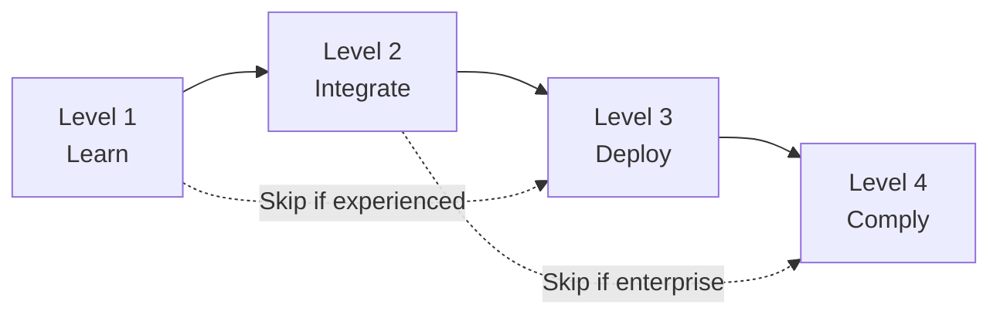

# 🎯 OAAS Complexity Level Decision Guide

> **Stop guessing. Use this guide to choose the right complexity level for your agent.**

## 📊 Quick Decision Matrix

| Your Situation | Recommended Level | Example to Use |
|----------------|-------------------|----------------|
| "I'm learning OAAS" | Level 1 | `01-agent-basic` |
| "I need a quick prototype" | Level 1 | `01-agent-basic` |
| "I need to integrate with LangChain" | Level 2 | `02-agent-integration` |
| "I need REST API endpoints" | Level 2 | `02-agent-integration` |
| "We're deploying to production" | Level 3 | `03-agent-production` |
| "We need monitoring and metrics" | Level 3 | `03-agent-production` |
| "We must meet compliance requirements" | Level 4 | `04-agent-enterprise` |
| "We handle sensitive data" | Level 4 | `04-agent-enterprise` |

## 🔍 Detailed Decision Criteria

### Choose Level 1 (Basic - 30 lines) When:
✅ You have **ALL** of these:
- [ ] Learning or experimenting with OAAS
- [ ] Building a proof of concept
- [ ] Single-purpose agent with <5 capabilities
- [ ] No API endpoints needed
- [ ] No production deployment planned
- [ ] Working alone or small team

❌ You have **ANY** of these:
- [ ] Need REST API endpoints
- [ ] Multiple framework integrations
- [ ] Production deployment
- [ ] Security requirements
- [ ] Compliance needs

**Your agent.yml will have:**
```yaml
name, version, expertise, capabilities, frameworks (basic)
```

### Choose Level 2 (Integration - 50 lines) When:
✅ You have **ANY** of these:
- [ ] Need to expose REST API endpoints
- [ ] Integrating with multiple AI frameworks
- [ ] Building tools for LangChain/CrewAI
- [ ] Need authentication (basic)
- [ ] Rate limiting requirements
- [ ] Small team collaboration

❌ You have **ANY** of these:
- [ ] Production deployment with SLAs
- [ ] Monitoring/metrics requirements
- [ ] Compliance frameworks
- [ ] Audit trail needs
- [ ] Multi-region deployment

**Your agent.yml will have:**
```yaml
Everything from Level 1 PLUS:
- OpenAPI specification
- Framework configurations
- Authentication settings
- Rate limiting
```

### Choose Level 3 (Production - 200 lines) When:
✅ You have **ANY** of these:
- [ ] Deploying to production environment
- [ ] Need monitoring and metrics (Prometheus)
- [ ] Security requirements (JWT, encryption)
- [ ] Health checks and auto-scaling
- [ ] Performance SLAs
- [ ] Logging and tracing needs
- [ ] Docker/Kubernetes deployment

❌ You have **ANY** of these:
- [ ] Regulatory compliance (SOX, HIPAA, GDPR)
- [ ] Forensic audit requirements
- [ ] Multi-region deployment
- [ ] Data governance policies
- [ ] Enterprise authentication (SAML, OAuth2)

**Your agent.yml will have:**
```yaml
Everything from Level 2 PLUS:
- Security configuration
- Monitoring setup
- Deployment specifications
- Health checks
- Resource limits
- Logging configuration
```

### Choose Level 4 (Enterprise - 400+ lines) When:
✅ You have **ANY** of these:
- [ ] Regulatory compliance requirements
- [ ] ISO 42001 certification needs
- [ ] NIST AI RMF compliance
- [ ] EU AI Act requirements
- [ ] SOX, HIPAA, or GDPR compliance
- [ ] Forensic audit trails
- [ ] Multi-region deployment
- [ ] Disaster recovery requirements
- [ ] Enterprise SSO integration
- [ ] Data classification policies

**Your agent.yml will have:**
```yaml
Everything from Level 3 PLUS:
- Compliance frameworks
- Audit configuration
- Data governance
- Multi-region setup
- Disaster recovery
- Advanced security
```

## 📈 Progressive Enhancement Path



### Upgrade Triggers

| From → To | Trigger Event | What to Add |
|-----------|---------------|-------------|
| L1 → L2 | Need API endpoints | OpenAPI spec, framework configs |
| L1 → L2 | Multiple frameworks | Framework configurations |
| L2 → L3 | Going to production | Security, monitoring, deployment |
| L2 → L3 | Need metrics | Prometheus, logging, tracing |
| L3 → L4 | Compliance audit | Compliance frameworks, governance |
| L3 → L4 | Enterprise requirements | Multi-region, DR, forensic logging |

## 🎲 Real-World Scenarios

### Scenario 1: Startup Building MVP
**Situation**: "We're a 3-person startup building an AI code reviewer"
**Decision**: Start with Level 1, upgrade to Level 2 when adding API
**Reasoning**: Focus on functionality first, add complexity later

### Scenario 2: Enterprise Adding AI to Existing System
**Situation**: "Fortune 500 adding AI agents to banking platform"
**Decision**: Start with Level 4
**Reasoning**: Compliance is mandatory from day one

### Scenario 3: Open Source Tool
**Situation**: "Building a LangChain tool for the community"
**Decision**: Use Level 2
**Reasoning**: Needs framework integration but not production features

### Scenario 4: SaaS Platform
**Situation**: "Multi-tenant SaaS with AI agents"
**Decision**: Use Level 3
**Reasoning**: Production features needed, compliance depends on customers

## ⚠️ Common Mistakes to Avoid

### Mistake 1: Over-Engineering
❌ **Wrong**: Starting with Level 4 for a prototype
✅ **Right**: Start with Level 1, upgrade as needed

### Mistake 2: Under-Engineering
❌ **Wrong**: Using Level 1 in production
✅ **Right**: Level 3 minimum for production

### Mistake 3: Skipping Levels
❌ **Wrong**: Jump from Level 1 to Level 4
✅ **Right**: Progressive enhancement through levels

### Mistake 4: Framework Overload
❌ **Wrong**: Enabling all frameworks in Level 2
✅ **Right**: Only enable frameworks you actively use

## 🏃 Quick Start Commands

Based on your decision:

### Level 1 - Basic
```bash
cp -r examples/01-agent-basic ~/.agents/my-agent
cd ~/.agents/my-agent
# Edit agent.yml
oaas validate agent.yml
```

### Level 2 - Integration
```bash
cp -r examples/02-agent-integration ~/.agents/my-agent
cd ~/.agents/my-agent
# Edit agent.yml and openapi.yaml
oaas validate agent.yml
oaas export --format=langchain  # Test framework
```

### Level 3 - Production
```bash
cp -r examples/03-agent-production ~/.agents/my-agent
cd ~/.agents/my-agent
# Full configuration needed
docker build -t my-agent .
docker run -p 3000:3000 my-agent
```

### Level 4 - Enterprise
```bash
cp -r examples/04-agent-enterprise ~/.agents/my-agent
cd ~/.agents/my-agent
# Requires compliance review
# Requires security audit
# Requires legal approval
```

## 📏 Sizing Guidelines

| Level | YAML Lines | Files | Setup Time | Maintenance |
|-------|------------|-------|------------|-------------|
| 1 | ~30 | 1-2 | 5 minutes | Low |
| 2 | ~50 | 2-3 | 30 minutes | Medium |
| 3 | ~200 | 4-6 | 2-4 hours | High |
| 4 | 400+ | 8-12 | 1-2 days | Very High |

## ✅ Final Checklist

Before choosing, answer these:

1. **What is your timeline?**
   - Hours → Level 1
   - Days → Level 2
   - Weeks → Level 3
   - Months → Level 4

2. **What is your team size?**
   - 1 person → Level 1-2
   - 2-5 people → Level 2-3
   - 5+ people → Level 3-4

3. **What are your requirements?**
   - Learning → Level 1
   - Integration → Level 2
   - Production → Level 3
   - Compliance → Level 4

4. **What is your budget?**
   - $0 → Level 1-2
   - <$10K → Level 2-3
   - >$10K → Level 3-4

## 🆘 Still Unsure?

**Default recommendation**: Start with Level 2
- Not too simple, not too complex
- Covers most use cases
- Easy to upgrade or downgrade
- Good learning experience

**When in doubt**: Ask yourself:
1. "Will this go to production?" → Yes: Level 3+
2. "Do I need compliance?" → Yes: Level 4
3. "Am I just learning?" → Yes: Level 1
4. Otherwise → Level 2

---

**Remember**: You can always upgrade. Starting simple and upgrading is better than starting complex and getting stuck.