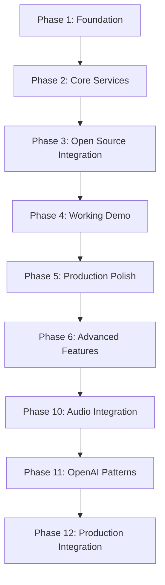

# OSSA Roadmap Phases Overview

## Development Phases Timeline

### ✅ Completed Phases

#### Phase 1: Foundation (Week 1-2) - COMPLETED
**Core Infrastructure & Validation**

- [x] Agent-Forge: Fix module loading errors, update validator, create API templates
- [x] Compliance-Engine: OSSA v0.1.8 validation, FedRAMP/NIST mapping, compliance scoring
- [x] Infrastructure: Core schemas, base classes, taxonomy definitions

#### Phase 2: Core Services (Week 3-4) - COMPLETED  
**API Gateway & Service Infrastructure**

- [x] Agent-Router: Discovery protocol, multi-protocol support, OAuth2/JWT auth
- [x] Agent-Orchestra: v0.1.8 orchestration API, workflow orchestration, scaling
- [x] Integration: Service mesh setup, observability, production deployment

### 🎯 Current & Upcoming Phases

#### Phase 3: Open Source Integration (Week 5) - IN PROGRESS
**Leverage Existing Frameworks**

- [ ] **MCP Integration**: Package agents as MCP servers using `@anthropic-ai/dxt`
- [ ] **LangChain Patterns**: Implement proven orchestration patterns
- [ ] **CrewAI Configuration**: Role-based agent teams with YAML config
- [ ] **AutoGen Conversation**: Conversational multi-agent systems

#### Phase 4: Working Demo (Week 6) - PLANNED
**Production-Ready Examples**

- [ ] **Functional CLI**: All commands execute without errors
- [ ] **MCP Server Example**: At least one working MCP server
- [ ] **Documentation**: Clear, honest documentation without fantasy claims
- [ ] **Integration Testing**: Cross-framework compatibility validation

#### Phase 5: Production Polish (Week 7) - PLANNED
**Enterprise Readiness**

- [ ] **Package Quality**: Clean dependencies, proper exclusions, remove unused scripts
- [ ] **Performance Optimization**: Token efficiency, latency improvements
- [ ] **Monitoring**: Comprehensive observability and alerting
- [ ] **Security**: Enterprise-grade security validation

#### Phase 6: Advanced Features (Week 8) - PLANNED
**Enhanced Capabilities**

- [ ] **Multi-Modal Integration**: Audio processing with Whisper
- [ ] **Advanced Memory**: Hierarchical memory systems (hot/warm/cold)
- [ ] **Learning Systems**: Continuous improvement and adaptation
- [ ] **Governance**: Advanced compliance and audit features

## Multi-Modal Enhancement Roadmap (2025)

### Phase 10: Audio-First Agent Integration (Week 9-10)
**Whisper Speech Recognition Integration**

- [ ] **Audio Agent Class**: Extend with Whisper capabilities
- [ ] **Model Selection**: Turbo model (809M params, 8x speed)
- [ ] **Protocol Integration**: WebSocket for real-time audio streaming
- [ ] **Performance**: <500ms audio processing latency

### Phase 11: OpenAI Cookbook Pattern Implementation (Week 11-12)
**Universal Context Management**

- [ ] **Embedding-Based RAG**: Provider-agnostic retrieval
- [ ] **Dynamic Context**: Token-aware context selection
- [ ] **Tool Integration**: Multi-tool orchestration patterns
- [ ] **Performance**: Semantic caching and efficiency

### Phase 12: Production Integration (Week 13-14)
**CLI and System Integration**

- [ ] **Audio Commands**: Create audio-enabled agents via CLI
- [ ] **Context Pipeline**: Multi-modal context processing
- [ ] **Performance Metrics**: Audio processing and context preservation
- [ ] **Production Deployment**: Full system integration

## Historical Phase Evolution

### OAAS v0.1.1 → v0.1.6 Evolution (COMPLETED)

1. **Phase 1**: Core OAAS Specification & Schema Foundation
2. **Phase 2**: Conformance Program & Validation Framework  
3. **Phase 3**: Framework-Agnostic Adapters & Bridges
4. **Phase 4**: Governance, Compliance & Registry
5. **Phase 5**: Tooling, CI/CD & Developer Experience

### Implementation Phases (COMPLETED)

1. **Phase 1**: Prove Discovery Magic (Agent discovery across 1000+ agents)
2. **Phase 2**: Standardized Enhancement (Multi-level agent support)
3. **Phase 3**: Bridge Standards (MCP, LangChain, CrewAI integration)
4. **Phase 4**: Scale Through TDDAI (Enterprise workspace orchestration)

## Advanced Implementation Phases (PLANNED)

### Phase 5: Advanced Bridge Implementation
**Deep Framework Integration**

- Enhanced MCP server capabilities
- LangChain chain composition patterns
- CrewAI workflow optimization
- AutoGen conversation management

### Phase 6: Enterprise Workspace Orchestration - DEPLOYED
**Production Orchestration**

- [x] Workspace Orchestrator Service deployed
- [x] Multi-project agent coordination
- [x] Enterprise-grade scalability
- [x] Compliance and governance integration

### Phase 7: Comprehensive Validation & Testing
**Quality Assurance**

- [ ] Automated testing frameworks
- [ ] Performance benchmarking
- [ ] Security vulnerability assessment
- [ ] Compliance validation

### Phase 8: Production Deployment
**Full Scale Launch**

- [ ] Enterprise deployment automation
- [ ] Monitoring and alerting systems
- [ ] Customer onboarding processes
- [ ] Support and maintenance procedures

## Future Phases (Q2 2025 and Beyond)

### Phase 13: Automated Agent Research & Deployment (Week 15-16)
- Agent-architect deployment system
- Research agent creation and training
- Training data conversion across workspaces
- API specification generation

### Phase 14: Agent Naming Standards Integration (Week 17)
- Production-ready naming framework
- Integration with Agent-Architect
- Backwards compatibility maintenance
- Standard compliance validation

### Phase 15: Missing Infrastructure Implementation (Week 18-20)
- Advanced pipeline features
- Comprehensive CLI tool enhancements
- Enterprise monitoring and alerting
- Full governance implementation

## Phase Dependencies

## Success Criteria by Phase

### Phase 3 (Current)
- [ ] MCP servers functional
- [ ] LangChain integration working  
- [ ] CrewAI patterns implemented
- [ ] AutoGen conversations operational

### Phase 4 (Next)
- [ ] CLI commands execute without errors
- [ ] At least one working MCP server example
- [ ] Documentation honest and accurate
- [ ] Integration tests passing

### Phase 5 (Following)
- [ ] Package quality validated
- [ ] Performance benchmarks met
- [ ] Security audit passed
- [ ] Enterprise readiness confirmed

This phased approach ensures steady progress while maintaining quality and addressing real user needs through open source integration first.