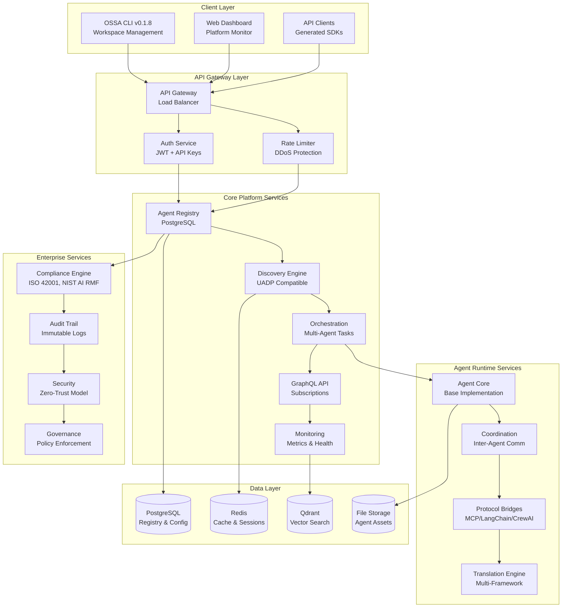
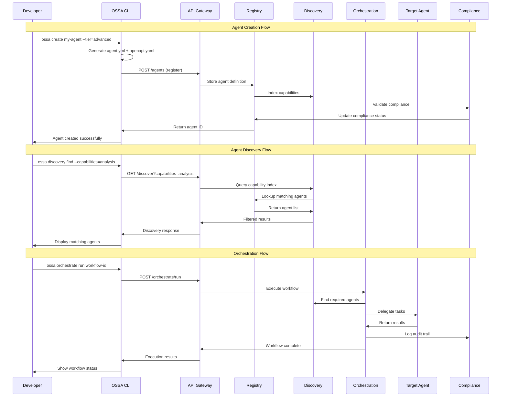

# OSSA Platform Architecture v0.1.8

## Overview

The Open Standards for Scalable Agents (OSSA) v0.1.8 platform provides a comprehensive microservices architecture for universal AI agent interoperability, discovery, orchestration, and management. Built with enterprise-grade compliance, security, and scalability.

## Platform Component Architecture



## Microservices Breakdown

### Core Platform Services

#### 1. Agent Registry (`/services/registry`)
- **Purpose**: Central repository for agent definitions and metadata
- **Database**: PostgreSQL with JSON columns for spec storage
- **Features**: 
  - CRUD operations for agent lifecycle
  - Version management and rollback
  - Health status tracking
  - Capability indexing
- **Port**: 3001
- **Health**: `/health`, `/metrics`

#### 2. Discovery Engine (`/services/discovery`)  
- **Purpose**: UADP-compatible agent discovery and capability matching
- **Features**:
  - Sub-50ms discovery for 1000+ agents
  - Hierarchical capability matching
  - Real-time registry updates
  - Semantic search with vector embeddings
- **Port**: 3002
- **Integration**: Qdrant vector database

#### 3. Orchestration Service (`/services/orchestration`)
- **Purpose**: Multi-agent task coordination and workflow management
- **Features**:
  - DAG-based workflow execution
  - Agent delegation and load balancing
  - State management and recovery
  - Performance optimization
- **Port**: 3003
- **Dependencies**: Registry, Discovery, Coordination

#### 4. GraphQL API (`/services/graphql`)
- **Purpose**: Unified query interface with real-time subscriptions
- **Features**:
  - Schema federation across services
  - Real-time agent status updates
  - Complex query optimization
  - Apollo Server integration
- **Port**: 3004
- **Schema**: Auto-generated from OpenAPI specs

#### 5. Monitoring Service (`/services/monitoring`)
- **Purpose**: Platform-wide observability and metrics collection
- **Features**:
  - Real-time performance metrics
  - Health check aggregation  
  - Alert management
  - SLA tracking and reporting
- **Port**: 3005
- **Storage**: InfluxDB for time-series data

### Agent Runtime Services

#### 6. Agent Core (`/services/agent-core`)
- **Purpose**: Base agent implementation and lifecycle management
- **Features**:
  - Standard OSSA agent interface
  - Protocol-agnostic communication
  - State persistence and recovery
  - Security context management
- **Integration**: All protocol bridges

#### 7. Coordination Service (`/services/coordination`)
- **Purpose**: Inter-agent communication and message routing
- **Features**:
  - Pub/sub messaging patterns
  - Request/response routing
  - Message queuing and reliability
  - Circuit breaker patterns
- **Transport**: Redis for message bus

#### 8. Protocol Bridges (`/services/bridges`)
- **Purpose**: Universal translation between AI frameworks
- **Supported Protocols**:
  - Model Context Protocol (MCP) v2024-11-05
  - LangChain Tools and Agents
  - CrewAI Agent and Task definitions
  - OpenAI Assistant API
  - Anthropic Tools API
- **Features**: Zero-code framework integration

### Enterprise Services

#### 9. Compliance Engine (`/services/compliance`)
- **Purpose**: Automated compliance validation and reporting
- **Frameworks**:
  - ISO 42001:2023 (AI Management Systems)
  - NIST AI RMF 1.0 (Risk Management)
  - EU AI Act 2024 (European regulation)
  - SOC 2 Type II (Security controls)
- **Features**: Continuous compliance monitoring

#### 10. Security Service (`/services/security`)
- **Purpose**: Zero-trust security model implementation  
- **Features**:
  - JWT token validation
  - API key management
  - Rate limiting and DDoS protection
  - Encryption key management
- **Integration**: All platform services

## CLI Workspace Architecture

### OSSA CLI v0.1.8 Structure

```
/Users/flux423/Sites/LLM/OSSA/
├── src/cli/                         # CLI workspace
│   ├── bin/ossa                    # Main CLI entry point
│   ├── src/                        # TypeScript source
│   │   ├── commands/               # Command implementations
│   │   │   ├── agent-management.ts
│   │   │   ├── discovery.ts
│   │   │   ├── orchestration.ts
│   │   │   ├── services.ts
│   │   │   └── validation.ts
│   │   ├── api/                    # Generated API clients
│   │   │   ├── types.ts           # OpenAPI types
│   │   │   └── generated/         # Generated clients
│   │   ├── services/              # Service implementations
│   │   └── utils/                 # Utility functions
│   ├── package.json               # CLI dependencies
│   └── tsconfig.json              # TypeScript config
├── src/services/                  # Microservices
│   ├── agent-core/
│   ├── coordination/
│   ├── discovery/
│   ├── orchestration/
│   └── monitoring/
├── infrastructure/                # Deployment configs
│   ├── docker/
│   │   ├── docker-compose.yml
│   │   ├── Dockerfile.platform
│   │   └── Dockerfile.gateway
│   └── kubernetes/               # K8s manifests
└── examples/                     # 13 comprehensive examples
    ├── 00-minimal-agent/
    ├── 01-basic-validation/
    ├── ...
    └── 13-enterprise-deployment/
```

### CLI Command Structure

The OSSA CLI provides comprehensive platform management:

```bash
# Core Agent Operations
ossa create <name>              # Create new agent
ossa validate [path]            # Validate agent spec
ossa list [--format=table|json] # List agents
ossa upgrade [path]             # Upgrade to v0.1.8

# Discovery Operations (UADP)
ossa discovery init             # Initialize discovery
ossa discovery register <path> # Register agent
ossa discovery find --capabilities=X,Y
ossa discovery health           # Check discovery status

# Platform Services
ossa services start             # Start all services
ossa services stop              # Stop all services  
ossa services status            # Service health
ossa services logs [service]    # Service logs

# Orchestration
ossa orchestrate create <workflow>
ossa orchestrate run <id>
ossa orchestrate status <id>

# API Operations
ossa api agents list
ossa api agents create <spec>
ossa api discover --capabilities=X
ossa api metrics --timeframe=1h

# Migration & Validation
ossa migrate from-v1 <path>     # Migrate from v0.1.1
ossa validate compliance        # Check compliance
ossa generate openapi <path>    # Generate API specs
```

## Data Flow Architecture



## Directory Structure Standards

### OSSA v0.1.8 Agent Structure

```
agent-name/
├── agent.yml                  # OSSA v0.1.8 agent manifest
├── openapi.yaml              # OpenAPI 3.1+ specification
├── README.md                 # Documentation
├── behaviors/                # Agent behavior definitions
│   ├── core-behaviors.yml
│   └── custom-behaviors.yml
├── config/                   # Configuration files
│   ├── frameworks.yml        # Framework integrations
│   ├── security.yml          # Security policies
│   └── compliance.yml        # Compliance settings
├── data/                     # Agent data and state
│   ├── knowledge-base.json
│   ├── training-data.json
│   └── examples.json
├── handlers/                 # Event and message handlers
│   ├── http-handlers.ts
│   ├── mcp-handlers.ts
│   └── event-handlers.ts
├── integrations/             # Framework integrations
│   ├── langchain/
│   ├── crewai/
│   ├── openai/
│   └── mcp/
├── schemas/                  # Validation schemas
│   ├── input-schema.json
│   ├── output-schema.json
│   └── state-schema.json  
├── training-modules/         # Training and learning
│   ├── supervised/
│   ├── reinforcement/
│   └── evaluation/
└── _roadmap/                # Versioned roadmaps (DITA format)
    ├── roadmap_meta.json
    ├── agent-name_1.0.0.dita
    ├── agent-name_1.0.1.dita
    └── agent-name_1.0.2.dita
```

## Conformance Tiers

### Core Tier
- **Requirements**: Basic OSSA compliance, health endpoint
- **Validation**: Schema validation, basic functionality tests
- **Use Cases**: Development, prototyping, learning
- **SLA**: Best effort, community support

### Governed Tier  
- **Requirements**: Core + security, monitoring, framework integration
- **Validation**: Performance tests, security scans, integration tests
- **Use Cases**: Production systems, commercial applications
- **SLA**: 99.5% uptime, business hour support

### Advanced Tier
- **Requirements**: Governed + enterprise compliance, audit trails
- **Validation**: Regulatory compliance, scalability tests, enterprise security
- **Use Cases**: Regulated industries, government, high-risk AI
- **SLA**: 99.9% uptime, 24/7 enterprise support

## Performance Characteristics

### Discovery Engine
- **Target**: <50ms discovery time for 1000+ agents
- **Scaling**: Horizontal with Redis clustering
- **Caching**: Multi-level caching with TTL
- **Optimization**: Vector embeddings for semantic search

### API Gateway
- **Throughput**: 10K+ requests/second per instance
- **Latency**: <100ms P95 response time
- **Rate Limiting**: Per-user and global limits
- **Load Balancing**: Round-robin with health checks

### Agent Registry  
- **Storage**: PostgreSQL with JSONB for flexible schemas
- **Indexing**: B-tree and GIN indexes for fast queries
- **Backup**: Continuous replication with point-in-time recovery
- **Scaling**: Read replicas for query distribution

### Message Bus (Redis)
- **Pattern**: Pub/sub with message persistence  
- **Reliability**: At-least-once delivery guarantees
- **Scaling**: Cluster mode with automatic sharding
- **Monitoring**: Real-time metrics and alerting

## Security Architecture

### Zero-Trust Model
- **Principle**: Never trust, always verify
- **Implementation**: Mutual TLS, certificate-based auth
- **Network**: Micro-segmentation, encrypted communication
- **Access Control**: RBAC with principle of least privilege

### Authentication & Authorization
- **Methods**: JWT tokens, API keys, OAuth2/OIDC
- **Token Management**: Automatic rotation, revocation lists  
- **Session Management**: Stateless with Redis backing
- **Audit**: Complete authentication audit trails

### Data Protection
- **Encryption at Rest**: AES-256 for sensitive data
- **Encryption in Transit**: TLS 1.3 for all communication
- **Key Management**: Hardware security modules (HSM)
- **Data Classification**: Automatic PII detection and protection

## Compliance Integration

### Automated Compliance Monitoring
- **Frameworks**: ISO 42001, NIST AI RMF, EU AI Act, SOC 2
- **Validation**: Continuous compliance checking
- **Reporting**: Automated regulatory reports
- **Alerts**: Real-time compliance violations

### Audit Trail System
- **Storage**: Immutable audit logs with cryptographic signatures
- **Retention**: Configurable retention policies by regulation
- **Search**: Full-text search with role-based access
- **Export**: Standard formats for regulatory submissions

### Risk Management
- **Assessment**: Automated AI risk scoring
- **Mitigation**: Policy-based risk controls
- **Monitoring**: Continuous risk posture monitoring
- **Reporting**: Executive dashboards and KPIs

This architecture provides enterprise-grade scalability, security, and compliance while maintaining the flexibility needed for universal AI agent interoperability across multiple frameworks and use cases.