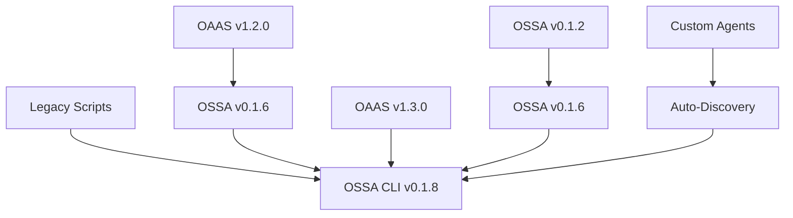

# OSSA Complete Migration Guide
## Comprehensive Migration from Legacy Systems to OSSA v0.1.8

> **Zero Breaking Changes Philosophy**: OSSA is designed for zero-disruption adoption with progressive enhancement capabilities.

---

## 📋 Table of Contents

1. [Migration Overview](#migration-overview)
2. [Legacy Script Migration](#legacy-script-migration)
3. [Framework Migration (OAAS → OSSA)](#framework-migration)
4. [Version Upgrade Paths](#version-upgrade-paths)
5. [Testing & Validation](#testing--validation)
6. [Rollback Procedures](#rollback-procedures)

---

## 🎯 Migration Overview

### Migration Principles
- ✅ **No file modifications** required for basic migration
- ✅ **Existing agents keep working** exactly as before  
- ✅ **Progressive enhancement** - add OSSA benefits incrementally
- ✅ **Rollback safety** - can disable OSSA without impact
- ✅ **CLI-first approach** - standardized commands for all operations

### Migration Timeline

| Phase | Timeline | Status | Description |
|-------|----------|--------|-------------|
| **Phase 1** | 2025-09-02 to 2025-10-01 | 🟨 In Progress | Legacy script deprecation warnings |
| **Phase 2** | 2025-10-01 to 2025-11-01 | 🔄 Upcoming | Scripts redirect to CLI (with confirmation) |
| **Phase 3** | 2025-11-01 to 2025-12-01 | ⏳ Planned | Scripts show error and exit |
| **Phase 4** | 2025-12-01+ | 🗑️ Cleanup | Complete removal of legacy scripts |

---

## 🔄 Legacy Script Migration

### OSSA Validation Commands

| **Deprecated Script** | **New CLI Command** | **Version** | **Description** |
|-----------------------|-------------------|-------------|-----------------|
| `node validate-ossa-v0.1.6.js <path>` | `ossa validate [path]` | 0.1.8 | Validate OSSA agent specifications |
| `node validate-ossa-v0.1.2.js <path>` | `ossa validate [path] --legacy` | 0.1.0 | Legacy validation (deprecated) |
| `node lib/tools/validation/validate-ossa-v0.1.6.js` | `ossa validate` | 0.1.8 | Direct validation script |
| `npm run validate` | `ossa validate` | 0.1.8 | Validate current directory |
| `npm run test` | `ossa validate examples/` | 0.1.8 | Test examples directory |

### Agent Management Commands

| **Deprecated Script** | **New CLI Command** | **Description** |
|-----------------------|-------------------|-----------------|
| `npm run create-agent` | `ossa create <name>` | Create new OSSA agent |
| `npm run list-agents` | `ossa list` | List all agents |
| `npm run upgrade-agent` | `ossa upgrade [path]` | Upgrade agent to latest OSSA |

### UADP Discovery Commands

| **Deprecated Script** | **New CLI Command** | **Description** |
|-----------------------|-------------------|-----------------|
| `node discovery/uadp-discovery.js` | `ossa discover` | Universal Agent Discovery Protocol |
| `node discovery/registry-sync.js` | `ossa discover --sync` | Sync agent registry |
| `node discovery/health-check.js` | `ossa discover --health` | Check agent health |

### Migration Command Examples

```bash
# Before (Legacy)
node validate-ossa-v0.1.6.js ./my-agent
npm run validate
node lib/tools/validation/validate-ossa-v0.1.6.js

# After (CLI)
ossa validate ./my-agent
ossa validate
ossa validate --verbose

# Batch migration helper
ossa migrate scripts --dry-run  # Preview changes
ossa migrate scripts --execute  # Perform migration
```

---

## 🔄 Framework Migration (OAAS → OSSA)

### Migration Scenarios

#### Scenario 1: Pure Discovery (Recommended Start)

**Goal**: Discover and catalog existing agents without changes.

```typescript
// Step 1: Install OSSA
npm install @ossa/core

// Step 2: Initialize OSSA service
import { OSSAService } from '@ossa/core';

const service = new OSSAService({
  projectRoot: process.cwd(),
  runtimeTranslation: false,  // Discovery only
  version: '0.1.8',
  cacheEnabled: true
});

// Step 3: Discover agents
const agents = await service.discoverAgents();
console.log(`Found ${agents.length} existing agents`);
```

#### Scenario 2: Runtime Translation

**Goal**: Enable cross-format translation while keeping originals unchanged.

```typescript
const service = new OSSAService({
  projectRoot: process.cwd(),
  runtimeTranslation: true,   // Enable translation
  preserveOriginals: true,    // Keep existing files
  version: '0.1.8'
});

// Agents automatically work across formats
const crewAIAgent = await service.loadAgent('./crew-agent.yaml');
const langChainAgent = await service.loadAgent('./langchain-agent.json');
// Both now work with OSSA v0.1.8 features
```

#### Scenario 3: Progressive Enhancement

**Goal**: Gradually add OSSA features to existing agents.

```typescript
// Step 1: Load existing agent
const agent = await service.loadAgent('./my-agent.yaml');

// Step 2: Add OSSA v0.1.8 capabilities
const enhanced = await service.enhance(agent, {
  addGovernance: true,
  addObservability: true,
  addCompliance: ['ISO-42001', 'NIST-AI-RMF'],
  version: '0.1.8'
});

// Step 3: Optional - persist enhancements
await service.save(enhanced, './my-agent.ossa.yaml');
```

### OAAS Legacy Migration Commands

| **Deprecated Script** | **New CLI Command** | **Description** |
|-----------------------|-------------------|-----------------|
| `node lib/tools/validation/validate-oaas-v1.3.0.js` | `ossa migrate --from oaas-1.3.0` | OAAS v1.3.0 migration |
| `node lib/tools/validation/validate-oaas-v1.2.0.js` | `ossa migrate --from oaas-1.2.0` | OAAS v1.2.0 migration |
| `node lib/tools/migration/migrate-to-oaas.js` | `ossa migrate --to oaas` | Legacy OAAS migration |
| `node lib/tools/migration/oaas-to-ossa-migrator.js` | `ossa migrate --from oaas` | OAAS to OSSA migration |

---

## 🔄 Version Upgrade Paths

### Supported Upgrade Paths



### Version-Specific Migration Commands

```bash
# From OSSA v0.1.2
ossa upgrade --from 0.1.2 --to 0.1.8

# From OSSA v0.1.6  
ossa upgrade --from 0.1.6 --to 0.1.8

# From OAAS v1.3.0
ossa migrate --from oaas-1.3.0 --target-version 0.1.8

# Auto-detect and upgrade
ossa upgrade --auto-detect
```

---

## ✅ Testing & Validation

### Pre-Migration Validation

```bash
# Check system compatibility
ossa validate --pre-migration

# Analyze existing agents
ossa analyze ./agents/ --compatibility-check

# Generate migration report
ossa migrate --dry-run --report migration-report.json
```

### Post-Migration Testing

```bash
# Validate migrated agents
ossa validate --all --strict

# Test agent functionality
ossa test ./migrated-agents/ --comprehensive

# Verify OSSA v0.1.8 compliance
ossa validate --version 0.1.8 --compliance-check
```

### Integration Testing

```bash
# Test with existing systems
ossa test --integration --frameworks crewai,langchain

# Validate API compatibility
ossa test --api-compatibility

# Performance benchmarks
ossa benchmark --compare-with-legacy
```

---

## 🔄 Rollback Procedures

### Emergency Rollback

```bash
# Immediate rollback to previous state
ossa rollback --immediate

# Rollback with backup restore
ossa rollback --restore-backup migration-backup-20250906

# Partial rollback (specific components)
ossa rollback --components validation,discovery
```

### Backup & Restore

```bash
# Create pre-migration backup
ossa backup create --name "pre-migration-$(date +%Y%m%d)"

# List available backups
ossa backup list

# Restore specific backup
ossa backup restore pre-migration-20250906
```

---

## 📋 Migration Checklist

### Pre-Migration

- [ ] **Backup all existing agents** and configurations
- [ ] **Run compatibility check** on current system
- [ ] **Review migration report** from dry-run
- [ ] **Ensure CLI installation** and access
- [ ] **Verify Node.js version** (20+ required)

### During Migration

- [ ] **Follow progressive approach** (discovery → translation → enhancement)
- [ ] **Validate each step** before proceeding
- [ ] **Monitor system performance** during migration
- [ ] **Test critical agents** after each phase
- [ ] **Document any customizations** or issues

### Post-Migration

- [ ] **Run comprehensive validation** on all agents
- [ ] **Test integration** with existing systems
- [ ] **Update documentation** and references
- [ ] **Train team** on new CLI commands
- [ ] **Clean up legacy scripts** (after validation period)

---

## 🔗 Additional Resources

- [OSSA CLI Reference](/docs/reference/cli/commands.md)
- [Agent Specification v0.1.8](/docs/reference/specifications/agent-spec.md)
- [Troubleshooting Guide](/docs/resources/troubleshooting.md)
- [Best Practices](/docs/guides/users/best-practices.md)
- [Community Support](/docs/community/support.md)

---

## 🆘 Support & Help

If you encounter issues during migration:

1. **Check the FAQ**: [docs/resources/faq.md](/docs/resources/faq.md)
2. **Review troubleshooting**: [docs/resources/troubleshooting.md](/docs/resources/troubleshooting.md)
3. **Run diagnostics**: `ossa diagnose --migration-issues`
4. **Get help**: `ossa help migrate` or `ossa support --create-ticket`

**Migration assistance available**: Contact the OSSA team for enterprise migration support and custom migration scripts.