# OSSA Platform Architecture Diagrams & Data Flows

## What is OSSA Platform?

**OSSA (Open Standards for Scalable Agents)** is a production-grade orchestration platform for AI agents that provides:

- **Agent Orchestration**: Coordinate multiple specialized AI agents to solve complex tasks
- **Workflow Management**: Define, execute, and monitor multi-step agent workflows  
- **Scalable Architecture**: Distributed system supporting thousands of concurrent agents
- **Enterprise Compliance**: Built-in governance, audit trails, and regulatory compliance
- **Developer Tools**: Comprehensive APIs, SDKs, and monitoring for agent development

## Core Concepts

### Agent Types & Hierarchy

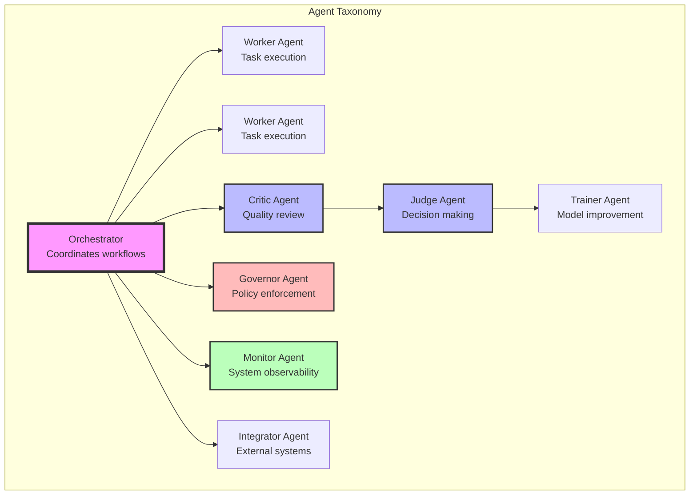
```mermaid
graph TD
    subgraph "Agent Taxonomy"
        O[Orchestrator<br/>Coordinates workflows]
        O --> W1[Worker Agent<br/>Task execution]
        O --> W2[Worker Agent<br/>Task execution]
        O --> C[Critic Agent<br/>Quality review]
        C --> J[Judge Agent<br/>Decision making]
        J --> T[Trainer Agent<br/>Model improvement]
        O --> G[Governor Agent<br/>Policy enforcement]
        O --> M[Monitor Agent<br/>System observability]
        O --> I[Integrator Agent<br/>External systems]
    end
    
    style O fill:#f9f,stroke:#333,stroke-width:4px
    style C fill:#bbf,stroke:#333,stroke-width:2px
    style J fill:#bbf,stroke:#333,stroke-width:2px
    style G fill:#fbb,stroke:#333,stroke-width:2px
    style M fill:#bfb,stroke:#333,stroke-width:2px
```

### OSSA Feedback Loop (360° Architecture)

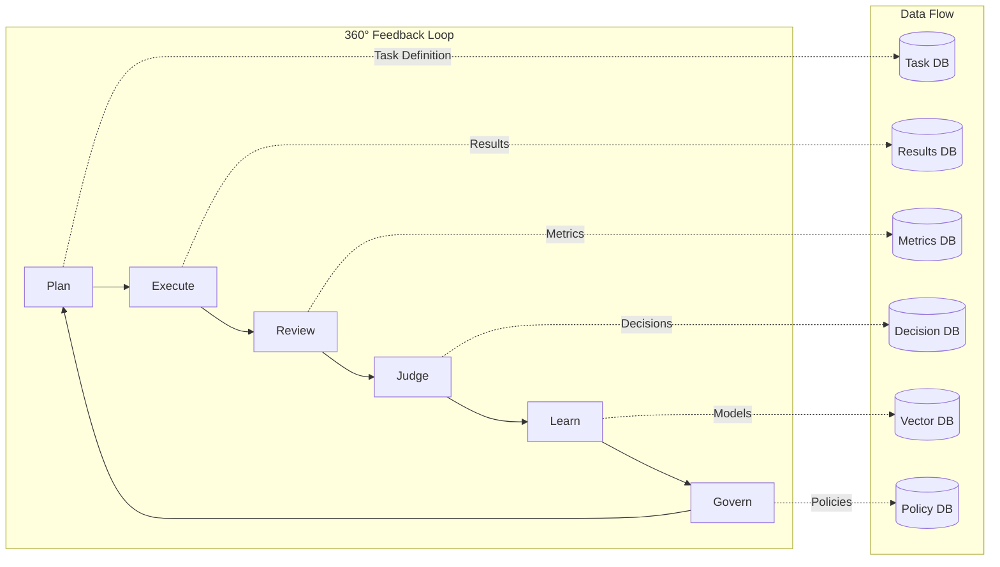
```mermaid
graph LR
    subgraph "360° Feedback Loop"
        P[Plan] --> E[Execute]
        E --> R[Review]
        R --> J[Judge]
        J --> L[Learn]
        L --> G[Govern]
        G --> P
    end
    
    subgraph "Data Flow"
        P -.->|Task Definition| TD[(Task DB)]
        E -.->|Results| RD[(Results DB)]
        R -.->|Metrics| MD[(Metrics DB)]
        J -.->|Decisions| DD[(Decision DB)]
        L -.->|Models| VD[(Vector DB)]
        G -.->|Policies| PD[(Policy DB)]
    end
```

## System Data Flow

### Request Processing Flow

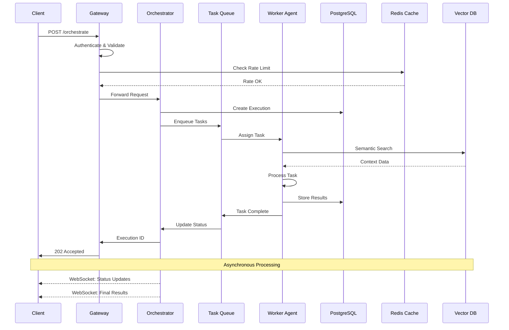
```mermaid
sequenceDiagram
    participant C as Client
    participant GW as Gateway
    participant O as Orchestrator
    participant Q as Task Queue
    participant W as Worker Agent
    participant DB as PostgreSQL
    participant R as Redis Cache
    participant V as Vector DB
    
    C->>GW: POST /orchestrate
    GW->>GW: Authenticate & Validate
    GW->>R: Check Rate Limit
    R-->>GW: Rate OK
    GW->>O: Forward Request
    O->>DB: Create Execution
    O->>Q: Enqueue Tasks
    Q->>W: Assign Task
    W->>V: Semantic Search
    V-->>W: Context Data
    W->>W: Process Task
    W->>DB: Store Results
    W->>Q: Task Complete
    Q->>O: Update Status
    O->>GW: Execution ID
    GW->>C: 202 Accepted
    
    Note over C,V: Asynchronous Processing
    
    O-->>C: WebSocket: Status Updates
    O-->>C: WebSocket: Final Results
```

### Agent Communication Flow

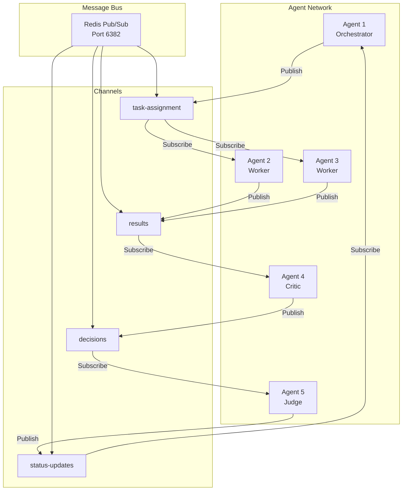
```mermaid
graph TB
    subgraph "Agent Network"
        A1[Agent 1<br/>Orchestrator] 
        A2[Agent 2<br/>Worker]
        A3[Agent 3<br/>Worker]
        A4[Agent 4<br/>Critic]
        A5[Agent 5<br/>Judge]
    end
    
    subgraph "Message Bus"
        MB[Redis Pub/Sub<br/>Port 6382]
    end
    
    subgraph "Channels"
        C1[task-assignment]
        C2[status-updates]
        C3[results]
        C4[decisions]
    end
    
    A1 -->|Publish| C1
    C1 -->|Subscribe| A2
    C1 -->|Subscribe| A3
    
    A2 -->|Publish| C3
    A3 -->|Publish| C3
    C3 -->|Subscribe| A4
    
    A4 -->|Publish| C4
    C4 -->|Subscribe| A5
    
    A5 -->|Publish| C2
    C2 -->|Subscribe| A1
    
    MB --> C1
    MB --> C2
    MB --> C3
    MB --> C4
```

## Workflow Execution Engine

### Workflow State Machine

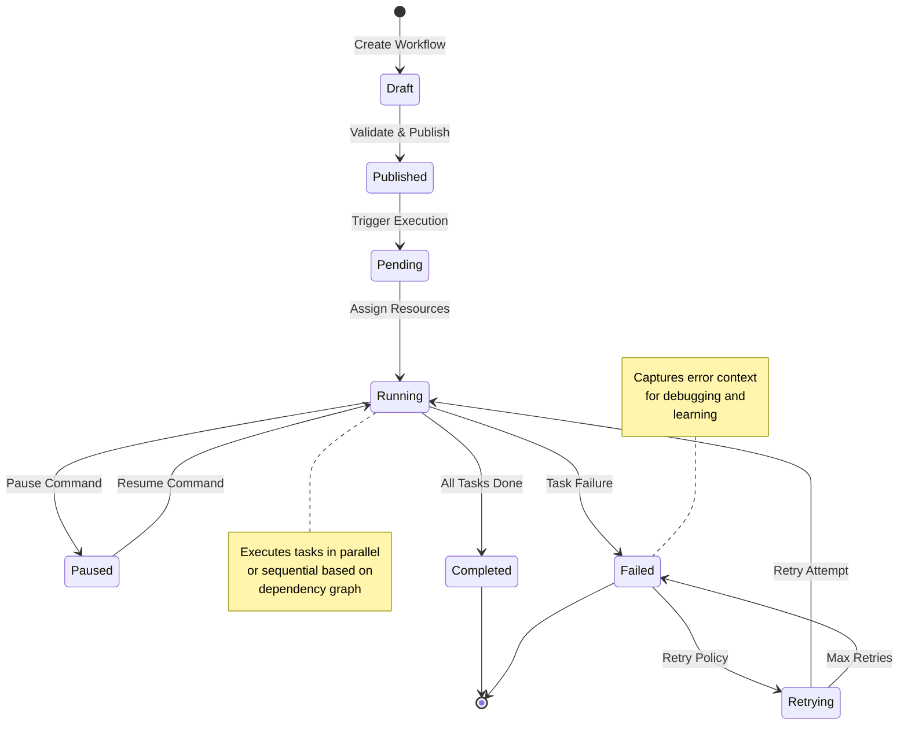
```mermaid
stateDiagram-v2
    [*] --> Draft: Create Workflow
    Draft --> Published: Validate & Publish
    Published --> Pending: Trigger Execution
    Pending --> Running: Assign Resources
    Running --> Paused: Pause Command
    Paused --> Running: Resume Command
    Running --> Completed: All Tasks Done
    Running --> Failed: Task Failure
    Failed --> Retrying: Retry Policy
    Retrying --> Running: Retry Attempt
    Retrying --> Failed: Max Retries
    Completed --> [*]
    Failed --> [*]
    
    note right of Running
        Executes tasks in parallel
        or sequential based on
        dependency graph
    end note
    
    note left of Failed
        Captures error context
        for debugging and
        learning
    end note
```

### Task Dependency Graph

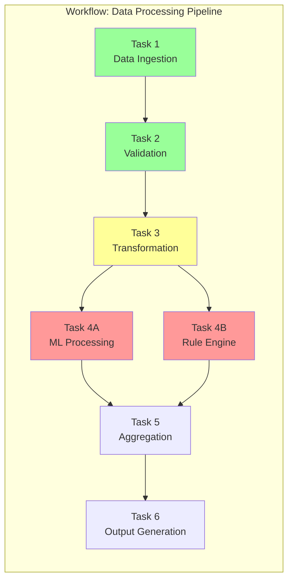
```mermaid
graph LR
    subgraph "Workflow: Data Processing Pipeline"
        T1[Task 1<br/>Data Ingestion]
        T2[Task 2<br/>Validation]
        T3[Task 3<br/>Transformation]
        T4A[Task 4A<br/>ML Processing]
        T4B[Task 4B<br/>Rule Engine]
        T5[Task 5<br/>Aggregation]
        T6[Task 6<br/>Output Generation]
    end
    
    T1 --> T2
    T2 --> T3
    T3 --> T4A
    T3 --> T4B
    T4A --> T5
    T4B --> T5
    T5 --> T6
    
    style T1 fill:#9f9
    style T2 fill:#9f9
    style T3 fill:#ff9
    style T4A fill:#f99
    style T4B fill:#f99
```

## Infrastructure Architecture

### Kubernetes Deployment Architecture

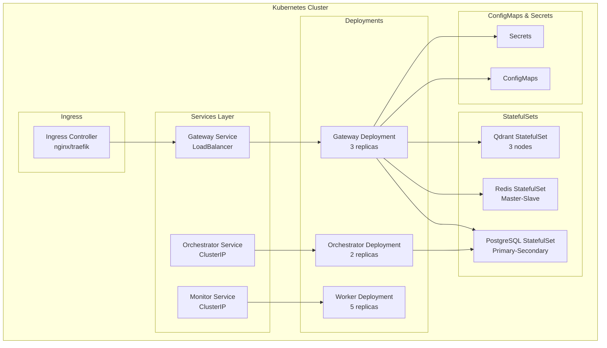
```mermaid
graph TB
    subgraph "Kubernetes Cluster"
        subgraph "Ingress"
            IG[Ingress Controller<br/>nginx/traefik]
        end
        
        subgraph "Services Layer"
            GS[Gateway Service<br/>LoadBalancer]
            OS[Orchestrator Service<br/>ClusterIP]
            MS[Monitor Service<br/>ClusterIP]
        end
        
        subgraph "Deployments"
            GD[Gateway Deployment<br/>3 replicas]
            OD[Orchestrator Deployment<br/>2 replicas]
            WD[Worker Deployment<br/>5 replicas]
        end
        
        subgraph "StatefulSets"
            PS[PostgreSQL StatefulSet<br/>Primary-Secondary]
            RS[Redis StatefulSet<br/>Master-Slave]
            QS[Qdrant StatefulSet<br/>3 nodes]
        end
        
        subgraph "ConfigMaps & Secrets"
            CM[ConfigMaps]
            SC[Secrets]
        end
    end
    
    IG --> GS
    GS --> GD
    GD --> PS
    GD --> RS
    GD --> QS
    GD --> CM
    GD --> SC
    OS --> OD
    OD --> PS
    MS --> WD
```

### Database Schema Relationships

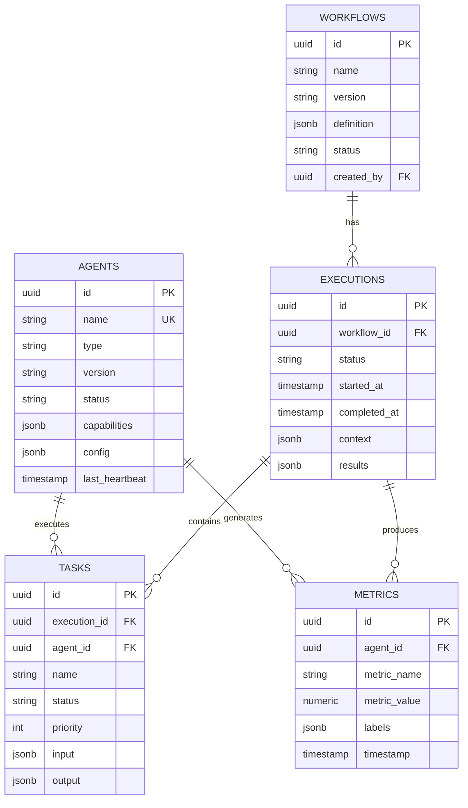
```mermaid
erDiagram
    AGENTS ||--o{ TASKS : executes
    WORKFLOWS ||--o{ EXECUTIONS : has
    EXECUTIONS ||--o{ TASKS : contains
    AGENTS ||--o{ METRICS : generates
    EXECUTIONS ||--o{ METRICS : produces
    
    AGENTS {
        uuid id PK
        string name UK
        string type
        string version
        string status
        jsonb capabilities
        jsonb config
        timestamp last_heartbeat
    }
    
    WORKFLOWS {
        uuid id PK
        string name
        string version
        jsonb definition
        string status
        uuid created_by FK
    }
    
    EXECUTIONS {
        uuid id PK
        uuid workflow_id FK
        string status
        timestamp started_at
        timestamp completed_at
        jsonb context
        jsonb results
    }
    
    TASKS {
        uuid id PK
        uuid execution_id FK
        uuid agent_id FK
        string name
        string status
        int priority
        jsonb input
        jsonb output
    }
    
    METRICS {
        uuid id PK
        uuid agent_id FK
        string metric_name
        numeric metric_value
        jsonb labels
        timestamp timestamp
    }
```

## Data Processing Pipelines

### Event-Driven Architecture

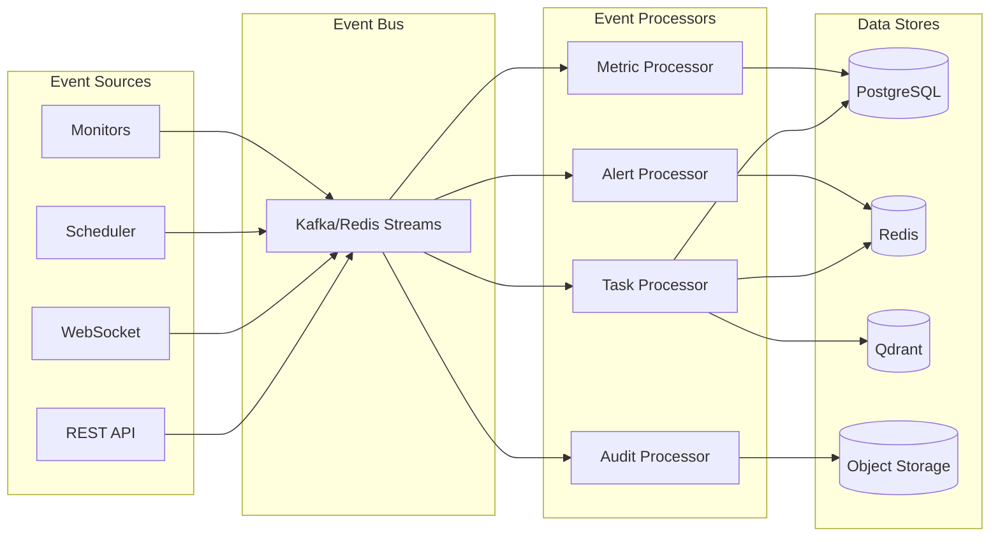
```mermaid
graph LR
    subgraph "Event Sources"
        API[REST API]
        WS[WebSocket]
        CRON[Scheduler]
        MON[Monitors]
    end
    
    subgraph "Event Bus"
        KAFKA[Kafka/Redis Streams]
    end
    
    subgraph "Event Processors"
        EP1[Task Processor]
        EP2[Metric Processor]
        EP3[Alert Processor]
        EP4[Audit Processor]
    end
    
    subgraph "Data Stores"
        PG[(PostgreSQL)]
        RD[(Redis)]
        QD[(Qdrant)]
        S3[(Object Storage)]
    end
    
    API --> KAFKA
    WS --> KAFKA
    CRON --> KAFKA
    MON --> KAFKA
    
    KAFKA --> EP1
    KAFKA --> EP2
    KAFKA --> EP3
    KAFKA --> EP4
    
    EP1 --> PG
    EP1 --> RD
    EP2 --> PG
    EP3 --> RD
    EP4 --> S3
    EP1 --> QD
```

### Vector Search & Semantic Processing

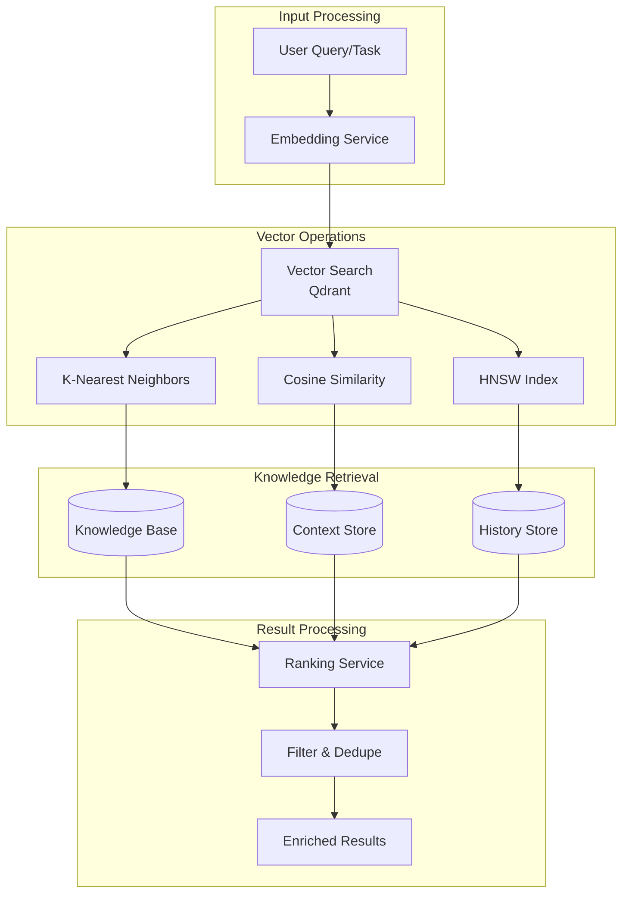
```mermaid
graph TB
    subgraph "Input Processing"
        IN[User Query/Task]
        EMB[Embedding Service]
        IN --> EMB
    end
    
    subgraph "Vector Operations"
        EMB --> VS[Vector Search<br/>Qdrant]
        VS --> KNN[K-Nearest Neighbors]
        VS --> SIM[Cosine Similarity]
        VS --> HNSW[HNSW Index]
    end
    
    subgraph "Knowledge Retrieval"
        KNN --> KB[(Knowledge Base)]
        SIM --> CTX[(Context Store)]
        HNSW --> HIS[(History Store)]
    end
    
    subgraph "Result Processing"
        KB --> RNK[Ranking Service]
        CTX --> RNK
        HIS --> RNK
        RNK --> FIL[Filter & Dedupe]
        FIL --> OUT[Enriched Results]
    end
```

## Monitoring & Observability

### Metrics Collection Flow

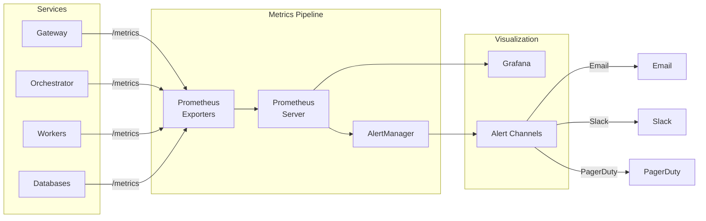
```mermaid
graph LR
    subgraph "Services"
        S1[Gateway]
        S2[Orchestrator]
        S3[Workers]
        S4[Databases]
    end
    
    subgraph "Metrics Pipeline"
        PE[Prometheus<br/>Exporters]
        PS[Prometheus<br/>Server]
        AM[AlertManager]
    end
    
    subgraph "Visualization"
        GR[Grafana]
        AL[Alert Channels]
    end
    
    S1 -->|/metrics| PE
    S2 -->|/metrics| PE
    S3 -->|/metrics| PE
    S4 -->|/metrics| PE
    
    PE --> PS
    PS --> AM
    PS --> GR
    AM --> AL
    
    AL -->|Email| MAIL[Email]
    AL -->|Slack| SLACK[Slack]
    AL -->|PagerDuty| PD[PagerDuty]
```

### Distributed Tracing

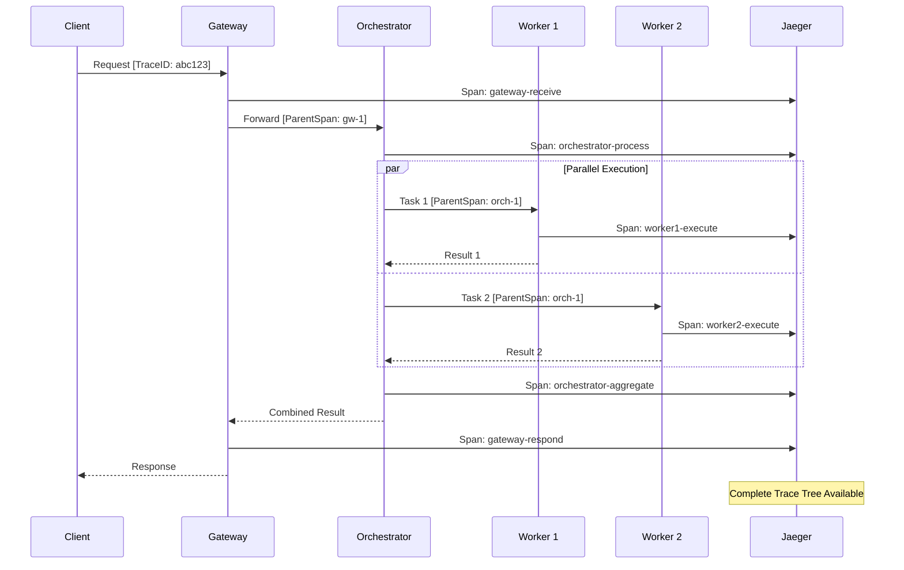
```mermaid
sequenceDiagram
    participant C as Client
    participant G as Gateway
    participant O as Orchestrator
    participant W1 as Worker 1
    participant W2 as Worker 2
    participant J as Jaeger
    
    C->>G: Request [TraceID: abc123]
    G->>J: Span: gateway-receive
    G->>O: Forward [ParentSpan: gw-1]
    O->>J: Span: orchestrator-process
    
    par Parallel Execution
        O->>W1: Task 1 [ParentSpan: orch-1]
        W1->>J: Span: worker1-execute
        W1-->>O: Result 1
    and
        O->>W2: Task 2 [ParentSpan: orch-1]
        W2->>J: Span: worker2-execute
        W2-->>O: Result 2
    end
    
    O->>J: Span: orchestrator-aggregate
    O-->>G: Combined Result
    G->>J: Span: gateway-respond
    G-->>C: Response
    
    Note over J: Complete Trace Tree Available
```

## Security Architecture

### Authentication & Authorization Flow

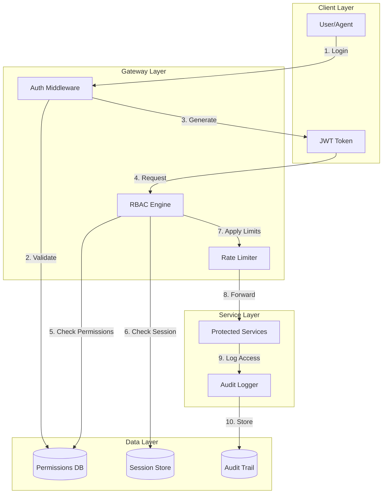
```mermaid
graph TB
    subgraph "Client Layer"
        USR[User/Agent]
        TOK[JWT Token]
    end
    
    subgraph "Gateway Layer"
        AUTH[Auth Middleware]
        RBAC[RBAC Engine]
        RATE[Rate Limiter]
    end
    
    subgraph "Service Layer"
        SVC[Protected Services]
        AUD[Audit Logger]
    end
    
    subgraph "Data Layer"
        PERM[(Permissions DB)]
        SESS[(Session Store)]
        AUDIT[(Audit Trail)]
    end
    
    USR -->|1. Login| AUTH
    AUTH -->|2. Validate| PERM
    AUTH -->|3. Generate| TOK
    TOK -->|4. Request| RBAC
    RBAC -->|5. Check Permissions| PERM
    RBAC -->|6. Check Session| SESS
    RBAC -->|7. Apply Limits| RATE
    RATE -->|8. Forward| SVC
    SVC -->|9. Log Access| AUD
    AUD -->|10. Store| AUDIT
```

## Deployment Strategies

### Zero-Downtime Deployment Flow

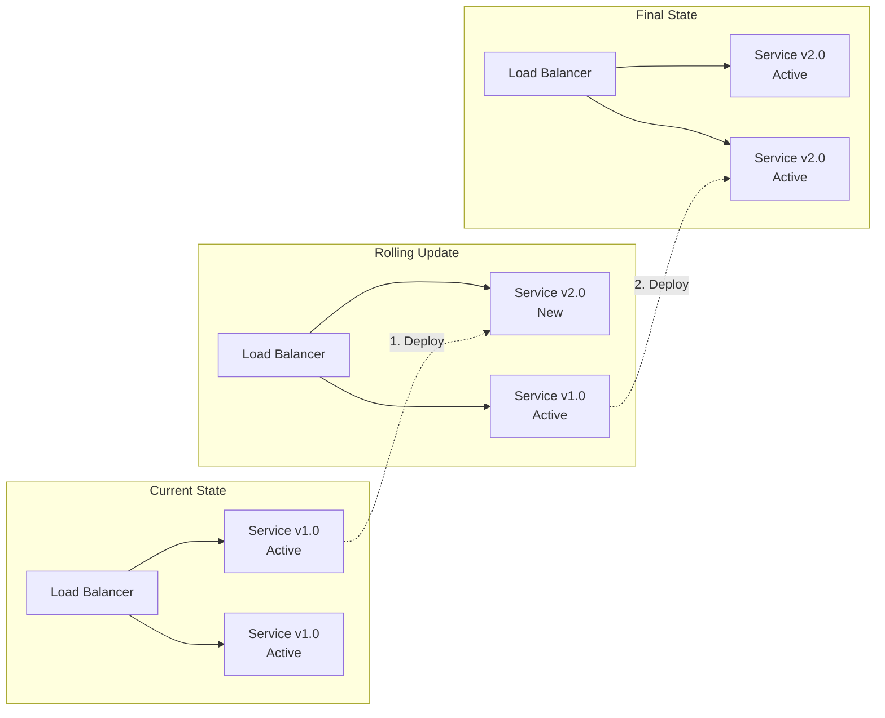
```mermaid
graph LR
    subgraph "Current State"
        LB1[Load Balancer]
        V1A[Service v1.0<br/>Active]
        V1B[Service v1.0<br/>Active]
    end
    
    subgraph "Rolling Update"
        LB2[Load Balancer]
        V2A[Service v2.0<br/>New]
        V1B2[Service v1.0<br/>Active]
    end
    
    subgraph "Final State"
        LB3[Load Balancer]
        V2A2[Service v2.0<br/>Active]
        V2B[Service v2.0<br/>Active]
    end
    
    LB1 --> V1A
    LB1 --> V1B
    
    LB2 --> V2A
    LB2 --> V1B2
    
    LB3 --> V2A2
    LB3 --> V2B
    
    V1A -.->|1. Deploy| V2A
    V1B2 -.->|2. Deploy| V2B
```

## Cost Optimization

### Resource Allocation Strategy

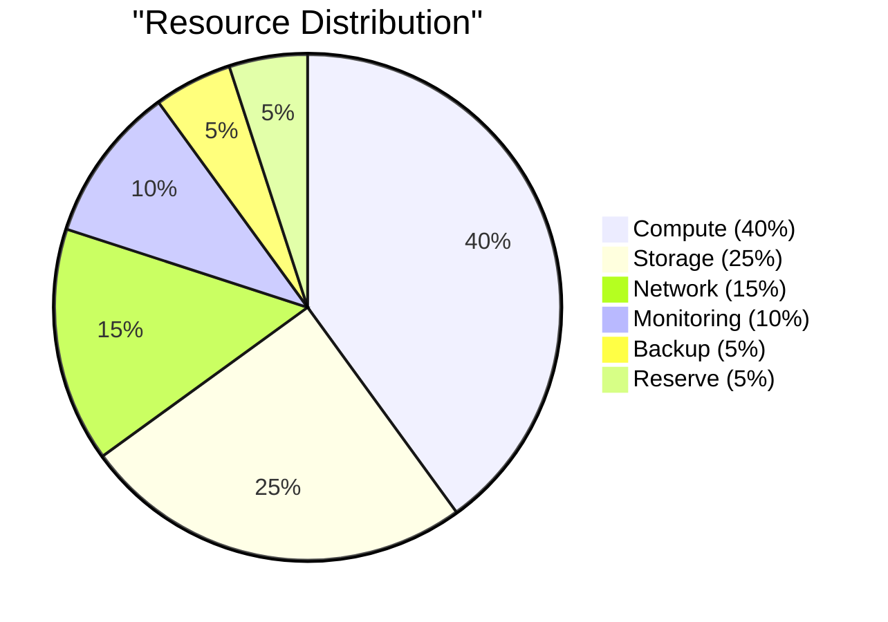
```mermaid
pie title "Resource Distribution"
    "Compute (40%)" : 40
    "Storage (25%)" : 25
    "Network (15%)" : 15
    "Monitoring (10%)" : 10
    "Backup (5%)" : 5
    "Reserve (5%)" : 5
```

### Auto-Scaling Behavior

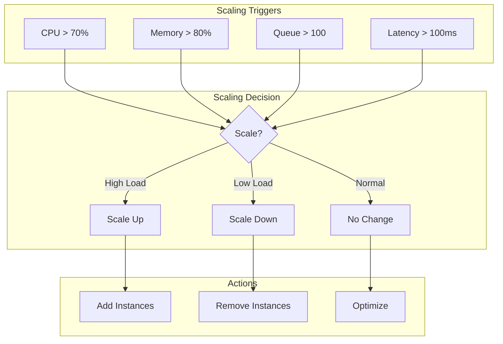
```mermaid
graph TB
    subgraph "Scaling Triggers"
        CPU[CPU > 70%]
        MEM[Memory > 80%]
        QUEUE[Queue > 100]
        LATE[Latency > 100ms]
    end
    
    subgraph "Scaling Decision"
        DEC{Scale?}
        UP[Scale Up]
        DOWN[Scale Down]
        SAME[No Change]
    end
    
    subgraph "Actions"
        ADD[Add Instances]
        REM[Remove Instances]
        OPT[Optimize]
    end
    
    CPU --> DEC
    MEM --> DEC
    QUEUE --> DEC
    LATE --> DEC
    
    DEC -->|High Load| UP
    DEC -->|Low Load| DOWN
    DEC -->|Normal| SAME
    
    UP --> ADD
    DOWN --> REM
    SAME --> OPT
```

## Platform Capabilities Summary

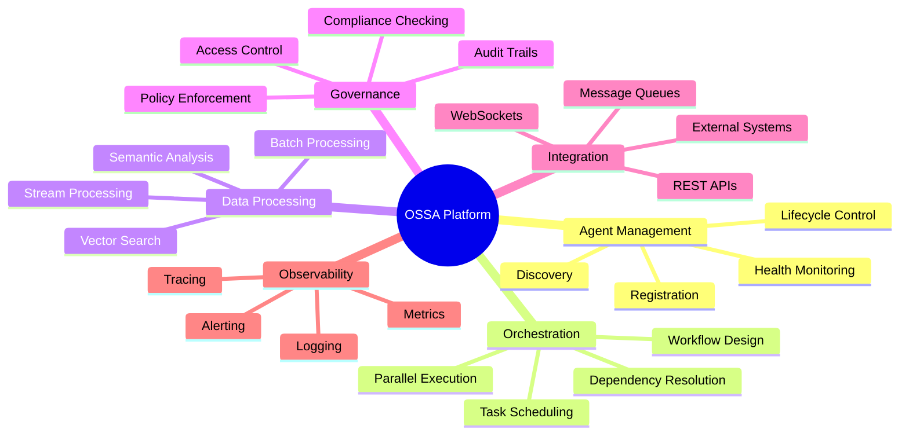
```mermaid
mindmap
  root((OSSA Platform))
    Agent Management
      Registration
      Discovery
      Health Monitoring
      Lifecycle Control
    Orchestration
      Workflow Design
      Task Scheduling
      Dependency Resolution
      Parallel Execution
    Data Processing
      Stream Processing
      Batch Processing
      Vector Search
      Semantic Analysis
    Governance
      Policy Enforcement
      Compliance Checking
      Audit Trails
      Access Control
    Integration
      REST APIs
      WebSockets
      Message Queues
      External Systems
    Observability
      Metrics
      Logging
      Tracing
      Alerting
```

## Key Benefits

1. **Scalability**: Handle thousands of concurrent agents and workflows
2. **Reliability**: Built-in fault tolerance, retry mechanisms, and health checks
3. **Flexibility**: Support for multiple agent types and custom workflows
4. **Observability**: Comprehensive monitoring and debugging capabilities
5. **Security**: Enterprise-grade authentication, authorization, and audit trails
6. **Compliance**: Built-in support for regulatory requirements (ISO-42001, NIST AI RMF, EU AI Act)

---

*These diagrams represent the core architectural patterns and data flows of the OSSA Platform v0.1.9-alpha.1*