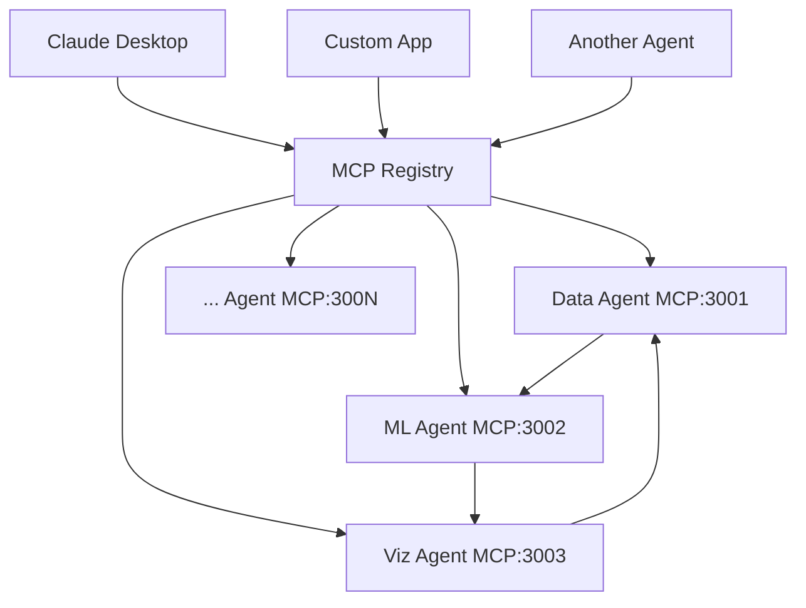

# OSSA Architecture: MCP-per-Agent Design

**Open Standards for Scalable Agents (OSSA) v0.1.2** - Revolutionary MCP-per-Agent Architecture for Enterprise AI Systems

## Executive Summary

OSSA introduces a groundbreaking **MCP-per-Agent architecture** where every agent can expose its own Model Context Protocol (MCP) server. This design enables unprecedented modularity, interoperability, and scalability in enterprise AI agent ecosystems.

## Core Architecture Principles

### 1. Agent Autonomy
- **Self-Contained Services**: Each agent operates as an independent microservice
- **Own MCP Server**: Agents expose capabilities through their dedicated MCP interface
- **Independent Deployment**: Agents can be deployed, scaled, and updated separately
- **Stateless Design**: Agents maintain minimal state for maximum portability
- **Model Independence**: Each agent can select and switch models independently

### 2. Universal Interoperability
- **MCP Standard Compliance**: All agents follow Model Context Protocol specifications
- **Client Agnostic**: Any MCP-compatible client can consume any agent's services
- **Protocol Translation**: OSSA provides seamless protocol translation between different agent types
- **Cross-Platform Support**: Agents work across different languages, runtimes, and platforms
- **Multi-Provider Support**: Agents can use different LLM providers simultaneously

### 3. Federated Discovery
- **Central Registry**: Global registry tracks all available agent MCP servers
- **Service Discovery**: Agents can dynamically discover and connect to other agents
- **Capability Mapping**: Automatic cataloging of agent tools, resources, and prompts
- **Load Balancing**: Intelligent routing based on agent performance and availability
- **Model-Aware Routing**: Route requests to agents with optimal models for specific tasks

### 4. Dynamic Model Selection
- **Runtime Switching**: Models can be changed without redeploying agents
- **Context-Aware Selection**: Automatically choose models based on task requirements
- **Provider Failover**: Seamless fallback between different LLM providers
- **Cost Optimization**: Balance performance and cost through intelligent model selection

## MCP-per-Agent Components

### Agent MCP Server Structure

```yaml
Agent MCP Server:
  metadata:
    name: "data-processing-agent"
    version: "1.2.0"
    category: "tier1"
    capabilities: ["data_transform", "validation", "analysis"]

  tools:
    - name: "transform_csv"
      description: "Transform CSV data with custom rules"
      parameters: { /* JSON Schema */ }
    - name: "validate_schema"
      description: "Validate data against schema"
      parameters: { /* JSON Schema */ }

  resources:
    - uri: "file://data/processed/"
      name: "processed_data"
      mimeType: "application/json"
    - uri: "memory://cache/"
      name: "processing_cache"

  prompts:
    - name: "data_expert"
      description: "Expert at data processing tasks"
      arguments: ["domain", "complexity"]
```

### Registry & Discovery System

```typescript
// Central MCP Registry API
interface MCPRegistry {
  // Register agent MCP server
  register(agent: AgentMCPServer): Promise<string>;

  // Discover agents by capability
  discover(capability: string): Promise<AgentMCPServer[]>;

  // Health check all registered agents
  healthCheck(): Promise<AgentHealth[]>;

  // Get agent by category
  getByCategory(category: AgentCategory): Promise<AgentMCPServer[]>;
}

// Service Discovery
const agents = await registry.discover("data_processing");
const bestAgent = agents.find(a => a.performance.latency < 100);
```

## Model Selection Architecture

### Multi-Provider Model Management

OSSA's model selection system enables each agent to use the optimal model for its specific tasks while maintaining flexibility and cost efficiency.

```typescript
// Model Configuration per Agent
interface AgentModelConfig {
  provider: 'ollama' | 'openai' | 'anthropic' | 'google' | 'azure' | 'custom';
  model: string;
  parameters?: {
    temperature?: number;
    max_tokens?: number;
    top_p?: number;
    reasoning_mode?: 'explicit' | 'implicit';
  };
  fallback?: AgentModelConfig;
  costTier?: 'economy' | 'standard' | 'premium';
}

// Agent with specific model configuration
class SpecializedAgent {
  private modelConfig: AgentModelConfig;

  constructor(config: AgentConfig) {
    this.modelConfig = {
      provider: config.preferredProvider || 'ollama',
      model: config.model || this.getDefaultModel(),
      parameters: config.modelParameters,
      fallback: {
        provider: 'ollama',
        model: 'llama3.2:8b',
        costTier: 'economy'
      }
    };
  }
}
```

### Dynamic Model Selection Strategies

```typescript
// Context-aware model selection
class ModelSelector {
  selectModel(task: TaskContext): AgentModelConfig {
    switch (task.type) {
      case 'code_analysis':
        return {
          provider: 'anthropic',
          model: 'claude-3-5-sonnet',
          parameters: { temperature: 0.1 }
        };

      case 'creative_writing':
        return {
          provider: 'openai',
          model: 'gpt-4o',
          parameters: { temperature: 0.8 }
        };

      case 'data_processing':
        return {
          provider: 'google',
          model: 'gemini-2.0-flash',
          parameters: { temperature: 0.3 }
        };

      case 'local_inference':
        return {
          provider: 'ollama',
          model: 'llama3.2:70b',
          parameters: { temperature: 0.5 }
        };

      default:
        return this.getDefaultModel();
    }
  }
}
```

### Model Provider Integration

```typescript
// Abstract provider interface
interface ModelProvider {
  name: string;
  models: string[];
  supportsStreaming: boolean;
  costPerToken: number;

  // Core methods
  invoke(prompt: string, config: ModelConfig): Promise<ModelResponse>;
  validateModel(model: string): boolean;
  getModelInfo(model: string): ModelInfo;
}

// Ollama provider implementation
class OllamaProvider implements ModelProvider {
  name = 'ollama';
  models = ['llama3.2:8b', 'llama3.2:70b', 'codellama', 'deepseek-coder'];
  supportsStreaming = true;
  costPerToken = 0; // Local inference

  async invoke(prompt: string, config: ModelConfig): Promise<ModelResponse> {
    const response = await fetch(`${this.baseUrl}/api/generate`, {
      method: 'POST',
      headers: { 'Content-Type': 'application/json' },
      body: JSON.stringify({
        model: config.model,
        prompt,
        options: {
          temperature: config.parameters?.temperature || 0.7,
          num_ctx: config.parameters?.max_tokens || 4096
        }
      })
    });

    return this.parseResponse(response);
  }
}

// OpenAI provider implementation
class OpenAIProvider implements ModelProvider {
  name = 'openai';
  models = ['gpt-4o', 'gpt-4o-mini', 'o1-preview', 'o1-mini'];
  supportsStreaming = true;
  costPerToken = 0.00001; // Varies by model

  async invoke(prompt: string, config: ModelConfig): Promise<ModelResponse> {
    const response = await this.client.chat.completions.create({
      model: config.model,
      messages: [{ role: 'user', content: prompt }],
      temperature: config.parameters?.temperature || 0.7,
      max_tokens: config.parameters?.max_tokens || 4096
    });

    return this.transformResponse(response);
  }
}
```

### Agent Manifest Model Configuration

```yaml
# Complete agent manifest with model configuration
apiVersion: "@bluefly/ossa/v0.1.9"
kind: Agent
metadata:
  name: code-review-agent
  version: "1.0.0"

spec:
  type: critic

  # Model configuration section
  modelConfig:
    primary:
      provider: "anthropic"
      model: "claude-3-5-sonnet"
      parameters:
        temperature: 0.1
        max_tokens: 8000
        reasoning_mode: "explicit"
      costTier: "premium"

    fallback:
      provider: "ollama"
      model: "deepseek-coder:33b"
      parameters:
        temperature: 0.2
        max_tokens: 4096
      costTier: "economy"

    # Task-specific model overrides
    taskModels:
      security_analysis:
        provider: "openai"
        model: "o1-preview"
        parameters:
          reasoning_mode: "explicit"

      quick_syntax_check:
        provider: "ollama"
        model: "codellama:7b"
        parameters:
          temperature: 0.0
          max_tokens: 1024

  capabilities:
    domains: ["code_analysis", "security_review", "performance_optimization"]
```

### Cost-Aware Model Selection

```typescript
// Cost optimization engine
class CostOptimizer {
  private modelCosts = {
    'gpt-4o': 0.00003,           // $30/1M tokens
    'claude-3-5-sonnet': 0.000015, // $15/1M tokens
    'gemini-2.0-flash': 0.000001,  // $1/1M tokens
    'llama3.2:70b': 0,           // Local inference
  };

  selectCostOptimalModel(
    task: TaskContext,
    qualityThreshold: number,
    budgetConstraint: number
  ): AgentModelConfig {
    const candidates = this.getViableModels(task.type);

    // Filter by budget constraint
    const affordable = candidates.filter(model =>
      this.estimateCost(task, model) <= budgetConstraint
    );

    // Select highest quality within budget
    return affordable.reduce((best, current) =>
      this.getQualityScore(current, task.type) >
      this.getQualityScore(best, task.type) ? current : best
    );
  }

  private estimateCost(task: TaskContext, model: string): number {
    const estimatedTokens = this.estimateTokenUsage(task);
    return estimatedTokens * this.modelCosts[model];
  }
}
```

## Implementation Patterns

### 1. Agent Development Kit (ADK) Integration

OSSA's ADK seamlessly converts any agent into an MCP-compatible service:

```typescript
import { OSSAADKAdapter } from '@ossa/adk';

class DataProcessingAgent {
  async transform(data: any, rules: any): Promise<any> {
    // Agent implementation
  }
}

// Convert to MCP tool automatically
const adapter = new OSSAADKAdapter();
const mcpTool = adapter.createMCPTool('data-processing-agent');

// Expose via MCP server
const mcpServer = new MCPServer({
  name: 'data-processing-agent',
  tools: [mcpTool],
  port: 3001
});
```

### 2. Multi-Agent Orchestration

Agents can orchestrate complex workflows by discovering and coordinating with other agents:

```typescript
// Orchestrator Agent discovers and coordinates workers
class WorkflowOrchestratorAgent {
  async executeWorkflow(workflowSpec: WorkflowSpec): Promise<WorkflowResult> {
    // Discover required agents
    const dataAgent = await registry.discover("data_processing");
    const analysisAgent = await registry.discover("data_analysis");
    const reportAgent = await registry.discover("report_generation");

    // Coordinate execution
    const processedData = await dataAgent.invoke("transform_csv", rawData);
    const analysis = await analysisAgent.invoke("analyze_trends", processedData);
    const report = await reportAgent.invoke("generate_report", analysis);

    return { report, metadata: { agents: [dataAgent, analysisAgent, reportAgent] } };
  }
}
```

### 3. Dynamic Agent Composition

Create specialized agents by composing capabilities from multiple MCP servers:

```typescript
// Composite Agent using multiple MCP servers
class CompositeAnalyticsAgent {
  private dataMCP: MCPClient;
  private mlMCP: MCPClient;
  private vizMCP: MCPClient;

  async performAnalysis(dataset: string): Promise<AnalysisResult> {
    // Use data processing agent
    const cleanData = await this.dataMCP.callTool("clean_dataset", { dataset });

    // Use ML agent for modeling
    const model = await this.mlMCP.callTool("train_model", { data: cleanData });

    // Use visualization agent for charts
    const charts = await this.vizMCP.callTool("create_charts", { model });

    return { model, charts, insights: this.generateInsights(model) };
  }
}
```

## Infrastructure Architecture

### Deployment Topology



### Port Allocation Strategy

OSSA uses a systematic port allocation system for MCP servers:

```yaml
Port Ranges:
  Core Infrastructure: 3000-3099
    - OSSA Registry: 3000
    - Health Monitor: 3001
    - Load Balancer: 3002

  Agent MCP Servers: 3100-3999
    - Worker Agents: 3100-3199
    - Orchestrator Agents: 3200-3299
    - Critic Agents: 3300-3399
    - Monitor Agents: 3400-3499
    - Governor Agents: 3500-3599
    - Judge Agents: 3600-3699

  Custom/Third-party: 4000-5999
```

### Container Orchestration

```dockerfile
# Agent MCP Server Container
FROM node:20-alpine
WORKDIR /app
COPY package*.json ./
RUN npm ci --only=production
COPY dist/ ./dist/
EXPOSE 3100
CMD ["node", "dist/agent-mcp-server.js"]
```

```yaml
# Kubernetes Deployment
apiVersion: apps/v1
kind: Deployment
metadata:
  name: data-agent-mcp
spec:
  replicas: 3
  selector:
    matchLabels:
      app: data-agent-mcp
  template:
    metadata:
      labels:
        app: data-agent-mcp
        ossa.agent.type: worker
        ossa.mcp.version: v1.0
    spec:
      containers:
      - name: data-agent
        image: ossa/data-agent:1.2.0
        ports:
        - containerPort: 3100
        env:
        - name: MCP_PORT
          value: "3100"
        - name: OSSA_REGISTRY_URL
          value: "http://ossa-registry:3000"
```

## Security Architecture

### MCP Server Security

```typescript
// OAuth 2.1 PKCE Authentication for MCP servers
class SecureMCPServer extends MCPServer {
  constructor(config: MCPServerConfig) {
    super({
      ...config,
      auth: {
        type: 'oauth2.1-pkce',
        clientId: process.env.OSSA_CLIENT_ID,
        scopes: ['agent:read', 'agent:execute', 'registry:register']
      },
      tls: {
        cert: process.env.TLS_CERT_PATH,
        key: process.env.TLS_KEY_PATH,
        ca: process.env.TLS_CA_PATH
      }
    });
  }

  // Verify client permissions before tool execution
  async verifyPermissions(clientId: string, tool: string): Promise<boolean> {
    return await this.authProvider.checkPermission(clientId, `tool:${tool}`);
  }
}
```

### Network Security

- **mTLS**: Mutual TLS authentication between all agents and registry
- **Network Policies**: Kubernetes network policies restrict agent-to-agent communication
- **API Gateway**: Central gateway with rate limiting and request validation
- **Secret Management**: HashiCorp Vault integration for credential management

## Performance & Scalability

### Metrics & Monitoring

```typescript
// OpenTelemetry integration for MCP servers
const mcpMetrics = {
  tools_executed: meter.createCounter('mcp_tools_executed_total'),
  request_duration: meter.createHistogram('mcp_request_duration_ms'),
  active_connections: meter.createGauge('mcp_active_connections'),
  resource_usage: meter.createGauge('mcp_resource_usage_percent')
};

// Agent performance tracking
class PerformanceTracker {
  async trackToolExecution(tool: string, duration: number, success: boolean) {
    mcpMetrics.tools_executed.add(1, { tool, success: success.toString() });
    mcpMetrics.request_duration.record(duration, { tool });
  }
}
```

### Auto-scaling Configuration

```yaml
apiVersion: autoscaling/v2
kind: HorizontalPodAutoscaler
metadata:
  name: data-agent-mcp-hpa
spec:
  scaleTargetRef:
    apiVersion: apps/v1
    kind: Deployment
    name: data-agent-mcp
  minReplicas: 2
  maxReplicas: 20
  metrics:
  - type: Resource
    resource:
      name: cpu
      target:
        type: Utilization
        averageUtilization: 70
  - type: Resource
    resource:
      name: memory
      target:
        type: Utilization
        averageUtilization: 80
```

## Benefits & Use Cases

### Enterprise Benefits

1. **🏢 Vendor Independence**: Mix agents from different vendors seamlessly
2. **📈 Elastic Scaling**: Scale individual agent types based on demand
3. ** Zero-Downtime Updates**: Update agents independently without system downtime
4. **💰 Cost Optimization**: Pay only for the agent capabilities you use
5. ** Security Isolation**: Isolate agent failures and security breaches
6. ** Granular Monitoring**: Monitor performance of individual agent types

### Real-World Use Cases

#### 1. Financial Trading Platform

```typescript
// Trading agents with specialized MCP servers
const marketDataAgent = await registry.discover("market_data");
const riskAnalysisAgent = await registry.discover("risk_analysis");
const executionAgent = await registry.discover("trade_execution");

// Compose trading strategy
const strategy = new TradingStrategy([
  marketDataAgent,
  riskAnalysisAgent,
  executionAgent
]);
```

#### 2. Healthcare Diagnostics

```typescript
// Medical agents for diagnostic workflow
const imagingAgent = await registry.discover("medical_imaging");
const diagnosisAgent = await registry.discover("diagnosis_ai");
const reportAgent = await registry.discover("medical_reports");

// Coordinate diagnosis pipeline
const diagnosticPipeline = new DiagnosticWorkflow([
  imagingAgent,
  diagnosisAgent,
  reportAgent
]);
```

#### 3. Content Creation Pipeline

```typescript
// Content creation agents
const researchAgent = await registry.discover("content_research");
const writingAgent = await registry.discover("content_writing");
const editingAgent = await registry.discover("content_editing");
const publishingAgent = await registry.discover("content_publishing");

// Automated content pipeline
const contentPipeline = new ContentWorkflow([
  researchAgent,
  writingAgent,
  editingAgent,
  publishingAgent
]);
```

## Future Roadmap

### Planned Enhancements

1. **🧠 AI-Powered Discovery**: ML-based agent recommendation and composition
2. ** Protocol Evolution**: Support for emerging MCP protocol features
3. ** Multi-Cloud**: Cross-cloud agent federation and discovery
4. **📱 Mobile SDK**: Native mobile clients for agent interaction
5. **🎛 Visual Composer**: Drag-and-drop agent workflow builder
6. ** Advanced Analytics**: Predictive analytics for agent performance

### Research Areas

- **Quantum-Safe Security**: Post-quantum cryptography for agent communication
- **Edge Computing**: Lightweight agents for IoT and edge devices
- **Federated Learning**: Collaborative learning across agent networks
- **Autonomous Optimization**: Self-optimizing agent networks

## Conclusion

OSSA's MCP-per-Agent architecture represents a paradigm shift in AI agent design, enabling truly composable, scalable, and interoperable agent ecosystems. By treating each agent as an independent MCP server, organizations can build flexible, maintainable, and cost-effective AI solutions that scale with their needs.

The architecture's emphasis on standards compliance, security, and observability makes it ideal for enterprise environments where reliability, auditability, and governance are paramount.

---

**Next Steps**: See [Getting Started Guide](getting-started/README.md) to deploy your first OSSA agent with MCP server capabilities.