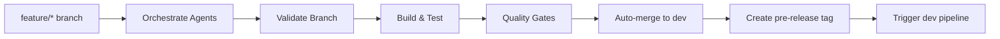
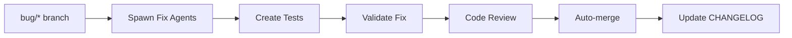
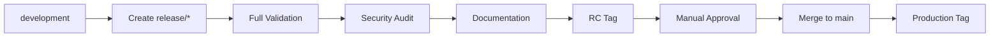

# 🌿 Enhanced Golden CI Branching Strategy with Full Tool Utilization

## Overview

This document outlines the comprehensive branching strategy that leverages all available tools:
- **buildkit** - Agent orchestration and spawning (short form of agent-buildkit)
- **ops** - Operations and deployment management
- **agent-buildkit** - Branch management and quality checks (full form)
- **OSSA CLI** - Compliance and specification validation

## Branch Model

### Protected Branches
- **`development`** - Primary development branch (all work flows here)
- **`main`** - Production branch (CI-managed only, never direct commits)

### Working Branches (Max 5 active per type)
```bash
feature/*   # New features (auto-merge to development)
bug/*       # Bug fixes (auto-merge to development)
hotfix/*    # Critical fixes (direct to main)
chore/*     # Maintenance tasks
docs/*      # Documentation updates
test/*      # Test additions/improvements
perf/*      # Performance optimizations
ci/*        # CI/CD improvements
```

## Tool Integration in CI Pipeline

### 1. Agent Orchestration (`buildkit`)

The pipeline automatically spawns specialized agents based on branch type:

```yaml
# Feature branches spawn:
buildkit agents spawn tdd-enforcer --task "Validate TDD compliance"
buildkit agents spawn api-first-architect --task "Check API specifications"
buildkit agents spawn typescript-specialist --task "TypeScript validation"

# Bug branches spawn:
buildkit agents spawn test-automation-engineer --task "Create regression tests"
buildkit agents spawn code-quality-critic --task "Review fix quality"

# Release branches spawn:
buildkit agents spawn ossa-compliance-validator --task "Validate OSSA compliance"
buildkit agents spawn security-audit-specialist --task "Security audit"
buildkit agents spawn documentation-curator --task "Update documentation"
```

### 2. Branch Management (`agent-buildkit`)

Automated branch operations using agent-buildkit commands:

```bash
# Validate current branch
agent-buildkit branch validate --current "$CI_COMMIT_BRANCH"

# Auto-merge to development
agent-buildkit git merge-to-development --branch "$CI_COMMIT_BRANCH" --strategy "no-ff"

# Cleanup old branches
agent-buildkit branch cleanup --age "30d" --keep-recent 5 --dry-run false

# Create tags
agent-buildkit git tag --name "v1.0.0-feature.search+sha.abc123" --message "Feature tag"
```

### 3. Operations Management (`ops`)

Build, deploy, and monitor using ops commands:

```bash
# Build orchestration
ops build --type "nodejs" --version "0.1.9"

# Security scanning
ops security scan --comprehensive

# Deployment
ops deploy --environment "staging" --version "0.1.9" --strategy "rolling"

# Health checks
ops health check --url "https://staging.example.com"

# Artifact cleanup
ops cleanup artifacts --older-than "7d"
```

### 4. OSSA Compliance (`ossa`)

Ensure specification compliance:

```bash
# Validate compliance
node /Users/flux423/Sites/LLM/OSSA/dist/cli/index.js compliance validate --version "0.1.9"

# Security audit
node /Users/flux423/Sites/LLM/OSSA/dist/cli/index.js security audit

# Orchestrator for complex workflows
node /Users/flux423/Sites/LLM/OSSA/dist/cli/index.js orchestrator spawn --workflow "release"
```

## Automated Workflows

### Feature Development Flow



1. **Create feature branch**: 
   ```bash
   agent-buildkit branch create feature/new-capability
   ```

2. **CI automatically**:
   - Spawns TDD enforcer agent
   - Validates branch naming
   - Runs comprehensive tests
   - Auto-merges to development on success
   - Creates tag: `v0.1.9-feature.new-capability+sha.abc123`

### Bug Fix Flow



### Release Flow



## Branch Limits & Cleanup

### Automatic Enforcement
- **Max 5 feature branches**: Older ones auto-archived
- **Max 3 bug branches**: Prioritized by severity
- **30-day age limit**: Stale branches auto-deleted

### Cleanup Agent
The `git-branch-management-specialist` agent runs automatically to:
- Remove merged branches
- Archive stale branches
- Clean up old tags
- Optimize repository size

## Version Detection & Tagging

### Auto-Detection Priority
1. `package.json` → `.version`
2. `composer.json` → `version`
3. `pyproject.toml` → `project.version`
4. Last git tag + patch increment

### Tag Formats
- **Feature**: `v0.1.9-feature.search-api+sha.abc123`
- **Bug**: `v0.1.9-bug.fix-cache+sha.def456`
- **RC**: `v0.1.9-rc.20240112`
- **Production**: `v0.1.9`

## Quality Gates

### Automated Checks
```bash
# Quality score calculation
agent-buildkit quality check --threshold 70

# Coverage validation
npm run test:coverage
# Must exceed: 80%

# Security scanning
ops security scan --comprehensive
# Must pass: No critical vulnerabilities

# OSSA compliance
$OSSA_CLI compliance validate
# Must pass: Full compliance
```

## Cross-Project Synchronization

### Automatic Sync on Development
```bash
# Sync to dependent projects
ops sync --source "OSSA" --targets "agent_buildkit,common_npm/*"

# Trigger dependent pipelines
curl -X POST \
  -F token="$CI_JOB_TOKEN" \
  -F ref=development \
  -F "variables[UPSTREAM_PROJECT]=OSSA" \
  "$CI_SERVER_URL/api/v4/projects/$PROJECT_ID/trigger/pipeline"
```

## Manual Intervention Points

The golden CI is fully automated except for:
1. **Production Release**: Manual approval required
2. **Production Deploy**: Manual trigger required

Everything else is automated through agent orchestration.

## Usage Examples

### Local Development
```bash
# Start new feature
agent-buildkit branch create feature/awesome-feature
git checkout feature/awesome-feature

# Work on feature...
git add .
git commit -m "feat: add awesome capability"
git push origin feature/awesome-feature

# CI automatically:
# - Validates
# - Tests
# - Merges to development
# - Creates tag
# - Triggers downstream

# Check branch status
agent-buildkit branch status --all

# Clean up old branches
agent-buildkit branch cleanup --interactive
```

### CI/CD Integration
```yaml
# .gitlab-ci.yml
include:
  - component: gitlab.bluefly.io/llm/gitlab_components/workflow/golden@0.1.0
    inputs:
      enable_agents: true
      max_feature_branches: 5
      branch_age_limit: "30d"
      auto_merge_to_dev: true
```

## Monitoring & Reporting

### Pipeline Summary
Every pipeline generates a comprehensive report:
- Agents spawned and their results
- Quality metrics (coverage, security, compliance)
- Branch statistics
- Performance metrics
- Deployment status

### Agent Coordination
```bash
# View all active agents
buildkit agents list --status active

# Check agent results
buildkit agents results --pipeline-id $CI_PIPELINE_ID

# Monitor orchestration
$OSSA_CLI orchestrator status --workflow $PIPELINE_TYPE
```

## Benefits of This Approach

1. **Fully Automated**: Only 2 manual steps (production release/deploy)
2. **Agent-Powered**: Specialized agents handle complex tasks
3. **Tool Integration**: Leverages all available CLIs effectively
4. **Self-Cleaning**: Automatic branch and artifact cleanup
5. **Cross-Project**: Synchronizes changes across ecosystem
6. **Compliance**: Built-in OSSA validation
7. **Quality**: Enforced gates and thresholds
8. **Scalable**: Handles multiple parallel workflows

## Troubleshooting

### Common Issues
```bash
# Branch limit exceeded
buildkit agents spawn git-branch-management-specialist --task "Emergency cleanup"

# Merge conflicts
agent-buildkit git resolve-conflicts --strategy "theirs"

# Failed quality gates
buildkit agents spawn code-quality-critic --task "Suggest improvements"

# OSSA compliance failures
$OSSA_CLI compliance report --detailed
```

## Conclusion

This enhanced branching strategy fully utilizes the tool ecosystem:
- **40+ agents** available for specialized tasks
- **Automated workflows** reduce manual intervention
- **Cross-platform integration** via OSSA ↔ Claude bridge
- **Self-maintaining** through cleanup agents
- **Compliance-first** with built-in validation

The result is a highly automated, self-maintaining CI/CD pipeline that requires minimal manual intervention while maintaining high quality and compliance standards.