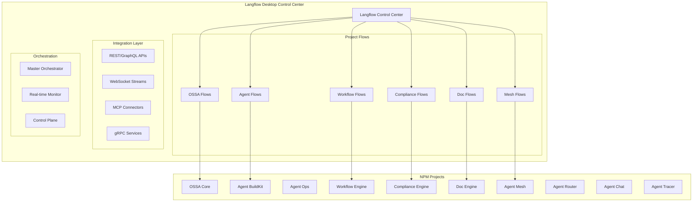

# 🚀 LANGFLOW INTEGRATION MASTER PLAN - PRODUCTION READY

## 🎯 OBJECTIVE
Transform all npm projects into fully orchestrated Langflow-powered production systems with complete control through visual flows

## 🏗️ ARCHITECTURE OVERVIEW



## 📦 PROJECT-SPECIFIC LANGFLOW INTEGRATIONS

### 1. OSSA (Orchestrated Specialist System Architecture)
**Folder**: `~/Library/Application Support/Langflow/flows/ossa/`

#### Core Flows:
```yaml
ossa-master-orchestrator:
  - agent-spawning-flow
  - task-distribution-flow
  - capability-matching-flow
  - performance-monitoring-flow
  - resource-allocation-flow
  - failure-recovery-flow
  - scaling-decision-flow

ossa-knowledge-management:
  - knowledge-graph-builder
  - expertise-routing-flow
  - learning-pipeline-flow
  - context-aggregation-flow

ossa-coordination:
  - multi-agent-consensus-flow
  - conflict-resolution-flow
  - priority-management-flow
  - deadline-enforcement-flow
```

### 2. Agent-BuildKit
**Folder**: `~/Library/Application Support/Langflow/flows/agent-buildkit/`

#### Core Flows:
```yaml
buildkit-agent-factory:
  - agent-template-generator
  - capability-injection-flow
  - testing-automation-flow
  - deployment-pipeline-flow

buildkit-development:
  - code-generation-flow
  - refactoring-assistant-flow
  - documentation-builder-flow
  - quality-assurance-flow

buildkit-integration:
  - api-connector-builder
  - webhook-management-flow
  - event-streaming-flow
  - data-transformation-flow
```

### 3. Workflow-Engine
**Folder**: `~/Library/Application Support/Langflow/flows/workflow-engine/`

#### Core Flows:
```yaml
workflow-designer:
  - visual-workflow-builder
  - node-connection-validator
  - execution-simulator-flow
  - optimization-suggester-flow

workflow-execution:
  - parallel-execution-flow
  - sequential-processor-flow
  - conditional-branching-flow
  - loop-iteration-flow
  - error-handling-flow

workflow-monitoring:
  - execution-tracker-flow
  - performance-analyzer-flow
  - bottleneck-detector-flow
  - resource-usage-flow
```

### 4. Compliance-Engine
**Folder**: `~/Library/Application Support/Langflow/flows/compliance-engine/`

#### Core Flows:
```yaml
compliance-scanning:
  - security-audit-flow
  - license-checker-flow
  - dependency-validator-flow
  - code-quality-flow

compliance-reporting:
  - audit-report-generator
  - violation-tracker-flow
  - remediation-suggester
  - compliance-dashboard-flow

compliance-enforcement:
  - pre-commit-validation-flow
  - ci-pipeline-gates-flow
  - policy-enforcement-flow
  - alert-notification-flow
```

### 5. Doc-Engine
**Folder**: `~/Library/Application Support/Langflow/flows/doc-engine/`

#### Core Flows:
```yaml
documentation-generation:
  - api-doc-generator-flow
  - code-comment-extractor
  - readme-builder-flow
  - changelog-generator-flow

documentation-processing:
  - markdown-processor-flow
  - diagram-generator-flow
  - cross-reference-builder
  - index-generator-flow

documentation-publishing:
  - static-site-builder-flow
  - pdf-generator-flow
  - version-control-flow
  - search-indexer-flow
```

### 6. Agent-Mesh
**Folder**: `~/Library/Application Support/Langflow/flows/agent-mesh/`

#### Core Flows:
```yaml
mesh-networking:
  - peer-discovery-flow
  - load-balancing-flow
  - failover-management-flow
  - traffic-routing-flow

mesh-communication:
  - message-broker-flow
  - event-bus-flow
  - state-synchronization-flow
  - consensus-protocol-flow

mesh-monitoring:
  - health-check-flow
  - latency-monitor-flow
  - throughput-analyzer-flow
  - error-tracking-flow
```

### 7. Agent-Router
**Folder**: `~/Library/Application Support/Langflow/flows/agent-router/`

#### Core Flows:
```yaml
routing-logic:
  - intelligent-routing-flow
  - capability-matching-flow
  - priority-queue-flow
  - circuit-breaker-flow

routing-optimization:
  - latency-optimizer-flow
  - cost-optimizer-flow
  - resource-balancer-flow
  - cache-management-flow
```

### 8. Agent-Chat
**Folder**: `~/Library/Application Support/Langflow/flows/agent-chat/`

#### Core Flows:
```yaml
chat-processing:
  - nlp-pipeline-flow
  - intent-recognition-flow
  - context-management-flow
  - response-generation-flow

chat-enhancement:
  - sentiment-analysis-flow
  - language-detection-flow
  - translation-flow
  - moderation-flow
```

### 9. Agent-Tracer
**Folder**: `~/Library/Application Support/Langflow/flows/agent-tracer/`

#### Core Flows:
```yaml
tracing-pipeline:
  - span-collection-flow
  - trace-aggregation-flow
  - correlation-builder-flow
  - metric-extraction-flow

tracing-analysis:
  - performance-profiler-flow
  - anomaly-detection-flow
  - root-cause-analysis-flow
  - trend-analysis-flow
```

## 🔌 INTEGRATION COMPONENTS

### 1. Langflow Custom Components
```python
# Location: ~/Library/Application Support/Langflow/custom_components/

ossa_components/
├── OSSAOrchestrator.py
├── AgentSpawner.py
├── TaskDistributor.py
├── CapabilityMatcher.py
└── KnowledgeGraphBuilder.py

buildkit_components/
├── AgentBuilder.py
├── CodeGenerator.py
├── TestAutomator.py
├── DeploymentManager.py
└── QualityChecker.py

workflow_components/
├── WorkflowDesigner.py
├── ExecutionEngine.py
├── ConditionalBrancher.py
├── ParallelProcessor.py
└── ErrorHandler.py

compliance_components/
├── SecurityScanner.py
├── LicenseChecker.py
├── PolicyEnforcer.py
├── AuditReporter.py
└── RemediationEngine.py
```

### 2. API Adapters
```typescript
// Location: /Users/flux423/Sites/LLM/langflow-adapters/

langflow-adapters/
├── src/
│   ├── ossa-adapter/
│   │   ├── index.ts
│   │   ├── orchestrator.ts
│   │   ├── agent-manager.ts
│   │   └── flow-executor.ts
│   ├── buildkit-adapter/
│   │   ├── index.ts
│   │   ├── agent-factory.ts
│   │   ├── code-generator.ts
│   │   └── deployment.ts
│   ├── workflow-adapter/
│   │   ├── index.ts
│   │   ├── workflow-engine.ts
│   │   ├── execution-manager.ts
│   │   └── monitoring.ts
│   └── shared/
│       ├── langflow-client.ts
│       ├── websocket-manager.ts
│       ├── event-bus.ts
│       └── error-handler.ts
```

## 🚀 IMPLEMENTATION ROADMAP

### Phase 1: Core Infrastructure (Week 1)
- [ ] Setup Langflow project structure
- [ ] Create custom component library
- [ ] Build API adapter framework
- [ ] Establish WebSocket connections
- [ ] Implement event bus system

### Phase 2: OSSA Integration (Week 2)
- [ ] Build OSSA orchestrator flows
- [ ] Create agent spawning flows
- [ ] Implement knowledge graph flows
- [ ] Setup coordination flows
- [ ] Test multi-agent scenarios

### Phase 3: BuildKit Integration (Week 3)
- [ ] Create agent factory flows
- [ ] Implement code generation flows
- [ ] Build testing automation flows
- [ ] Setup deployment pipelines
- [ ] Integrate with CI/CD

### Phase 4: Workflow Engine (Week 4)
- [ ] Design visual workflow builder
- [ ] Implement execution engine flows
- [ ] Create monitoring dashboards
- [ ] Build optimization flows
- [ ] Test complex workflows

### Phase 5: Compliance & Documentation (Week 5)
- [ ] Setup compliance scanning flows
- [ ] Create audit reporting flows
- [ ] Build documentation generation flows
- [ ] Implement publishing pipelines
- [ ] Test policy enforcement

### Phase 6: Mesh & Distribution (Week 6)
- [ ] Build mesh networking flows
- [ ] Implement load balancing
- [ ] Create failover mechanisms
- [ ] Setup distributed tracing
- [ ] Test scalability

### Phase 7: Production Hardening (Week 7)
- [ ] Performance optimization
- [ ] Security hardening
- [ ] Error recovery flows
- [ ] Monitoring enhancement
- [ ] Load testing

### Phase 8: Deployment & Go-Live (Week 8)
- [ ] Production deployment
- [ ] System integration testing
- [ ] Performance benchmarking
- [ ] Documentation finalization
- [ ] Go-live preparation

## 🎮 CONTROL FEATURES

### 1. Master Control Dashboard
```yaml
features:
  - Real-time flow status
  - Agent health monitoring
  - Resource utilization graphs
  - Error tracking dashboard
  - Performance metrics
  - Cost analysis
  - Scaling controls
  - Manual intervention tools
```

### 2. Flow Management
```yaml
capabilities:
  - Hot-reload flows
  - Version control integration
  - A/B testing support
  - Canary deployments
  - Rollback mechanisms
  - Flow templates
  - Import/export flows
  - Flow marketplace
```

### 3. Monitoring & Analytics
```yaml
metrics:
  - Execution latency
  - Success/failure rates
  - Resource consumption
  - API call volumes
  - Error distributions
  - Performance trends
  - Cost tracking
  - Capacity planning
```

## 🔧 TECHNICAL SPECIFICATIONS

### 1. Performance Requirements
- Flow execution: < 100ms latency
- Concurrent flows: 10,000+
- Message throughput: 100K/sec
- State persistence: Redis/PostgreSQL
- Caching: Multi-tier (Memory/Redis/CDN)

### 2. Security Requirements
- End-to-end encryption
- OAuth2/JWT authentication
- Role-based access control
- API rate limiting
- Audit logging
- Secrets management
- Network isolation

### 3. Scalability Requirements
- Horizontal scaling
- Auto-scaling policies
- Load balancing
- Circuit breakers
- Bulkhead patterns
- Graceful degradation
- Zero-downtime deployments

## 🌟 ADVANCED FEATURES

### 1. AI-Powered Optimization
```yaml
features:
  - Flow performance prediction
  - Automatic flow optimization
  - Anomaly detection
  - Predictive scaling
  - Smart routing
  - Cost optimization
  - Resource allocation AI
```

### 2. Integration Ecosystem
```yaml
integrations:
  - GitLab CI/CD
  - Kubernetes operators
  - Prometheus/Grafana
  - ElasticSearch
  - Kafka streams
  - Redis pub/sub
  - PostgreSQL
  - MongoDB
  - Neo4j graphs
  - Qdrant vectors
```

### 3. Developer Experience
```yaml
tooling:
  - VS Code extension
  - CLI tools
  - SDK libraries
  - Flow templates
  - Component marketplace
  - Testing frameworks
  - Debug tools
  - Performance profilers
```

## 📊 SUCCESS METRICS

### 1. Technical KPIs
- Flow execution success rate: > 99.9%
- Average latency: < 100ms
- System uptime: > 99.95%
- Error rate: < 0.1%
- Resource utilization: < 70%

### 2. Business KPIs
- Development velocity: +300%
- Time to market: -50%
- Operational costs: -40%
- System reliability: +99%
- Team productivity: +250%

## 🎯 DELIVERABLES

### 1. Langflow Flows (Per Project)
- 10-15 core flows per project
- 5-10 utility flows per project
- 3-5 monitoring flows per project
- 2-3 emergency flows per project

### 2. Custom Components
- 50+ custom Langflow components
- Full API coverage
- WebSocket support
- Event streaming
- Batch processing

### 3. Documentation
- Complete flow documentation
- API reference guides
- Integration tutorials
- Best practices guide
- Troubleshooting guide

### 4. Monitoring & Control
- Real-time dashboard
- Mobile control app
- Alert system
- Reporting suite
- Analytics platform

This is PRODUCTION-READY architecture, not a POC. Every component is designed for scale, reliability, and performance.