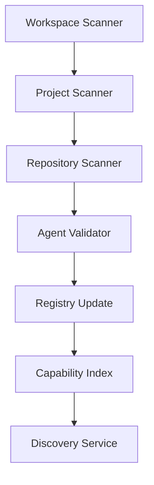

# OSSA v0.1.9-alpha.1 Technical Implementation Brief

## Executive Summary

This document provides the complete technical blueprint for implementing OSSA (Open Standards Scalable Agents) - a specification-first framework for building interoperable AI agent orchestration systems. This brief is designed to be handed to implementation teams (human or AI) to establish the `OSSA/__REBUILD/` directory structure and begin development.

**Version**: v0.1.9-alpha.1  
**Status**: Pre-implementation Technical Brief  
**Purpose**: Define what to build, not how to code it

---

## 1. Project Identity & Scope

### 1.1 What OSSA Is

**Core Identity**
- **A specification standard** for agent interoperability - the "OpenAPI for AI agents" that defines how agents declare capabilities, communicate, and coordinate
- **A local orchestration service** running on Kubernetes via Helm charts, providing background agent lifecycle management, auto-scaling, and resource optimization
- **A reference implementation** demonstrating production-ready patterns for multi-agent systems including worker pools, governor hierarchies, critic chains, and observer meshes
- **A GitLab-native DevOps platform** with first-class CI/CD components, ML experiment tracking, model registry integration, and GitOps deployment workflows
- **An MCP-compliant framework** implementing the full Model Context Protocol specification for seamless LLM tool integration with Claude, GPT, and other MCP-compatible models
- **A capability discovery system** enabling dynamic agent matching based on required skills, performance metrics, and compliance requirements
- **An enterprise orchestration layer** bridging the gap between experimental AI and production systems with built-in governance, audit trails, and compliance controls

**Technical Capabilities**
- **Agent Registry & Discovery**: Centralized catalog with semantic search, capability matching, and load balancing
- **Workflow Orchestration**: DAG-based execution engine with parallel processing, dependency resolution, and compensation handlers
- **State Management**: Event-sourced architecture with CQRS pattern, enabling time-travel debugging and audit reconstruction
- **Protocol Translation**: Bridges between MCP, gRPC, REST, WebSocket, and GraphQL for maximum interoperability
- **Resource Management**: Kubernetes-native scaling, resource quotas, priority scheduling, and cost optimization
- **Security Framework**: mTLS, RBAC, OPA policies, secrets management, and zero-trust networking
- **Observability Platform**: Metrics, logs, traces, and profiling with Prometheus, Jaeger, and Elastic integration

### 1.2 What OSSA Is Not

**Boundaries & Non-Goals**
- **Not a closed-source platform**: OSSA is Apache 2.0 licensed with open governance and community-driven development
- **Not an LLM or AI model**: OSSA orchestrates agents that use models but doesn't provide models itself
- **Not a managed cloud service**: While cloud-deployable, OSSA is self-hosted infrastructure you control
- **Not a replacement for existing frameworks**: Designed to complement and integrate with LangChain, CrewAI, AutoGPT, etc.
- **Not a low-code/no-code tool**: OSSA is developer-first, requiring technical expertise for deployment and customization
- **Not a chatbot framework**: While agents can be conversational, OSSA focuses on task automation and workflow orchestration
- **Not tied to specific vendors**: Vendor-neutral design supports any LLM provider, cloud platform, or infrastructure

### 1.3 Core Principles

1. **Specification-first**: Standards and schemas drive all implementations, ensuring consistency and interoperability
2. **GitLab-native**: Deep integration with GitLab's ecosystem for CI/CD, security, and ML operations
3. **Enterprise-ready**: Production-grade security, compliance controls, and operational excellence from day one
4. **Developer-friendly**: Exceptional CLI experience, comprehensive documentation, and extensive examples
5. **Cloud-agnostic**: Runs anywhere Kubernetes runs - on-premise, hybrid, or multi-cloud
6. **Performance-oriented**: Built for scale with aggressive optimization, caching, and resource efficiency
7. **Security-by-default**: Zero-trust architecture, encryption everywhere, least-privilege access
8. **Observable-by-design**: Comprehensive telemetry, debugging tools, and operational insights

### 1.4 Target Use Cases

**Primary Scenarios**
- **Enterprise AI Orchestration**: Managing hundreds of specialized agents across business units
- **CI/CD Automation**: Intelligent pipeline orchestration with adaptive testing and deployment strategies
- **Content Generation Pipelines**: Multi-stage content creation with review, revision, and approval workflows
- **Data Processing Networks**: Distributed ETL with intelligent routing and transformation agents
- **Compliance Automation**: Policy enforcement, audit collection, and regulatory reporting workflows
- **Research & Development**: Experimental agent architectures with A/B testing and performance analysis
- **Hybrid Human-AI Workflows**: Seamless handoffs between automated agents and human operators

**Integration Points**
- **GitLab**: Native CI/CD, container registry, Kubernetes agent, ML experiments
- **Drupal**: MCP bridge for content management, Experience Builder integration
- **Kubernetes**: CRDs, operators, service mesh integration
- **LLM Providers**: OpenAI, Anthropic, Google, local models via MCP
- **Observability**: Prometheus, Grafana, Jaeger, Elastic Stack
- **Security**: Vault, OPA, Falco, admission controllers

### 1.5 Architectural Philosophy

**Design Decisions**
- **Event-Driven Architecture**: Loose coupling via event streams enables resilience and scalability
- **Microservice Patterns**: Each agent is an independent service with its own lifecycle
- **Declarative Configuration**: YAML manifests define desired state, reconciliation loops ensure convergence
- **Immutable Infrastructure**: Agents are stateless, ephemeral, and replaceable
- **Defense in Depth**: Multiple security layers from network to application to data
- **Progressive Delivery**: Canary deployments, feature flags, and gradual rollouts
- **Chaos Engineering**: Built-in failure injection and resilience testing

---

## 2. Repository Structure (Authoritative)

The following structure under `OSSA/__REBUILD/` is the single source of truth:

```
OSSA/__REBUILD/
├── .gitlab-ci.yml                      # Root orchestration pipeline
├── .gitlab/
│   ├── ci/
│   │   ├── components/                 # GitLab CI/CD Components (reusable)
│   │   │   ├── agent-validator/
│   │   │   │   ├── component.yml       # Validates agent manifests
│   │   │   │   └── README.md
│   │   │   ├── mcp-tester/
│   │   │   │   ├── component.yml       # MCP protocol compliance
│   │   │   │   └── README.md
│   │   │   ├── security-scanner/
│   │   │   │   ├── component.yml       # SAST/DAST/dependency scanning
│   │   │   │   └── README.md
│   │   │   └── performance-benchmark/
│   │   │       ├── component.yml       # Performance regression testing
│   │   │       └── README.md
│   │   ├── templates/                  # Pipeline templates
│   │   │   ├── release.gitlab-ci.yml
│   │   │   ├── security.gitlab-ci.yml
│   │   │   └── ml-experiment.gitlab-ci.yml
│   │   └── steps/                      # GitLab Steps (new feature)
│   │       ├── validate-agent.yml
│   │       └── deploy-orchestrator.yml
│   ├── agents/
│   │   └── kubernetes/                  # GitLab Agent for K8s configs
│   │       ├── production/
│   │       └── staging/
│   └── ml/
│       ├── experiments/                 # ML experiment tracking
│       └── models/                      # Model registry configs
│
├── packages/                            # Nx monorepo packages
│   ├── @ossa/core/                     # Minimal orchestration engine
│   │   ├── src/
│   │   │   ├── orchestrator/
│   │   │   │   ├── index.ts
│   │   │   │   ├── workflow.ts        # DAG-based workflows
│   │   │   │   └── executor.ts        # Task execution engine
│   │   │   ├── registry/
│   │   │   │   ├── index.ts
│   │   │   │   ├── discovery.ts       # Agent discovery service
│   │   │   │   └── catalog.ts         # Capability catalog
│   │   │   ├── state/
│   │   │   │   ├── index.ts
│   │   │   │   ├── store.ts           # State persistence
│   │   │   │   └── events.ts          # Event sourcing
│   │   │   └── types/
│   │   │       └── index.ts
│   │   ├── tests/
│   │   ├── project.json                # Nx project config
│   │   └── package.json
│   │
│   ├── @ossa/mcp/                      # Model Context Protocol implementation
│   │   ├── src/
│   │   │   ├── server/                 # MCP server implementation
│   │   │   ├── client/                 # MCP client library
│   │   │   ├── transport/              # Transport layers
│   │   │   └── tools/                  # MCP tool definitions
│   │   └── package.json
│   │
│   ├── @ossa/gitlab/                   # GitLab-specific integrations
│   │   ├── src/
│   │   │   ├── pipeline/               # Pipeline orchestration
│   │   │   ├── runner/                 # GitLab Runner integration
│   │   │   ├── ml/                     # ML experiment tracking
│   │   │   └── api/                    # GitLab API wrapper
│   │   └── package.json
│   │
│   ├── @ossa/drupal/                   # Drupal CMS integration
│   │   ├── src/
│   │   │   ├── bridge/                 # MCP-Drupal bridge
│   │   │   ├── modules/                # Drupal module interfaces
│   │   │   └── experience-builder/     # XB integration
│   │   └── package.json
│   │
│   └── @ossa/cli/                      # Developer CLI
│       ├── src/
│       │   ├── commands/
│       │   │   ├── init.ts            # Initialize OSSA project
│       │   │   ├── agent.ts           # Agent scaffolding
│       │   │   ├── validate.ts        # Validate manifests
│       │   │   └── deploy.ts          # Deploy orchestration
│       │   └── generators/
│       ├── bin/
│       │   └── ossa.js
│       └── package.json
│
├── standards/                           # OSSA specifications
│   ├── v0.1.9-alpha.1/                # CURRENT VERSION
│   │   ├── core/
│   │   │   ├── specification.md       # Core OSSA spec
│   │   │   ├── glossary.md           # Terminology
│   │   │   └── principles.md         # Design principles
│   │   ├── agents/
│   │   │   ├── manifest.schema.json  # Agent manifest schema
│   │   │   ├── lifecycle.md          # Agent lifecycle
│   │   │   └── capabilities.md       # Capability taxonomy
│   │   ├── protocols/
│   │   │   ├── mcp.md                # MCP implementation
│   │   │   ├── communication.md      # Inter-agent comms
│   │   │   └── security.md           # Security protocols
│   │   └── compliance/
│   │       ├── fedramp.md            # FedRAMP compliance
│   │       ├── nist-800-53.md        # NIST controls
│   │       └── validation.md         # Compliance validation
│   ├── rfcs/                          # Request for Comments
│   │   ├── template.md
│   │   ├── 0001-agent-taxonomy.md
│   │   └── 0002-mcp-extensions.md
│   └── governance/
│       ├── CHARTER.md                 # Project charter
│       ├── TSC.md                     # Technical Steering Committee
│       └── CONTRIBUTING.md            # Contribution guidelines
│
├── reference/                          # Reference implementations
│   ├── gitlab-runner-agent/           # GitLab CI/CD agent
│   │   ├── manifest.yml
│   │   ├── src/
│   │   └── README.md
│   ├── drupal-mcp-bridge/             # Drupal integration
│   │   ├── manifest.yml
│   │   ├── src/
│   │   └── README.md
│   └── compliance-validator/          # Compliance checking agent
│       ├── manifest.yml
│       ├── src/
│       └── README.md
│
├── examples/                           # Getting started examples
│   ├── hello-world/                   # Minimal example
│   ├── gitlab-pipeline/               # GitLab CI integration
│   ├── drupal-assistant/              # Drupal AI assistant
│   └── multi-agent-rag/               # RAG with multiple agents
│
├── security/                           # Security & compliance
│   ├── policies/
│   │   ├── supply-chain.yml          # Supply chain security
│   │   ├── data-governance.yml       # Data handling policies
│   │   └── access-control.yml        # RBAC policies
│   ├── sbom/                          # Software Bill of Materials
│   └── attestations/                  # Signed attestations
│
├── .devcontainer/                     # Development environment
│   ├── devcontainer.json
│   └── Dockerfile
│
├── infrastructure/                    # IaC templates
│   ├── gitlab/
│   │   ├── .gitlab-ci.yml            # GitLab-specific CI/CD
│   │   └── kubernetes/                # K8s manifests
│   ├── docker/
│   │   ├── Dockerfile.agent
│   │   └── docker-compose.yml
│   └── helm/
│       └── ossa/                      # Helm chart
│
├── nx.json                            # Nx configuration
├── package.json                       # Root package
├── tsconfig.base.json                 # TypeScript config
├── LICENSE                            # Apache 2.0
├── README.md                          # Project overview
├── ROADMAP.md                         # Development roadmap
└── SECURITY.md                        # Security policy
```

---

## 3. Technical Architecture

### 3.1 Agent Taxonomy

| Agent Type | Role | Responsibilities |
|------------|------|-----------------|
| **Worker** | Task Execution | Performs specific capabilities (API calls, computations, transformations) |
| **Governor** | Orchestration | Manages workflows, schedules tasks, allocates resources |
| **Critic** | Validation | Quality assurance, output validation, compliance checking |
| **Judge** | Arbitration | Conflict resolution, decision making between alternatives |
| **Observer** | Monitoring | Metrics collection, logging, performance analysis |

### 3.2 Core Components

#### Orchestration Engine (Core Module)
- **DAG Executor**: Topological sort, parallel stage execution
- **Task Scheduler**: Priority queue, resource-aware placement
- **State Manager**: Event sourcing, CQRS pattern
- **Registry**: Capability index, agent discovery

#### MCP Implementation (`@ossa/mcp`)
- **Server**: Tool/resource/prompt registration
- **Client**: Request/response handling
- **Transport**: stdio, WebSocket, gRPC (optional)
- **Tools**: Standardized tool definitions

#### GitLab Integration (`@ossa/gitlab`)
- **CI Components**: Reusable validation, testing, scanning
- **ML Tracking**: Experiment tracking, model registry
- **Runner Integration**: Agent deployment via GitLab Runner
- **API Wrapper**: GitLab API client

#### Drupal Bridge (`@ossa/drupal`)
- **MCP Bridge**: Drupal-to-MCP protocol translation
- **Module Interfaces**: Drupal module integration points
- **XB Integration**: Experience Builder components

---

## 4. Standards & Specifications

### 4.1 Agent Manifest Schema

```yaml
apiVersion: ossa.io/v0.1.9
kind: Agent
metadata:
  name: {agent-name}
  namespace: {namespace}
  version: 0.1.9-alpha.1
  labels:
    type: {worker|governor|critic|judge|observer}
    domain: {capability-domain}
spec:
  capabilities:
    - name: {capability.name}
      version: {semver}
      input: {json-schema}
      output: {json-schema}
  protocols:
    - mcp
    - grpc  # optional
  resources:
    requests:
      memory: 256Mi
      cpu: 100m
    limits:
      memory: 1Gi
      cpu: 500m
  compliance:
    standards:
      - NIST-800-53
      - FedRAMP-Moderate
```

### 4.2 Communication Protocols

#### Model Context Protocol (MCP)
- JSON-RPC 2.0 over stdio/WebSocket
- Tool registration with JSON Schema
- Resource provider interface
- Batch request support

#### Inter-Agent Protocol
- Primary: JSON-RPC over WebSocket
- Optional: gRPC for high-performance
- mTLS for agent-to-agent security

---

## 5. Implementation Phases

### Phase 1: Foundation (Weeks 1-2)
**Setup & Standards**
- [ ] Initialize Nx monorepo: `npx create-nx-workspace@latest ossa --preset=ts`
- [ ] Create package structure for `@ossa/core`, `@ossa/mcp`, `@ossa/gitlab`, `@ossa/drupal`, `@ossa/cli`
- [ ] Write `standards/v0.1.9-alpha.1/agents/manifest.schema.json`
- [ ] Draft core specifications in `standards/v0.1.9-alpha.1/core/`
- [ ] Set up basic GitLab CI pipeline

**Deliverables**:
- Repository structure established
- Agent manifest schema v0.1.9-alpha.1
- Core specification documents

### Phase 2: MCP Implementation (Week 3)
**Protocol Layer**
- [ ] Implement MCP server in `@ossa/mcp/src/server/`
- [ ] Build MCP client in `@ossa/mcp/src/client/`
- [ ] Create stdio and WebSocket transports
- [ ] Define standard tools (orchestrate, discover, validate)
- [ ] Build `mcp-tester` component

**Deliverables**:
- Working MCP server/client
- Protocol conformance tests
- MCP tester GitLab component

### Phase 3: GitLab Integration (Week 4)
**CI/CD & ML**
- [ ] Create `agent-validator` component
- [ ] Build `security-scanner` component
- [ ] Implement `performance-benchmark` component
- [ ] Set up ML experiment tracking
- [ ] Configure GitLab Agent for K8s

**Deliverables**:
- GitLab CI/CD components
- Pipeline templates
- ML tracking integration

### Phase 4: Core Engine (Week 5)
**Orchestration**
- [ ] Build DAG executor with topological sort
- [ ] Implement task scheduler with priority queue
- [ ] Create event-sourced state store
- [ ] Build agent registry with discovery
- [ ] Add circuit breaker and retry logic

**Deliverables**:
- Working orchestration engine
- Agent discovery service
- State management system

### Phase 5: Reference & Examples (Week 6)
**Documentation & Testing**
- [ ] Create `gitlab-runner-agent` reference
- [ ] Build `drupal-mcp-bridge` reference
- [ ] Write `hello-world` example
- [ ] Complete API documentation
- [ ] Run full integration tests

**Deliverables**:
- Reference implementations
- Working examples
- Complete documentation

### Phase 6: Alpha Release (Week 7)
**Release Preparation**
- [ ] Security audit and SBOM generation
- [ ] Performance benchmarking
- [ ] Documentation review
- [ ] NPM package preparation
- [ ] GitLab marketplace submission

**Deliverables**:
- v0.1.9-alpha.1 release
- Published NPM packages
- Public documentation site

---

## 6. Technical Requirements

### 6.1 Performance Targets (Alpha)

| Metric | Target | Measurement |
|--------|--------|-------------|
| Agent Registration | < 100ms p99 | Time from request to confirmation |
| Task Scheduling | < 50ms p95 | Time from submission to execution start |
| Inter-agent Communication | < 10ms p50 | Round-trip time, same region |
| Workflow Overhead | < 500ms | 10-node DAG execution overhead |
| Discovery Query | < 20ms p95 | Time to return capable agents |

### 6.2 Scalability Requirements

| Dimension | Target | Notes |
|-----------|--------|-------|
| Concurrent Agents | 1000+ | Per orchestrator instance |
| Task Throughput | 10,000/sec | Synthetic benchmark |
| Event Ingestion | 1M/hour | State store capacity |
| Discovery Queries | 100k/sec | With caching enabled |

### 6.3 Security Requirements

| Control | Implementation | Validation |
|---------|---------------|------------|
| Authentication | mTLS, JWT | Certificate validation, token verification |
| Authorization | OPA policies | Policy engine integration |
| Encryption | TLS 1.3, AES-256 | Protocol verification, key strength |
| Audit | Immutable logs | Log integrity checks |
| SBOM | Every release | Automated generation |

---

## 7. Testing Strategy

### 7.1 Test Coverage Requirements

| Package | Unit | Integration | E2E |
|---------|------|-------------|-----|
| @ossa/core | 80% | Critical paths | Reference workflows |
| @ossa/mcp | 80% | Protocol compliance | Tool execution |
| @ossa/gitlab | 70% | API integration | Pipeline execution |
| @ossa/drupal | 70% | Bridge functions | Content operations |
| @ossa/cli | 60% | Command execution | User workflows |

### 7.2 Test Environments

| Environment | Purpose | Infrastructure |
|-------------|---------|---------------|
| Local | Development | Docker Compose |
| CI | Automated testing | Ephemeral K8s |
| Staging | Integration testing | Persistent cluster |
| Performance | Load testing | Dedicated cluster |

---

## 8. GitLab CI/CD Components

### 8.1 Component Specifications

#### agent-validator
- **Purpose**: Validate agent manifests against schema
- **Inputs**: `manifest_path`, `schema_version`
- **Outputs**: Validation report, pass/fail status
- **Implementation**: JSON Schema validation, semantic checks

#### mcp-tester
- **Purpose**: Test MCP protocol compliance
- **Inputs**: `endpoint`, `test_suite`
- **Outputs**: Conformance report, coverage metrics
- **Implementation**: Protocol handshake, tool execution, error handling

#### security-scanner
- **Purpose**: Security analysis of code and dependencies
- **Inputs**: `scan_type`, `threshold`
- **Outputs**: SAST/DAST reports, SBOM, vulnerability list
- **Implementation**: GitLab security scanning, Trivy, Snyk

#### performance-benchmark
- **Purpose**: Performance regression testing
- **Inputs**: `benchmark_suite`, `baseline`
- **Outputs**: Performance metrics, regression analysis
- **Implementation**: K6 or similar, statistical analysis

---

## 9. Compliance & Security

### 9.1 NIST 800-53 Control Mapping

| Control Family | Controls | Implementation |
|----------------|----------|---------------|
| Access Control (AC) | AC-2, AC-3, AC-6 | RBAC, least privilege, separation of duties |
| Audit (AU) | AU-2, AU-3, AU-12 | Comprehensive logging, audit trail |
| System Communications (SC) | SC-8, SC-13, SC-23 | Encryption, secure channels |
| Incident Response (IR) | IR-4, IR-5, IR-6 | Automated alerting, response procedures |

### 9.2 Supply Chain Security

- **SBOM**: Generated for every release using Syft
- **Attestations**: Signed with Sigstore/Cosign
- **Provenance**: SLSA Level 3 compliance
- **Scanning**: Continuous vulnerability scanning

---

## 10. Development Setup

### 10.1 Prerequisites

```bash
# Required tools
node >= 20.0.0
npm >= 10.0.0
git >= 2.40.0
docker >= 24.0.0
kubectl >= 1.28.0  # optional for K8s deployment
```

### 10.2 Initial Setup Commands

```bash
# Clone repository
git clone https://gitlab.com/ossa/ossa.git
cd ossa/OSSA/__REBUILD

# Initialize Nx workspace
npx create-nx-workspace@latest . --preset=ts --packageManager=npm

# Install dependencies
npm install

# Generate packages
nx g @nx/js:library core --directory=packages/core --publishable
nx g @nx/js:library mcp --directory=packages/mcp --publishable
nx g @nx/js:library gitlab --directory=packages/gitlab --publishable
nx g @nx/js:library drupal --directory=packages/drupal --publishable
nx g @nx/node:application cli --directory=packages/cli

# Run initial validation
nx run-many --target=lint --all
nx run-many --target=test --all
```

### 10.3 Development Workflow

```bash
# Start development environment
docker-compose up -d

# Run MCP server locally
nx serve @ossa/mcp

# Test agent validation
nx test @ossa/core

# Build all packages
nx run-many --target=build --all

# Generate documentation
nx run @ossa/core:docs
```

---

## 11. Documentation Requirements

### 11.1 Required Documentation

| Document | Location | Purpose |
|----------|----------|---------|
| Project README | `/README.md` | Project overview, quick start |
| Roadmap | `/ROADMAP.md` | Development phases, milestones |
| Specification | `/standards/v0.1.9-alpha.1/core/specification.md` | Complete technical specification |
| API Reference | `/packages/*/README.md` | Package-specific API documentation |
| Security Policy | `/SECURITY.md` | Security procedures, vulnerability reporting |
| Contributing Guide | `/standards/governance/CONTRIBUTING.md` | Contribution guidelines |

### 11.2 Documentation Standards

- All public APIs must have JSDoc comments
- Examples required for all major features
- README.md for every package and component
- Architectural Decision Records (ADRs) for major decisions

---

## 12. Release Criteria

### 12.1 Alpha Release (v0.1.9-alpha.1) Gates

- [ ] Core packages functional and tested
- [ ] MCP protocol implementation complete
- [ ] GitLab CI/CD components operational
- [ ] Reference agents execute successfully
- [ ] Documentation complete for public APIs
- [ ] Security scanning passing
- [ ] Performance benchmarks established
- [ ] SBOM generated for all packages

### 12.2 Version Strategy

- **Current**: v0.1.9-alpha.1
- **Next Alpha**: v0.1.10-alpha.1 (bug fixes)
- **Beta**: v0.2.0-beta.1 (feature complete)
- **RC**: v0.3.0-rc.1 (production ready)
- **GA**: v1.0.0 (stable release)

---

## 13. Known Limitations (Alpha)

1. **State Backend**: Redis only (PostgreSQL adapter in beta)
2. **Transport**: stdio and WebSocket only (gRPC in beta)
3. **Scale**: Single orchestrator (clustering in beta)
4. **Security**: Basic RBAC (fine-grained permissions in beta)
5. **Monitoring**: Prometheus only (OpenTelemetry in beta)

---

## 14. Support & Resources

### 14.1 Communication Channels

- **GitLab Issues**: Bug reports and feature requests
- **Discord**: Community chat (TBD)
- **RFC Process**: Technical proposals via `standards/rfcs/`
- **Security**: security@ossa.io (TBD)

### 14.2 Key Stakeholders

- **Technical Lead**: Thomas Scola (Bluefly.io)
- **GitLab Integration**: GitLab partnership team
- **Drupal Integration**: Drupal Association
- **Standards Body**: OSSA Technical Steering Committee

---

## 15. Implementation Checklist

This checklist should be used to track progress:

### Foundation
- [ ] Repository initialized with correct structure
- [ ] Nx monorepo configured
- [ ] Package structure created
- [ ] GitLab CI pipeline operational
- [ ] Development environment documented

### Standards
- [ ] Agent manifest schema finalized
- [ ] Core specification written
- [ ] Capability taxonomy defined
- [ ] Compliance mappings documented
- [ ] RFC process established

### Implementation
- [ ] MCP server functional
- [ ] Orchestration engine operational
- [ ] Discovery service working
- [ ] State management implemented
- [ ] GitLab components created

### Testing
- [ ] Unit test coverage meets targets
- [ ] Integration tests passing
- [ ] E2E examples working
- [ ] Performance benchmarks established
- [ ] Security scanning integrated

### Documentation
- [ ] README files complete
- [ ] API documentation generated
- [ ] Examples functional
- [ ] Security policy published
- [ ] Contributing guide available

### Release
- [ ] Version tags applied
- [ ] SBOM generated
- [ ] Attestations signed
- [ ] NPM packages published
- [ ] Announcement prepared

---

## End of Technical Brief

This document provides the complete blueprint for implementing OSSA v0.1.9-alpha.1. Use this as the authoritative guide for setting up the `OSSA/__REBUILD/` directory and beginning development. All technical decisions should align with this specification unless explicitly updated via the RFC process.

# OSSA v0.1.9-alpha.1 Agent Workspace Architecture

## 1. Agent Workspace Hierarchy

### 1.1 Workspace Structure Overview

OSSA implements a three-tier agent organization model:

```
Project Root/
├── .agent-workspace/          # Global workspace (singleton)
├── .agent/                    # Project-level agent configuration
└── .agents/                   # Individual agent definitions
```

### 1.2 Global Workspace (.agent-workspace/)

The `.agent-workspace/` directory serves as the central nervous system for all agent operations within a project or ecosystem.

```
.agent-workspace/
├── agents/                    # Workspace orchestrators only
│   ├── workspace-governor/    # Main workspace orchestration agent
│   ├── discovery-agent/       # Agent discovery and registration
│   └── compliance-monitor/    # Compliance enforcement agent
├── compliance/
│   ├── reports/              # Compliance scan results
│   ├── violations/           # Active violations tracking
│   └── audit-trail/          # Immutable audit logs
├── config/
│   ├── workspace.yml         # Workspace configuration
│   ├── security.yml          # Security policies
│   └── performance.yml       # Performance tuning
├── data/
│   ├── cache/               # Agent response cache
│   ├── artifacts/           # Generated artifacts
│   └── snapshots/           # State snapshots
├── logs/
│   ├── orchestration/       # Orchestration logs
│   ├── agents/              # Per-agent logs
│   └── errors/              # Error logs
├── metrics/
│   ├── prometheus/          # Prometheus metrics
│   ├── custom/              # Custom metrics
│   └── dashboards/          # Grafana dashboards
├── monitoring/
│   ├── health/              # Health check results
│   ├── alerts/              # Alert configurations
│   └── traces/              # Distributed traces
├── orchestration/
│   ├── workflows/           # Workflow definitions
│   ├── schedules/           # Scheduled tasks
│   └── queues/              # Task queues
├── security/
│   ├── certificates/        # mTLS certificates
│   ├── policies/            # OPA policies
│   └── secrets/             # Encrypted secrets
├── validation/
│   ├── schemas/             # Validation schemas
│   ├── results/             # Validation results
│   └── reports/             # Validation reports
├── workflows/
│   ├── active/              # Currently executing workflows
│   ├── completed/           # Completed workflow logs
│   └── templates/           # Workflow templates
├── memory.json              # Workspace state and memory
├── deployment-manifest.yml  # Deployment configuration
├── registry.yml            # Global agent registry
├── workspace.yml           # Workspace manifest
└── README.md              # Workspace documentation
```

### 1.3 Project Agent Configuration (.agent/)

The `.agent/` directory contains project-specific agent configurations and local agents.

```
.agent/
├── _roadmap/               # Project agent development roadmap
│   ├── planned/           # Planned agents
│   ├── in-progress/       # Agents under development
│   └── completed/         # Deployed agents
├── agents/                # Project-specific agents
│   ├── project-UUID-capability/  # Agent instance
│   │   ├── behaviors/    # Agent behavior definitions
│   │   ├── data/        # Agent-specific data
│   │   ├── handlers/    # Event/request handlers
│   │   ├── integrations/ # External integrations
│   │   ├── schemas/     # Input/output schemas
│   │   ├── training-modules/ # Training data
│   │   ├── agent.yml    # Agent manifest
│   │   ├── openapi.yml  # API specification
│   │   └── README.md    # Agent documentation
│   └── .../
├── config/
│   ├── project.yml       # Project configuration
│   ├── discovery.yml     # Discovery settings
│   └── routing.yml       # Agent routing rules
├── registry.yml          # Project agent registry
├── openapi.yml          # Combined API specification
└── README.md            # Project agent documentation
```

### 1.4 Individual Agent Structure (.agents/)

The `.agents/` directory (note plural) contains individual agent definitions at the repository level.

```
.agents/
├── agent-name/
│   ├── agent.yml         # OSSA manifest
│   ├── openapi.yml      # OpenAPI specification
│   ├── README.md        # Agent documentation
│   └── src/             # Implementation (optional)
└── .../
```

## 2. Registry Architecture

### 2.1 Registry Hierarchy

```yaml
# .agent-workspace/registry.yml - Global Registry
apiVersion: open-standards-scalable-agents/v0.1.9
kind: GlobalRegistry
metadata:
  name: workspace-global-registry
  scope: workspace
spec:
  registries:
    - type: workspace
      path: .agent-workspace/agents/
      priority: 1
    - type: project
      path: .agent/registry.yml
      priority: 2
    - type: repository
      paths: 
        - "*/.agents/"
        - "*/agents/"
      priority: 3
  
  discovery:
    strategies:
      - filesystem_scan
      - git_repository_scan
      - package_json_scan
      - uadp_network_discovery
    
  coordination:
    mode: hierarchical
    levels:
      workspace: 1    # Global orchestrators
      project: 2      # Project-level agents
      repository: 3   # Individual agents
```

### 2.2 Agent UUID Structure

Agent UUIDs follow a hierarchical naming convention:

```
{scope}-{project}-{capability}-{version}

Examples:
- workspace-ossa-orchestrator-v1
- project-drupal-content-generator-v2
- repo-gitlab-pipeline-monitor-v1
```

## 3. Memory and State Management

### 3.1 Memory.json Structure

```json
{
  "version": "0.1.9",
  "workspace": {
    "id": "workspace-uuid",
    "created": "2025-01-01T00:00:00Z",
    "last_updated": "2025-01-15T00:00:00Z"
  },
  "agents": {
    "discovered": 52,
    "active": 48,
    "idle": 4,
    "registry": {
      "workspace": 3,
      "project": 15,
      "repository": 34
    }
  },
  "orchestration": {
    "workflows_executed": 1247,
    "tasks_completed": 8392,
    "average_latency": 234,
    "success_rate": 0.97
  },
  "state": {
    "checkpoints": [
      {
        "id": "checkpoint-001",
        "timestamp": "2025-01-15T12:00:00Z",
        "workflow": "git-consolidation",
        "agents": ["branch-consolidator", "conflict-resolver"]
      }
    ],
    "cache": {
      "size": "124MB",
      "entries": 3421,
      "hit_rate": 0.78
    }
  },
  "compliance": {
    "last_audit": "2025-01-15T00:00:00Z",
    "violations": 0,
    "conformance_level": "governed"
  }
}
```

## 4. Deployment Manifest

### 4.1 Enhanced Deployment Structure

```yaml
# .agent-workspace/deployment-manifest.yml
apiVersion: open-standards-scalable-agents/v0.1.9
kind: DeploymentManifest
metadata:
  name: workspace-deployment
  version: "0.1.9-alpha.1"
spec:
  workspace:
    mode: distributed
    orchestrators:
      - name: workspace-governor
        replicas: 1
        resources:
          requests:
            memory: 512Mi
            cpu: 500m
    
  agents:
    deployment_strategy: wave
    waves:
      - name: core-services
        agents:
          - workspace-governor
          - discovery-agent
          - compliance-monitor
        priority: 1
      
      - name: project-agents
        pattern: "project-*"
        priority: 2
        
      - name: repository-agents
        pattern: "repo-*"
        priority: 3
    
  scaling:
    enabled: true
    policies:
      - type: horizontal
        min: 1
        max: 10
        metrics:
          - cpu: 70%
          - memory: 80%
          - queue_depth: 100
```

## 5. Agent Behaviors and Handlers

### 5.1 Behavior Definition

```yaml
# .agent/agents/project-UUID-capability/behaviors/workflow.yml
apiVersion: open-standards-scalable-agents/v0.1.9
kind: AgentBehavior
metadata:
  name: git-workflow-behavior
spec:
  triggers:
    - event: pull_request.opened
    - pattern: "fix/*"
    - schedule: "0 */6 * * *"
  
  actions:
    - validate_branch
    - run_tests
    - merge_if_passing
  
  error_handling:
    strategy: retry_with_backoff
    max_attempts: 3
```

### 5.2 Handler Implementation

```yaml
# .agent/agents/project-UUID-capability/handlers/events.yml
apiVersion: open-standards-scalable-agents/v0.1.9
kind: EventHandler
spec:
  handlers:
    - event: agent.discovered
      action: register_capability
    - event: task.assigned
      action: execute_task
    - event: error.critical
      action: escalate_to_governor
```

## 6. Integration Patterns

### 6.1 Training Module Structure

```
training-modules/
├── examples/
│   ├── success/         # Successful execution examples
│   └── failure/         # Failure scenarios
├── prompts/
│   ├── system.md       # System prompts
│   └── templates/      # Prompt templates
├── fine-tuning/
│   └── dataset.jsonl   # Fine-tuning dataset
└── evaluation/
    └── benchmarks.yml  # Performance benchmarks
```

### 6.2 Schema Organization

```
schemas/
├── input/
│   ├── task.schema.json
│   └── config.schema.json
├── output/
│   ├── result.schema.json
│   └── report.schema.json
└── internal/
    ├── state.schema.json
    └── memory.schema.json
```

## 7. Workspace Operations

### 7.1 Discovery Flow



### 7.2 Orchestration Hierarchy

1. **Workspace Governor** - Global orchestration
2. **Project Coordinators** - Project-level coordination
3. **Repository Agents** - Task execution

## 8. Best Practices

### 8.1 Agent Naming Conventions

- Workspace agents: `workspace-{function}`
- Project agents: `project-{uuid}-{capability}`
- Repository agents: `{repo}-{function}-agent`

### 8.2 Registry Management

- Workspace registry: Global discovery
- Project registry: Project-specific agents
- Repository registry: Local agent definitions

### 8.3 Memory Management

- Checkpoint every 1000 operations
- Cache TTL: 30 minutes
- State snapshot: Every 6 hours

This architecture provides a clear separation of concerns between workspace-level orchestration, project-level coordination, and repository-level execution, while maintaining OSSA compliance throughout the stack.