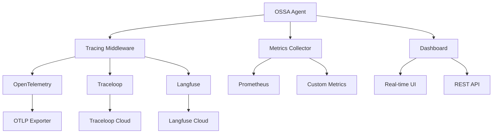

# OSSA Observability Integration v0.1.8

Comprehensive observability and monitoring for Open Standards Scalable Agents (OSSA) using industry-leading open source tools.

## Overview

The OSSA Observability Integration provides complete visibility into agent performance, behavior, and resource usage through:

- **OpenLLMetry/Traceloop** - OpenTelemetry-based LLM application tracing
- **Langfuse** - LLM application analytics and debugging
- **Built-in Dashboard** - Real-time monitoring and metrics visualization
- **Automatic Instrumentation** - Zero-code observability setup

## Features

### 🔍 Distributed Tracing
- **OpenTelemetry Integration** - Industry-standard distributed tracing
- **LLM-Specific Traces** - Token usage, latency, and cost tracking
- **Agent Execution Tracing** - Complete visibility into agent workflows
- **MCP Operation Tracing** - Model Context Protocol operation monitoring

### 📊 Metrics & Analytics
- **Real-time Metrics** - Agent performance and usage statistics
- **Token Usage Tracking** - Cost analysis and optimization insights
- **Error Rate Monitoring** - Automated error detection and alerting
- **Performance Dashboards** - Visual monitoring and trend analysis

### 🚨 Alerting & Monitoring
- **Configurable Alerts** - Custom rules for performance and error thresholds
- **Multiple Channels** - Email, webhook, and Slack notifications
- **Health Checks** - Automated agent health monitoring

### 🔒 Privacy & Compliance
- **PII Redaction** - Automatic personally identifiable information removal
- **Secret Masking** - API keys and sensitive data protection
- **GDPR Compliance** - Privacy-first data collection and storage

## Quick Start

### 1. Environment Setup

```bash
# Install OSSA with observability packages
npm install @bluefly/open-standards-scalable-agents

# Set up environment variables
export TRACELOOP_API_KEY="your_traceloop_api_key"
export LANGFUSE_PUBLIC_KEY="your_langfuse_public_key"
export LANGFUSE_SECRET_KEY="your_langfuse_secret_key"
export OTEL_EXPORTER_OTLP_ENDPOINT="https://your-otel-endpoint.com"
```

### 2. Basic Integration

```javascript
import { initializeOSSAObservability } from '@bluefly/open-standards-scalable-agents/observability';

// Initialize observability stack
const observability = await initializeOSSAObservability({
  agentConfig: yourAgentConfig,
  enableDashboard: true,
  enableAutoInstrumentation: true
});

// Create observable agent
const agent = await observability.agentFactory.createBasicAgent(
  './examples/agent.yml',
  { provider: 'openai', model: 'gpt-4' }
);

// Use agent with automatic tracing
const result = await agent.invoke({ 
  input: "Analyze this data and provide insights" 
});

console.log('Result:', result);
console.log('Observability metadata:', result.metadata.observability);
```

### 3. Agent Configuration

Add observability configuration to your agent YAML:

```yaml
apiVersion: open-standards-scalable-agents/v0.1.8
kind: Agent
metadata:
  name: my-observable-agent
  version: 1.0.0

spec:
  agent:
    name: "My Observable Agent"
    expertise: "Data analysis with observability"
  
  capabilities:
    - name: analyze_data
      description: "Analyze datasets with full tracing"

# Observability Configuration
x-ossa-observability:
  enabled: true
  version: "0.1.8"
  
  tracing:
    enabled: true
    serviceName: "my-agent-service"
    environment: "production"
    sampleRate: 1.0
    
    traceloop:
      enabled: true
      apiKey: "${TRACELOOP_API_KEY}"
    
    langfuse:
      enabled: true
      publicKey: "${LANGFUSE_PUBLIC_KEY}"
      secretKey: "${LANGFUSE_SECRET_KEY}"
  
  dashboard:
    enabled: true
    port: 3001
```

### 4. Dashboard Access

Once initialized, access the observability dashboard at:
- **URL**: `http://localhost:3001`
- **Features**: Real-time metrics, trace visualization, agent status

## Architecture



## Configuration Reference

### Environment Variables

| Variable | Description | Required |
|----------|-------------|----------|
| `TRACELOOP_API_KEY` | Traceloop API key for trace export | Optional |
| `LANGFUSE_PUBLIC_KEY` | Langfuse public key | Optional |
| `LANGFUSE_SECRET_KEY` | Langfuse secret key | Optional |
| `LANGFUSE_BASE_URL` | Langfuse instance URL | Optional |
| `OTEL_EXPORTER_OTLP_ENDPOINT` | OpenTelemetry OTLP endpoint | Optional |
| `OSSA_DASHBOARD_PORT` | Dashboard server port | Optional |

### Complete Configuration Schema

See the [observability schema](../../schemas/v0.1.8/extensions/x-ossa-observability.json) for full configuration options.

## Examples

### Development Setup

```javascript
import { setupDevelopmentObservability } from '@bluefly/open-standards-scalable-agents/observability';

// Quick development setup with console logging and dashboard
const observability = await setupDevelopmentObservability('dev-agent');

console.log('Dashboard available at:', `http://localhost:${observability.dashboard.port}`);
```

### Production Setup

```javascript
import { setupProductionObservability } from '@bluefly/open-standards-scalable-agents/observability';

// Production setup with full observability stack
const observability = await setupProductionObservability(productionAgentConfig);

// Health check
const health = observability.getHealthStatus();
console.log('Observability health:', health);
```

### Custom Metrics

```javascript
// Add custom metrics to agent configuration
const customMetrics = [
  {
    name: "documents_processed",
    type: "counter",
    description: "Number of documents processed",
    labels: ["document_type", "success"]
  }
];

const observability = await initializeOSSAObservability({
  agentConfig: {
    ...config,
    'x-ossa-observability': {
      metrics: {
        customMetrics
      }
    }
  }
});
```

### Express Middleware

```javascript
import express from 'express';
import { createOSSAObservabilityMiddleware } from '@bluefly/open-standards-scalable-agents/observability';

const app = express();
const observability = await initializeOSSAObservability(config);

// Add observability middleware
app.use(createOSSAObservabilityMiddleware(observability));

app.post('/analyze', async (req, res) => {
  // Agent operations are automatically traced
  const result = await req.ossa.tracer.traceAgentExecution(
    'api-handler',
    'analyze',
    { endpoint: '/analyze' },
    async () => {
      return await agent.invoke(req.body);
    }
  );
  
  res.json(result);
});
```

## Best Practices

### 1. Performance Optimization

- Use sampling in production (sampleRate: 0.1-0.5)
- Enable batch processing for high-throughput scenarios
- Monitor dashboard impact on performance

### 2. Security

- Never log sensitive data (PII, API keys, passwords)
- Use environment variables for credentials
- Enable redaction for compliance
- Implement proper authentication for dashboards

### 3. Cost Management

- Monitor token usage and set alerts
- Use appropriate log levels (info/warn in production)
- Configure retention periods for traces and logs
- Optimize trace sampling based on needs

### 4. Debugging

- Enable debug logging in development
- Use trace correlation IDs for issue tracking
- Leverage Langfuse for LLM behavior analysis
- Set up alerts for error rate spikes

## Troubleshooting

### Common Issues

1. **Traces not appearing**
   - Check API keys and endpoint configuration
   - Verify network connectivity to trace collectors
   - Ensure proper authentication

2. **High memory usage**
   - Reduce sample rate
   - Adjust batch sizes and flush intervals
   - Check for trace/metric retention settings

3. **Dashboard not loading**
   - Verify port availability (default 3001)
   - Check authentication settings
   - Review console logs for errors

### Debug Commands

```bash
# Test observability configuration
node -e "import('./lib/observability/index.js').then(obs => console.log(obs.VERSION))"

# Validate agent configuration
ossa examples/observability/agent-with-full-observability.yml

# Check health status
curl http://localhost:3001/health
```

## API Reference

### Core Classes

- [`OSSATracer`](../../lib/observability/middleware/ossa-tracer.js) - Main tracing middleware
- [`OSSAAutoInstrumentation`](../../lib/observability/instrumentation/auto-instrument.js) - Automatic instrumentation
- [`ObservableLangChainAgentFactory`](../../lib/observability/instrumentation/langchain-enhanced.js) - Enhanced agent factory
- [`OSSAObservabilityDashboard`](../../lib/observability/dashboards/express-dashboard.js) - Dashboard server

### Key Methods

```javascript
// Initialize observability
const obs = await initializeOSSAObservability(options)

// Create traced agent
const agent = await obs.agentFactory.createBasicAgent(configPath, llmConfig)

// Manual tracing
await obs.tracer.traceAgentExecution(agentId, operation, metadata, fn)

// Update metrics
obs.updateMetrics(type, data)

// Health check
const health = obs.getHealthStatus()

// Shutdown
await obs.shutdown()
```

## Integration Examples

- [Basic Agent with Observability](../../examples/observability/agent-with-full-observability.yml)
- [Development Setup](./examples/development-setup.md)
- [Production Deployment](./examples/production-setup.md)
- [Custom Metrics](./examples/custom-metrics.md)
- [Alert Configuration](./examples/alerting.md)

## Contributing

1. Follow OSSA development guidelines
2. Add tests for new observability features
3. Update documentation for configuration changes
4. Ensure privacy compliance for new metrics

## License

Apache 2.0 - See [LICENSE](../../LICENSE) for details.

---

**OSSA Observability v0.1.8** - Bringing transparency and insights to AI agent operations.