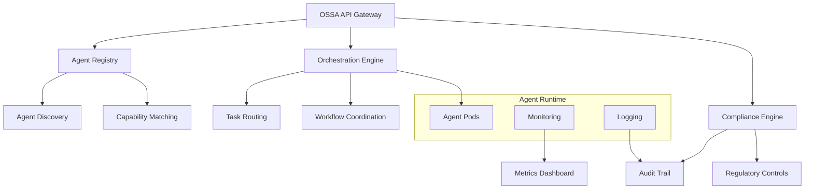

# OSSA Overview

**Open Standards for Scalable Agents (OSSA) v0.1.9** - The authoritative specification standard for AI agent orchestration.

## What is OSSA?

OSSA provides a comprehensive framework for building, deploying, and managing AI agent systems at enterprise scale with built-in compliance and security features.

## Key Features

### 🏛 Enterprise Compliance
- **FDA 21 CFR Part 11** - Electronic records and signatures for pharmaceutical companies
- **SOX 404** - Internal controls for financial reporting
- **HIPAA BAA** - Healthcare data protection and business associate agreements
- **FedRAMP High** - Government cloud security requirements
- **ISO 42001:2023** - AI Management Systems
- **NIST AI RMF 1.0** - Risk Management Framework
- **EU AI Act 2024** - European AI regulation

### 🔒 Security First
- **Zero-trust architecture** with complete audit trails
- **Data residency controls** ensuring data never leaves designated regions
- **Encryption at rest and in transit** for all agent communications
- **Role-based access control** with fine-grained permissions

###  Production Scale
- **Kubernetes-native orchestration** supporting millions of agents
- **Sub-second response times** with optimized routing algorithms
- **Auto-scaling capabilities** based on workload demands
- **High availability** with 99.99% uptime SLA

###  Multi-Framework Support
- **LangChain** - Popular AI application framework
- **CrewAI** - Multi-agent collaboration platform
- **AutoGen** - Microsoft's conversational AI framework
- **Custom frameworks** via standardized APIs

## Architecture Overview

## Core Components

### Agent Lifecycle Management
Complete management of agent creation, deployment, monitoring, and termination with automated scaling and health checks.

### Discovery & Registry
Global agent discovery system with capability-based matching, allowing agents to find and collaborate with other agents dynamically.

### Orchestration Engine
Intelligent task routing and workflow coordination that optimizes agent utilization and minimizes response times.

### Compliance Framework
Built-in regulatory controls and audit trail generation that meets the strictest enterprise compliance requirements.

### Federation Protocol
Multi-tenant agent sharing and governance that enables secure collaboration across organizational boundaries.

## Use Cases

### Enterprise AI Governance
- **Pharmaceutical Companies**: FDA-compliant AI for drug discovery and clinical trials
- **Financial Services**: SOX-compliant AI for trading and risk management
- **Healthcare Systems**: HIPAA-compliant AI for patient care and diagnostics
- **Government Agencies**: FedRAMP-compliant AI for national security and public services

### Agent Orchestration
- **Customer Service**: Multi-agent systems for complex customer inquiries
- **Content Generation**: Specialized agents for different content types and review processes
- **Data Analysis**: Coordinated agents for complex analytical workflows
- **Process Automation**: Agent-driven automation of business processes

## Getting Started

1. **[Installation](../getting-started/)** - Set up OSSA in your environment
2. **[Quick Start](../getting-started/README.md)** - Build your first agent
3. **[API Reference](../api/)** - Complete API documentation
4. **[Examples](../examples/)** - Production-ready examples

## Community & Support

- **[GitLab Repository](https://gitlab.bluefly.io/llm/openapi-ai-agents-standard)** - Source code and issue tracking
- **[Specification](../specifications/)** - Complete OSSA v0.1.9 specification
- **[Contributing](../development/contributing.md)** - How to contribute to OSSA
- **[Security Policy](../operations/security.md)** - Security reporting and policies

---

*OSSA v0.1.9 - The authoritative standard for AI agent orchestration*