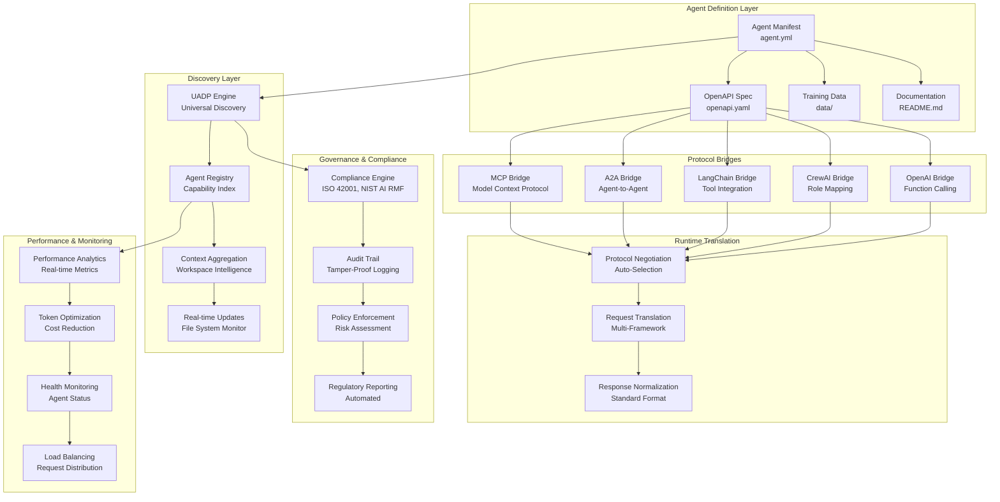
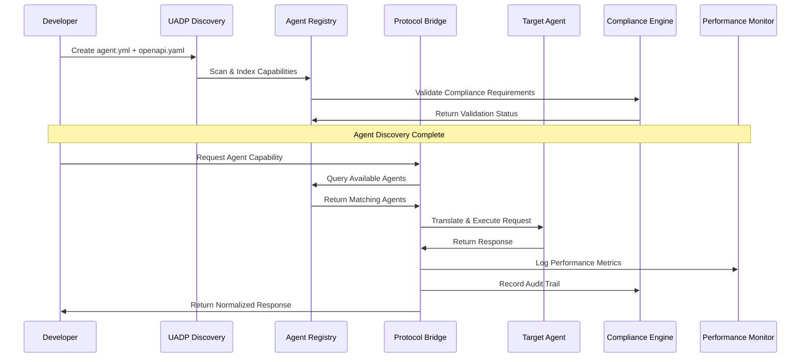

# OAAS Architecture Overview

## Component Map and Data Flows

The OpenAPI AI Agents Standard (OAAS) defines a comprehensive ecosystem for agent interoperability built on OpenAPI 3.1 foundations with enterprise-grade governance.

### Core Architecture Components



### Data Flow Architecture



## Core Concepts Glossary

### Agent Manifest (`agent.yml`)
- **Purpose**: Structured metadata defining agent capabilities, compliance level, and framework compatibility
- **Levels**: Bronze (Basic), Silver (Production), Gold (Enterprise)
- **Requirements**: Name, version, capabilities, framework compatibility

### OpenAPI Specification (`openapi.yaml`)  
- **Purpose**: Complete API contract following OpenAPI 3.1 standard
- **Extensions**: `x-openapi-ai-agents-standard` extension for OAAS metadata
- **Requirements**: Health endpoint, capability endpoints, security schemes

### Universal Agent Discovery Protocol (UADP)
- **Purpose**: Automatic agent discovery across workspaces without configuration
- **Mechanism**: Recursive scanning of `.agents/` directories
- **Features**: Capability indexing, context aggregation, real-time updates

### Protocol Bridges
- **Purpose**: Enable seamless integration across AI frameworks
- **Supported**: MCP, A2A, LangChain, CrewAI, OpenAI, Anthropic
- **Features**: Zero-modification integration, protocol negotiation

### Capability Registry
- **Purpose**: Centralized index of agent capabilities and compatibility
- **Structure**: Hierarchical capability taxonomy with versioning
- **Features**: Semantic search, performance metrics, compliance status

### Task Contract System
- **Purpose**: Standardized input/output definitions for capabilities
- **Components**: Input schema, output schema, state transitions
- **Requirements**: JSON Schema validation, error handling

### Runtime Handoff Protocol
- **Purpose**: Seamless agent-to-agent communication and delegation
- **Features**: Capability matching, constraint validation, provenance tracking
- **Security**: Authentication, authorization, audit logging

### Governance Framework
- **Purpose**: Enterprise compliance automation and audit trails
- **Standards**: ISO 42001:2023, NIST AI RMF 1.0, EU AI Act
- **Features**: Risk assessment, policy enforcement, regulatory reporting

### Policy Manifest System
- **Purpose**: Declarative policy definitions for agent behavior
- **Hooks**: Pre-task, in-task, post-task evaluation points
- **Outcomes**: Allow, deny, redact, warn with detailed reasoning

### Provenance Tracking
- **Purpose**: Complete lineage and audit trail for agent operations
- **Components**: Agent IDs, input hashes, output signatures, citations
- **Requirements**: Immutable logging, cryptographic verification

## Hierarchical Organization

### Workspace Level
```
workspace-root/
├── .agents-workspace/           # Workspace-level configuration
│   ├── registry.yml            # Master agent registry
│   ├── discovery.yml           # Discovery configuration  
│   ├── context.yml             # Workspace context
│   └── governance.yml          # Compliance policies
```

### Project Level
```
project/
├── .agents/                    # Project-specific agents
│   ├── agent-name/
│   │   ├── agent.yml          # Agent manifest
│   │   ├── openapi.yaml       # API specification
│   │   ├── README.md          # Documentation
│   │   └── data/              # Training data, examples
│   └── another-agent/
```

### Agent Structure
```
.agents/agent-name/
├── agent.yml                  # Core agent definition
├── openapi.yaml              # OpenAPI 3.1 specification
├── README.md                 # Human-readable documentation
├── config/                   # Configuration files
│   ├── frameworks.yml        # Framework-specific settings
│   ├── security.yml          # Security policies
│   └── monitoring.yml        # Observability configuration
├── data/                     # Agent data
│   ├── training-data.json    # Training examples
│   ├── knowledge-base.json   # Domain knowledge
│   ├── examples.json         # Usage examples
│   └── benchmarks.json       # Performance baselines
└── tests/                    # Testing artifacts
    ├── unit/                 # Unit tests
    ├── integration/          # Integration tests
    └── performance/          # Performance tests
```

## Progressive Complexity Model

### Level 1: Bronze (Basic)
- **Requirements**: Valid OAAS structure, health endpoint, basic capabilities
- **Validation**: Schema compliance, basic functionality
- **Use Cases**: Internal tools, prototypes, learning environments

### Level 2: Silver (Production)
- **Requirements**: All Bronze + token optimization, protocol bridges, security
- **Validation**: Performance benchmarks, integration tests, security scans
- **Use Cases**: Production systems, commercial applications

### Level 3: Gold (Enterprise)
- **Requirements**: All Silver + full governance, audit trails, compliance
- **Validation**: Regulatory compliance, enterprise security, scalability
- **Use Cases**: Regulated industries, government, high-risk AI systems

## Extension Points

### Custom Capabilities
- **Namespace**: Capability IDs with versioning (e.g., `custom/capability/v1`)
- **Requirements**: Schema definition, compatibility matrix
- **Discovery**: Automatic registration in capability registry

### Policy Packs
- **Purpose**: Reusable policy definitions for common compliance scenarios
- **Structure**: YAML-based policy manifests with evaluation hooks
- **Examples**: GDPR pack, HIPAA pack, financial services pack

### Transport Adapters
- **Purpose**: Support for additional transport protocols beyond HTTP/REST
- **Interface**: Pluggable adapter architecture
- **Examples**: gRPC, WebSocket, message queue integration

### Framework Connectors
- **Purpose**: Integration with new AI frameworks
- **Requirements**: Bridge implementation following standard interface
- **Discovery**: Automatic registration and capability mapping

This architecture provides a comprehensive foundation for universal AI agent interoperability while maintaining enterprise-grade security, compliance, and performance characteristics.