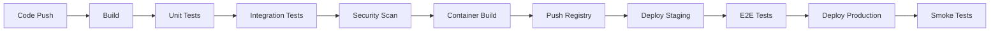

# OSSA Platform Architecture

## System Architecture Overview

The OSSA platform implements a microservices-based architecture designed for scalability, resilience, and multi-tenant isolation. The system follows Domain-Driven Design (DDD) principles with clear bounded contexts and event-driven communication patterns.

## High-Level Architecture

```
┌─────────────────────────────────────────────────────────────┐
│                        Client Layer                         │
│  Web UI | Mobile | CLI | SDKs | Third-party Integrations   │
└─────────────────────────┬───────────────────────────────────┘
                          │
┌─────────────────────────┴───────────────────────────────────┐
│                    API Gateway Layer                        │
│         Load Balancer | Rate Limiting | Auth Proxy          │
└─────────────────────────┬───────────────────────────────────┘
                          │
┌─────────────────────────┴───────────────────────────────────┐
│                    Service Mesh                             │
│  ┌──────────┐  ┌──────────┐  ┌──────────┐  ┌──────────┐  │
│  │  Agent   │  │Discovery │  │Compliance│  │Orchestra-│  │
│  │ Registry │  │  Engine  │  │ Service  │  │   tion   │  │
│  └──────────┘  └──────────┘  └──────────┘  └──────────┘  │
└─────────────────────────┬───────────────────────────────────┘
                          │
┌─────────────────────────┴───────────────────────────────────┐
│                    Data Layer                               │
│   PostgreSQL | Redis | Kafka | Elasticsearch | S3          │
└─────────────────────────────────────────────────────────────┘
```

## Core Components

### 1. API Gateway Layer

#### Kong Gateway Configuration
```yaml
services:
  - name: ossa-api
    url: http://upstream-services
    plugins:
      - name: rate-limiting
        config:
          minute: 1000
          hour: 10000
      - name: jwt
        config:
          key_claim_name: iss
      - name: correlation-id
      - name: prometheus
```

#### Load Balancing Strategy
- **Algorithm**: Weighted round-robin with health checks
- **Sticky Sessions**: Cookie-based for WebSocket connections
- **Circuit Breaker**: 50% error rate triggers circuit open
- **Retry Policy**: 3 retries with exponential backoff

### 2. Service Architecture

#### Agent Registry Service
```typescript
class AgentRegistryService {
  // Core responsibilities
  - Agent CRUD operations
  - Version management
  - Capability indexing
  - Health monitoring
  
  // Data stores
  - Primary: PostgreSQL (agent metadata)
  - Cache: Redis (frequent lookups)
  - Search: Elasticsearch (capability search)
}
```

#### Discovery Engine Service
```typescript
class DiscoveryEngineService {
  // Core responsibilities
  - UADP protocol implementation
  - Semantic matching algorithm
  - Capability inference
  - Cross-org federation
  
  // Data stores
  - Vector DB: Qdrant (embeddings)
  - Cache: Redis (discovery results)
  - Graph DB: Neo4j (relationships)
}
```

#### Compliance Service
```typescript
class ComplianceService {
  // Core responsibilities
  - Control validation
  - Audit trail generation
  - Risk assessment
  - Report generation
  
  // Data stores
  - Primary: PostgreSQL (compliance data)
  - Document Store: MongoDB (reports)
  - Time Series: TimescaleDB (metrics)
}
```

#### Orchestration Service
```typescript
class OrchestrationService {
  // Core responsibilities
  - Workflow execution
  - Task scheduling
  - Event coordination
  - State management
  
  // Data stores
  - State: Redis (workflow state)
  - Events: Kafka (event streaming)
  - History: PostgreSQL (execution logs)
}
```

### 3. Data Architecture

#### Database Schema Design

##### Agent Registry Schema
```sql
-- Core agent table
CREATE TABLE agents (
  id UUID PRIMARY KEY DEFAULT gen_random_uuid(),
  name VARCHAR(255) UNIQUE NOT NULL,
  version VARCHAR(50) NOT NULL,
  description TEXT,
  spec JSONB NOT NULL,
  status VARCHAR(50) DEFAULT 'active',
  created_at TIMESTAMP DEFAULT CURRENT_TIMESTAMP,
  updated_at TIMESTAMP DEFAULT CURRENT_TIMESTAMP,
  deleted_at TIMESTAMP NULL
);

-- Capabilities table
CREATE TABLE capabilities (
  id UUID PRIMARY KEY DEFAULT gen_random_uuid(),
  agent_id UUID REFERENCES agents(id),
  capability VARCHAR(255) NOT NULL,
  type VARCHAR(50) NOT NULL, -- primary, secondary
  metadata JSONB
);

-- Metrics table (TimescaleDB)
CREATE TABLE agent_metrics (
  time TIMESTAMPTZ NOT NULL,
  agent_id UUID NOT NULL,
  metric_name VARCHAR(100) NOT NULL,
  value DOUBLE PRECISION,
  tags JSONB
);
SELECT create_hypertable('agent_metrics', 'time');
```

#### Caching Strategy

##### Redis Cache Layers
```yaml
cache_layers:
  L1_session:
    ttl: 300 # 5 minutes
    patterns:
      - "session:*"
      - "auth:*"
  
  L2_application:
    ttl: 3600 # 1 hour
    patterns:
      - "agent:*"
      - "discovery:*"
  
  L3_static:
    ttl: 86400 # 24 hours
    patterns:
      - "config:*"
      - "schema:*"
```

#### Event Streaming Architecture

##### Kafka Topics
```yaml
topics:
  agent_events:
    partitions: 10
    replication: 3
    retention_ms: 604800000 # 7 days
    
  compliance_events:
    partitions: 5
    replication: 3
    retention_ms: 2592000000 # 30 days
    
  metrics_events:
    partitions: 20
    replication: 2
    retention_ms: 86400000 # 1 day
```

### 4. Communication Patterns

#### Synchronous Communication
- **REST API**: Request-response for CRUD operations
- **GraphQL**: Flexible queries with field selection
- **gRPC**: High-performance service-to-service

#### Asynchronous Communication
- **Event Sourcing**: Capture all state changes as events
- **CQRS**: Separate read and write models
- **Pub/Sub**: Kafka for event distribution
- **Message Queue**: SQS for task processing

#### Real-time Communication
- **WebSockets**: GraphQL subscriptions
- **Server-Sent Events**: One-way notifications
- **Long Polling**: Fallback for WebSocket issues

### 5. Security Architecture

#### Defense in Depth

```
┌─────────────────────────────────────────┐
│          WAF (CloudFlare)               │ Layer 1: Edge Security
├─────────────────────────────────────────┤
│        API Gateway (Auth)               │ Layer 2: Authentication
├─────────────────────────────────────────┤
│     Service Mesh (mTLS)                 │ Layer 3: Service Auth
├─────────────────────────────────────────┤
│    Application (RBAC)                   │ Layer 4: Authorization
├─────────────────────────────────────────┤
│     Database (Encryption)               │ Layer 5: Data Security
└─────────────────────────────────────────┘
```

#### Zero Trust Principles
1. **Never Trust**: Verify every request
2. **Least Privilege**: Minimal access rights
3. **Assume Breach**: Design for compromise
4. **Verify Explicitly**: Multi-factor validation
5. **Secure by Default**: Deny unless allowed

### 6. Scalability Patterns

#### Horizontal Scaling
```yaml
scaling_rules:
  api_gateway:
    min_replicas: 3
    max_replicas: 50
    target_cpu: 70
    target_memory: 80
    
  agent_registry:
    min_replicas: 2
    max_replicas: 20
    target_rps: 1000
    
  discovery_engine:
    min_replicas: 3
    max_replicas: 30
    target_latency_ms: 100
```

#### Database Scaling
- **Read Replicas**: 3 replicas per region
- **Sharding**: By tenant_id for multi-tenancy
- **Connection Pooling**: PgBouncer configuration
- **Query Optimization**: Materialized views

### 7. Multi-Region Architecture

#### Geographic Distribution
```yaml
regions:
  us-east-1:
    primary: true
    services: all
    database: master
    
  eu-west-1:
    primary: false
    services: all
    database: read_replica
    
  ap-southeast-1:
    primary: false
    services: api_only
    database: read_replica
```

#### Data Replication Strategy
- **Synchronous**: Within region (strong consistency)
- **Asynchronous**: Cross-region (eventual consistency)
- **Conflict Resolution**: Last-write-wins with vector clocks
- **Backup Strategy**: Cross-region S3 replication

### 8. Deployment Architecture

#### Kubernetes Configuration
```yaml
apiVersion: apps/v1
kind: Deployment
metadata:
  name: ossa-platform
spec:
  replicas: 3
  strategy:
    type: RollingUpdate
    rollingUpdate:
      maxSurge: 1
      maxUnavailable: 0
  template:
    spec:
      containers:
      - name: ossa-api
        image: ossa:0.1.8
        resources:
          requests:
            memory: "512Mi"
            cpu: "500m"
          limits:
            memory: "1Gi"
            cpu: "1000m"
        livenessProbe:
          httpGet:
            path: /health
            port: 8080
          initialDelaySeconds: 30
        readinessProbe:
          httpGet:
            path: /ready
            port: 8080
          initialDelaySeconds: 5
```

#### CI/CD Pipeline Architecture


### 9. Monitoring & Observability

#### Metrics Collection
```yaml
metrics:
  application:
    - request_duration_seconds
    - request_total
    - error_rate
    - active_connections
    
  business:
    - agents_registered
    - discovery_requests
    - compliance_score
    - api_usage_by_tier
    
  infrastructure:
    - cpu_utilization
    - memory_usage
    - disk_io
    - network_throughput
```

#### Distributed Tracing
```typescript
// OpenTelemetry configuration
const tracer = opentelemetry.trace.getTracer('ossa-platform');

async function handleRequest(req: Request) {
  const span = tracer.startSpan('handle_request', {
    attributes: {
      'http.method': req.method,
      'http.url': req.url,
      'user.id': req.user?.id
    }
  });
  
  try {
    // Process request
    const result = await processRequest(req);
    span.setStatus({ code: SpanStatusCode.OK });
    return result;
  } catch (error) {
    span.recordException(error);
    span.setStatus({ code: SpanStatusCode.ERROR });
    throw error;
  } finally {
    span.end();
  }
}
```

### 10. Disaster Recovery

#### RTO/RPO Targets
| Component | RTO | RPO | Strategy |
|-----------|-----|-----|----------|
| API Gateway | 30s | 0 | Multi-region active-active |
| Agent Registry | 2min | 5min | Hot standby |
| Discovery Engine | 5min | 15min | Warm standby |
| Compliance Service | 10min | 1hour | Cold standby |

#### Backup Strategy
```yaml
backup_policy:
  databases:
    frequency: hourly
    retention: 30_days
    type: incremental
    location: s3://ossa-backups/db/
    
  configurations:
    frequency: daily
    retention: 90_days
    type: full
    location: s3://ossa-backups/config/
    
  audit_logs:
    frequency: continuous
    retention: 7_years
    type: streaming
    location: s3://ossa-audit/logs/
```

## Architecture Decision Records (ADRs)

### ADR-001: Microservices Architecture
**Decision**: Adopt microservices architecture
**Rationale**: Enables independent scaling and deployment
**Consequences**: Increased complexity, requires service mesh

### ADR-002: Event Sourcing Pattern
**Decision**: Use event sourcing for audit trail
**Rationale**: Provides complete audit history
**Consequences**: Increased storage, eventual consistency

### ADR-003: GraphQL for API
**Decision**: Implement GraphQL alongside REST
**Rationale**: Flexible queries, real-time subscriptions
**Consequences**: Additional complexity, learning curve

### ADR-004: Multi-Region Deployment
**Decision**: Deploy across 3 geographic regions
**Rationale**: Global latency optimization, DR
**Consequences**: Data consistency challenges, cost

## Future Architecture Considerations

### Planned Enhancements
1. **Service Mesh**: Istio for advanced traffic management
2. **Edge Computing**: CDN-based agent execution
3. **Serverless**: Lambda functions for event processing
4. **Federation**: Cross-organization agent sharing
5. **Blockchain**: Immutable audit trail option

### Technical Debt
1. **Monolithic Database**: Need to further decompose
2. **Synchronous Dependencies**: Move to async patterns
3. **Cache Invalidation**: Implement smart invalidation
4. **Testing Coverage**: Increase to 90%+
5. **Documentation**: Automate API doc generation