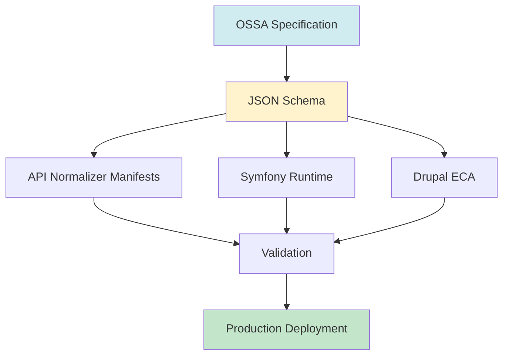

# Cross-Project Dependencies

**Last Updated:** 2025-12-10

---

## 📊 Project Ecosystem

### OSSA Specification Projects

| Project | Repository | Purpose |
|---------|------------|---------|
| **openstandardagents** | GitLab: blueflyio/openstandardagents | OSSA specification and schema |
| **gitlab_components** | GitLab: blueflyio/gitlab_components | GitLab CI/CD components for OSSA |

### Implementation Projects

| Project | Repository | Technology | Purpose |
|---------|------------|------------|---------|
| **api_normalizer** | Drupal.org | Drupal module | API normalization with OSSA integration |
| **symfony-messenger-adapter** | Packagist | Symfony bundle | Runtime implementation for Symfony |

### Related Frameworks

| Framework | Type | Integration |
|-----------|------|-------------|
| **Drupal ECA** | Event-driven workflows | Phase 2 |
| **Maestro** | Business process automation | Phase 4 |
| **Langflow** | Node-based AI workflows | Phase 4 |
| **LangChain** | Python AI framework | Phase 4 |
| **CrewAI** | Multi-agent orchestration | Phase 4 |
| **N8n** | Workflow automation | Phase 4 |

---

## 🔗 Dependency Mapping

### 1. OSSA Specification → API Normalizer

**Direction**: OSSA provides schema, API Normalizer consumes

**Dependencies:**
- API Normalizer uses OSSA v0.3.0 schema for agent definitions
- API Normalizer validates task/workflow patterns
- API Normalizer provides real-world use case validation

**Integration Points:**
```yaml
# api_normalizer agent definition
apiVersion: ossa/v0.3.0
kind: Agent
metadata:
  name: api-normalizer
  namespace: drupal.api_normalizer
spec:
  role: |
    You normalize API responses across different formats
  
  capabilities:
    - name: normalize-response
      description: Convert API response to standard format
  
  messaging:
    publishes:
      - channel: api.normalized
        schema:
          type: object
          properties:
            format: { type: string }
            data: { type: object }
```

**Validation:**
- API Normalizer agents must validate against OSSA schema
- OSSA spec-healer validates API Normalizer manifests
- Integration tests ensure compatibility

**Timeline:**
- Phase 1: OSSA defines schema
- Phase 2: API Normalizer implements agents
- Phase 3: Production validation

---

### 2. OSSA Specification → Symfony Messenger

**Direction**: OSSA provides contract, Symfony implements runtime

**Dependencies:**
- Symfony Messenger implements OSSA task execution contract
- Symfony Messenger provides runtime for async task execution
- Symfony Messenger enables Drupal integration via shared runtime

**Integration Points:**
```php
// Symfony service implementing OSSA contract
namespace Ossa\SymfonyRuntime;

#[AsMessageHandler]
class OssaTaskHandler {
    public function __invoke(OssaTaskMessage $message): void {
        // Load OSSA manifest
        $manifest = $message->getManifest();
        
        // Execute task according to OSSA spec
        $executor = $this->executorFactory->create($manifest);
        $result = $executor->run($message->getInput());
        
        // Publish result to OSSA messaging channels
        if ($manifest->messaging->publishes) {
            $this->messageBus->dispatch(
                new OssaMessageEnvelope($result)
            );
        }
    }
}
```

**Configuration:**
```yaml
# config/packages/ossa.yaml
ossa:
  runtime:
    transport: async
    state_backend: redis
    retry:
      max_attempts: 3
      backoff: exponential
  
  messaging:
    broker: rabbitmq
    dlq: enabled
```

**Timeline:**
- Phase 1: OSSA defines runtime contract
- Phase 2: Symfony implements adapter
- Phase 3: Production deployment

---

### 3. API Normalizer → Symfony Messenger

**Direction**: Bidirectional - API Normalizer uses Messenger, Messenger executes API Normalizer tasks

**Dependencies:**
- API Normalizer uses Messenger for async task execution
- API Normalizer publishes messages to Messenger queues
- API Normalizer subscribes to Messenger messages
- Messenger executes API Normalizer OSSA tasks

**Integration Points:**

**API Normalizer publishes to Messenger:**
```php
// API Normalizer Drupal module
namespace Drupal\api_normalizer;

class ApiNormalizerService {
    public function normalizeResponse($response) {
        // Normalize response
        $normalized = $this->normalize($response);
        
        // Publish to Symfony Messenger via OSSA messaging
        $this->messageBus->dispatch(
            new OssaMessage(
                channel: 'api.normalized',
                payload: $normalized
            )
        );
    }
}
```

**Messenger executes API Normalizer tasks:**
```php
// Symfony Messenger handler
namespace App\MessageHandler;

#[AsMessageHandler]
class ApiNormalizerTaskHandler {
    public function __invoke(ApiNormalizerTask $message): void {
        // Execute API Normalizer task via OSSA
        $manifest = $this->manifestLoader->load('api-normalizer');
        $executor = $this->ossaRuntime->createExecutor($manifest);
        $executor->run($message->getInput());
    }
}
```

**Message Flow:**
```
API Normalizer (Drupal)
    ↓ publishes
Symfony Messenger Queue
    ↓ consumes
Symfony Messenger Handler
    ↓ executes
OSSA Task Executor
    ↓ publishes
Symfony Messenger Queue
    ↓ consumes
API Normalizer (Drupal)
```

**Timeline:**
- Phase 2: Basic integration (API Normalizer → Messenger)
- Phase 3: Full bidirectional integration
- Phase 3: Production workflows

---

## 🔄 Data Flow Diagrams

### Multi-Agent Workflow Flow

```mermaid
graph LR
    A[API Normalizer Agent] -->|api.normalized| B[Symfony Messenger Queue]
    B -->|consumes| C[Security Scanner Agent]
    C -->|security.vulnerabilities| D[Symfony Messenger Queue]
    D -->|consumes| E[Incident Responder Agent]
    E -->|incident.created| F[Symfony Messenger Queue]
    F -->|consumes| G[Compliance Auditor Agent]
    
    style A fill:#e1f5ff
    style C fill:#fff3cd
    style E fill:#f8d7da
    style G fill:#d1ecf1
```



### OSSA Specification Flow



---

## 📋 Integration Requirements

### For API Normalizer

**Required from OSSA:**
- ✅ Agent schema (v0.3.0)
- 🔄 Task schema (v0.3.0)
- 🔄 Workflow schema (v0.3.0)
- 🔄 Messaging extension (v0.3.0)

**Provides to OSSA:**
- Real-world use case validation
- Production feedback
- Integration test coverage

### For Symfony Messenger

**Required from OSSA:**
- ✅ Agent schema (v0.3.0)
- 🔄 Task schema (v0.3.0)
- 🔄 Messaging extension (v0.3.0)
- ⚪ Runtime contract (v0.3.4)

**Provides to OSSA:**
- Runtime implementation
- Async execution
- State management
- Error handling (retry, DLQ)

### For Drupal ECA

**Required from OSSA:**
- ✅ Agent schema (v0.3.0)
- 🔄 Task schema (v0.3.0)
- 🔄 Workflow schema (v0.3.0)
- ⚪ Runtime contract (v0.3.4)

**Provides to OSSA:**
- Event-driven workflow validation
- Drupal ecosystem integration
- Production use cases

---

## 🎯 Success Criteria

### Cross-Project Integration
- [ ] API Normalizer agents validate against OSSA schema
- [ ] Symfony Messenger executes OSSA tasks
- [ ] Drupal ECA workflows use OSSA definitions
- [ ] Messages flow between all projects
- [ ] State is shared correctly
- [ ] Error handling works end-to-end

### Production Readiness
- [ ] All integrations tested in production
- [ ] Performance meets SLAs
- [ ] Security validated
- [ ] Documentation complete
- [ ] Monitoring in place

---

## 📊 Version Compatibility Matrix

| OSSA Version | API Normalizer | Symfony Adapter | Drupal ECA |
|--------------|----------------|-----------------|------------|
| v0.3.0 | ✅ v0.1.0 | ❌ | ❌ |
| v0.3.0 | 🔄 v0.1.1 | ⚪ v1.0.0 | ⚪ v1.0.0 |
| v0.3.4 | ⚪ v0.1.2 | ⚪ v1.1.0 | ⚪ v1.1.0 |
| v0.4.0 | ⚪ v0.2.0 | ⚪ v2.0.0 | ⚪ v2.0.0 |

**Legend:**
- ✅ Released
- 🔄 In Progress
- ⚪ Planned
- ❌ Not Compatible

---

## 🔗 Communication Channels

### Issue Tracking
- **OSSA Issues**: GitLab blueflyio/openstandardagents
- **API Normalizer Issues**: Drupal.org issue queue
- **Symfony Adapter Issues**: GitHub (TBD)

### Coordination
- **Weekly sync**: Tuesdays 10am EST
- **Slack**: #ossa-integration
- **Email**: ossa-dev@openstandardagents.org

---

## 📌 Next Steps

### Phase 1 (Weeks 1-2)
- [ ] Finalize OSSA v0.3.0 schema
- [ ] API Normalizer reviews schema
- [ ] Symfony team reviews runtime contract

### Phase 2 (Weeks 3-4)
- [ ] Symfony implements adapter
- [ ] API Normalizer implements agents
- [ ] Integration testing begins

### Phase 3 (Weeks 5-6)
- [ ] Production deployment
- [ ] Multi-agent workflows
- [ ] Performance testing

---

## 🔗 Related Documentation

- [Master Roadmap](v0.3.x-to-v0.4.0.md)
- [Dependency Graph](dependency-graph.md)
- [Phase 2: Runtime Implementation](phase-2-runtime-implementation.md)
- [Phase 3: Production Use Cases](phase-3-production-use-cases.md)

---

**Maintained by**: OSSA Community  
**Last Updated**: 2025-12-10
