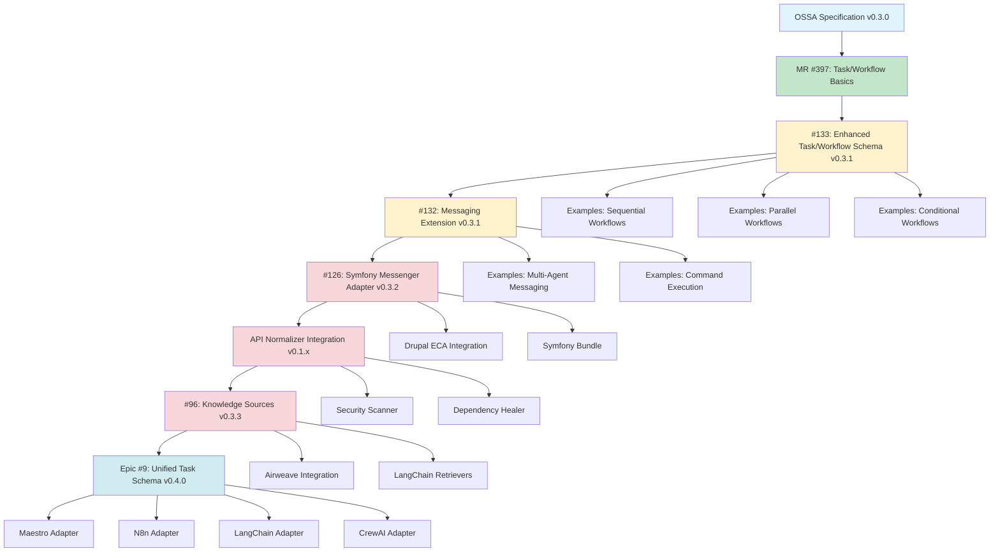

# OSSA v0.3.x → v0.4.0 Dependency Graph

**Last Updated:** 2025-12-10

---

## 📊 Visual Dependency Graph



---

## 🔗 Dependency Details

### Level 0: Foundation
**OSSA Specification v0.3.0**
- Current stable version
- Defines Agent, Tool, Capability schemas
- No dependencies

### Level 1: Task/Workflow Basics
**MR #397: Task/Workflow Basics** ✅ Completed
- Introduces `Task` and `Workflow` kinds
- Basic task execution
- Simple workflow orchestration
- **Depends on**: OSSA v0.3.0
- **Blocks**: #133, #132

### Level 2: Enhanced Schemas
**#133: Enhanced Task/Workflow Schema** 🔄 In Progress
- Task dependencies
- Conditional execution
- Retry policies
- Error handling
- Parallel execution
- Loop constructs
- **Depends on**: MR #397
- **Blocks**: #132, #126

**#132: Messaging Extension** 🔄 In Progress
- Channel declarations
- Subscriptions
- Commands (RPC)
- Message routing
- Reliability guarantees
- **Depends on**: #133
- **Blocks**: #126, API Normalizer

### Level 3: Runtime Implementation
**#126: Symfony Messenger Adapter** ⚪ Closed
- Symfony bundle
- Messenger integration
- State management
- Error handling
- **Depends on**: #132
- **Blocks**: API Normalizer, Drupal ECA

**API Normalizer Integration** ⚪ Not Started
- OSSA agent definitions
- Multi-agent workflows
- Production validation
- **Depends on**: #126
- **Blocks**: #96

### Level 4: Knowledge Sources
**#96: Knowledge Sources Extension** ⚪ Closed
- Context retrieval layers
- Provider support (Airweave, LangChain, etc.)
- Search configuration
- MCP bridge
- **Depends on**: API Normalizer
- **Blocks**: Epic #9

### Level 5: Convergence
**Epic #9: Unified Task Schema** ⚪ Not Started
- Framework convergence
- Maestro adapter
- N8n adapter
- LangChain adapter
- CrewAI adapter
- **Depends on**: #96
- **Blocks**: None (final milestone)

---

## 📅 Timeline Mapping

### Weeks 1-2: Phase 1 (Specification)
- ✅ MR #397 (completed)
- 🔄 #133 (in progress)
- 🔄 #132 (in progress)

### Weeks 3-4: Phase 2 (Runtime Implementation)
- ⚪ #126 (closed, needs reopening or new issue)
- ⚪ API Normalizer Integration

### Weeks 5-6: Phase 3 (Production Use Cases)
- ⚪ API Normalizer OSSA Integration
- ⚪ Security Scanner Integration
- ⚪ Dependency Healer Integration

### Weeks 7-8: Phase 4 (Knowledge & Convergence)
- ⚪ #96 (closed, needs reopening or new issue)
- ⚪ Epic #9

---

## 🚧 Critical Path

The critical path for v0.4.0 release:

```
#133 → #132 → #126 → API Normalizer → #96 → Epic #9
```

**Estimated Duration**: 8 weeks

**Critical Dependencies:**
1. #133 must complete before #132 (messaging needs enhanced task schema)
2. #132 must complete before #126 (runtime needs messaging spec)
3. #126 must complete before API Normalizer (needs runtime implementation)
4. API Normalizer must complete before #96 (needs production validation)
5. #96 must complete before Epic #9 (needs knowledge sources for convergence)

---

## ⚠️ Risk Analysis

### High Risk
- **#133 delay**: Blocks entire roadmap
- **#132 delay**: Blocks runtime implementation
- **#126 reopening**: Issue is closed, may need new issue

### Medium Risk
- **API Normalizer integration**: Cross-project dependency
- **Framework team availability**: Maestro, N8n, LangChain teams

### Low Risk
- **Examples creation**: Can be done in parallel
- **Documentation**: Can be done in parallel

---

## 🔄 Parallel Work Streams

While following the critical path, these can be done in parallel:

### Stream 1: Examples
- Sequential workflow examples
- Parallel workflow examples
- Conditional workflow examples
- Multi-agent messaging examples
- Can start during Phase 1

### Stream 2: Documentation
- Specification documentation
- Runtime adapter guides
- Framework comparison matrix
- Can start during Phase 1

### Stream 3: Tooling
- Validation tools
- Conversion tools (Maestro → OSSA, N8n → OSSA)
- Can start during Phase 2

---

## 📊 Dependency Matrix

| Issue | Depends On | Blocks | Phase |
|-------|------------|--------|-------|
| MR #397 | OSSA v0.3.0 | #133, #132 | 1 |
| #133 | MR #397 | #132, #126 | 1 |
| #132 | #133 | #126, API Normalizer | 1 |
| #126 | #132 | API Normalizer, Drupal ECA | 2 |
| API Normalizer | #126 | #96 | 2-3 |
| #96 | API Normalizer | Epic #9 | 4 |
| Epic #9 | #96 | None | 4 |

---

## 🎯 Milestone Dependencies

### v0.3.1 Milestone
**Required:**
- ✅ MR #397
- 🔄 #133
- 🔄 #132

**Deliverables:**
- Enhanced Task schema
- Enhanced Workflow schema
- Messaging extension
- 10+ examples

### v0.3.2 Milestone
**Required:**
- ✅ v0.3.1
- ⚪ #126
- ⚪ API Normalizer

**Deliverables:**
- Symfony Messenger adapter
- Drupal ECA integration
- Production workflows

### v0.3.3 Milestone
**Required:**
- ✅ v0.3.2
- ⚪ #96

**Deliverables:**
- Knowledge Sources extension
- Airweave integration
- LangChain retrievers

### v0.4.0 Milestone
**Required:**
- ✅ v0.3.3
- ⚪ Epic #9

**Deliverables:**
- Unified Task Schema
- Maestro adapter
- N8n adapter
- Full framework convergence

---

## 🔗 Related Documentation

- [Master Roadmap](v0.3.x-to-v0.4.0.md)
- [Phase 1: Specification](phase-1-specification.md)
- [Phase 2: Runtime Implementation](phase-2-runtime-implementation.md)
- [Phase 3: Production Use Cases](phase-3-production-use-cases.md)
- [Phase 4: Knowledge & Convergence](phase-4-knowledge-convergence.md)
- [Cross-Project Dependencies](cross-project-dependencies.md)

---

**Maintained by**: OSSA Community  
**Last Updated**: 2025-12-10
