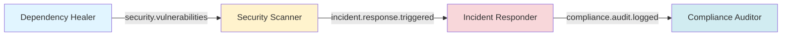
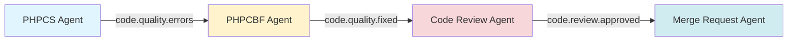

# Phase 3: Production Use Cases (Weeks 5-6)

**Status:** Not Started  
**Timeline:** Weeks 5-6  
**Version Target:** v0.3.4+

---

## 🎯 Goal

Validate OSSA with real-world multi-agent workflows in production environments.

**Principle**: "Production Validation" - Prove the specification works with real use cases, not just examples.

---

## 📋 Issues

| Issue | Title | Status | Priority |
|-------|-------|--------|----------|
| TBD | API Normalizer OSSA Integration | ⚪ Not Started | P0 |
| TBD | Security Scanner Integration | ⚪ Not Started | P1 |
| TBD | Dependency Healer Integration | ⚪ Not Started | P1 |

---

## 📦 Deliverables

### 1. API Normalizer Agents/Tasks/Workflows

**Agents:**
- **API Normalizer Agent**: Normalizes API responses across different formats
- **Schema Validator Agent**: Validates API schemas against OSSA
- **Documentation Generator Agent**: Generates API documentation

**Tasks:**
- `normalize-api-response`: Convert API response to standard format
- `validate-schema`: Validate API schema
- `generate-docs`: Generate API documentation

**Workflows:**
- `api-normalization-pipeline`: End-to-end API normalization
- `schema-validation-workflow`: Multi-step schema validation
- `documentation-generation-workflow`: Automated doc generation

**Example:**
```yaml
apiVersion: ossa/v0.3.0
kind: Workflow
metadata:
  name: api-normalization-pipeline
spec:
  description: Normalize API responses and generate documentation
  
  tasks:
    - name: fetch-api
      task: fetch-api-response
    
    - name: normalize
      task: normalize-api-response
      depends_on: [fetch-api]
    
    - name: validate
      task: validate-schema
      depends_on: [normalize]
    
    - name: generate-docs
      task: generate-docs
      depends_on: [validate]
  
  messaging:
    publishes:
      - channel: api.normalized
        on_event: success
```

### 2. Multi-Agent Workflow Examples

**Example 1: Security Vulnerability Workflow**
```
Dependency Healer → Security Scanner → Incident Responder → Compliance Auditor
```

**Flow:**
1. Dependency Healer scans dependencies
2. Publishes vulnerabilities to `security.vulnerabilities` channel
3. Security Scanner subscribes and analyzes severity
4. Publishes critical issues to `incident.response.triggered` channel
5. Incident Responder creates tickets
6. Compliance Auditor logs for audit trail

**Example 2: Code Quality Workflow**
```
PHPCS Agent → PHPCBF Agent → Code Review Agent → Merge Request Agent
```

**Flow:**
1. PHPCS Agent checks code style
2. Publishes errors to `code.quality.errors` channel
3. PHPCBF Agent subscribes and auto-fixes
4. Code Review Agent validates fixes
5. Merge Request Agent creates MR if all pass

**Example 3: Documentation Workflow**
```
Code Parser → Doc Generator → Link Checker → Publisher
```

**Flow:**
1. Code Parser extracts docblocks
2. Doc Generator creates markdown
3. Link Checker validates links
4. Publisher deploys to website

### 3. Integration Tests

**Test Suites:**
- End-to-end workflow tests
- Multi-agent communication tests
- Message routing tests
- Error handling tests
- Performance tests

**Example Test:**
```php
class MultiAgentWorkflowTest extends TestCase {
    public function testSecurityVulnerabilityWorkflow() {
        // 1. Trigger dependency scan
        $this->triggerTask('dependency-healer', 'scan-dependencies');
        
        // 2. Assert vulnerability published
        $this->assertMessagePublished('security.vulnerabilities');
        
        // 3. Assert security scanner received message
        $this->assertMessageReceived('security-scanner', 'security.vulnerabilities');
        
        // 4. Assert incident created
        $this->assertMessagePublished('incident.response.triggered');
        
        // 5. Assert compliance logged
        $this->assertAuditLogCreated('compliance-auditor');
    }
}
```

### 4. Documentation

**Required Documentation:**
- Multi-agent workflow guide
- API Normalizer integration guide
- Security Scanner integration guide
- Dependency Healer integration guide
- Troubleshooting guide
- Performance tuning guide

---

## ✅ Success Criteria

### Multi-Agent Workflows
- [ ] Security vulnerability workflow works end-to-end
- [ ] Code quality workflow works end-to-end
- [ ] Documentation workflow works end-to-end
- [ ] All agents communicate via OSSA messaging
- [ ] Message routing works correctly
- [ ] Error handling works correctly

### Integration Tests
- [ ] End-to-end integration tests pass
- [ ] Multi-agent communication tests pass
- [ ] Message routing tests pass
- [ ] Error handling tests pass
- [ ] Performance tests meet SLAs

### Production Readiness
- [ ] Code quality meets standards (PHPCS, PHPStan)
- [ ] Security review completed
- [ ] Performance acceptable (< 100ms latency)
- [ ] Monitoring and observability in place
- [ ] Documentation complete

### Real-World Validation
- [ ] API Normalizer uses OSSA in production
- [ ] Security Scanner uses OSSA in production
- [ ] Dependency Healer uses OSSA in production
- [ ] Feedback incorporated into spec

---

## 📊 Progress Tracking

### Week 5
- [ ] Implement API Normalizer agents
- [ ] Implement Security Scanner integration
- [ ] Implement Dependency Healer integration
- [ ] Create multi-agent workflow examples
- [ ] Write integration tests

### Week 6
- [ ] Complete all integration tests
- [ ] Performance testing and optimization
- [ ] Security review
- [ ] Documentation
- [ ] Production deployment

---

## 🔗 Dependencies

### Upstream
- ✅ Phase 1: Specification (#133, #132)
- ✅ Phase 2: Runtime Implementation (#126, API Normalizer)

### Downstream
- Phase 4: Knowledge & Convergence (#96, Epic #9)

---

## 🏗️ Multi-Agent Architecture

### Security Vulnerability Workflow



### Code Quality Workflow



---

## 📚 Real-World Use Cases

### Use Case 1: API Normalizer

**Problem**: Different APIs return data in different formats (REST, GraphQL, SOAP)

**Solution**: OSSA agents normalize responses to a standard format

**Benefits:**
- Consistent data format across all APIs
- Easier to build integrations
- Automated documentation generation

### Use Case 2: Security Scanner

**Problem**: Vulnerabilities discovered across multiple projects

**Solution**: OSSA agents scan, analyze, and escalate critical issues

**Benefits:**
- Automated vulnerability detection
- Prioritized incident response
- Compliance audit trail

### Use Case 3: Dependency Healer

**Problem**: Outdated dependencies across multiple projects

**Solution**: OSSA agents scan, update, and test dependencies

**Benefits:**
- Automated dependency updates
- Reduced security risk
- Improved code quality

---

## 🎯 Key Success Factors

1. **Real production data**: Use actual APIs, not mocked data
2. **End-to-end testing**: Test complete workflows, not just individual tasks
3. **Performance monitoring**: Measure latency, throughput, error rates
4. **Security validation**: Ensure all data is sanitized and validated
5. **Documentation**: Clear guides for each use case
6. **Feedback loop**: Incorporate learnings back into spec

---

## 📌 Next Steps

1. **Week 5**: Implement all agents and workflows
2. **Week 6**: Complete integration tests, performance testing, documentation
3. **Following Week**: Production deployment, monitoring, feedback collection

---

## 🔗 Related Documentation

- [Master Roadmap](v0.3.x-to-v0.4.0.md)
- [Phase 2: Runtime Implementation](phase-2-runtime-implementation.md)
- [Phase 4: Knowledge & Convergence](phase-4-knowledge-convergence.md)
- [Multi-Agent Examples](../../examples/multi-agent/)

---

**Maintained by**: OSSA Community  
**Last Updated**: 2025-12-10
