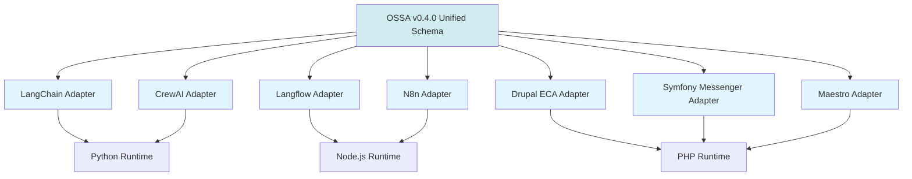
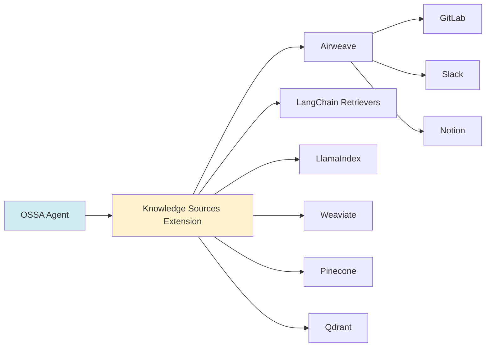

# Phase 4: Knowledge & Convergence (Weeks 7-8)

**Status:** Not Started  
**Timeline:** Weeks 7-8  
**Version Target:** v0.4.0

---

## 🎯 Goal

Add knowledge sources extension and achieve full convergence - making OSSA the "OpenAPI for AI Agents".

**Principle**: "Universal Portability" - One schema, any framework. One definition, multiple runtimes.

---

## 📋 Issues

| Issue | Title | Status | Priority |
|-------|-------|--------|----------|
| [#96](https://gitlab.com/blueflyio/openstandardagents/-/issues/96) | Knowledge Sources Extension | ⚪ Closed | P0 |
| [Epic #9](https://gitlab.com/groups/blueflyio/-/epics/9) | Unified Task Schema | ⚪ Not Started | P0 |

---

## 📦 Deliverables

### 1. Knowledge Sources Extension

**Purpose**: Standardize how agents access enterprise knowledge across multiple data sources.

**Features:**
- Context retrieval layer configuration
- Provider support (Airweave, LangChain, LlamaIndex, Weaviate, Pinecone, Qdrant)
- Search configuration (hybrid, neural, keyword)
- MCP bridge integration
- Source documentation

**Example:**
```yaml
apiVersion: ossa/v0.4.0
kind: Agent
metadata:
  name: knowledge-agent
spec:
  extensions:
    knowledge_sources:
      - name: enterprise-knowledge
        provider: airweave
        config:
          api_url: https://api.airweave.ai
          collection_id: enterprise-docs
        auth:
          type: api_key
          credentials: secret:airweave-api-key
        search:
          default_strategy: hybrid
          reranking: true
          recency_bias: 0.3
          max_results: 20
        mcp_bridge:
          enabled: true
          expose_as: airweave-search
        sources:
          - type: gitlab
            project: my-org/my-project
          - type: notion
            workspace: engineering-docs
          - type: slack
            channels: [engineering, product]
```

### 2. Unified Task Schema

**Goal**: Merge all insights from Drupal, Symfony, Maestro, Langflow, N8n into one unified schema.

**Key Features:**
- Task dependencies and ordering
- Conditional execution (if/then/else)
- Loop constructs (for-each, while, until)
- Parallel execution
- Error handling (retry, fallback, circuit breaker)
- State management
- Messaging integration
- Knowledge source integration

**Example:**
```yaml
apiVersion: ossa/v0.4.0
kind: Task
metadata:
  name: intelligent-task
spec:
  description: Task with all v0.4.0 features
  
  # Dependencies
  dependencies:
    - task: fetch-data
      required: true
  
  # Conditional execution
  condition: |
    input.priority > 5 && context.user.role == 'admin'
  
  # Knowledge sources
  knowledge_sources:
    - name: enterprise-docs
      query: "How to process {{input.type}} data"
  
  # Retry policy
  retry:
    max_attempts: 3
    backoff:
      strategy: exponential
      initial_delay_ms: 1000
  
  # Error handling
  on_error:
    strategy: fallback
    fallback_task: handle-error
  
  # Messaging
  messaging:
    publishes:
      - channel: task.completed
        payload: output
```

### 3. Maestro Adapter

**Purpose**: Enable Maestro templates to be expressed in OSSA.

**Features:**
- Template conversion (Maestro → OSSA)
- Non-linear workflow support
- Branching and looping
- Parallel execution
- State management

**Example Maestro Template:**
```yaml
# Maestro template
template:
  name: approval-workflow
  tasks:
    - id: submit
      type: form
    - id: manager-review
      type: approval
      depends_on: [submit]
    - id: director-review
      type: approval
      depends_on: [manager-review]
      condition: amount > 10000
    - id: finalize
      type: action
      depends_on: [manager-review, director-review]
```

**OSSA Equivalent:**
```yaml
apiVersion: ossa/v0.4.0
kind: Workflow
metadata:
  name: approval-workflow
spec:
  tasks:
    - name: submit
      task: form-submission
    
    - name: manager-review
      task: approval-task
      depends_on: [submit]
    
    - name: director-review
      task: approval-task
      depends_on: [manager-review]
      condition: output.manager-review.amount > 10000
    
    - name: finalize
      task: finalize-action
      depends_on: [manager-review, director-review]
```

### 4. N8n Adapter

**Purpose**: Enable N8n workflows to be expressed in OSSA.

**Features:**
- Workflow conversion (N8n → OSSA)
- Node-based execution
- Trigger support
- Webhook integration

**Example N8n Workflow:**
```json
{
  "nodes": [
    {
      "name": "Webhook",
      "type": "n8n-nodes-base.webhook",
      "position": [250, 300]
    },
    {
      "name": "Process Data",
      "type": "n8n-nodes-base.function",
      "position": [450, 300]
    },
    {
      "name": "Send Email",
      "type": "n8n-nodes-base.emailSend",
      "position": [650, 300]
    }
  ],
  "connections": {
    "Webhook": {
      "main": [[{"node": "Process Data"}]]
    },
    "Process Data": {
      "main": [[{"node": "Send Email"}]]
    }
  }
}
```

**OSSA Equivalent:**
```yaml
apiVersion: ossa/v0.4.0
kind: Workflow
metadata:
  name: webhook-workflow
spec:
  triggers:
    - type: webhook
      path: /webhook
  
  tasks:
    - name: process-data
      task: data-processor
    
    - name: send-email
      task: email-sender
      depends_on: [process-data]
```

### 5. Full Documentation

**Required Documentation:**
- Knowledge Sources Extension Guide
- Unified Task Schema Reference
- Maestro Adapter Guide
- N8n Adapter Guide
- Migration Guide (v0.3.x → v0.4.0)
- Framework Comparison Matrix
- Best Practices Guide

---

## ✅ Success Criteria

### OSSA is the "OpenAPI for AI Agents"
- [ ] One schema works across all frameworks
- [ ] Agents are portable (define once, deploy anywhere)
- [ ] Interoperability proven (agents communicate across frameworks)
- [ ] Production examples exist for each framework

### One Schema, Any Framework
- [ ] LangChain agents expressible in OSSA
- [ ] CrewAI agents expressible in OSSA
- [ ] Langflow workflows expressible in OSSA
- [ ] Drupal ECA workflows expressible in OSSA
- [ ] Symfony Messenger tasks expressible in OSSA

### Maestro Templates Expressible
- [ ] All Maestro template patterns supported
- [ ] Non-linear workflows work
- [ ] Branching and looping work
- [ ] Parallel execution works
- [ ] Conversion tool created

### N8n Workflows Expressible
- [ ] All N8n workflow patterns supported
- [ ] Node-based execution works
- [ ] Triggers work
- [ ] Webhook integration works
- [ ] Conversion tool created

### Production Examples Exist
- [ ] 5+ production examples for each framework
- [ ] All examples validated
- [ ] All examples documented
- [ ] All examples tested

---

## 📊 Progress Tracking

### Week 7
- [ ] Implement Knowledge Sources extension
- [ ] Create Maestro adapter
- [ ] Create N8n adapter
- [ ] Write conversion tools
- [ ] Create production examples

### Week 8
- [ ] Complete all documentation
- [ ] Validate all examples
- [ ] Performance testing
- [ ] Security review
- [ ] Release v0.4.0

---

## 🔗 Dependencies

### Upstream
- ✅ Phase 1: Specification (#133, #132)
- ✅ Phase 2: Runtime Implementation (#126, API Normalizer)
- ✅ Phase 3: Production Use Cases (multi-agent workflows)

### Downstream
- None (final phase)

---

## 🏗️ Convergence Architecture

### Framework Convergence



### Knowledge Sources Integration



---

## 📚 Framework Comparison Matrix

| Feature | LangChain | CrewAI | Langflow | Drupal ECA | Symfony | Maestro | N8n | OSSA v0.4.0 |
|---------|-----------|--------|----------|------------|---------|---------|-----|-------------|
| Task Definition | ✅ | ✅ | ✅ | ✅ | ✅ | ✅ | ✅ | ✅ |
| Workflow Orchestration | ✅ | ✅ | ✅ | ✅ | ✅ | ✅ | ✅ | ✅ |
| Messaging | ⚠️ | ⚠️ | ⚠️ | ✅ | ✅ | ⚠️ | ✅ | ✅ |
| Knowledge Sources | ✅ | ⚠️ | ⚠️ | ❌ | ❌ | ❌ | ⚠️ | ✅ |
| Branching/Looping | ✅ | ✅ | ✅ | ✅ | ⚠️ | ✅ | ✅ | ✅ |
| Error Handling | ✅ | ⚠️ | ⚠️ | ✅ | ✅ | ✅ | ✅ | ✅ |
| State Management | ✅ | ⚠️ | ⚠️ | ✅ | ✅ | ✅ | ✅ | ✅ |
| Portability | ❌ | ❌ | ❌ | ❌ | ❌ | ❌ | ❌ | ✅ |

**Legend:**
- ✅ Full support
- ⚠️ Partial support
- ❌ No support

---

## 🎯 Key Success Factors

1. **Universal portability**: Same manifest works across all frameworks
2. **Zero vendor lock-in**: Agents are framework-agnostic
3. **Production proven**: Real examples in production
4. **Community adoption**: 3+ framework implementations
5. **Documentation excellence**: Clear guides for each framework
6. **Performance**: Production-ready performance across all runtimes

---

## 📌 Next Steps

1. **Week 7**: Implement all adapters and extensions
2. **Week 8**: Complete documentation, testing, release v0.4.0
3. **Post-release**: Community feedback, adoption tracking, iteration

---

## 🔗 Related Documentation

- [Master Roadmap](v0.3.x-to-v0.4.0.md)
- [Phase 3: Production Use Cases](phase-3-production-use-cases.md)
- [Success Metrics](success-metrics.md)
- [Issue #96: Knowledge Sources](https://gitlab.com/blueflyio/openstandardagents/-/issues/96)
- [Epic #9: Unified Task Schema](https://gitlab.com/groups/blueflyio/-/epics/9)

---

**Maintained by**: OSSA Community  
**Last Updated**: 2025-12-10
