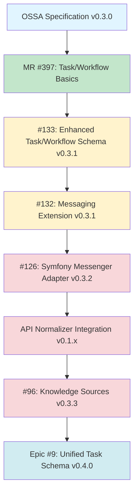

# OSSA v0.3.x → v0.4.0 Evolution Roadmap

**Version:** 1.0.0  
**Status:** Active  
**Last Updated:** 2025-12-10  
**Milestone:** [v0.3.x](https://gitlab.com/blueflyio/openstandardagents/-/milestones/6) (Due: 2025-12-31)

---

## 🎯 Vision Statement

**OSSA v0.4.0: The OpenAPI for AI Agents**

Just as OpenAPI standardized REST API contracts, OSSA v0.4.0 will standardize agent communication contracts, enabling:

- **One schema, any framework** - Define once, deploy everywhere
- **One definition, multiple runtimes** - Portable across ecosystems
- **Portable agents across ecosystems** - LangChain, CrewAI, Langflow, Drupal, Symfony
- **Interoperable multi-agent systems** - Agents communicate across framework boundaries
- **Production-ready workflows** - Enterprise-grade orchestration
- **Enterprise-grade governance** - Policy-driven agent behavior

**Impact**: Agents become as portable and interoperable as REST APIs.

---

## 📊 Project Landscape

### Specification Projects

| Project | Purpose | Repository |
|---------|---------|------------|
| **openstandardagents** | OSSA specification and schema | GitLab: blueflyio/openstandardagents |
| **gitlab_components** | GitLab CI/CD components for OSSA workflows | GitLab: blueflyio/gitlab_components |

### Implementation Projects

| Project | Purpose | Technology |
|---------|---------|------------|
| **api_normalizer** | API normalization with OSSA integration | Drupal module |
| **symfony-messenger-adapter** | Runtime implementation for Symfony | Symfony bundle |

### Related Ecosystems

| Framework | Type | Integration Status |
|-----------|------|-------------------|
| **Drupal ECA** | Event-driven workflows | Phase 2 |
| **Maestro** | Business process automation | Phase 4 |
| **Langflow** | Node-based AI workflows | Phase 4 |
| **LangChain** | Python AI framework | Phase 4 |
| **CrewAI** | Multi-agent orchestration | Phase 4 |
| **N8n** | Workflow automation | Phase 4 |

---

## 🔄 Dependency Graph

**Legend:**
- 🟢 Completed (Green)
- 🟡 In Progress (Yellow)
- 🔴 Not Started (Red)
- 🔵 Planning (Blue)

---

## 📅 Timeline & Phases

### Phase 1: Specification (Weeks 1-2)

**Goal**: Define the contract for tasks, workflows, and messaging

**Issues:**
- ✅ [#397](https://gitlab.com/blueflyio/openstandardagents/-/merge_requests/397) - Task/Workflow basics (completed)
- 🔄 [#133](https://gitlab.com/blueflyio/openstandardagents/-/issues/133) - Enhanced Task/Workflow schema
- 🔄 [#132](https://gitlab.com/blueflyio/openstandardagents/-/issues/132) - Messaging extension

**Deliverables:**
- `spec/v0.3.1/task-schema.md`
- `spec/v0.3.1/workflow-schema.md`
- `spec/v0.3.1/messaging.md`
- 10+ working examples
- JSON Schema updates

**Success Criteria:**
- [ ] Task/Workflow schema supports all patterns (Maestro, ECA, Langflow)
- [ ] Messaging extension defined with channel naming conventions
- [ ] 10+ working examples demonstrating all patterns
- [ ] Zero breaking changes to v0.3.0

---

### Phase 2: Runtime Implementation (Weeks 3-4)

**Goal**: Implement OSSA in Symfony Messenger and Drupal ECA

**Issues:**
- ⚪ [#126](https://gitlab.com/blueflyio/openstandardagents/-/issues/126) - Symfony Messenger adapter (closed)
- ⚪ API Normalizer integration (new)

**Deliverables:**
- Symfony Messenger runtime adapter
- Drupal ECA event plugins
- Message routing implementation
- State management
- Error handling

**Success Criteria:**
- [ ] Symfony Messenger adapter works with OSSA v0.3.1
- [ ] Drupal ECA integration works
- [ ] API Normalizer publishes events to Messenger
- [ ] All PHPCS errors fixed

---

### Phase 3: Production Use Cases (Weeks 5-6)

**Goal**: Validate with real-world workflows

**Issues:**
- ⚪ API Normalizer OSSA integration
- ⚪ Security Scanner integration
- ⚪ Dependency Healer integration

**Deliverables:**
- API Normalizer agents/tasks/workflows
- Multi-agent workflow examples
- Integration tests
- Documentation

**Success Criteria:**
- [ ] Multi-agent workflows work end-to-end
- [ ] End-to-end integration tests pass
- [ ] Production-ready code quality
- [ ] Real-world use cases validated

---

### Phase 4: Knowledge & Convergence (Weeks 7-8)

**Goal**: Add knowledge sources and achieve full convergence

**Issues:**
- ⚪ [#96](https://gitlab.com/blueflyio/openstandardagents/-/issues/96) - Knowledge Sources extension (closed)
- ⚪ [Epic #9](https://gitlab.com/groups/blueflyio/-/epics/9) - Unified Task Schema

**Deliverables:**
- Knowledge sources extension
- Unified task schema
- Maestro adapter
- N8n adapter
- Full documentation

**Success Criteria:**
- [ ] OSSA is the "OpenAPI for AI Agents"
- [ ] One schema, any framework
- [ ] Maestro templates expressible in OSSA
- [ ] N8n workflows expressible in OSSA
- [ ] Production examples exist

---

## 🎯 Success Metrics

### By End of Phase 1 (Week 2)
- ✅ Task/Workflow schema supports all patterns
- ✅ Messaging extension defined
- ✅ 10+ working examples
- ✅ Zero breaking changes to v0.3.0

### By End of Phase 2 (Week 4)
- ✅ Symfony Messenger adapter works
- ✅ Drupal ECA integration works
- ✅ API Normalizer publishes events
- ✅ All PHPCS errors fixed

### By End of Phase 3 (Week 6)
- ✅ Multi-agent workflows work
- ✅ End-to-end integration tests pass
- ✅ Production-ready code
- ✅ Real-world use cases validated

### By End of Phase 4 (Week 8)
- ✅ OSSA is the "OpenAPI for AI Agents"
- ✅ One schema, any framework
- ✅ Maestro templates expressible
- ✅ N8n workflows expressible
- ✅ Production examples exist

---

## 📋 Key Work Items

### Specification Issues (OSSA)

| Issue | Title | Version | Phase |
|-------|-------|---------|-------|
| [#132](https://gitlab.com/blueflyio/openstandardagents/-/issues/132) | Agent-to-Agent Messaging Extension | v0.3.1 | 1 |
| [#133](https://gitlab.com/blueflyio/openstandardagents/-/issues/133) | Enhanced Task/Workflow Schema | v0.3.1 | 1 |
| [#96](https://gitlab.com/blueflyio/openstandardagents/-/issues/96) | Knowledge Sources Extension | v0.3.3 | 4 |
| [Epic #9](https://gitlab.com/groups/blueflyio/-/epics/9) | Unified Task Schema | v0.4.0 | 4 |

### Implementation Issues

| Issue | Title | Version | Phase |
|-------|-------|---------|-------|
| [#126](https://gitlab.com/blueflyio/openstandardagents/-/issues/126) | Symfony Messenger Adapter | v0.3.2 | 2 |
| TBD | API Normalizer OSSA Integration | v0.1.x | 2-3 |

---

## 🔗 Cross-Project Dependencies

### OSSA Specification → API Normalizer
- API Normalizer uses OSSA v0.3.1 schema
- Validates task/workflow patterns
- Provides real-world use case

### OSSA Specification → Symfony Messenger
- Symfony Messenger implements OSSA contract
- Provides runtime for task execution
- Enables Drupal integration

### API Normalizer → Symfony Messenger
- API Normalizer uses Messenger for async tasks
- Publishes messages to Messenger queues
- Subscribes to Messenger messages

See [cross-project-dependencies.md](cross-project-dependencies.md) for detailed mapping.

---

## ✅ Acceptance Criteria

### For Each Phase
- [ ] All issues closed
- [ ] All tests passing
- [ ] All documentation complete
- [ ] Code review approved
- [ ] No breaking changes
- [ ] Performance acceptable
- [ ] Security reviewed

### For Each Release
- [ ] Changelog updated
- [ ] Version bumped
- [ ] Tags created
- [ ] Packages published
- [ ] Website updated
- [ ] Community notified
- [ ] Migration guide published

---

## 🎯 Key Success Factors

1. **Clear Specification**: Define the contract before implementation
2. **Real-World Validation**: Use API Normalizer to validate patterns
3. **Framework Alignment**: Work with Symfony, Drupal, Langflow teams
4. **Community Feedback**: Gather feedback early and often
5. **Documentation**: Keep docs in sync with code
6. **Testing**: Comprehensive test coverage
7. **Performance**: Ensure production-ready performance
8. **Security**: Security review at each phase

---

## 📌 Next Steps

### This Week
1. Review and approve #133, #132
2. Start specification work on enhanced schemas
3. Create working examples for all patterns

### Next Week
1. Complete #133, #132 specifications
2. Start #126 and API Normalizer integration
3. Begin Symfony Messenger adapter implementation

### Following Week
1. Complete #126 and API Normalizer integration
2. Start multi-agent workflows
3. Validate with production use cases

### Week 4
1. Complete multi-agent workflows
2. Start #96 and Epic #9
3. Begin convergence work

---

## 📚 Related Documentation

- [Phase 1: Specification](phase-1-specification.md)
- [Phase 2: Runtime Implementation](phase-2-runtime-implementation.md)
- [Phase 3: Production Use Cases](phase-3-production-use-cases.md)
- [Phase 4: Knowledge & Convergence](phase-4-knowledge-convergence.md)
- [Dependency Graph](dependency-graph.md)
- [Cross-Project Dependencies](cross-project-dependencies.md)
- [Success Metrics](success-metrics.md)

---

## 🔗 Related Issues

- [#133: Enhanced Task/Workflow Schema (v0.3.1)](https://gitlab.com/blueflyio/openstandardagents/-/issues/133)
- [#132: Messaging Extension (v0.3.1)](https://gitlab.com/blueflyio/openstandardagents/-/issues/132)
- [#126: Symfony Messenger Adapter (v0.3.2)](https://gitlab.com/blueflyio/openstandardagents/-/issues/126)
- [#96: Knowledge Sources Extension (v0.3.3)](https://gitlab.com/blueflyio/openstandardagents/-/issues/96)
- [Epic #9: Unified Task Schema (v0.4.0)](https://gitlab.com/groups/blueflyio/-/epics/9)

---

**Maintained by**: OSSA Community  
**Contact**: https://openstandardagents.org  
**License**: MIT
