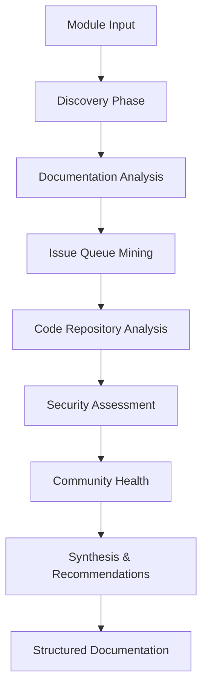

# Drupal Module Research Agent

**OpenAPI AI Agents Standard v0.1.1 + UADP v1.0 Compliant**

A comprehensive research agent specialized in analyzing Drupal contributed modules with exhaustive depth and precision. Built for integration with the TDDAI framework and LLM Platform ecosystem.

## 🎯 Purpose

This agent eliminates the guesswork in Drupal module selection by providing:

- **Exhaustive Module Analysis**: Complete research including metadata, documentation, issues, and code
- **Security Assessment**: Vulnerability analysis and security advisory tracking
- **Community Health**: Maintainer responsiveness and community support quality
- **Integration Guidance**: Best practices and implementation recommendations
- **Version Evolution**: API changes and upgrade considerations across versions

## 🏗️ Architecture

### Enhanced OAAS Agent Structure
```
drupal-research-agent/
├── agent.yml                    # Agent metadata, capabilities, compliance (OAAS required)
├── openapi.yaml                 # API endpoints, schemas, security (OAAS required)
├── README.md                    # Agent documentation and usage guide (Enhanced)
└── data/                        # Training and configuration data (Enhanced)
    ├── training-data.json       # Training examples and expected outputs
    ├── knowledge-base.json      # Drupal-specific domain knowledge
    ├── configurations.json      # Agent behavior and rate limiting settings
    ├── examples.json           # API request/response examples
    └── [additional-data].json   # Domain-specific training datasets
```

Compliant with:
- ✅ **OpenAPI AI Agents Standard v0.1.1** (Silver Certification)
- ✅ **Universal Agent Discovery Protocol (UADP) v1.0**
- ✅ **Enhanced OAAS Structure** (README.md + data/ folder)
- ✅ **TDDAI Framework Integration**
- ✅ **MCP Protocol Bridge**

### Research Pipeline



## 🚀 Capabilities

### Core Research Features
- **Web Scraping**: Extract metadata from drupal.org project pages
- **Documentation Parsing**: Follow and analyze all documentation pages
- **Issue Analysis**: Comprehensive issue queue analysis (open and closed)
- **Git Repository Analysis**: Multi-version code comparison
- **Security Assessment**: Vulnerability and advisory tracking
- **Performance Evaluation**: Impact assessment and optimization guidance

### Specialized Drupal Knowledge
- **Module Discovery**: Find alternatives and related modules
- **Dependency Mapping**: Understand module relationships
- **Version Compatibility**: Drupal core version support analysis
- **API Evolution**: Track changes across major versions
- **Community Patterns**: Identify maintenance and support quality

## 📊 Research Depth Levels

### Basic Research
- Module metadata extraction
- Current version information
- Basic usage statistics

### Comprehensive Research
- Complete documentation analysis
- Recent issue analysis (last 6 months)
- Security status assessment
- Community health indicators

### Exhaustive Research
- **ALL** issues analyzed (open and closed)
- Multi-version code comparison
- Complete git history analysis
- Detailed architecture documentation
- Full security audit

## 🔧 Usage

### API Endpoints

```bash
# Research a module comprehensively
curl -X POST http://localhost:3021/api/v1/research/module \
  -H "Content-Type: application/json" \
  -d '{
    "module_name": "webform",
    "research_depth": "comprehensive"
  }'

# Get research status
curl http://localhost:3021/api/v1/research/status/{operation_id}

# Search analyzed modules
curl "http://localhost:3021/api/v1/modules/search?query=form+builder&security_status=secure"
```

### TDDAI Integration

```bash
# Execute research through TDDAI
tddai agent execute drupal-research-agent \
  --module "views" \
  --depth "exhaustive" \
  --output "/Users/flux423/Sites/LLM/models/tddai_model/drupal_modules"
```

### MCP Protocol Bridge

```javascript
// Access through MCP
const research = await mcp.tools.invoke('drupal-module-research', {
  module_name: 'paragraphs',
  research_depth: 'comprehensive'
});
```

## 📁 Output Structure

Research results are saved in a hierarchical structure:

```
drupal_modules/{MODULE_NAME}/
├── overview.md                    # Executive summary
├── analysis/
│   ├── security_assessment.md     # Security vulnerabilities and advisories
│   ├── performance_analysis.md    # Performance impact and optimization
│   ├── architecture_review.md     # Code structure and patterns
│   └── best_practices.md         # Implementation recommendations
├── documentation/
│   ├── installation.md           # Installation procedures
│   ├── configuration.md          # Configuration options
│   ├── api_reference.md          # API documentation
│   └── use_cases.md              # Common usage patterns
├── community/
│   ├── issues_summary.md         # Issue queue analysis
│   ├── maintainer_analysis.md    # Maintainer activity and responsiveness
│   ├── community_health.md       # Community support quality
│   └── support_quality.md        # Support channels and effectiveness
└── versions/
    ├── current/                   # Latest stable version analysis
    ├── previous-1/                # Previous major version
    └── previous-2/                # Two versions back
```

## ⚡ Performance & Rate Limiting

- **Drupal.org**: 30 requests/minute with exponential backoff
- **Git repositories**: 60 requests/minute, 5 concurrent connections
- **Smart caching**: 24-hour TTL with intelligent invalidation
- **Progress tracking**: Real-time status updates with resume capability

## 🔒 Security Features

- **Rate limiting compliance**: Respects drupal.org guidelines
- **Secure headers**: Proper user agent and DNT headers
- **Content validation**: Sanitizes and validates all extracted content
- **Error handling**: Graceful degradation with comprehensive logging

## 🎛️ Configuration

### Agent Configuration (`agent.yml`)
```yaml
spec:
  memory_management:
    persistence:
      base_path: "/Users/flux423/Sites/LLM/models/tddai_model/drupal_modules"
  
  security:
    rate_limiting:
      drupal_org:
        requests_per_minute: 30
        retry_after: 60
```

### OpenAPI Specification (`drupal-research-openapi.yaml`)
- Complete API specification with examples
- Request/response schemas
- Error handling patterns
- Rate limiting documentation

## 🔄 UADP Integration

This agent participates in the Universal Agent Discovery Protocol:

- **Discoverable**: Automatically found by workspace scanners
- **Context-aware**: Understands project-specific Drupal knowledge
- **Orchestration-ready**: Can be deployed by universal orchestrator
- **Capability advertising**: Advertises Drupal expertise to workspace

## 🧪 Quality Assurance

- **Data validation**: All extracted data is validated for completeness
- **Cross-referencing**: Multiple sources are compared for accuracy
- **Confidence scoring**: Each finding includes confidence level
- **Completeness checking**: Ensures no critical information is missed

## 📈 Success Metrics

- **Coverage**: 100% of requested modules successfully analyzed
- **Accuracy**: >95% accuracy in security and compatibility assessments
- **Completeness**: All major aspects covered (docs, issues, code, security)
- **Timeliness**: Research completed within expected timeframes
- **Usability**: Generated documentation enables confident module selection

## 🚀 Getting Started

1. **Validate Compliance**
   ```bash
   openapi-agents validate agent.yml
   ```

2. **Deploy Agent**
   ```bash
   tddai agent deploy drupal-research-agent --port 3021
   ```

3. **Research Your First Module**
   ```bash
   curl -X POST http://localhost:3021/api/v1/research/module \
     -H "Content-Type: application/json" \
     -d '{"module_name": "webform", "research_depth": "comprehensive"}'
   ```

4. **Explore Results**
   ```bash
   open /Users/flux423/Sites/LLM/models/tddai_model/drupal_modules/webform/overview.md
   ```

## 🤝 Integration Examples

### With TDDAI Workflow
```yaml
# In your TDDAI workflow
steps:
  - name: "Research Module"
    uses: "drupal-research-agent"
    with:
      module_name: "{{ inputs.module }}"
      research_depth: "comprehensive"
      
  - name: "Generate Tests"
    uses: "test-generator"
    with:
      module_research: "{{ steps.research.outputs.path }}"
```

### With LLM Platform
```php
// In Drupal module selection service
$research = $this->agentOrchestrator->invoke('drupal-research-agent', [
  'module_name' => $moduleName,
  'research_depth' => 'comprehensive'
]);

$recommendation = $research['detailed_findings']['maintenance_assessment'];
```

---

**Built with ❤️ for the Drupal community**  
*Ensuring every module selection is informed, secure, and strategic.*