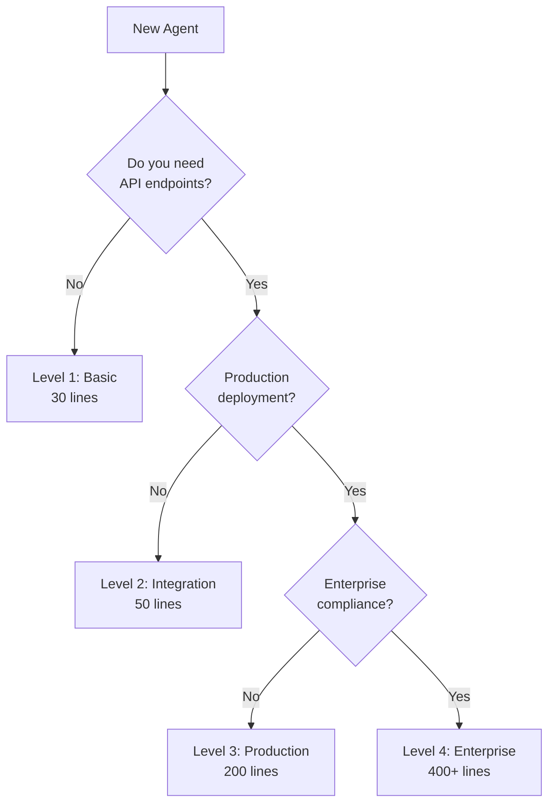

# 📚 OSSA Examples - Learn by Building

> **Open Standards for Scalable Agents v0.1.8 - Educational Examples**
> 
> These examples are designed to teach you OSSA from zero to enterprise level.
> Each example builds on the previous one, introducing new concepts progressively.

## 🎯 Quick Start Guide

**New to OSSA?** Start here:

1. **Read** `00-agent-minimal/` (2 minutes)
2. **Progress** through `01-agent-basic/` (5 minutes)
3. **Copy** the example to your project
4. **Modify** for your use case
5. **Validate** with `ossa validate agent.yml`
6. **Deploy** and test discovery

## 📊 Complexity Levels - Choose Your Path

### 🤔 Which Level Do I Need?



### 📁 Complete Example Structure

| Level | Directory | Focus | Key Features | When to Use |
|-------|-----------|-------|--------------|-------------|
| **00** | `00-agent-minimal/` | Discovery | Bare minimum | Learning only |
| **01** | `01-agent-basic/` | **Start Here** | Core features | Learning, prototypes |
| **02** | `02-agent-integration/` | Frameworks | OpenAPI, auth | Multi-framework apps |
| **03** | `03-agent-production/` | Production | Security, monitoring | Real deployments |
| **04** | `04-agent-enterprise/` | Enterprise | Full compliance | Regulated industries |
| **05** | `05-workspace-basic/` | Multi-project | Discovery, routing | Team projects |
| **06** | `06-workspace-enterprise/` | Enterprise workspace | Compliance, DR | Large organizations |
| **07** | `07-agent-communication/` | Inter-agent | Discovery, protocols | Agent coordination |
| **08** | `08-devops-integration/` | CI/CD | Pipeline automation | DevOps workflows |
| **09** | `09-framework-integration/` | All frameworks | Universal compatibility | Framework bridging |
| **10** | `10-workspace-orchestration/` | Orchestration | 6 coordination patterns | Complex workflows |
| **11** | `11-observability-validation/` | Monitoring | Metrics, compliance | Production monitoring |
| **12** | `12-enterprise-devops/` | Enterprise CI/CD | Security, compliance | Enterprise deployment |
| **13** | `13-complete-workflow/` | End-to-end | Full lifecycle | Complete examples |

## 🚀 Learning Path

### Week 1: Fundamentals
```bash
# Day 1-2: Learn basics
cd 01-agent-basic
cat agent.yml  # Read all comments carefully
oaas validate agent.yml

# Day 3-4: Add frameworks
cd ../02-agent-integration
# Study framework configurations
# Test with MCP/LangChain

# Day 5: Understand workspaces
cd ../05-workspace-basic
# Learn multi-agent orchestration
```

### Week 2: Production Skills
```bash
# Day 1-3: Production features
cd 03-agent-production
# Study security, monitoring, deployment

# Day 4-5: Enterprise features
cd ../04-agent-enterprise
# Understand compliance, governance
```

### Week 3: Real Implementation
```bash
# Apply to your project
cd ~/your-project
oaas agent create my-agent --level=2
# Customize and deploy
```

## 📖 Detailed Example Descriptions

### 01-agent-basic: Your First Agent (5-minute quickstart)
- **Purpose**: Learn OAAS fundamentals quickly
- **Concepts**: name, version, capabilities, frameworks
- **Files**: Just `agent.yml` with extensive comments
- **Try This**: 
  ```bash
  cd 01-agent-basic
  # Read every comment in agent.yml
  # Modify the capabilities for your use case
  # Test with: oaas validate agent.yml
  ```

### 02-agent-integration: Framework Integration
- **Purpose**: Connect with MCP, LangChain, CrewAI
- **Concepts**: OpenAPI spec, framework configs, authentication
- **Files**: `agent.yml`, `openapi.yaml`
- **Try This**:
  ```bash
  cd 02-agent-integration
  # Generate MCP server: oaas export --format=mcp
  # Test with LangChain: python test_langchain.py
  ```

### 03-agent-production: Production Deployment
- **Purpose**: Deploy agents to production safely
- **Concepts**: Security, monitoring, scaling, compliance
- **Files**: `agent.yml`, `openapi.yaml`, `data/examples.json`
- **Key Features**:
  - JWT authentication
  - Prometheus metrics
  - Health checks
  - Rate limiting
  - Audit logging

### 04-agent-enterprise: Enterprise Compliance
- **Purpose**: Meet regulatory requirements
- **Concepts**: ISO 42001, NIST AI RMF, EU AI Act, SOX
- **Files**: Complete structure with data folder
- **Key Features**:
  - Full audit trails
  - Data governance
  - Multi-region support
  - Forensic logging

### 05-workspace-basic: Multi-Agent Orchestration
- **Purpose**: Coordinate multiple agents
- **Concepts**: Discovery, routing, orchestration
- **Try This**:
  ```bash
  cd 05-workspace-basic
  # Place in project root
  oaas workspace scan  # Discovers all agents
  oaas workspace ask "How do I add authentication?"
  ```

### 06-workspace-enterprise: Enterprise Workspace
- **Purpose**: Enterprise-scale agent management
- **Features**: Multi-region, disaster recovery, compliance frameworks

## 🛠️ Common Patterns

### Pattern 1: Capability Naming
```yaml
# ✅ GOOD - Clear verb_noun format
capabilities:
  - analyze_code: "Analyzes code quality"
  - generate_tests: "Creates test cases"
  
# ❌ BAD - Unclear or abbreviated
capabilities:
  - anlz: "Analysis"  # Too abbreviated
  - code: "Code stuff" # Not specific
```

### Pattern 2: Framework Selection
```yaml
# ✅ GOOD - Only enable what you use
frameworks:
  langchain: enabled  # Actually using LangChain
  
# ❌ BAD - Enabling everything
frameworks:
  mcp: enabled       # Not using
  langchain: enabled # Not using
  crewai: enabled    # Not using
  autogen: enabled   # Not using
```

### Pattern 3: Version Management
```yaml
# Development
version: "0.1.8"  # Pre-production

# Production
version: "1.0.0"  # First stable release
version: "1.0.1"  # Patch fix
version: "1.1.0"  # New features
version: "2.0.0"  # Breaking changes
```

## ❓ Troubleshooting Guide

### Problem: "Agent not discovered"
**Solution**: Check these in order:
1. File named exactly `agent.yml` (not `agent.yaml`)
2. Located in `.agents/` directory
3. Has required fields: name, version, capabilities
4. Run `oaas workspace scan` to verify

### Problem: "Framework bridge not working"
**Solution**: 
1. Framework must be enabled in agent.yml
2. For Level 2+, need OpenAPI spec
3. Check framework-specific config section
4. Test with: `oaas export --format=<framework>`

### Problem: "Validation fails"
**Solution**:
1. Check line count matches level expectations
2. Verify required fields for your level
3. Use proper naming format (lowercase-with-hyphens)
4. Run: `oaas validate agent.yml --verbose`

### Problem: "Don't know which level to choose"
**Solution**: Start with Level 1, then upgrade when you need:
- API endpoints → Level 2
- Production deployment → Level 3
- Compliance requirements → Level 4

## 🔄 Migration Guide

### From LangChain Tools
```python
# Old LangChain tool
tool = Tool(name="analyzer", func=analyze)

# New OAAS agent (Level 2)
# 1. Create agent.yml with langchain enabled
# 2. Define capabilities matching tool functions
# 3. Bridge automatically generates tool
```

### From CrewAI Agents
```python
# Old CrewAI agent
agent = Agent(role="analyst", goal="analyze code")

# New OAAS agent (Level 2)
# 1. Set crewai.role in agent.yml
# 2. Map goal to capabilities
# 3. CrewAI discovers via OAAS
```

### From MCP Servers
```javascript
// Old MCP server
const server = new MCPServer({...})

// New OAAS agent (Level 2)
// 1. Enable mcp in frameworks
// 2. OAAS generates MCP config
// 3. Auto-registers with Claude Desktop
```

## 📋 Quick Reference Card

### Minimal Agent (Copy & Modify)
```yaml
name: my-agent
version: "0.1.8"
expertise: "What I do"
capabilities:
  - do_something: "Description"
frameworks:
  langchain: enabled
```

### Command Cheatsheet
```bash
# Discovery
oaas scan                        # Find all agents
oaas workspace scan              # Deep scan

# Validation  
oaas validate agent.yml          # Check syntax
oaas doctor                      # Health check

# Creation
oaas create my-agent --level=2  # From template
oaas migrate .                   # Convert existing

# Bridges
oaas export --format=mcp        # For Claude
oaas export --format=langchain  # For LangChain
```

### File Structure Template
```
.agents/
├── my-agent/
│   ├── agent.yml        # Required
│   ├── openapi.yaml     # Level 2+
│   ├── data/           # Level 3+
│   │   ├── examples.json
│   │   └── config.json
│   └── README.md       # Recommended
```

## 🎓 Educational Resources

### Understanding Progressive Complexity
Each level adds specific features:
- **Level 1**: Core identity + capabilities
- **Level 2**: + API specification + framework configs
- **Level 3**: + Security + monitoring + deployment
- **Level 4**: + Compliance + governance + audit

### Why This Approach?
1. **No Over-Engineering**: Start simple, grow as needed
2. **Clear Progression**: Each level has clear triggers
3. **Framework Agnostic**: Works with any AI framework
4. **Production Ready**: Level 3+ includes all production needs
5. **Standards Compliant**: Level 4 meets enterprise requirements

### Research Foundation
Based on analysis of:
- OpenAPI specification patterns
- MCP (Model Context Protocol) requirements
- LangChain tool specifications
- CrewAI agent definitions
- Enterprise compliance frameworks (ISO 42001, NIST AI RMF)

## 🤝 Contributing

We welcome contributions! Please:
1. Follow the progression pattern
2. Add extensive comments
3. Include real-world use cases
4. Test all examples
5. Update this README

## 📜 License

These examples are part of the OpenAPI AI Agents Standard (OAAS) and are provided under MIT License for educational purposes.

---

**Remember**: The best agent is not the most complex one, but the one at the right complexity level for its purpose. Start simple, upgrade when needed.