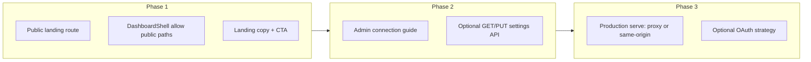

<!-- f6dc8169-af57-459e-a0d7-b65882589da1 -->
# Dragonfly as Open-Core SaaS Platform

## Current state (what you have)

- **API:** Express, OpenAPI 3.1 (`openapi/drupal-test-orchestrator.openapi.yaml`), Passport local strategy, express-session (in-memory or connect-redis), Cedar gate via compliance-engine. Base path `/api/drupal-test-orchestrator/v1`. Already registered in api-schema-registry (`openapi/dragonfly/openapi.yaml`).
- **Dashboard:** Next.js 14 in `apps/dashboard/` with login, projects/queue/agents, admin placeholder. Uses `@bluefly/studio-ui`, AuthContext calling `/api/auth/login|me|logout` with `credentials: 'include'`. **Login-first:** unauthenticated users are redirected to `/login`; there is no public marketing page.
- **Drupal:** `dragonfly_client` uses **http_client_manager** (dragonfly_client.http_services_api.yml + dragonfly.json); config: base URL and API path. No custom HTTP client.
- **Deploy:** Oracle at dragonfly.blueflyagents.com (port 3020). Dashboard has `output: 'export'` (static export); in dev, Next rewrites `/api/*` to localhost:3020.

## Goals (your ask)

1. **Website frontend** — Public landing that explains what Dragonfly is and does (open-core, self-host vs SaaS).
2. **Login** — Already present; keep and optionally extend (e.g. OAuth).
3. **Config/admin** — Screens to “hook up” a Drupal site using the dragonfly_client module (connection guide, base URL, optional API key).
4. **Constraints** — No reinventing the wheel; use OSS frameworks and projects; API-first; reduce tech debt; SOLID.

---

## 1. Landing / marketing site (no new framework)

**Approach:** Extend the existing Next.js app in `apps/dashboard/` with a **public** landing experience. Do not add Docusaurus, Nextra, or a second app unless you later need a full docs site; one codebase keeps deployment and auth simple.

- **Route layout:** Introduce a public route group so unauthenticated users can see marketing without being sent to `/login`.
  - **Option A (recommended):** `(marketing)/page.tsx` = public landing at `/`; move current app dashboard to `(app)/dashboard/page.tsx` and redirect `/` when logged in to `/dashboard`. Or keep `/` as landing and use `/dashboard`, `/projects`, etc. as app routes; only protect app routes.
  - **Option B:** Landing at `/`; if user is authenticated, show dashboard at `/` (current behavior) and add a separate `/home` or `/landing` for the public page with a link “Sign in” to `/login`.
- **Content:** One or a few React pages using **@bluefly/studio-ui** (Card, Button, Section, typography). Copy: value prop (AI-powered Drupal testing, PHPUnit/PHPCS/Playwright/Rector, OSSA agents), “Self-host or use our SaaS”, “Sign in” / “Get started” CTA to `/login`. Optional: “Docs” link to GitLab wiki or a later docs subdomain.
- **Tech:** Next.js App Router, studio-ui only. Optional: `next-mdx-remote` if you want landing content in MDX; otherwise static React is enough.
- **Shell:** In `DashboardShell`, treat “public” paths (e.g. `/`, `/login`, `/pricing` if any) as no-redirect; for all other paths require auth and redirect to `/login` if not authenticated.

**Deliverables:** Public `/` (or `/home`) with hero, features, self-host vs SaaS, CTA; “Sign in” → `/login`; logged-in users can keep landing link but primary entry is dashboard.

---

## 2. Auth (extend, do not replace)

**Current:** Passport local strategy, env-backed users (`DRAGONFLY_ADMIN_EMAIL`, `DRAGONFLY_ADMIN_PASSWORD`, optional `DRAGONFLY_SEED_USERS`), express-session, session cookie.

**Keep and extend:**

- **Passport (OSS):** Add strategies as needed (no custom auth protocol).
  - **Optional “Login with GitLab”:** Add `passport-gitlab2` (or OAuth2 generic) so users can sign in with GitLab; map GitLab user to a Dragonfly user/role (create on first login or link to existing env user). Document in AGENTS.md / wiki.
  - **Optional “Login with Drupal”:** If Drupal_Fleet_Manager (or another site) exposes OAuth2 (e.g. simple_oauth), add a Passport OAuth2 strategy pointing at that IdP; one platform login. AGENTS.md already mentions this.
- **Session store:** You already have connect-redis when `REDIS_URL` is set; keep it for SaaS so sessions survive restarts and scale.
- **No BaaS auth for core:** Do not introduce Clerk/Supabase Auth as the primary path for the open-core product; keep auth in-repo so self-hosters get the same behavior. Optional: document “bring your own IdP” (OAuth2) for enterprise.

**Deliverables:** Same login flow; optional GitLab/Drupal OAuth strategies; session and env config documented for self-host vs SaaS.

---

## 3. Admin and “connect your Drupal site”

**Principle:** Admin is for configuring how Dragonfly is used (e.g. which Drupal site to treat as “test site”, connection details for dragonfly_client). Do not build a custom admin framework; use existing API + studio-ui forms.

- **Admin API (API-first):**
  - Add a small **settings** surface in the Dragonfly API, e.g. `GET/PUT /api/dragonfly/v1/admin/settings` (or under existing base path), admin-only (session role or Cedar). Schema: e.g. `{ drupal_fleet_manager_url?: string, webhook_base_url?: string }` for SaaS hints. Persist in DB (new table or key-value) or in a single config file read at startup. OpenAPI spec first; then implement.
  - If you prefer zero new persistence for MVP, admin can be “connection guide” only (see below).
- **Admin UI (apps/dashboard):**
  - **Connection guide:** One admin section “Connect your Drupal site”:
    - Short copy: “Install the dragonfly_client module and set the Dragonfly API base URL to `https://dragonfly.blueflyagents.com` (or your self-hosted URL).”
    - Display or copy-paste: **Base URL** (e.g. `https://dragonfly.blueflyagents.com`), **API path** (e.g. `/api/drupal-test-orchestrator/v1`), link to dragonfly_client docs (GitLab wiki or drupal.org if published).
    - Optional: form to set “Default Drupal site URL” (for SaaS) and save via `PUT /admin/settings` for display in docs or for webhook callbacks.
  - Use **studio-ui** Card, form primitives, Button only; no custom form library.
- **Drupal side:** No change to dragonfly_client’s config model (base_url + api_path in Drupal config). Document in dragonfly_client’s README/wiki: “SaaS: use https://dragonfly.blueflyagents.com; self-host: use your Dragonfly URL.”

**Deliverables:** Admin page with “Connect your Drupal site” (copy + base URL + path + link to module docs); optional GET/PUT settings API + form if you add persistence.

---

## 4. API-first and platform alignment

- **OpenAPI:** All new endpoints (e.g. admin/settings) go into the Dragonfly OpenAPI spec; keep using `express-openapi-validator` and generated types.
- **api-schema-registry:** Dragonfly is already there; after adding any new paths, re-export or sync the spec (e.g. copy from Dragonfly repo or CI step) so api.blueflyagents.com stays the source of truth. Drupal can continue to import from api.blueflyagents.com via api_normalization for gateway/Tools.
- **dragonfly_client:** Keep using http_client_manager; no new custom HTTP client. Ensure config is documented for both SaaS and self-host (base_url, optional API key if you add it later).
- **Compliance-engine:** Keep using Cedar for “can user X trigger test?” and, if you add admin endpoints, “can user X change settings?” so policy stays in one place.

---

## 5. Open-source and “don’t reinvent”

| Need | Use | Avoid |
|------|-----|--------|
| Landing + app | Same Next.js app, route groups | Second framework (Docusaurus, etc.) for just landing |
| Auth | Passport + existing session, optional OAuth2 strategies | Custom auth protocol; BaaS as only option |
| Admin forms | studio-ui components | Custom form/CRUD framework |
| API contract | OpenAPI 3.1, express-openapi-validator, openapi-typescript | Ad-hoc validation or hand-written types |
| Drupal client | http_client_manager (already) | Raw Guzzle or duplicate client |
| Authz | compliance-engine (Cedar) | Hardcoded role checks in Dragonfly |
| Session store | connect-redis when REDIS_URL set | Custom session backend |

No new major dependencies for the landing or admin; only optional Passport strategies and optional persistence for admin settings.

---

## 6. Tech debt reduction

- **Single app:** Landing + dashboard + admin in one Next.js app; one deploy, one auth boundary.
- **Production dashboard vs static export:** Today `output: 'export'` makes the dashboard static; for SaaS at dragonfly.blueflyagents.com you need the browser to send requests to the same origin so session cookies work. **Change:** Either (a) serve the Next app in non-export mode (e.g. `next start`) behind the same host as the API (reverse proxy: e.g. nginx/Cloudflare routes `/` to Next and `/api` to Express), or (b) keep static export and set `NEXT_PUBLIC_DRAGONFLY_API` to `https://dragonfly.blueflyagents.com` and ensure the API allows CORS and same-site cookies for that origin. Prefer (a) for same-origin and simpler cookie handling.
- **Docs:** Put “How to connect Drupal” and “Self-host vs SaaS” in GitLab Wiki (dragonfly project); link from landing and admin. No long-form docs in repo root (per .cursorrules).
- **Self-host story:** README (or wiki) with: one-line run (e.g. docker-compose or `npm run serve` + env template), required env vars (SESSION_SECRET, DRAGONFLY_ADMIN_*, COMPLIANCE_ENGINE_URL, etc.), optional REDIS_URL. Same codebase = self-host and SaaS; no separate “SaaS-only” code path beyond env.

---

## 7. Implementation order

1. **Phase 1 — Landing:** Add public route (e.g. `(marketing)/page.tsx` at `/` or `/home`), update `DashboardShell` so `/` and `/login` (and any other public paths) do not redirect to login; add landing content with studio-ui; “Sign in” → `/login`.
2. **Phase 2 — Admin:** Build “Connect your Drupal site” in admin (copy, base URL, API path, link to dragonfly_client docs); optionally add GET/PUT settings in OpenAPI + implementation and a simple form.
3. **Phase 3 — Production and optional auth:** Fix production serving (same-origin or CORS + cookie domain); optionally add Passport GitLab/Drupal OAuth; document self-host and SaaS in wiki.

---

## 8. Files and locations (reference)

| Area | Location |
|------|----------|
| Dragonfly API | `worktrees/dragonfly/src/` (server, auth, api) |
| OpenAPI spec | `worktrees/dragonfly/openapi/drupal-test-orchestrator.openapi.yaml` |
| Dashboard app | `worktrees/dragonfly/apps/dashboard/` (Next.js) |
| Auth (server) | `worktrees/dragonfly/src/auth/` (passport, auth.routes, auth.middleware) |
| Auth (client) | `apps/dashboard/src/lib/auth.ts`, `context/AuthContext.tsx` |
| Shell / redirect | `apps/dashboard/src/components/DashboardShell.tsx` |
| Admin page | `apps/dashboard/src/app/admin/page.tsx` |
| Registry spec | `worktrees/api-schema-registry/.../openapi/dragonfly/openapi.yaml` |
| Drupal module | `TESTING_DEMOS/.../dragonfly_client` (http_client_manager, config) |

---

## 9. Summary

- **Landing:** One Next.js app, public route(s), studio-ui, no new framework.
- **Login:** Keep Passport + session; optional OAuth (GitLab/Drupal) later.
- **Admin:** Connection guide for dragonfly_client + optional settings API; studio-ui only.
- **API-first:** All new endpoints in OpenAPI; keep api-schema-registry and Drupal api_normalization in sync.
- **OSS-only:** Passport, Next.js, studio-ui, express-openapi-validator, connect-redis, compliance-engine; no custom auth, no custom form framework, no duplicate HTTP client in Drupal.
- **Tech debt:** Single app (landing + app), production serve strategy (same-origin or CORS), wiki for docs, same codebase for self-host and SaaS.
