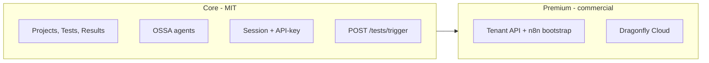

<!-- f6dc8169-af57-459e-a0d7-b65882589da1 -->
# Dragonfly audit and open-core plan

## 1. Audit: what is there

### Dragonfly (Node service, `WORKING_DEMOs/dragonfly`)

| Area | Status | Notes |
|------|--------|------|
| **API surface** | Done | Express, OpenAPI 3.1 validator, base path `/api/drupal-test-orchestrator/v1`. Routes: projects, tests, results, rector, agents, compliance, canvas, migrations, **tenant** (GET/POST bootstrap/PATCH, GET /tenants admin), webhooks, MCP resources. |
| **Auth** | Done | Session (Passport local), Redis session store option, **API-key middleware** (Bearer / X-API-Key for Drupal/CLI). requireAuth, requireAdmin, requireAuthOrAgent. |
| **Tenant** | Done | `tenant.controller.ts`, `tenant.service.ts` (n8n webhook), `database.service.ts` (tenants table, getTenantByUserId, listTenants, updateTenant). OpenAPI tag "tenant" and paths documented. Commented as "premium" but code is in main tree. |
| **Phase E contract** | Partial | `schemas/phase-e.contract.ts` has TriggerInputSchema/TriggerOutputSchema. Actual `POST /tests/trigger` uses different shape (projects, priority, etc.) and is not fully aligned to Phase E schema. |
| **Core vs premium split** | Not done | Single codebase. No `packages/core` vs `packages/premium`, no feature flags, no dual license. AGENTS.md says "core first, prove it, then premium" but tenant/n8n bootstrap are already implemented in-tree. |

### dragonfly_client (Drupal, `TESTING_DEMOS/.../dragonfly_client`)

| Area | Status | Notes |
|------|--------|------|
| **HTTP ops** | Done | `dragonfly.json`: GetMyTenant, BootstrapTenant, TriggerTests, ListProjects, plus compliance, rector, cost, etc. |
| **Tool plugins** | Done | GetMyTenant, BootstrapTenant, TriggerDragonflyTest, ListDragonflyProjects (and others). Orchestration auto-discovers all `dragonfly_client:*` via `dragonfly_client_orchestration` ServicesProvider. |
| **ECA** | Partial | Events: DragonflyTestCompleted, DragonflyTestFailed, DragonflyComplianceChecked, DragonflyRectorApplied. Conditions: DragonflyTestsPassed, DragonflyProjectCompliant. **Missing:** event TenantBootstrapped, action BootstrapDragonflyTenant. |
| **DragonflyEvents** | Missing constant | No `TENANT_BOOTSTRAPPED`. |
| **Config** | Fixed | DragonflyConfigSubscriber typo `[)` -> `[]` already fixed. |

### BuildKit and docs

| Item | Status |
|------|--------|
| Dragonfly tenant CLI | Deferred (BuildKit not open source). |
| Research doc (Drupal AI/ECA/orchestration full capability) | Not created; must go to GitLab Wiki. |

---

## 2. Open-core carve-out: how to do it

Goal: one **open-source core** (MIT) that anyone can run and extend, and a **premium** layer (commercial or source-available) that you ship on top.

**Option A – Same repo, runtime feature flag (simplest for now)**  
- Keep one repo. Core = everything except tenant + n8n bootstrap.  
- Premium = tenant routes + `tenant.service.ts` (n8n) + tenants table.  
- Env: `DRAGONFLY_PREMIUM_ENABLED=true` or `N8N_TENANT_BOOTSTRAP_WEBHOOK_URL` set. If unset, do not register tenant routes (or return 403).  
- License: single MIT; "premium" is just a feature you enable when you have the n8n workflow and choose to use it. No legal split yet.  
- **Pro:** No repo split, no package split. **Con:** Premium code is in the open repo; you rely on hosting/support for revenue, not code hiding.

**Option B – Two packages (core + premium add-on)**  
- **Core:** New package `dragonfly-core` or rename current to `@bluefly/dragonfly-core`. Publish to npm (public). Contains: projects, tests, results, rector, agents, compliance, canvas, migrations, auth, health. No tenant, no tenants table, no n8n bootstrap.  
- **Premium:** Package `@bluefly/dragonfly-premium` (private or commercial license). Depends on core. Adds: tenant routes, tenant.service, tenants table, n8n bootstrap. Registers routes with core app.  
- Core repo is public (e.g. GitHub + GitLab mirror MIT). Premium repo is private or source-available with commercial license.  
- **Pro:** Clear boundary; core is clearly open. **Con:** Refactor to extract core into a library and a thin server that loads core + optional premium.

**Option C – Monorepo with packages/core and packages/premium**  
- Same as B but both in one repo. `packages/core` (MIT), `packages/premium` (proprietary license or "premium" license file). Root app imports core and conditionally premium (e.g. when license key or env is set).  
- **Pro:** Single clone, clear folders. **Con:** Premium code is still in the same repo unless you use a private subtree or separate private repo that includes only `packages/premium`.

**Recommendation:** Start with **Option A** (feature flag, no tenant routes when not configured). Document in AGENTS.md and OpenAPI that "tenant and n8n bootstrap are premium features; enable with N8N_TENANT_BOOTSTRAP_WEBHOOK_URL." When you are ready to truly open-source the core, do **Option B**: extract core to its own package and repo, then add premium as a separate package that extends it.

---

## 3. What to do next (ordered)

**Phase 1 – Finish Drupal integration (no open-core refactor yet)**  
1. **dragonfly_client ECA**  
   - Add `DragonflyEvents::TENANT_BOOTSTRAPPED`.  
   - Add ECA event plugin `DragonflyTenantBootstrapped` (event_class can reuse `DragonflyEvent` with tenant payload: tenantId, gitlabProjectPath, etc.).  
   - Add ECA action `BootstrapDragonflyTenant`: configurable (requested_slug, user_id, email from tokens), call `plugin.manager.tool` with `dragonfly_client:bootstrap_tenant`, set result tokens (e.g. `bootstrap_success`, `bootstrap_tenant_id`, `bootstrap_gitlab_project_path`).  
   - Optionally dispatch `TENANT_BOOTSTRAPPED` from that action after success (or from a separate ECA model that runs after the action).  

2. **Wiki**  
   - Publish one GitLab Wiki page (technical-docs or dragonfly_client / Dragonfly project): "Dragonfly and Drupal at full capability" – list Drupal AI, ECA, orchestration, FlowDrop, dragonfly_client tools, and how to use them with Dragonfly. No new .md in repo roots.

**Phase 2 – Keep Dragonfly clean (open-core ready)**  
3. **Feature-flag tenant (Option A)**  
   - In `server.ts`, register tenant routes only when `process.env.N8N_TENANT_BOOTSTRAP_WEBHOOK_URL` is set (or `DRAGONFLY_PREMIUM_ENABLED=true`).  
   - If not set, either do not mount tenant routes or mount them and return 403 with message "Tenant API is a premium feature; configure N8N_TENANT_BOOTSTRAP_WEBHOOK_URL."  
   - OpenAPI: keep tenant paths; add in description that they require premium configuration.  
   - No new files; minimal change so core can run without premium.

4. **AGENTS.md**  
   - In Dragonfly AGENTS.md, add a short "Open-core" subsection: core = test orchestration, projects, results, agents, compliance, canvas, auth (session + API-key). Premium = tenant API and n8n GitLab bootstrap. Document env to enable premium. State that a future step is extracting core to a separate package (Option B) when open-sourcing.

**Phase 3 – Later (when you open-source)**  
5. **Extract core (Option B)**  
   - New package `@bluefly/dragonfly-core` (or rename): only core routes and services, no tenant, no tenants table. Publish MIT.  
   - Current repo becomes the "full" server that depends on core and optionally `@bluefly/dragonfly-premium` (tenant + n8n).  
   - Or: core repo public, premium repo private; full server in a third repo or in premium repo.  

6. **BuildKit**  
   - When BuildKit is open source, add dragonfly tenant CLI (get, bootstrap, list) as a consumer of Dragonfly API.

---

## 4. File-level checklist (Phase 1–2)

| Task | File(s) / location |
|------|--------------------|
| ECA constant | `dragonfly_client/src/Event/DragonflyEvents.php` – add `TENANT_BOOTSTRAPPED`. |
| ECA event plugin | New `dragonfly_client/src/Plugin/ECA/Event/DragonflyTenantBootstrapped.php` (event_name = TENANT_BOOTSTRAPPED, event_class = DragonflyEvent or new DragonflyTenantEvent). |
| ECA action | New `dragonfly_client/src/Plugin/ECA/Action/BootstrapDragonflyTenant.php` – inject ToolManager and TokenService; config form for token names for requested_slug, user_id, email; execute tool `dragonfly_client:bootstrap_tenant`; set tokens from result. |
| Wiki page | GitLab Wiki (technical-docs or Dragonfly project): create "Dragonfly-and-Drupal-full-capability" (or similar). Content: Drupal AI, ECA, orchestration, FlowDrop, dragonfly_client tools and when to use them. |
| Tenant route guard | `dragonfly/src/server.ts` – wrap tenant route registration in `if (process.env.N8N_TENANT_BOOTSTRAP_WEBHOOK_URL) { ... }` or return 403 when env unset. |
| AGENTS.md open-core | `dragonfly/AGENTS.md` – add "Open-core" subsection (core vs premium, env for premium). |

No new .md in repo roots; no BuildKit changes until it is open source.
