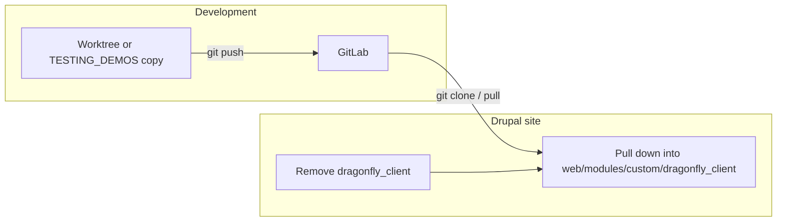
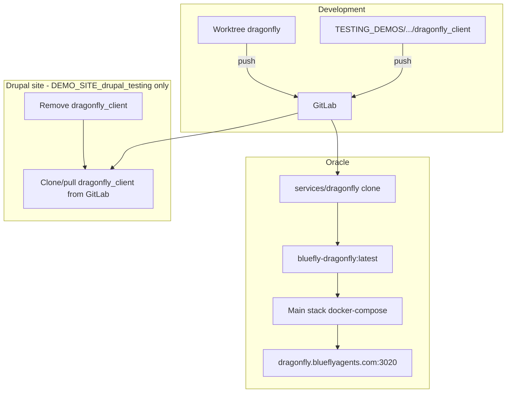

<!-- bf3320bf-99f5-4c3c-852e-9b1bdab83b97 -->
# Dragonfly + dragonfly_client + Oracle: full audit and plan

## Ownership

- **Dragonfly (Node):** you own the service, API, and runbooks.
- **dragonfly_client (Drupal):** you own the module; all Drupal work happens only in **TESTING_DEMOS/DEMO_SITE_drupal_testing**.
- **Oracle infra:** you own how Dragonfly is deployed, tunneled, and verified.

---

## 1. Canonical paths and workflow

| Component | Canonical path | GitLab | Branch |
|-----------|----------------|--------|--------|
| Dragonfly Node | `$HOME/Sites/blueflyio/worktrees/dragonfly` | blueflyio/agent-platform/services/dragonfly | release/v0.1.x (default); deploy uses `main` |
| dragonfly_client | **Only** `TESTING_DEMOS/DEMO_SITE_drupal_testing/web/modules/custom/dragonfly_client` | blueflyio/agent-platform/drupal/dragonfly_client | release/v0.1.x |
| Oracle deploy | `/opt/agent-platform/services/dragonfly` (clone); main stack at `/opt/agent-platform/docker-compose.yml` | — | — |

**Drupal-only rule:** All edits to dragonfly_client (and any other custom Drupal code for this stack) must be done under **`/Users/flux423/Sites/blueflyio/TESTING_DEMOS/DEMO_SITE_drupal_testing`**. No Drupal development under WORKING_DEMOs or other sites for this ownership set.

**Update workflow (worktrees → Drupal site):**

1. **Develop in worktree** (or directly under TESTING_DEMOS if that directory is the only copy you use for dragonfly_client).
2. **Push to GitLab** from the worktree (or from `TESTING_DEMOS/.../dragonfly_client` if that is the git repo).
3. **In the Drupal site** (`TESTING_DEMOS/DEMO_SITE_drupal_testing`): **remove** the existing `web/modules/custom/dragonfly_client` directory, then **pull down** the module again (clone from GitLab or pull if the site’s copy is a separate clone). That way the demo site always consumes the pushed state from GitLab after you push from the worktree.

---

## 2. Dragonfly (Node) – audit summary

- **Repo:** `worktrees/dragonfly`; GitLab `blueflyio/agent-platform/services/dragonfly`.
- **API:** Express; port 3020; `/health`, `/healthz`, `/readyz`; `/api/dragonfly/v1` and `/api/drupal-test-orchestrator/v1`; POST `/tests/trigger` (projects, testTypes, addons, backend).
- **Phase E:** `src/schemas/phase-e.contract.ts` (TriggerInputSchema, TriggerOutputSchema); `request-id.middleware.ts`; healthz/readyz present.
- **Docker:** Root `Dockerfile` and `docker-compose.yml` (3020:3020); healthcheck uses `/api/drupal-test-orchestrator/v1/health`. Main stack template: `config-templates/docker-compose.agent-platform.yml` (dragonfly service, image `bluefly-dragonfly:latest`).

**Gaps / fixes:**

- **oracle-setup-dragonfly** (`oracle-setup-dragonfly.command.ts`): Clones to `/opt/agent-platform/dragonfly` and uses `docker-compose.oracle-root.yml`. Deploy now uses **main stack** and clone path **`/opt/agent-platform/services/dragonfly`**. Either deprecate the one-shot command or align it to `ORACLE_BASE/services/dragonfly` and the main compose.
- **Branch in deploy:** `oracle.command.ts` uses branch `main` for dragonfly in `MAIN_STACK_IMAGE_BUILDS` (line 322). If the canonical branch is `release/v0.1.x`, change to `release/v0.1.x` for consistency.
- **setup-projects.json:** Entry for dragonfly has `"gitlabPath": "blueflyio/agent-platform/dragonfly"`. Should be **`blueflyio/agent-platform/services/dragonfly`**.
- **Runbook:** Add or update a runbook (e.g. in agent-buildkit wiki) for: first-time Oracle Dragonfly (ensure `services/dragonfly` clone, main stack compose, env), verify `/health`, and repair.

---

## 3. dragonfly_client (Drupal) – audit summary

- **Path (only):** `TESTING_DEMOS/DEMO_SITE_drupal_testing/web/modules/custom/dragonfly_client`.
- **Structure:** 20+ Tool plugins, ECA events/conditions/actions, Blocks, AiAgent (DragonflyOrchestratorAgent), optional DragonflyProvider (alternative_services), submodule **dragonfly_client_orchestration** (orchestration services), http_client_manager (`src/api/dragonfly.json`), config schema, migrations (projects, test_results, agents).
- **Config:** `dragonfly_client.settings` (base_url); portable install (no *.blueflyagents.com in config/install). Configure at `/admin/config/services/dragonfly_client`.
- **Policy:** No .sh; in-repo .md (README, INTEGRATION_GUIDE, etc.) are present; project rules prefer long-form docs in Wiki—leave README for drupal.org, move runbooks/deployment details to Wiki if needed.

**Workflow (push up / remove and pull down):**

- Do all edits under **TESTING_DEMOS/DEMO_SITE_drupal_testing** (in `web/modules/custom/dragonfly_client` or a worktree that you later sync into that path).
- **Push up:** From `dragonfly_client` repo (whether that’s the dir under TESTING_DEMOS or a worktree), commit and push to GitLab (`release/v0.1.x`).
- **Remove and pull down in that Drupal site:** In `TESTING_DEMOS/DEMO_SITE_drupal_testing`, remove `web/modules/custom/dragonfly_client`, then re-add the module by cloning from GitLab (e.g. `git clone -b release/v0.1.x https://gitlab.com/blueflyio/agent-platform/drupal/dragonfly_client.git web/modules/custom/dragonfly_client`) so the site runs the code you just pushed.

---

## 4. Oracle infra – audit summary

- **Tunnel:** agent-docker `k8s/cloudflared-oracle/config-configmap.yaml`: `dragonfly.blueflyagents.com` -> `http://localhost:3020`.
- **Deploy:** `buildkit deploy oracle dragonfly` runs main-stack logic: ensures image `bluefly-dragonfly:latest` by cloning/pulling **`ORACLE_BASE/services/dragonfly`** (branch `main` in code), then `docker compose up` at `ORACLE_BASE` using `config-templates/docker-compose.agent-platform.yml` (synced to Oracle as `docker-compose.yml`).
- **Verify:** `oracle-domains.config.ts`: `dragonfly.blueflyagents.com` port 3020 path `/health` serviceId `dragonfly`. Correct.
- **Env:** Oracle uses `/opt/agent-platform/.env` (env-sync from platform .env.local); compose passes PORT, DATABASE_URL, REDIS_URL, etc. for dragonfly service.

**Fixes:**

- Unify Dragonfly clone path everywhere to **`/opt/agent-platform/services/dragonfly`** and main stack; document that `oracle-setup-dragonfly` is legacy unless updated.
- Ensure deploy branch for Dragonfly matches project policy (e.g. `release/v0.1.x` in `oracle.command.ts` MAIN_STACK_IMAGE_BUILDS for dragonfly).

---

## 5. Implementation todos

| Id | Task |
|----|------|
| sod-path | Document in plan/wiki: all Drupal work for this stack only in TESTING_DEMOS/DEMO_SITE_drupal_testing; workflow = push from worktree/repo then remove and pull down dragonfly_client in that site. |
| workflow-doc | Add to dragonfly_client AGENTS.md or Wiki: “Push up from worktree; in DEMO_SITE_drupal_testing remove web/modules/custom/dragonfly_client and clone/pull from GitLab to get updates.” |
| deploy-branch | In agent-buildkit `oracle.command.ts`, change dragonfly branch in MAIN_STACK_IMAGE_BUILDS from `main` to `release/v0.1.x` (or document why main is required). |
| setup-projects | In agent-buildkit `config-templates/setup-projects.json`, fix dragonfly gitlabPath to `blueflyio/agent-platform/services/dragonfly`. |
| oracle-setup | Deprecate or update `oracle-setup-dragonfly` to use path `ORACLE_BASE/services/dragonfly` and main stack; add comment in command that deploy oracle dragonfly uses main stack. |
| runbook | Add/update agent-buildkit wiki runbook: Dragonfly on Oracle (clone path, compose, env, health check, repair). |

---

## 6. Diagram: end-to-end

---

## 7. Summary

- **Drupal:** All work only in **`/Users/flux423/Sites/blueflyio/TESTING_DEMOS/DEMO_SITE_drupal_testing`**. Update flow: **push up** from worktree (or that repo), then **remove and pull down** `dragonfly_client` in that Drupal site so it runs the pushed code.
- **Dragonfly Node:** Align deploy path and branch (services/dragonfly, release/v0.1.x), fix setup-projects and oracle-setup-dragonfly references, add runbook.
- **Oracle:** Single path (`/opt/agent-platform/services/dragonfly`), main stack compose, tunnel and verify already correct.
