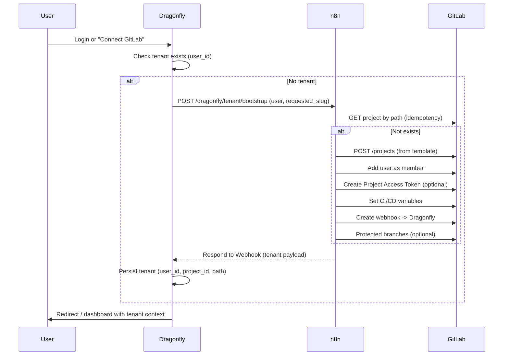

<!-- f6dc8169-af57-459e-a0d7-b65882589da1 -->
# n8n Tenant Bootstrap for Dragonfly SaaS (Open-Core + Premium)

## Open-core vs premium (mandatory separation)

| Aspect | Open-core (self-hosted) | Premium (dragonfly.blueflyagents.com) |
|--------|--------------------------|----------------------------------------|
| **Trigger** | Same: first login or "Connect GitLab" calls n8n webhook | Same |
| **n8n** | Self-hoster's n8n instance | Our n8n at n8n.blueflyagents.com (Oracle) |
| **GitLab** | Self-hoster's GitLab (host + group) | Our GitLab (gitlab.com, group blueflyio) |
| **Template** | Self-hoster provides their own template project | Our tenant template (Dragonfly CI, optional Agents) |
| **Namespace** | Self-hoster's group (e.g. `myorg/tenants`) | `blueflyio/tenants` or `blueflyio/agent-platform/agentmarketplace/tenant-projects` |
| **Tokens** | Group Access Token (or PAT) they create | Our Group Access Token (service account); stored in n8n credentials |
| **Webhook back to Dragonfly** | Their Dragonfly URL + per-tenant secret | https://dragonfly.blueflyagents.com/.../webhooks/gitlab + secret in CI vars |
| **CI / Agents** | Their .gitlab-ci.yml (any) | Our golden CI (gitlab_components), optional GitLab Kubernetes Agent + External Agents in Docker (premium differentiator) |
| **Workspaces / Duo** | N/A or their config | Premium: link tenant project to GitLab Workspaces + Duo External Agent |

**Deliverables**: One n8n workflow definition that is **parameterized** (GitLab host, namespace_id, template_project_id, Dragonfly base URL). Open-core: doc + example env; Premium: our values in n8n credentials and env.

---

## Architecture (high level)



---

## 1. Dragonfly backend changes

**1.1 Tenant persistence (new)**

- **Schema**: Add table `tenants` (e.g. in `database.service.ts`):
  - `user_id` (string, FK to "user" identity; today auth is env-based so `user_id` = `AuthUser.id`)
  - `gitlab_project_id` (integer)
  - `gitlab_project_path` (string)
  - `gitlab_project_url` (string)
  - `mode` (`saas` | `selfhost`)
  - `n8n_execution_id` (string, optional, for audit)
  - `created_at`, `updated_at`
- **APIs** (behind auth):
  - `GET /api/drupal-test-orchestrator/v1/tenant` (or `/me/tenant`) — return current user's tenant if any.
  - Used by dashboard to show "Your workspace" and link to GitLab project.

**1.2 Trigger: when to call n8n**

- **Option A (recommended for MVP)**: Explicit "Connect GitLab" or "Provision workspace" action in the dashboard (button). User clicks → Dragonfly checks if tenant exists for `req.session.user.id`; if not, call n8n webhook (see 2.1), then persist and return tenant.
- **Option B**: On first successful login (post-login middleware or auth route): same check + call n8n if no tenant. Risk: every first login triggers provisioning; ensure idempotency and rate limit.
- **Option C**: Hybrid: on first login redirect to "Set up your workspace" page with one-click "Provision"; after success redirect to dashboard.

**1.3 Call n8n**

- **URL**: From env `N8N_TENANT_BOOTSTRAP_WEBHOOK_URL` (e.g. `https://n8n.blueflyagents.com/webhook/dragonfly/tenant/bootstrap`) or `N8N_BASE_URL` + path.
- **Auth**: Header (e.g. `Authorization: Bearer <N8N_TENANT_BOOTSTRAP_SECRET>` or `X-Dragonfly-Secret: <secret>`). Stored in Dragonfly env and in n8n (Webhook node "Header Auth").
- **Payload** (to n8n):

```json
{
  "event": "tenant.bootstrap",
  "user": {
    "id": "<AuthUser.id>",
    "email": "<email>",
    "username": "<slug from email or requested>",
    "gitlab_user_id": null
  },
  "mode": "saas",
  "requested_slug": "<username-slug>"
}
```

- **Note**: Today Dragonfly auth has no `gitlab_user_id`. For "Add user as member" (GitLab), either:
  - **Premium**: Require "Connect GitLab" first (OAuth) and store GitLab user id in session/DB; or invite by email via GitLab API; or skip "add member" and use Project Access Token only for CI.
  - **Open-core**: Same choices; document that self-hosters can use a mapping (email → GitLab user id) or invite-by-email.

**1.4 Response from n8n**

- Synchronous: n8n Webhook node "Respond to Webhook" returns JSON. Dragonfly parses it and persists tenant.
- **Contract** (from your base plan):

```json
{
  "status": "ok",
  "tenant": {
    "gitlab_project_id": 999,
    "gitlab_project_path": "blueflyio/tenants/thomas",
    "gitlab_project_url": "https://gitlab.com/blueflyio/tenants/thomas",
    "credentials": {
      "project_access_token_ref": "n8n://credentials/...",
      "webhook_secret_ref": "n8n://..."
    }
  }
}
```

- Dragonfly stores `gitlab_project_id`, `gitlab_project_path`, `gitlab_project_url`; never store raw tokens. Credential refs stay in n8n only.

**1.5 Register tenant project in Dragonfly for testing (optional)**

- After bootstrap, Dragonfly can auto-register the new GitLab project as a "project" (in `projects` table) so push/MR webhooks from that repo trigger tests. Or leave it to user to "Add project" in UI with their repo URL (tenant repo URL pre-filled). Recommendation: Premium can auto-register tenant repo; open-core doc says "add your repo in Dragonfly if you want tests."

---

## 2. n8n workflow (node-by-node)

**Workflow name**: `Dragonfly - Tenant Bootstrap (GitLab Project Provisioning)`

**Credentials (n8n)**  
- **GitLab Provisioner**: HTTP Header Auth or GitLab OAuth with Group Access Token (scopes: `api`, `read_api`). Value from platform `.env.local` → store once in n8n Credentials (no secrets in workflow JSON).  
- **Dragonfly Callback Secret**: Used to validate incoming webhook (Header Auth). Same as `N8N_TENANT_BOOTSTRAP_SECRET` in Dragonfly.

**Config (n8n workflow variables or env)**  
- `GITLAB_HOST` (e.g. `https://gitlab.com`)  
- `GITLAB_NAMESPACE_ID` (group id for tenants, e.g. blueflyio/tenants)  
- `TEMPLATE_PROJECT_ID` (template project id)  
- `DRAGONFLY_BASE_URL` (e.g. `https://dragonfly.blueflyagents.com`)  
- `DRAGONFLY_WEBHOOK_PATH` (e.g. `/api/drupal-test-orchestrator/v1/webhooks/gitlab`)

**Nodes (ordered)**

1. **Webhook Trigger**  
   - Path: `/webhook/dragonfly/tenant/bootstrap` (or `/dragonfly/tenant/bootstrap` per n8n version).  
   - Auth: Header (e.g. `X-Dragonfly-Secret` or `Authorization: Bearer`).  
   - Validate body: `event`, `user`, `user.email`, `requested_slug` or `user.username`.

2. **Function: Normalize slug**  
   - `tenant_slug = slugify(requested_slug || username from email)` (lowercase, replace non-alphanumeric with `-`, max length).  
   - Reserved words: e.g. `admin`, `api`, `tenants`.  
   - Output: `tenant_slug`, `project_path` = `{namespace_path}/{tenant_slug}` (e.g. `blueflyio/tenants/thomas`).

3. **HTTP Request: Check if project exists**  
   - `GET {{ $env.GITLAB_HOST }}/api/v4/projects?search={{ project_path }}` (or search by path_with_namespace).  
   - Use GitLab credential.  
   - If project found → go to "Return existing tenant" (Node 10).

4. **HTTP Request: Create project from template**  
   - `POST {{ $env.GITLAB_HOST }}/api/v4/projects`  
   - Body: `name`, `path` (tenant_slug), `namespace_id`, `template_project_id` (or `template_name` if using GitLab template), `visibility: private`, `default_branch: main`.  
   - GitLab API: "Create from template" may be `POST /projects` with `template_project_id` or a dedicated endpoint; confirm with your GitLab version.

5. **HTTP Request: Add user as member**  
   - `POST /api/v4/projects/:id/members` with `user_id` (if we have gitlab_user_id) and `access_level` (e.g. 40 = Maintainer).  
   - If no GitLab user id: skip or use "Invite by email" (GitLab API). Premium: optional "Connect GitLab" OAuth later to attach gitlab_user_id.

6. **HTTP Request: Create Project Access Token**  
   - GitLab 15.7+: Project Access Tokens (scopes: api, read_repository, write_repository). Create token, store in n8n credential store (or external secret backend), do not return in response. Return only a reference (e.g. credential id) in response if Dragonfly needs to reference it.

7. **HTTP Request: Set CI/CD variables**  
   - `POST /api/v4/projects/:id/variables` for:  
     - `DRAGONFLY_TENANT_ID`, `DRAGONFLY_API_BASE`, `DRAGONFLY_WEBHOOK_SECRET` (per-tenant webhook secret for Dragonfly).  
     - Optional: `NPM_TOKEN` / `GITLAB_REGISTRY_NPM_TOKEN`, runner/agent vars (Premium).

8. **HTTP Request: Create webhook to Dragonfly**  
   - `POST /api/v4/projects/:id/hooks`  
   - URL: `{{ DRAGONFLY_BASE_URL }}{{ DRAGONFLY_WEBHOOK_PATH }}`  
   - Secret token: same per-tenant webhook secret (so Dragonfly can validate per-tenant).  
   - Events: `push`, `merge_request` (and `pipeline` if needed).

9. **HTTP Request: Apply hardening (optional)**  
   - Protected branches (e.g. main), required approvals (Premium policy).

10. **Respond to Webhook**  
    - Return `{ status: "ok", tenant: { gitlab_project_id, gitlab_project_path, gitlab_project_url, credentials: { refs only } } }`.  
    - On "existing tenant" path (Node 3 branch), return same shape with existing project id/path.

**Error handling**  
- Any step fails → Respond with `{ status: "error", message: "..." }` and (optional) mark tenant as `provisioning_failed` if Dragonfly persists that.  
- Idempotency: if project exists, reconcile (ensure webhook + vars exist) then return existing tenant.

---

## 3. GitLab: template and namespace

**3.1 Tenant template project (Premium)**

- Create or reuse a GitLab project as template, e.g. under `blueflyio/agent-platform/agentmarketplace/tenant-template` or `blueflyio/tenants/template`.  
- Contents (minimal):  
  - `.gitlab-ci.yml` that includes platform CI (e.g. gitlab_components) and Dragonfly test trigger (optional).  
  - `.agents/` stub (if OSSA).  
  - README with "Your Dragonfly workspace".  
- **Premium differentiator**: Add jobs that use GitLab Kubernetes Agent and/or External Agents (Docker) for AI-assisted CI (e.g. Duo, or our orchestrator). Document in template README.

**3.2 Namespace for tenant projects**

- Create group (e.g. `blueflyio/tenants`) or use existing (e.g. `blueflyio/agent-platform/agentmarketplace/tenant-projects`).  
- Group Access Token (service account): create with scopes `api`, `read_api`; store in n8n credentials.  
- Open-core: self-hosters create their own group and token.

**3.3 Template project id**

- From GitLab: Project Settings → General → Project ID.  
- Put in n8n config (workflow variable or credential metadata).

---

## 4. Credentials and config placement

| What | Where | Notes |
|------|--------|--------|
| n8n webhook URL (Dragonfly calls n8n) | Dragonfly env: `N8N_TENANT_BOOTSTRAP_WEBHOOK_URL`, `N8N_TENANT_BOOTSTRAP_SECRET` | NAS/Oracle .env.local |
| GitLab Group Access Token | n8n Credentials (GitLab or HTTP Header) | From .env.local once, then in n8n only |
| Dragonfly webhook secret (per tenant) | Generated in n8n (Function node crypto), stored in GitLab CI vars + n8n credential store ref | Never in Dragonfly DB |
| n8n admin / MCP | .env.local: N8N_MCP_TOKEN, n8n admin login (thomas.scola@bluefly.io) | Per AGENTS.md |

---

## 5. Dragonfly dashboard (UI)

- **"Connect GitLab" or "Provision workspace"**: Button (e.g. on dashboard or /admin). Calls Dragonfly `POST /api/drupal-test-orchestrator/v1/tenant/bootstrap` (new) or similar. Backend calls n8n, persists tenant, returns project URL and link to GitLab.  
- **Show tenant**: If tenant exists, show "Your workspace: [link to GitLab project]", "Add this repo to Dragonfly for testing" (optional).  
- **Open-core**: Same UI; backend uses self-hoster's n8n URL and their template/namespace.

---

## 6. Premium-only features (summary)

- **Our template**: Dragonfly CI + optional GitLab Agents / External Agents in Docker in CI.  
- **Our namespace and token**: blueflyio/tenants, our Group Access Token.  
- **Workspaces / Duo**: Link tenant project to GitLab Workspaces; Duo External Agent webhook for that project (or group).  
- **Auto-register tenant repo** in Dragonfly for push/MR tests (optional).  
- **Audit and rate limit**: Our n8n + Dragonfly; self-hosters get same logic but their own limits.

---

## 7. Implementation order

1. **Dragonfly**: Tenants table + `GET /tenant` (or `/me/tenant`) + `POST /tenant/bootstrap` (calls n8n, persists, returns). Use "Connect GitLab" button first (no auto-trigger on login).  
2. **GitLab**: Create tenant template project and group (e.g. blueflyio/tenants); create Group Access Token; document template_project_id and namespace_id.  
3. **n8n**: Implement workflow (Webhook → slug → check exists → create → add member → CI vars → webhook → respond). Use credentials for GitLab; config for GITLAB_HOST, NAMESPACE_ID, TEMPLATE_PROJECT_ID, DRAGONFLY_BASE_URL.  
4. **Wire Dragonfly ↔ n8n**: Set N8N_TENANT_BOOTSTRAP_WEBHOOK_URL and secret in Dragonfly (NAS/Oracle .env.local); test end-to-end.  
5. **Dashboard**: "Connect GitLab" button and tenant display.  
6. **Premium**: Add to template .gitlab-ci.yml (Agents/External Agents), Workspaces/Duo docs; keep open-core workflow parameterized and documented.

---

## 8. Values you need to provide (for exact node configs)

- **GitLab host**: `https://gitlab.com` (assumed).  
- **Target namespace id**: From GitLab group `blueflyio/tenants` (or chosen path) — Group Settings → General → Group ID.  
- **Template project id**: After creating tenant template project — Project Settings → General → Project ID.  
- **Dragonfly webhook path**: `https://dragonfly.blueflyagents.com/api/drupal-test-orchestrator/v1/webhooks/gitlab`.  
- **n8n webhook base**: `https://n8n.blueflyagents.com` (production); path e.g. `/webhook/dragonfly/tenant/bootstrap` (n8n Webhook node path).

Once these are set, the exact HTTP Request node bodies and URLs can be filled in the n8n workflow JSON. Open-core: document the same node list and parameters so self-hosters plug their host, namespace_id, template_project_id, and Dragonfly URL.
