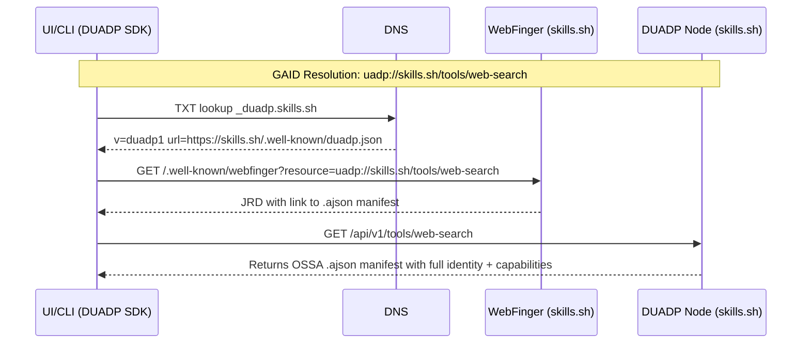

# OSSA + DUADP Ecosystem Architecture

**Last Updated:** March 8, 2026
**OSSA Version:** v0.4.8 (v0.5.0 releasing March 9)
**DUADP Version:** v0.2.0

---

## The Six Pillars

### 1. `openstandardagents` — Core CLI & Validation

**Package:** `@bluefly/openstandardagents` v0.4.8 (npm, public)
**Repository:** https://gitlab.com/blueflyio/ossa/openstandardagents

The foundational layer — the "compiler" that translates one agent manifest into many platform deployments:

- **Validation**: Dual-engine validation — AJV (JSON Schema) + Zod (runtime type-safe) with per-platform validators for 22+ targets
- **CLI**: 45+ commands including `ossa wizard`, `ossa validate`, `ossa export`, `ossa build`, `ossa deploy`, `ossa conformance`, `ossa compliance`
- **Export Adapters**: 22+ platform targets — LangChain, CrewAI, OpenAI, Anthropic, Cursor, Claude Code, Claude Agent SDK, Docker, Kubernetes (kagent), Drupal, Symfony, Vercel AI, AutoGen, Semantic Kernel (.NET), LangGraph, LlamaIndex, and more
- **Agent Mesh**: A2A communication layer with service discovery, circuit breakers, load balancing
- **Schema**: 1,567-line JSON Schema (Kubernetes-style `apiVersion/kind/metadata/spec` pattern)
- **Architecture**: InversifyJS dependency injection with 50+ injectable services
- **Migration**: Automated upgrade from legacy formats with git rollback on failure

### 2. `duadp` — Decentralized Universal Agent Discovery Protocol

**Package:** `@bluefly/duadp` v0.2.0 (npm, public)
**Repository:** https://gitlab.com/blueflyio/ossa/duadp
**Website:** https://duadp.org
**Reference Node:** https://discover.duadp.org

The network transport layer — while OSSA defines the *format* of an agent, DUADP defines how to *discover and distribute* them across a federated network.

**The Problem:** The AI agent ecosystem risks centralizing around walled-garden registries (GPT Store: 3M+ agents but OpenAI-locked, Salesforce AgentExchange: Salesforce-only, Google Agentspace: proprietary). 10+ competing marketplaces with different standards. BCG calculates integration complexity rises **quadratically** without standards.

**The Solution:** DUADP applies proven federated architecture patterns (email/SMTP, Mastodon/ActivityPub, Bluesky/AT Protocol) to AI agent discovery.

**Three-Tier Discovery:**

1. **DNS TXT Records** (`_duadp.<domain>`) — Zero-configuration bootstrap. Single TXT record: `v=duadp1 url=https://...`. Works with every domain on the internet.
2. **WebFinger Resolution** (`/.well-known/webfinger`) — Cross-domain GAID lookup. Query `uadp://skills.sh/tools/web-search` → returns links to .ajson manifest, A2A Agent Card, MCP server manifest simultaneously.
3. **Gossip Federation** — Epidemic protocol propagates discovery information between nodes. O(log N) convergence, configurable max_hops, circuit breakers for peer failure resilience.

**Identity & Trust:**
- **W3C DID** (`did:web` + `did:key`) via DIF standard resolvers
- **Ed25519 signatures** with RFC 8785 canonical JSON for deterministic verification
- **5-tier trust model**: official → verified-signature → signed → community → experimental
- **Full identity verification chain**: DID presence → resolution → signature → lifecycle status

**SDKs:** TypeScript, Python, Go — 136 passing tests across 7 test suites

**Advanced Features:**
- Multi-agent delegation with context transfer, budget constraints, depth limits
- Orchestration plans (DAG/parallel/sequential/adaptive execution)
- 360-degree feedback system (humans, agents, systems, automated tests)
- Reputation system with badges and trend analysis
- Outcome attestations (signed, verifiable task records)
- Token analytics per-execution + aggregate cost tracking
- Cedar authorization policies as first-class DUADP resources
- NIST AI RMF governance declarations built in

### Deep Dive: DUADP vs HTTP

| Aspect | HTTP | DUADP |
|--------|------|-------|
| **Purpose** | State transfer of documents | State transfer of capabilities and semantic intent |
| **URL meaning** | Direct execution endpoint | Discovery pointer — resolve first, then invoke |
| **Contract** | Out-of-band (OpenAPI portal for humans) | In-band (.ajson carries machine-readable contract) |
| **Identity** | None (server identity only) | DID-based with cryptographic proof per-resource |
| **Registry** | Centralized (npm, PyPI) | Federated gossip — no single point of failure |
| **Trust** | TLS certificate only | 5-tier trust model with attestations and reputation |

### What Makes `.ajson` Different from `.json`

Standard `.json` is a generic serialization format with zero inherent meaning. `.ajson` (Agent JSON) is a semantic contract aligned with OSSA v0.4+ spec:

- **Cryptographic Provenance:** `did:web` or `did:key` identity of the creator
- **Tool/Protocol Binding:** Declares exactly which MCP servers, OpenAPI endpoints, or A2A capabilities required
- **LLM Context & Alignment:** System prompts, model constraints, token limits, Cedar policies
- **Cross-Compilable:** Any orchestrator can take `.ajson` and generate LangChain Python, Docker container, Go binary, or Kubernetes CRD

### 3. `openstandard-ui` & `studio-ui` — User Interfaces

**Package:** `@bluefly/openstandard-ui` v0.3.5
**Live:** https://openstandardagents.org

Frontend applications for the ecosystem:
- **DUADP Catalog**: Uses `@bluefly/duadp` SDK to fetch agents, skills, and tools from federated nodes
- **Agent Builder**: 5 modes — Quick, Wizard (9-step), Visual (React Flow), FlowDrop (Svelte), Transform (YAML→code)
- **Export Triggers**: "Build" button POSTs manifest to deployment pipeline (GitLab CI on project 79780429)

> These UIs are **example consumers**. Because DUADP and OSSA are language-agnostic, any application — PHP/Drupal, Python/FastAPI, Go, Node.js — can consume, compose, or publish on the federated network.

### 4. `openstandard-generated-agents` — Deployment Pipeline

**Repository:** https://gitlab.com/blueflyio/ossa/openstandard-generated-agents

The execution infrastructure — a GitLab CI pipeline that receives manifests and produces deployable agents:

1. **Accept** — Decode base64-encoded OSSA manifest
2. **Validate** — `ossa validate` against JSON Schema
3. **Export** — `ossa export` for each requested platform (Docker, LangChain, etc.)
4. **Evaluate** — Score manifest quality (spam/quality gate, minimum 75+)
5. **Gate** — Verify score threshold and export output exist
6. **Persist** — Commit validated exports to `.agents/<agent-name>/exports/<platform>/`

### 5. `openstandardagents.org` — Governance & Documentation Hub

**Live:** https://openstandardagents.org

- **Specification**: Hosts JSON Schema files, OpenAPI definitions, DUADP protocol docs
- **NIST Response**: Full RFI response at `/docs/government/nist-caisi-rfi-response`
- **Seed Node**: Acts as a trusted DUADP seed node for the federation
- **Builder**: Interactive agent creation at `/builder`

### 6. `marketplace` — Drupal Registry Node

**Live:** https://marketplace.blueflyagents.com

Production-grade Drupal implementation of a DUADP registry:
- Leverages Drupal's entity system for agent versioning and syndication
- Serves as primary publishing target for enterprise teams
- Exposes DUADP HTTP endpoints for consumers
- Proves that any CMS/backend can be a fully-fledged DUADP node

---

## Live Infrastructure (Oracle Cloud + Cloudflare Tunnels)

### Registries & Repositories

| Service | Endpoint | Purpose |
|---------|----------|---------|
| agents.blueflyagents.com | Core DUADP registry | Agent catalog and identity records |
| skills.blueflyagents.com | Skills registry | Domain-specific skills index |
| toolbox.blueflyagents.com | Tools hub | Standalone tools for dynamic injection into agents |
| plugins.blueflyagents.com | Plugin registry | Ecosystem extensions for agent runtimes |
| mcp.blueflyagents.com | MCP aggregator | Active MCP servers providing context |
| discover.duadp.org | Reference node | DUADP conformance reference (5 skills, 3 agents, 3 tools) |

### Communication & Orchestration

| Service | Endpoint | Purpose |
|---------|----------|---------|
| router.blueflyagents.com | Semantic router | Intent-based task routing to optimal agent |
| mesh.blueflyagents.com | Agent mesh | P2P discovery, handoffs, networking |
| workflow.blueflyagents.com | Workflow engine | Deterministic multi-step agent pipelines |
| orchestrator.blueflyagents.com | Swarm coordinator | Complex prompt decomposition into sub-tasks |
| a2a-collector.blueflyagents.com | A2A telemetry | Agent-to-Agent protocol event collection |
| a2a-stream.blueflyagents.com | A2A streaming | WebSocket/SSE for real-time agent communication |

### Governance, Storage & Tooling

| Service | Endpoint | Purpose |
|---------|----------|---------|
| compliance.blueflyagents.com | Cedar engine | 135 Cedar policies, NIST control evaluation |
| brain.blueflyagents.com | Vector DB (Qdrant) | Semantic long-term memory for agent mesh |
| intel.blueflyagents.com | Knowledge graph | Insights from historical agent execution |
| tracer.blueflyagents.com | OTel tracing | Cross-agent task lifecycle tracing |
| content-guardian.blueflyagents.com | Safety filters | PII detection, injection scanning, hallucination checks |
| api.blueflyagents.com | API gateway | Rate limiting, auth, traffic routing |

---

## Ecosystem Interaction Flow

```mermaid
sequenceDiagram
    participant User as User / Developer
    participant UI as openstandardagents.org (Builder)
    participant Registry as DUADP Registry (marketplace)
    participant CLI as OSSA CLI (@bluefly/openstandardagents)
    participant CI as GitLab CI (generated-agents)
    participant Cedar as Compliance Engine (Cedar)

    %% 1. Discovery Phase
    rect rgb(20, 40, 60)
    Note over User,Registry: 1. Federated Discovery via DUADP
    User->>UI: Search for agent capabilities
    UI->>Registry: GET /.well-known/webfinger?resource=uadp://agents.blueflyagents.com/analyst
    Registry-->>UI: JRD+JSON (Link to .ajson manifest)
    UI->>Registry: GET /api/v1/agents/analyst
    Registry-->>UI: Returns OSSA .ajson manifest
    end

    %% 2. Composition Phase
    rect rgb(20, 60, 40)
    Note over User,CLI: 2. Create / Modify Agent
    User->>UI: Use Builder (wizard/visual/transform)
    UI->>CLI: Validate manifest against OSSA v0.4 schema
    CLI-->>UI: ValidationResult (valid + warnings)
    UI->>Cedar: Check Cedar policy compliance
    Cedar-->>UI: Authorization decision (ALLOW/DENY)
    end

    %% 3. Deployment Phase
    rect rgb(60, 20, 40)
    Note over UI,CI: 3. Build & Deploy
    User->>UI: Click "Build"
    UI->>CI: POST /export (Base64 manifest + target platforms)
    CI->>CLI: npx @bluefly/openstandardagents export --platform langchain,docker,kagent
    CLI-->>CI: Generated platform-specific code + configs
    CI->>CI: Quality scoring (threshold: 75+)
    CI->>CI: Commit to .agents/<name>/exports/<platform>/
    CI-->>User: Build complete — artifacts persisted
    end
```

---

## Migration History

| Date | Change |
|------|--------|
| 2025 Q3 | OSSA v0.2 — initial schema, basic validation |
| 2025 Q4 | OSSA v0.3 — added security, autonomy, constraints sections |
| 2026 Jan | OSSA v0.4 — Kubernetes-style apiVersion/kind/metadata/spec, Cedar integration, DUADP protocol |
| 2026 Jan | Legacy `agent://` URIs transitioned to `uadp://` across all repos |
| 2026 Feb | DUADP v0.2.0 — full federation, gossip protocol, 3 language SDKs |
| 2026 Feb | UI terminology unified: "OSSA Nodes" → "DUADP Nodes", "Marketplace Nodes" → "DUADP Registries" |
| 2026 Mar | OSSA v0.4.8 — 22+ export adapters, 45+ CLI commands, 136 DUADP tests |
| 2026 Mar 9 | OSSA v0.5.0 release planned — cognition patterns, enhanced security posture |
