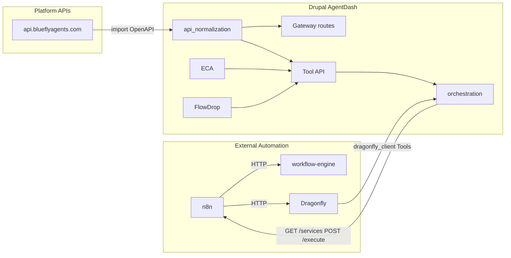

<!-- 0a794af7-6209-4bce-9406-97477c355eab -->
# AgentDash Full Native Integration and Community Showcase

## Alignment with other plans

This plan stays consistent with the following; no conflicting workflows or ownership.

- **Feature-merge-release-validate workflow** (`Feature-merge-release-validate workflow-a2f4f003.plan.md`): Merge feature into release **locally**, run **local validation** (e.g. `ddev composer validate`, `drush cr`, or project build/test) in that repo, then push. Use `buildkit drupal sync-all` for Drupal + applications; no rebase, no force push. Phase 1 below follows this.
- **Merge to release and main** (`Merge to release and main-540db5c6.plan.md`): After release is pushed, MR release -> main is a separate step (`buildkit gitlab mr release-to-main`). This plan does not merge to main; it only gets to "release merged and pushed."
- **Dragonfly audit / open-core / SaaS / full audit** (`Dragonfly audit and open-core plan-f6dc8169.plan.md`, `Dragonfly full audit and plan-bf3320bf.plan.md`, `Dragonfly SaaS platform plan-f6dc8169.plan.md`): Dragonfly (Node) and dragonfly_client (Drupal) are owned there. **dragonfly_client** development is in **TESTING_DEMOs**; WORKING_DEMOs (e.g. Drupal_AgentDash) consume via Composer. This plan uses existing dragonfly_client Tools and **dragonfly_client_orchestration**; it does not change Dragonfly or dragonfly_client code. n8n workflows here are "GitLab -> Drupal orchestration -> Dragonfly trigger" (run tests), not tenant bootstrap.
- **n8n Tenant Bootstrap Dragonfly SaaS** (`n8n Tenant Bootstrap Dragonfly SaaS-f6dc8169.plan.md`): That plan is for **tenant provisioning** (n8n creates GitLab project from template, webhook back to Dragonfly). This plan's n8n flows are **orchestration showcase** (call Drupal `/orchestration/service/execute` and/or workflow-engine). Both coexist; document which is which in the wiki.
- **Oracle Deploy BuildKit Standardization** (`Oracle Deploy BuildKit Standardization-0d408385.plan.md`): Deploy uses `buildkit deploy oracle <service>`. Use production URLs (dragonfly.blueflyagents.com, workflow.blueflyagents.com, api.blueflyagents.com) from platform config in runbooks and config.
- **GitLab CI Tools Integration** (`GitLab CI Tools Integration-a2f4f003.plan.md`): BuildKit is the primary CI tool. This plan does not add new CI jobs; it adds runbooks and optional validation before merge-release.
- **OSSA five repos / OSSA UI / OSSA repos** (`OSSA five repos release v04x and CI patch-6ba5dd73.plan.md`, etc.): AgentDash does not own OSSA repos. Use api_normalization + orchestration; do not duplicate OSSA logic in Drupal.
- **Own Kagent End-to-End** (`Own Kagent End-to-End-03aec4eb.plan.md`): Kagent (ai_agents_kagent) and its orchestration/FlowDrop are covered there. This plan does not add Kagent; if AgentDash later enables ai_agents_kagent, use that plan for kagent orchestration.
- **Playwright E2E ownership** (`Playwright E2E ownership and integration-03aec4eb.plan.md`): E2E/Playwright is owned there and by Dragonfly (testTypes include playwright). This plan's dragonfly_client:trigger_test can pass `testTypes: ['playwright']`; no change to Playwright ownership.
- **Clone iac wiki to Wikis** (`Clone iac wiki to Wikis-7e932ab1.plan.md`): Wikis live at `/Volumes/AgentPlatform/applications/Wikis` (or NAS); runbooks from this plan go to **GitLab Wiki** (e.g. agent-buildkit or technical-docs), not new .md in repo roots.

---

## Reference: drupal/orchestration

[drupal/orchestration](https://www.drupal.org/project/orchestration) exposes Drupal Tool plugins, AI agents, and ECA workflows to external automation (Activepieces today; n8n, Zapier desired). Two-way: external platforms invoke Drupal (run workflows, execute AI agents) and Drupal reacts to events. Ecosystem: [Tool API](https://www.drupal.org/project/tool), [AI](https://www.drupal.org/project/ai), [AI Agents](https://www.drupal.org/project/ai_agents), [ECA](https://www.drupal.org/project/eca). Our custom modules already implement `ServicesProviderInterface` and expose Tools via `GET /orchestration/services` and `POST /orchestration/service/execute`; this plan wires them end-to-end with api_normalization and n8n/workflow-engine/Dragonfly.

---

## Current State (Summary)

| Module | Tool plugins | Orchestration provider | FlowDrop | Notes |
|--------|--------------|------------------------|----------|-------|
| api_normalization | Generated from OpenAPI + create_gateway_routes_from_spec | No (gateway is route-based) | No | Import any OpenAPI -> entities + gateway + Tool plugins |
| dragonfly_client | 20+ (trigger test, compliance, rector, memory, etc.) | dragonfly_client_orchestration | No | Full orchestration |
| code_executor | 15+ (execute, DDEV, SubmitToDragonfly, etc.) | code_executor_orchestration | No | Full orchestration |
| alternative_services | 30+ (DDEV, registry, workflow, MCP, skills, router) | No single provider | alternative_services_ddev_flowdrop | Platform import Drush: platform-import, platform-health, platform-routes |
| cedar_policy | Via submodule | cedar_policy_orchestration | No | Full orchestration |
| mcp_registry | GetApiDocs, FleetOrchestrate | mcp_registry_orchestration | mcp_registry_flowdrop (FleetOrchestrate) | Full orchestration |
| ai_agents_client | TriggerDuoAgent, RegisterProtocol, DiscoverAgentServices | ai_agents_client_orchestration | No | Full orchestration |
| external_migration | RunMigration, etc. | No | No | Tools only |
| layout_system_converter | 20+ (migration, vector DB, components) | No | No | Tools only |
| drupal_patch_framework | ApplyPatch, ValidatePatch, etc. | No | No | Tools only |
| agent_registry_consumer | None found | No | No | Consumer only |

Drupal_AgentDash already has in composer: `drupal/orchestration`, `drupal/flowdrop`, `drupal/eca`, `drupal/ai`, `drupal/ai_agents`, `drupal/ai_integration_eca`, `drupal/tool`, etc.

---

## Architecture: One Control Plane

- **api_normalization**: Import https://api.blueflyagents.com/openapi.yaml (or local stub) -> schema `bluefly_platform` -> create gateway routes + optional Tool generation. One-shot: `drush alternative_services:platform-import` (already implemented in alternative_services).
- **Orchestration**: All providers (dragonfly_client, code_executor, cedar_policy, mcp_registry, ai_agents_client) expose their Tool plugins; n8n/Activepieces call `GET /orchestration/services` and `POST /orchestration/service/execute`.
- **ECA / FlowDrop**: Use "Execute Tool" to call any Tool by id (dragonfly_client:trigger_test, code_executor:execute_code, etc.); FlowDrop nodes (DdevTool, FleetOrchestrate) already exist; add generic "Execute Tool" FlowDrop node if missing.
- **n8n**: (1) Webhook from GitLab -> n8n -> HTTP to Drupal `POST /orchestration/service/execute` with id `dragonfly_client:trigger_test` and config. (2) n8n -> HTTP to workflow-engine `POST /api/v1/flows/execute-by-name`. (3) n8n -> Drupal orchestration for Cedar, code run, patch apply, etc.

---

## Phase 1: Repo Sync and Baseline (No New Code)

- **Merge to release and push (aligned with Feature-merge-release-validate workflow)**  
  For each custom module under AgentDash that is a separate git repo (e.g. in `web/modules/custom/*/` with its own `.git`): ensure latest is merged into that repo’s release branch, then push. For the **demo_agentdash** repo (Drupal_AgentDash root): merge any feature branch into `release/v0.1.x`, push, pull so the tree is up to date. Use `buildkit drupal sync-all` (or per-repo `buildkit flow push` / `buildkit repos sync`) from workspace root; no force push, no rebase. **Before pushing release:** run local validation in that repo (e.g. `ddev composer validate`, `drush cr`, or project build/test); only push if it passes. MR release -> main is a separate step per "Merge to release and main" plan; this phase stops at "release merged and pushed."
- **Verify composer and orchestration**  
  In Drupal_AgentDash root: `ddev composer validate` and confirm `drupal/orchestration`, `drupal/flowdrop`, `drupal/tool`, `drupal/eca` are present. Enable all orchestration submodules (dragonfly_client_orchestration, code_executor_orchestration, cedar_policy_orchestration, mcp_registry_orchestration, ai_agents_client_orchestration) so `GET /orchestration/services` lists every provider.

---

## Phase 2: Platform OpenAPI Import and Gateway (One-Shot)

- **Run platform-import**  
  From Drupal_AgentDash root (with api_normalization and alternative_services enabled, and ApiSchemaRegistryService endpoint set to https://api.blueflyagents.com or equivalent): run `ddev drush alternative_services:platform-import` (optionally `--tags='["workflow-engine","dragonfly","compliance"]'` to limit routes). This fetches the aggregated OpenAPI, registers it in api_normalization as `bluefly_platform`, and runs the Tool `api_normalization:create_gateway_routes_from_spec` so platform operations become gateway routes and are callable from Drupal (ECA, FlowDrop, other Tools).
- **Optional: Generate Tool plugins from platform spec**  
  If api_normalization supports generating Tool plugins from an imported schema (ToolPluginGenerator), run the Drush/UI step to generate Tools for key operations (e.g. workflow execute-by-name, dragonfly trigger) so they appear alongside existing Tool plugins and in orchestration if exposed by a provider.
- **Config and health**  
  Ensure config for api_normalization (schema id, base_url) and alternative_services (registry endpoint) is in config sync or install so the same flow works in other environments. Run `ddev drush alternative_services:platform-health` and `alternative_services:platform-routes --limit=20` to verify.

---

## Phase 3: Expose All Tool Domains via Orchestration (Gaps)

- **alternative_services**  
  Add an orchestration `ServicesProvider` that discovers all Tool plugins with id prefix `alternative_services:` (and optionally `alternative_router:`, `alternative_mcp:`, etc. from submodules) and exposes them as orchestration services. Reuse the same pattern as `dragonfly_client_orchestration` and `code_executor_orchestration`: implement `ServicesProviderInterface`, tag `orchestration_services_provider`, return `Service` instances from `getAll()` and execute via ToolManager in `execute()`. No new Tools; only exposure of existing Tools to GET/POST orchestration API.
- **layout_system_converter**  
  Add a submodule `layout_system_converter_orchestration` with a `ServicesProvider` that exposes all `layout_system_converter:*` Tool plugins (DiscoverComponents, ConvertLayout, RunMigrationJob, etc.) so n8n/Activepieces can call them without custom code.
- **drupal_patch_framework**  
  Add a submodule `drupal_patch_framework_orchestration` with a `ServicesProvider` for `drupal_patch_framework:*` Tools (ApplyPatch, ValidatePatch, CreatePatch, etc.).
- **external_migration**  
  Add a submodule `external_migration_orchestration` (or a single provider in external_migration) that exposes `external_migration:*` and related Tool plugins (e.g. RunMigration) to orchestration.
- **api_normalization**  
  Optionally add an orchestration provider that exposes "invoke gateway route" or the generated Tool plugins (e.g. by schema id) so external platforms can call any normalized API operation via orchestration; if the gateway is already callable via ECA/FlowDrop "Execute Tool", a thin provider that lists gateway-backed Tools is enough.

---

## Phase 4: FlowDrop and ECA Wiring

- **FlowDrop**  
  Ensure a generic "Execute Tool" (or "Invoke Tool") FlowDrop node exists so any Tool plugin id can be invoked from a FlowDrop canvas (input: tool_plugin_id, config key-value). If only domain-specific nodes exist (DdevTool, FleetOrchestrate), add a generic one in a shared module (e.g. flowdrop_tool_provider from contrib or a small custom FlowDrop node processor that calls ToolManager). This lets visual flows chain Dragonfly + code_executor + Cedar + MCP + layout_system_converter + patches without custom PHP.
- **ECA**  
  Document or add an ECA action "Execute Tool by id" (or use existing contrib action if any) so ECA models can invoke any Tool by plugin id and config. Ensure ai_integration_eca and tool_ai_connector are in use so AI agents can call these Tools.
- **Event-driven chain**  
  One canonical ECA or FlowDrop flow: on content publish (or form submit), run Cedar check (Tool), then optionally trigger Dragonfly test (Tool), then invoke workflow-engine flow (Tool or gateway). Document this as the "AgentDash native chain" in the wiki.

---

## Phase 5: n8n and Workflow-Engine Showcase

- **n8n workflow: GitLab -> Drupal -> Dragonfly**  
  Create an n8n workflow (stored in n8n or as export in repo/wiki): Webhook (GitLab push/MR) -> HTTP Request to Drupal `POST /orchestration/service/execute` with body `{"id":"dragonfly_client:trigger_test","config":{"project_id":"...","test_types":["phpunit"]}}` (auth per Drupal). Optionally next node: HTTP to workflow-engine `POST /api/v1/flows/execute-by-name` with `{"name":"notify-on-test-done","inputs":{...}}`. This demonstrates Drupal as the control plane and n8n as the orchestrator.
- **n8n workflow: Drupal orchestration catalog**  
  First node: HTTP GET `{DRUPAL_BASE}/orchestration/services` to list all services; use that list to drive subsequent "Execute service" nodes (dragonfly, code_executor, cedar, mcp_registry, ai_agents_client, and after Phase 3: alternative_services, layout_system_converter, drupal_patch_framework, external_migration).
- **Documentation**  
  Publish a short runbook to GitLab Wiki (e.g. agent-buildkit or technical-docs): "AgentDash orchestration and n8n" with the two flows above, required permissions, and how to add new Tools to the catalog. No new .md in repo roots.

---

## Phase 6: Community and Innovation Angles

- **Single idea to highlight**  
  "Any OpenAPI spec -> Drupal entities + gateway + Tool plugins (api_normalization); every Tool -> one orchestration API (drupal/orchestration); n8n/workflow-engine/Dragonfly call Drupal and each other." So: one import gives the whole platform API inside Drupal; one API gives every Drupal capability to n8n/Zapier/Activepieces.
- **Drupal.org / community**  
  Optionally: contribute a short case study or comment on [drupal.org/project/orchestration](https://www.drupal.org/project/orchestration) (or in a blog/wiki) describing use of orchestration with 5+ custom providers (dragonfly, code_executor, cedar, mcp_registry, ai_agents_client) plus api_normalization for platform OpenAPI import, and n8n as the external automation (aligns with their "we'd like n8n" note). No code in Drupal.org issue queue unless maintainers ask; keep narrative in our wiki.
- **Mistral / LLM**  
  If "Minstral" meant Mistral (LLM): AgentDash already has drupal/ai and ai_agents; route LLM through agent-router or existing provider. No separate "Minstral" integration required for this plan; the innovation is the orchestration + api_normalization + n8n + Dragonfly + workflow-engine wiring.

---

## Implementation Order and Constraints

- **Separation of duties**  
  No logic that belongs in another package: e.g. no new MCP server in Drupal (use agent-protocol); no new workflow execution engine (use workflow-engine). Drupal only: Tool plugins, orchestration providers, ECA/FlowDrop, and gateway routes from api_normalization.
- **Contrib-first**  
  Use only drupal/tool, drupal/orchestration, drupal/eca, drupal/flowdrop, api_normalization (our custom but spec-driven), http_client_manager, key. No raw Guzzle for platform calls; use gateway or Tool plugins.
- **Where to edit**  
  Custom module code for AgentDash lives under `WORKING_DEMOs/Drupal_AgentDash/web/modules/custom/`. Per AGENTS.md, long-term custom module development should be in TESTING_DEMOs with sync to demos; for this plan, edits in AgentDash custom modules are acceptable with the understanding that shared changes (e.g. new orchestration provider pattern) may later be synced to TESTING_DEMOs and other demos.
- **No new repos**  
  All work stays in existing repos (demo_agentdash and the custom module repos); only new submodules or new classes within existing modules.

---

## Deliverables Checklist

1. Repos synced: release merged and pushed for Drupal_AgentDash and custom modules; pull latest.
2. Platform-import run and verified (gateway routes + optional Tools from api.blueflyagents.com).
3. All existing orchestration submodules enabled; GET /orchestration/services returns all providers.
4. New orchestration providers (optional but recommended): alternative_services, layout_system_converter, drupal_patch_framework, external_migration.
5. FlowDrop: generic "Execute Tool" node or equivalent so any Tool is callable from FlowDrop.
6. ECA: "Execute Tool by id" action documented or implemented.
7. n8n: at least one documented workflow (GitLab -> Drupal orchestration -> Dragonfly; optional workflow-engine step).
8. Wiki runbook: "AgentDash orchestration and n8n" (and optionally a short "OpenAPI to orchestration" one-pager).

---

## Files and Locations (Key)

- **Platform import**: `alternative_services/src/Commands/PlatformImportCommands.php` (`platform-import`, `platform-health`, `platform-routes`).
- **Orchestration provider pattern**: `dragonfly_client/modules/dragonfly_client_orchestration/src/ServicesProvider.php` or `code_executor/modules/code_executor_orchestration/src/ServicesProvider.php` (copy pattern for new providers).
- **Tool discovery**: `\Drupal\tool\Tool\ToolManager::getDefinitions()`, filter by plugin id prefix.
- **Recipe / enabled modules**: Ensure `recipe_agentdash` or site install enables orchestration and all *_orchestration submodules; list in recipe or docs.
- **Config**: api_normalization schema and gateway base_url; alternative_services ApiSchemaRegistryService endpoint (e.g. https://api.blueflyagents.com).
