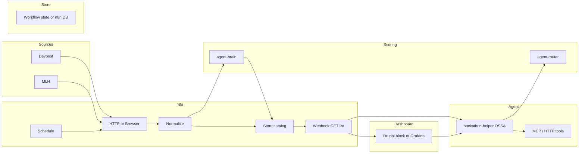

<!-- 6ade26d0-500f-408e-8a16-ef09eedada58 -->
# Hackathon Pipeline: Feed, Match, Dashboard, and Agent (Existing Stack Only)

## Goal

- **Pull** hackathon feeds (Devpost and others).
- **Review and match** hackathons to your platform (OSSA, agents, Drupal, MCP).
- **Dashboard** to browse, filter, and select hackathons.
- **Run it:** one agent guides from selection to submission; you only enter registration info; drafts, reminders, and steps are automated.

Constraints: **no new repo**, **maximize existing tools**, **minimal new code**.

---

## 1. Data source and feed pull

**Reality:** Devpost’s listing page is JS-rendered; a plain HTTP GET returns almost no content. You have three paths:

- **Option A (recommended):** Use **alternative sources** that expose data or static HTML:
  - **MLH (Major League Hacking):** `https://mlh.io/seasons/2025/events` or similar; check for API or scrape-friendly HTML.
  - **Devpost:** If they add or you find an API, use it; otherwise Option B.
- **Option B:** **n8n + headless browser.** Use an n8n node that runs Puppeteer/Playwright (e.g. “Execute Command” plus a small script, or an n8n community node for browser automation) to load Devpost, then extract hackathon cards. More moving parts; use only if A is insufficient.
- **Option C:** **Manual or hybrid.** You (or a one-off script) periodically export Devpost/MLH to a JSON file; n8n reads that file (from a URL or shared storage) and runs the rest of the pipeline.

**Where it runs:** **n8n** (https://n8n.blueflyagents.com). One workflow:

- **Trigger:** Schedule (e.g. daily) or webhook (manual “refresh”).
- **Steps:** HTTP Request (or browser node) to source(s) → Code node or HTML Extract to normalize to a common shape: `{ id, title, url, description, deadline, prizes, themes, source }`.
- **No new service:** All orchestration in n8n; no new project.

---

## 2. Storage and “platform fit” scoring

**Store the list** in one place so the dashboard and agent can read it:

- **Preferred:** **n8n stores and serves.**
  - In the same (or a companion) workflow: after normalizing, write the array to n8n’s **static data** or to a **database** node (e.g. n8n’s built-in DB or a Postgres/Redis you already have). Then a second n8n workflow “List hackathons” with a **Webhook (GET)** returns that data. Dashboard and agent call that webhook URL.
- **Alternative:** **workflow-engine** already has file-based workflow state (`workflow-state.service.ts`). Add one flow “hackathon-catalog”: triggered by n8n via POST with body `{ hackathons: [...] }`; flow saves to state; expose GET (e.g. from workflow-engine or a tiny route) to return the catalog. More code but reuses existing state.

**Platform-fit scoring (optional but high value):**

- **agent-brain** (vector search): If it exposes an “index”/“add” API, index each hackathon’s `title + description + themes` into a collection (e.g. `hackathons`). Query with a **platform description** (e.g. “Open Standard for Software Agents, OSSA, MCP, Drupal, developer tools, AI agents”) and use the similarity score as “fit.”
- **agent-router** (LLM): If brain doesn’t support index, call router once per hackathon (or in batch) with a prompt: “Rate 0–10 how well this hackathon fits a platform that does X, Y, Z” and attach the score.
- **Fallback:** Keyword filter in n8n (e.g. “agents”, “AI”, “developer tools”) and optional manual “interested” flag on the dashboard.

Use **existing** agent-brain and agent-router; no new service.

---

## 3. Dashboard: where and how

**Options (no new app):**

- **A. Drupal AgentDash**  
  Add a **block** (and optionally a dashboard section) that:
  - Calls the n8n “List hackathons” webhook (or workflow-engine GET) and renders the list.
  - Lets you filter (e.g. by score, deadline), select one or more, and “Start” to hand off to the agent.
  - Uses **http_client_manager** or a simple fetch from a custom block to the webhook URL (configurable in config).
- **B. Grafana**  
  You already have Grafana. Create a dashboard that uses a **JSON API** (or Prometheus/other) data source pointing at the same “list” endpoint; show table + filters. Less ideal for “select and run” unless you add a link to an external “run” URL.
- **C. n8n-built UI**  
  Use n8n’s form or a simple **Respond to Webhook** + HTML response to serve a minimal list page; link “Start” to a URL that triggers the agent (e.g. Cursor/IDE or a chat endpoint).

**Recommendation:** **Drupal AgentDash block** for “list + select + Start” so everything stays in one place and uses existing Drupal + contrib (e.g. dashboard, blocks). One new block in an existing custom module (e.g. under `alternative_services` or a small `hackathon_pipeline` in TESTING_DEMOS that can later move to its own module repo).

---

## 4. “Run it” agent (start to finish)

**Idea:** One **OSSA agent** in **platform-agents** (e.g. `hackathon-helper`) that:

- Has **tools:** e.g. `get_hackathon_list`, `get_hackathon_details`, `draft_submission_text`, `save_my_selection`, `get_deadline_reminders`.
- **get_hackathon_list:** Calls the n8n “List hackathons” webhook (or workflow-engine GET).
- **get_hackathon_details:** Fetches one hackathon by id/url (n8n or direct HTTP).
- **draft_submission_text:** Calls **agent-router** (LLM) with platform context (from GKG or a short config blob) and hackathon description to generate a first draft of “what we built,” “how it works,” “tech stack.”
- **save_my_selection:** Writes selected hackathon(s) and “interested” state to workflow-engine state or to n8n (POST to a workflow).
- **get_deadline_reminders:** Reads stored selections and returns “submit by X” and optional calendar link.

**User flow:**

1. You pick hackathons on the dashboard and click “Start.”
2. Dashboard passes selected ids to the agent (e.g. via Cursor/IDE by opening a task that includes those ids, or via a chat UI that invokes the agent with context).
3. Agent: loads hackathon details, generates draft submission text (router), saves your choices, and tells you “Register at &lt;url&gt;; use this draft for the project description; deadline is X.”
4. You only **enter registration info** on Devpost (or the host site); the agent does not (and should not) automate login or form submit. It prepares everything so you can paste and submit.

**Where it lives:** **platform-agents** only: new agent under `.agents/@ossa/hackathon-helper/` with manifest and tools that call existing HTTP endpoints (n8n webhooks, workflow-engine, router). **agent-protocol** only if we add one small MCP tool (e.g. `hackathon.get_list`) that wraps the same webhook; otherwise the OSSA agent can call HTTP directly or via existing MCP tools.

---

## 5. End-to-end architecture (high level)

---

## 6. What to build where (checklist)

| Piece | Where | What |
|-------|--------|------|
| Feed pull | n8n | New workflow: Schedule → Fetch (HTTP or browser node) → Normalize (Code/HTML Extract) → optional call to agent-brain or router for score → Store (n8n static/DB or workflow-engine state). |
| List API | n8n | Webhook GET workflow that returns stored hackathon list (and optional scores). |
| Platform description | Config | One config blob or wiki page: short “platform pitch” used for agent-brain query and router prompts. |
| Dashboard | Drupal AgentDash (or Grafana) | Block (or view) that calls list webhook, renders table with filter/select, “Start” button that passes selection to agent. |
| Hackathon-helper agent | platform-agents | New OSSA agent with tools: get_list, get_details, draft_submission (via router), save_selection, get_reminders. Tools implemented as HTTP calls to n8n/workflow-engine/router. |
| Optional MCP tool | agent-protocol | One tool e.g. `hackathon.get_list` that calls the n8n list webhook, so any MCP client can get the list without custom HTTP. |

**No new project.** Only: n8n workflows, one Drupal block (in existing module or a small new one under TESTING_DEMOS), one new agent in platform-agents, optional one MCP tool in agent-protocol.

---

## 7. Next level: multi-source, ROI, reminders, drafts

- **Multi-source:** Add MLH, hackathon.com, or others in the same n8n workflow (multiple HTTP/browser nodes → same normalizer → same store).
- **Prize/ROI:** In the normalizer, capture `prizes` and `deadline`; in the dashboard or agent, sort or tag by “prize value” or “days left.” Optional: simple “expected value” = prize × probability (e.g. fixed 5% for “we might place”) for sorting.
- **Reminders:** n8n workflow “Hackathon reminders”: Schedule (e.g. daily) → read stored “my selections” from workflow-engine or n8n → if deadline in 3/7 days, send email or post to Slack (using existing n8n nodes).
- **Submission drafts:** Already in agent: `draft_submission_text` using router + platform context. Optionally pull “what we built” from GKG or wiki so the draft is grounded in your real docs.
- **Post-win:** If you track “we won,” add a step in the agent or n8n to update a “portfolio” (e.g. openstandard-ui showcase or a simple list in config) so wins are visible and reusable for future applications.

---

## 8. Implementation order

1. **n8n: feed workflow** – Schedule + fetch from at least one source (MLH or Devpost via browser node), normalize to JSON, store (n8n static data or workflow-engine POST).
2. **n8n: list webhook** – GET returns stored list (and scores if you added them).
3. **Config** – Platform description text for scoring and drafts.
4. **Optional scoring** – agent-brain index + query, or router one-shot score; write score into stored items.
5. **Dashboard** – Drupal block (or Grafana) calling list webhook, render + select + “Start.”
6. **platform-agents: hackathon-helper** – OSSA agent + tools (get_list, get_details, draft_submission, save_selection, get_reminders).
7. **Optional** – agent-protocol MCP tool `hackathon.get_list`; n8n reminder workflow; multi-source and ROI tags.

This keeps everything inside existing tools, minimizes custom code, and gives you a path from “pull feed” to “dashboard” to “agent guides me; I only do the form.”
