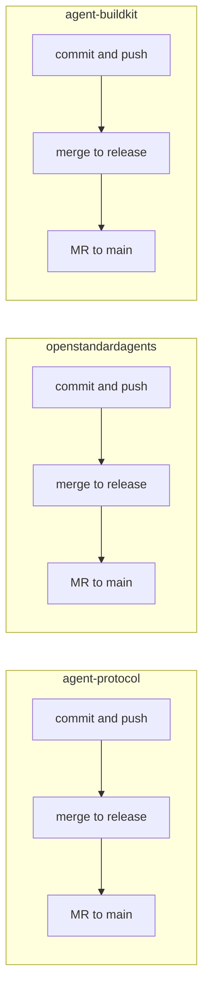

<!-- 540db5c6-9076-42f8-b761-b969e35f2e3f -->
# Merge to release and main (then npm update on Oracle/NAS)

## Current state

- **agent-protocol** (worktree): branch `chore/mcp-buildkit-secrets`. Uncommitted: many modified files across the repo plus **untracked** `src/api/routes/mcp-bridge.routes.ts` and `src/mcp/bridge/` (config.schema.ts, config-loader.ts, mcp-bridge.service.ts). `src/api/server.ts` already wires the bridge (imports and route at `/api/v1/mcp/bridge`).
- **openstandardagents** (WORKING_DEMOs): branch `nist-compliance-v0.4.6`, **ahead 2** of `release/v0.4.x`. Uncommitted: possibly M on MCP bridge CLI files; untracked `.npmrc.bak`.
- **agent-buildkit** (worktree): branch `fix/nas-ssh-and-mcp-build`. Uncommitted: M on `.gitlab-ci.yml`, `.gitlab/wiki-manifest.json`, `.npmrc`, `config-templates/wiki-NIST-Pillar-2-OSSA-MCP-Bridge.md`, `docs/wiki/Home.md`; untracked `config-templates/wiki-13-Plans-Status-and-Remaining.md`.

## Prerequisites

- **Token:** Source platform env before any GitLab or git push: `set -a && source /Volumes/AgentPlatform/.env.local && set +a`. Run `buildkit gitlab token check`; if 401, stop and set GITLAB_TOKEN (or GITLAB_TOKEN_PAT) in that file.
- **Merge policy:** No direct commits to `main` or `release/*`. All flows: feature branch -> merge into release (push) -> MR release -> main (merge when pipeline passes).

---

## 1. agent-protocol: bridge + branch onto release then main

**1.1 Commit and push feature branch**

- From `worktrees/agent-protocol`:
  - `git add src/mcp/bridge/ src/api/routes/mcp-bridge.routes.ts` (add untracked bridge).
  - Decide: either (a) `git add -A` and commit all current changes on `chore/mcp-buildkit-secrets` with one message (e.g. `fix(mcp): NIST Pillar 2 OSSA MCP bridge + buildkit secrets`), or (b) commit only bridge-related files plus `src/api/server.ts` and any other files strictly required for the bridge (minimal NIST-only).
- `git commit -m "feat(mcp): NIST Pillar 2 OSSA MCP bridge (config, service, routes)"` (or the chosen message).
- `buildkit git push` (or `git push origin chore/mcp-buildkit-secrets` with token in env).

**1.2 Merge into release and push**

- `git fetch origin`
- `git checkout release/v0.1.x && git pull origin release/v0.1.x` (merge, no rebase).
- `git merge chore/mcp-buildkit-secrets -m "Merge chore/mcp-buildkit-secrets: NIST bridge + buildkit secrets"`
- Resolve conflicts if any; then `git push origin release/v0.1.x`.

**1.3 MR release -> main**

- From workspace (with buildkit on PATH and token loaded):  
  `buildkit gitlab mr release-to-main --project blueflyio/agent-platform/services/agent-protocol --source-branch release/v0.1.x`
- In GitLab: ensure MR pipeline passes, then merge (merge when pipeline succeeds if set).

---

## 2. openstandardagents: bridge CLI onto release then main

**2.1 Commit and push feature branch**

- From `WORKING_DEMOs/openstandardagents`:
  - Add only the bridge/CLI changes (do not add `.npmrc.bak`). Example: `git add src/cli/commands/mcp.command.ts src/services/mcp/bridge.service.ts` (and any other modified files that are part of the NIST bridge CLI).
  - `git commit -m "feat(cli): ossa mcp bridge sync (config-only) for NIST Pillar 2"`
  - `buildkit git push` (or `git push origin nist-compliance-v0.4.6`).

**2.2 Merge into release and push**

- `git fetch origin`
- `git checkout release/v0.4.x && git pull origin release/v0.4.x`
- `git merge nist-compliance-v0.4.6 -m "Merge nist-compliance-v0.4.6: OSSA MCP bridge CLI"`
- `git push origin release/v0.4.x`

**2.3 Merge release -> main**

- Open MR in GitLab: `release/v0.4.x` -> `main` for repo `blueflyio/ossa/openstandardagents`. Merge when CI passes. (openstandardagents is on **npmjs**; CI publishes from main.)

---

## 3. agent-buildkit: wiki and CI onto release then main

**3.1 Commit and push feature branch**

- From `worktrees/agent-buildkit`:
  - `git add .gitlab-ci.yml .gitlab/wiki-manifest.json .npmrc config-templates/wiki-NIST-Pillar-2-OSSA-MCP-Bridge.md docs/wiki/Home.md`
  - Optionally add the new wiki template if it should be published: `git add config-templates/wiki-13-Plans-Status-and-Remaining.md`
  - `git commit -m "docs(nist): Pillar 2 wiki Section 9 package-first, manifest and CI updates"`
  - `buildkit git push`

**3.2 Merge into release and push**

- `git fetch origin`
- `git checkout release/v0.1.x && git pull origin release/v0.1.x`
- `git merge fix/nas-ssh-and-mcp-build -m "Merge fix/nas-ssh-and-mcp-build: NIST wiki and NAS/MCP build fixes"`
- `git push origin release/v0.1.x`

**3.3 MR release -> main**

- `buildkit gitlab mr release-to-main --project blueflyio/agent-platform/tools/agent-buildkit --source-branch release/v0.1.x`
- Merge in GitLab when pipeline passes.

---

## 4. After CI publishes

- **Oracle / NAS:** No git clone or pull for these packages. Run:
  - `npm update -g @bluefly/agent-buildkit @bluefly/agent-protocol`
  - `npm update -g @bluefly/openstandardagents` (from npmjs)
- Optional: Re-publish wiki so the NIST page (with Section 9) is current: from agent-buildkit worktree, `buildkit gitlab wiki publish --project blueflyio/agent-platform/tools/agent-buildkit --manifest .gitlab/wiki-manifest.json` (token in env).

---

## Order and dependencies

Repos can be merged in parallel; no cross-repo dependency for the merge steps. Oracle/NAS `npm update -g` is done after all three pipelines have published.

---

## Risks and notes

- **agent-protocol:** Hundreds of modified files on `chore/mcp-buildkit-secrets`. If the intent is only NIST bridge, consider a branch that contains only `src/mcp/bridge/`, `src/api/routes/mcp-bridge.routes.ts`, and minimal server/DI changes; otherwise merging the full branch is correct.
- **Wiki publish:** Section 9 is already in `config-templates/wiki-NIST-Pillar-2-OSSA-MCP-Bridge.md`. After merge, run wiki publish once to push that file to the GitLab wiki page `NIST-Pillar-2-OSSA-MCP-Bridge`.
- **Lefthook / pre-push:** If pre-push hooks block (e.g. compliance or long-running checks), fix the underlying issue; use `--no-verify` only if project policy allows and the user explicitly requests it.
