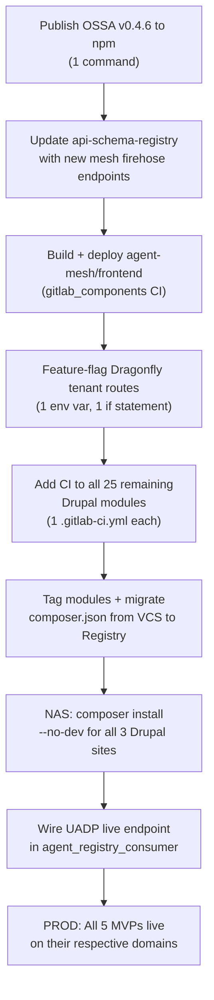

# BlueFly Agent Platform — MVP Roadmap
## Synthesized from: `.cursor/plans`, `.claude/plans`, `agent-buildkit/todo`, module audits

> [!IMPORTANT]
> **Core principle (from your own Cursor plans):** Use OSS only. No custom form frameworks, no custom auth protocols, no duplicate HTTP clients. If an open-source package exists — use it.

---

## The 5 Products (MVPs)

| # | Product | Domain | Stack | Status |
|---|---------|--------|-------|--------|
| 1 | **OSSA** – Agent schema + CLI | `openstandardagents.org` | Node.js npm package | v0.4.6 local, 0.4.5 on npm |
| 2 | **Agent Mesh** – A2A runtime | `mesh.blueflyagents.com` | Node.js/Express + Next.js frontend | Live, needs firehose wired |
| 3 | **Dragonfly** – Drupal test orchestrator | `dragonfly.blueflyagents.com` | Node.js + Next.js + n8n SaaS bootstrap | Open-core + SaaS split needed |
| 4 | **AgentDash** – Drupal admin for agents | `agentdash.blueflyagents.com` | Drupal 11 | Composer registry migration needed |
| 5 | **AgentMarketplace** – Agent install catalog | `agents.blueflyagents.com` | Drupal 11 | 26 VCS repos → needs Composer migration |

---

## What OSS Tools Are Already Used (DO NOT REPLACE)

| Need | Already Using | Never Add |
|------|--------------|-----------|
| Agent schema | `@bluefly/openstandardagents` (own package on npm) | Custom parser |
| HTTP client (Drupal) | `http_client_manager` | Raw Guzzle or custom client |
| Auth (Node) | Passport.js + express-session | Clerk, Supabase Auth, custom JWT |
| Session store | `connect-redis` when `REDIS_URL` set | Custom session backend |
| API contracts | OpenAPI 3.1 + `express-openapi-validator` + `openapi-typescript` | Ad-hoc validation |
| Policy/Authz | `compliance-engine` (Cedar) | Hardcoded role checks |
| Drupal AI integration | `drupal/ai`, `ai_agents`, `ai_chatbot`, ECA | Custom AI orchestration |
| Drupal tool plugins | `tool`, `tool_ai_connector` | Custom tool discovery |
| Drupal MCP | `mcp_registry` (client), `drupal/mcp` (server) | Custom MCP protocol impl |
| CI/CD | `gitlab_components/drupal-master` template | Custom CI scripts per module |
| Tenant automation | n8n at `n8n.blueflyagents.com` | Custom provisioning backend |
| K8s agents | kagent (OSS k8s controller) | Custom k8s operator |
| Composer packages | GitLab Package Registry + `gitlab-group` auth | VCS repos per-module in prod |

---

## Config Directory Decision: `~/.agent-platform` vs `~/.config`

**Verdict: Keep `~/.agent-platform/` as-is. Do NOT merge into `~/.config/`.**

Reasons:
- `~/.config/` is for XDG-compliant user-facing tools (fish, bat, ghostty, k9s, etc.)
- `~/.agent-platform/` is **service state** (agent-registry.json, audit JSON, tokens, sprint state, enforcement config). This is machine/service data, not user config.
- Moving it would break `buildkit` path resolution (`config.json` shows `~/Sites/blueflyio` workspace root — this is a buildkit contract, not a user preference)
- The `.env.local` in `~/.agent-platform/` holds credentials — this should stay out of `~/.config/` (which some tools read)

**Recommended consolidation:** The `~/.cursor/plans` and `~/.claude/plans` directories ARE fragmented — they are the same kind of content (agent plans) in different tools. Consider a single `~/Sites/blueflyio/.agents/plans/` directory as the canonical location (synced to the NAS via buildkit). Keep the tool-specific dirs as symlinks if needed.

---

## MVP 1 — OSSA Schema + CLI (`openstandardagents`)

**Status:** v0.4.6 local, v0.4.5 on npm. Schema valid. New `infrastructure` + `spatial_mapping` fields added.

**What's left to reach MVP 1.0:**
- [ ] **Publish v0.4.6 to npm** (`npm publish --access public`) — no custom work, just run the command
- [ ] **JSON Schema validation in CI** — already configured (`validate:schema` script), just needs to run in GitLab CI on every MR
- [ ] **`ossa validate` CLI** — already exists as `ossa-validate-all` in volta. Ensure it validates `infrastructure` and `spatial_mapping` fields

**OSS tools:** AJV (validation), Volta (tool pinning), npm (distribution). Zero custom code needed beyond the schema itself.

---

## MVP 2 — Agent Mesh (`mesh.blueflyagents.com`)

**Status:** Live Express service. SSE firehose added. Frontend at `agent-mesh/frontend` with `(mesh)` route group.

**What's left:**
- [ ] **Deploy frontend** — `agent-mesh/frontend` has never been built/deployed. It's a Next.js app. Add CI job using `gitlab_components/platform-service-pipeline`. No custom deploy script.
- [ ] **Wire A2A Firehose nav** — Done (committed to `release/v0.1.x`) — just needs the CI build
- [ ] **Replace `dashboard/index.html`** — The Kagent dashboard is a single HTML file using CDN React. This can stay for the Kagent view; the Next.js frontend handles A2A monitoring
- [ ] **OpenAPI spec update** — Add `/a2a/firehose/log` and `/a2a/firehose/stream` to `openapi.yaml` so `api-schema-registry` picks them up automatically

**OSS tools:** Next.js 14, Tailwind, Recharts, react-flow-renderer, Framer Motion — all already in `package.json`. No new deps.

---

## MVP 3 — Dragonfly (`dragonfly.blueflyagents.com`)

**Status:** Core test orchestration works. n8n tenant bootstrap planned. Open-core split not done.

**What's left (Phase 1 from your Cursor plan):**
- [ ] **Feature flag tenant routes** — In `server.ts`, wrap tenant route registration: `if (process.env.N8N_TENANT_BOOTSTRAP_WEBHOOK_URL)`. One code change, no refactor
- [ ] **ECA missing constants** — Add `DragonflyEvents::TENANT_BOOTSTRAPPED` constant + ECA event plugin + ECA action `BootstrapDragonflyTenant` in `dragonfly_client`
- [ ] **n8n workflow** — Parameterize the existing tenant bootstrap workflow for self-host vs SaaS (GitLab host, namespace_id, template_project_id, Dragonfly base URL)
- [ ] **Landing page** — Add public `(marketing)/page.tsx` at `/` in Next.js app, update `DashboardShell` to allow public paths. Use existing studio-ui components only
- [ ] **Admin "Connect Drupal"** — One admin page showing base URL + API path for `dragonfly_client`. No custom form library — use existing studio-ui

**OSS tools:** Passport.js, express-openapi-validator, connect-redis, n8n (self-hosted), studio-ui. Already in use.

---

## MVP 4 — AgentDash (Drupal Admin)

**Status:** Reference implementation — uses Composer Package Registry (0 VCS repos). Has `agent_registry_consumer` module for UADP catalog browsing.

**The `agent_registry_consumer` in AgentDash is GOOD — keep it:**
- Settings form for registry endpoint + publisher allowlist + signature enforcement ✅
- Catalog controller — fetches from `/api/v1/discovery`, shows table, install button ✅
- Install controller — policy check (signatures, revocation) + provenance logging ✅
- **NOT reinventing:** Uses Drupal's native `http_client`, config system, routing. Proper DI, no custom HTTP client

**What's left:**
- [ ] **Connect to live UADP** — Change default `registry_endpoint` from `localhost:3000` to `https://agents.blueflyagents.com/api/v1/discovery` in `config/install/agent_registry_consumer.settings.yml`
- [ ] **Add `ai_agents_ossa` fields** — The `infrastructure` and `spatial_mapping` fields are now in the entity form (done). Need `config/schema/ai_agents_ossa.schema.yml` update
- [ ] **Kagent integration** — `ai_agents_kagent` module: deploy OSSA agents to Kagent via `KagentDeploymentService`. Pattern mirrors `dragonfly_client_orchestration`. **Use existing ServicesProvider pattern, not custom code.**
- [ ] **Publish custom modules to GitLab Package Registry** — `ai_agents_ossa`, `mcp_server`, etc. need CI with `composer_package: "true"`. Template exists at `gitlab_components/drupal-master`. One `.gitlab-ci.yml` per module.

---

## MVP 5 — AgentMarketplace (26 VCS repos → Composer)

**Status:** Worst debt. 26 modules loaded via `"type": "vcs"` in `composer.json`. Must migrate to GitLab Package Registry.

**Step-by-step (from your agent-buildkit plan):**
1. **Audit which modules already have CI** — `api_normalization` does. Check the other 25.
2. **Add `gitlab_components/drupal-master` CI to each missing module** — One `.gitlab-ci.yml` file per module, ~5 lines each (using the template `include` pattern)
3. **Tag each module `1.0.0-alpha1`** — 1 git tag command per module bare repo on NAS
4. **Remove 26 VCS entries from `composer.json`** — replace with `^1.0@alpha` version constraints
5. **`composer update` locally** to verify
6. **NAS deploy** — add `COMPOSER_GITLAB_TOKEN` to NAS docker-compose, run `composer install --no-dev` in each PHP container
7. **Oracle** — replicate after NAS is proven

**OSS tools:** Composer, GitLab Package Registry, `gitlab_components` CI template. Zero custom tooling needed.

---

## The Map to Production

---

## Critical: Stop Doing This

| ❌ Stop | ✅ Do Instead |
|---------|-------------|
| Committing to `openstandard-ui` without knowing which app is at which URL | `localhost:9173` = website + builder app. Mesh = `mesh.blueflyagents.com` = `agent-mesh/frontend` |
| Deleting module folders without `drush pmu` — modules stay in DB even when files are gone | Rename to `_disabled` when DDEV is down, or `drush pmu` when up |
| Creating new components when an OSS package exists | Check `package.json` and `drupal/ai` module list first |
| Writing custom deploy scripts | Use `gitlab_components/drupal-master` and `platform-service-pipeline` templates |
| Moving config dirs | `~/.agent-platform/` = service state, stays. `~/.config/` = user tool config, stays |

---

## Next 3 Actions (no code, just decisions needed from you)

1. **OSSA publish** — Should I run `npm publish` for v0.4.6 tonight while you have access?
2. **Composer migration priority** — AgentDash is already good. Start with Fleet Manager (4 VCS) or AgentMarketplace (26 VCS)?
3. **Dragonfly landing** — Is there already a design? Or should I use the existing `studio-ui` components to scaffold it from the Cursor plan spec?
