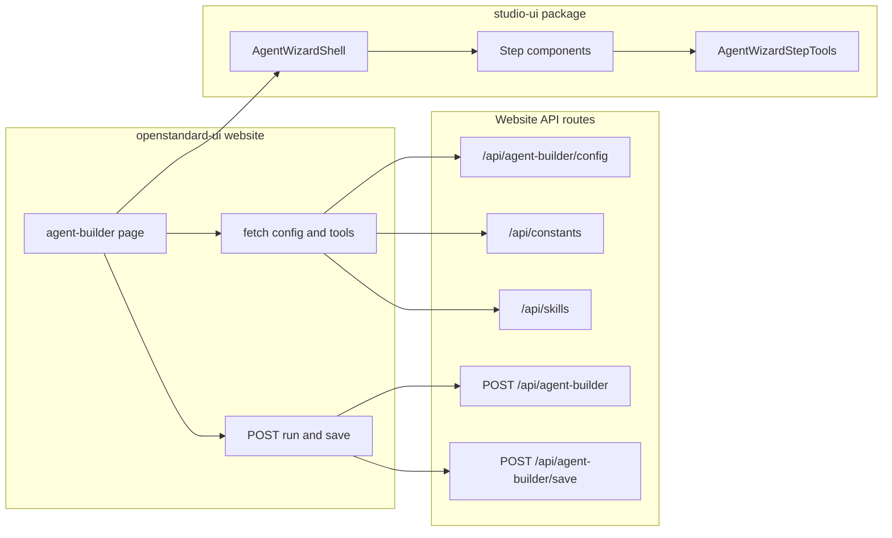

<!-- 6ba5dd73-ae3b-45e8-a91e-aa697bea0e04 -->
# OSSA UI: Componentized Architecture and Real Wizard

## Goal

- **All UI/graphics** live in **@bluefly/studio-ui** (no one-off UI in the website repo).
- **openstandard-ui website** only composes studio-ui components and calls API endpoints (no custom look-and-feel or heavy UI logic).
- **No placeholders**: Tools step (and other stub steps) use real data, real selection, and real `spec.tools` in the generated manifest.

---

## Current State (facts)

- **Agent-builder page**: `website/app/agent-builder/page.tsx` — full wizard (8 steps) with inline Tailwind; **Tools step** (wizardStep === 3) is a single placeholder div: "Tools: configure in custom YAML or use init defaults" (lines ~473–477). No studio-ui imports on this page.
- **APIs used**: `POST /api/agent-builder` (run), `GET /api/agent-builder/config`, `POST /api/agent-builder/save`, `GET /api/skills`, `POST /api/skills/attach`, `GET /api/constants` (returns `toolPresets`, `providers`, `autonomyLevels`, `complianceFrameworks`). Tool presets already exist (web-search, code-execution, file-operations, mcp-filesystem, mcp-github) but are not used in the wizard.
- **studio-ui**: Package `@bluefly/studio-ui` (WORKING_DEMOs/studio-ui or worktree). Exports: primitives (Button, Card, Badge, Tabs, Progress, Alert, Dialog, Tag, etc.), sections, liquid-glass, WebCommandCenter. Website re-exports via `website/components/studio-ui.tsx` and uses `studio-ui-supplement.tsx` for Input, Checkbox, etc. Homepage had to avoid Card from studio-ui due to React runtime conflict; supplement exists to work around missing or problematic exports.
- **OSSA manifest**: `spec.tools` is an array of `{ type, name, ... }` (e.g. `type: http`, `name: gitlab_api`). Reference agents use `type: http | function | mcp` and `name`.

---

## Architecture (target)

- **Data flow**: Page fetches once (config, constants, skills). Page holds wizard state (mode, step, form values, **selected tools**, selected skills). State is passed as props into studio-ui wizard components. On Run/Save, page builds request body (including `spec.tools` from selected tools) and POSTs to API. No API calls inside studio-ui.
- **Single source of UI**: All wizard step layout, labels, controls, and tool picker live in studio-ui. Website does not implement step content.

---

## Phase 1: API contract for tools

- **Tools list**: Already available as `toolPresets` from `GET /api/constants` (each preset has `name`, `tools[]` with `name`, `type`, `description`, `uri?`). Optional: add `GET /api/agent-builder/tools` that returns the same structure plus skills from `GET /api/skills` (e.g. `{ toolPresets, skills }`) so the Tools step has one fetch. If you keep a single fetch from the page, page can call `GET /api/constants` and `GET /api/skills` and merge; no new route required.
- **Manifest wiring**: Ensure the run/save pipeline accepts and emits `spec.tools`. When building manifest from wizard state, map selected tool keys (and optional skill refs) to OSSA `spec.tools` array: e.g. selected preset keys → expand to `tools[]` entries with `type`, `name`, `description`, `uri` where present. Skills already have attach flow; ensure attached skills are reflected in manifest where the schema expects them (e.g. capabilities or tool refs).

**Deliverable**: Document or implement the mapping from "selected presets + selected skills" to `spec.tools` (and any skills/capabilities) in the agent-builder run/save logic. No UI change yet.

---

## Phase 2: studio-ui – presentational wizard components

- **Location**: Add components under `studio-ui` package (e.g. `package/src/components/wizard/` or `features/agent-wizard/`) and export from the package’s public entry (e.g. `package/src/components/index.ts` or `package/src/index.ts`).
- **Components to add** (all presentational; props only, no fetch):
  - **AgentWizardShell**: Steps list, current step index, children (step content), Next/Back, optional Run/Save buttons. Props: `step`, `steps[]`, `onStepChange`, `onRun`, `onSave`, `children`.
  - **AgentWizardStepTools**: Receives `toolPresets` (or flat `toolsList`), `selectedToolIds: string[]`, `onSelectionChange`, optional `skills[]` and `onAttachSkill`. Renders multi-select or checklist (preset groups + optional skills). No API calls.
  - **AgentWizardStepBasics**, **AgentWizardStepDomain**, **AgentWizardStepLLM**, **AgentWizardStepAutonomy**, **AgentWizardStepGovernance**, **AgentWizardStepDeployment**, **AgentWizardStepReview**: One component per step, each with typed props for value and onChange. Content and layout live here; data comes from parent.
- **Shared pieces** (if not already in studio-ui): **PlatformChipGrid** (select multiple from a list), **ModeToggle** (Quick vs Wizard). Result area (terminal / files / manifest) can stay in website or move to studio-ui as a presentational block (props: logs, files, manifestYaml).
- **React/Next compatibility**: Build studio-ui so the app uses a single React instance (peer dependency, no bundling React inside the package). If the current Card/homepage issue is due to duplicate React or "use client" boundaries, fix that in this phase (e.g. ensure wizard components are "use client" where needed and that Next and studio-ui share the same React). This unblocks using the new components in the website without the supplement for the wizard.

**Deliverable**: New components in studio-ui, exported and buildable; no placeholder content inside them.

---

## Phase 3: openstandard-ui website – thin agent-builder page

- **agent-builder page** (and `/agent` if it re-exports the same page): Replace inline step UI with:
  1. Fetch on load: `GET /api/agent-builder/config`, `GET /api/constants`, `GET /api/skills` (or a single combined endpoint if added).
  2. Hold state: mode, currentStep, form state per step, **selectedToolIds** (and selected skill refs if applicable).
  3. Render: `<AgentWizardShell step={...} steps={...} onStepChange={...} onRun={...} onSave={...}>` with step content from studio-ui step components. Pass `toolPresets` (and skills) and `selectedToolIds`/`onSelectionChange` into `AgentWizardStepTools`.
  4. On Run: Build body from state (including `spec.tools` from selected tools), `POST /api/agent-builder`. On Save: same, `POST /api/agent-builder/save`.
- **Remove**: All inline Tailwind step content and the placeholder Tools div. Keep only layout/wrapper and API wiring.
- **Optional**: Keep `AgentBuilderSessionBar` in the website if it’s app-specific; or move it to studio-ui if it’s generic.

**Deliverable**: Agent-builder page is a thin shell: data from API, UI from studio-ui, actions via API.

---

## Phase 4: Real Tools step (no placeholder)

- **Data**: Tool list = `toolPresets` from `/api/constants` (and optionally skills from `/api/skills`). Use as-is for the Tools step.
- **UI**: `AgentWizardStepTools` shows a real multi-select: preset groups (e.g. Web Search, Code Execution, MCP Filesystem) with checkboxes or chips; optional section for "Attach skills" using existing skills list and attach callback. No text that says "configure in YAML or use init defaults."
- **State**: When user selects/deselects presets (and skills), parent updates `selectedToolIds` (and attached skills). Parent maps selected presets to OSSA `spec.tools` when building the manifest (e.g. preset "mcp-filesystem" → `{ type: 'mcp', name: 'mcp_filesystem', description: '...', uri: '...' }`).
- **Run/Save**: Pipeline that builds the manifest must merge in `spec.tools` from the wizard state so the saved/run manifest is valid and includes the chosen tools.

**Deliverable**: Tools step shows real presets (and optionally skills), real selection, and manifest output contains the selected `spec.tools`.

---

## Phase 5: Other steps (real data where applicable)

- **Domain, Autonomy, Governance, Deployment**: Replace any stub content with real options from `/api/constants` (`autonomyLevels`, `complianceFrameworks`) and wire their values into wizard state and manifest. Use studio-ui step components for layout and controls so the website stays thin.
- **Review step**: Show a summary (and optionally a manifest preview) built from current wizard state, including tools. No placeholder.

---

## File-level summary

| Area | Action |
|------|--------|
| **studio-ui** | Add `wizard/` or `features/agent-wizard/`: AgentWizardShell, AgentWizardStepTools, AgentWizardStepBasics, … Review. Export from package. Fix React/Next compatibility if needed. |
| **openstandard-ui website** | agent-builder page: fetch config + constants + skills; state (including selectedToolIds); render only studio-ui wizard + step components; build body and POST run/save. Remove inline step UI and Tools placeholder. |
| **openstandard-ui API** | Optionally add GET `/api/agent-builder/tools` (constants + skills). Ensure run/save handlers accept and output `spec.tools` from wizard state. |
| **Manifest build** | In run/save flow, map selectedToolIds (and toolPresets) to `spec.tools` array (type, name, description, uri). Attach skills per existing attach API. |

---

## Order of implementation

1. **Phase 1** – Define and implement manifest mapping (selected tools → `spec.tools`) and confirm API returns toolPresets/skills.
2. **Phase 2** – Add and export wizard components in studio-ui; fix React/Next usage so the website can import them.
3. **Phase 3** – Refactor agent-builder page to thin shell (fetch, state, studio-ui only).
4. **Phase 4** – Implement real Tools step content and wire selection to manifest.
5. **Phase 5** – Replace remaining stub steps with real options and studio-ui components.

---

## Out of scope (for this plan)

- MCP server live tool listing (e.g. calling MCP list_tools from the website). Tool list is presets + skills; MCP can be a later enhancement.
- Moving every existing website page to studio-ui; focus is agent-builder and wizard only.
- Changes to openstandardagents CLI or OSSA spec itself.
