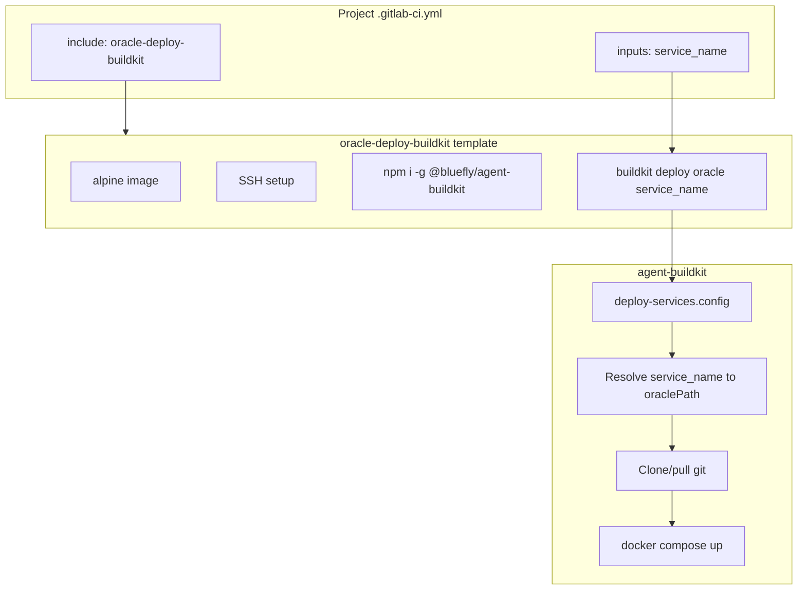

<!-- 0d408385-b6cf-4919-9dd3-b8675fdabba1 -->
# Oracle Deploy BuildKit Standardization Plan

## Current State

**Two deploy models exist:**

1. **oracle-deploy-buildkit** (preferred): Alpine + npm install -g @bluefly/agent-buildkit, runs `buildkit deploy oracle $service_name`. Uses deploy-services.config for paths. Catalog: `oracle-deploy-buildkit`.

2. **oracle-deploy** (legacy): Uses `oracle-deploy` runner tag, SSH + git pull + docker compose. Different layout (/opt/bluefly), manual approval. Not in catalog (uses project include).

**Projects audit:**

| Project | Current | service_name | Action |
|---------|---------|--------------|--------|
| Drupal_AgentDash | oracle-deploy-buildkit | agentdash | Keep (reference pattern) |
| Drupal_AgentMarketplace | Custom inline SSH | agent-marketplace | Migrate to oracle-deploy-buildkit |
| Drupal_Fleet_Manager | drupal-master only | N/A | Fix path: `blueflyio/gitlab_components` -> `blueflyio/agent-platform/tools/gitlab_components`; ref `rebuild-drupal-ci` -> `release/v0.1.x` |
| workflow-engine | oracle-deploy | workflow-engine | Migrate to oracle-deploy-buildkit |
| dragonfly | oracle-deploy | dragonfly | Migrate to oracle-deploy-buildkit |
| agent-tracer | oracle-deploy | agent-tracer | Migrate to oracle-deploy-buildkit |
| agent-router | oracle-deploy | router | Migrate to oracle-deploy-buildkit |
| agent-protocol | oracle-deploy (2 jobs) | mcp | Migrate to oracle-deploy-buildkit |
| foundation-bridge | oracle-deploy | foundation-bridge | Migrate to oracle-deploy-buildkit |
| agent-brain | oracle-deploy, **wrong path** | agent-brain | Fix path + migrate |
| agent-mesh, agent-studio, api-schema-registry, agent-buildkit | platform-service-pipeline | mesh, agent-studio, etc. | Already use BuildKit internally; no change |
| agent-docker | Custom deploy:oracle | N/A | Special case (tunnel config); keep or document |

**agent-brain path bug:** Uses `blueflyio/gitlab_components` (missing `agent-platform/tools`). Will 404.

**deploy-services.config gaps:** workflow-engine, agent-tracer, agent-brain, foundation-bridge are not in DEFAULT_DEPLOY_SERVICES. BuildKit `deploy oracle <name>` will fail for these until added.

---

## Implementation Plan

### Phase 1: Extend deploy-services.config (agent-buildkit)

Add missing services so `buildkit deploy oracle <name>` works for all migrated projects.

**File:** `worktrees/agent-buildkit/.../src/cli/commands/deploy/deploy-services.config.ts`

Add entries (match opt-config.json and GitLab repo paths):

```ts
'workflow-engine': {
  oraclePath: `${ORACLE_BASE}/services/workflow-engine`,
  nasPath: `${NAS_SERVICES_BASE}/services/workflow-engine`,
  description: 'Workflow engine (workflow.blueflyagents.com, port 3015)',
  gitlabRepo: 'blueflyio/agent-platform/services/workflow-engine',
},
'agent-tracer': {
  oraclePath: `${ORACLE_BASE}/services/agent-tracer`,
  nasPath: `${NAS_SERVICES_BASE}/services/agent-tracer`,
  description: 'Agent tracer (tracer.blueflyagents.com, port 3006)',
  gitlabRepo: 'blueflyio/agent-platform/services/agent-tracer',
},
'agent-brain': {
  oraclePath: `${ORACLE_BASE}/services/agent-brain`,
  nasPath: `${NAS_SERVICES_BASE}/services/agent-brain`,
  description: 'Agent brain / Qdrant (brain.blueflyagents.com)',
  gitlabRepo: 'blueflyio/agent-platform/services/agent-brain',
},
'foundation-bridge': {
  oraclePath: `${ORACLE_BASE}/services/foundation-bridge`,
  nasPath: `${NAS_SERVICES_BASE}/services/foundation-bridge`,
  description: 'Foundation bridge (LLM providers)',
  gitlabRepo: 'blueflyio/agent-platform/services/foundation-bridge',
},
```

Note: agent-protocol deploys to `mcp` (already in config). agent-protocol-mcp may be same service or a variant; consolidate to one deploy job using service_name `mcp` if appropriate.

---

### Phase 2: Migrate Drupal_AgentMarketplace to oracle-deploy-buildkit

**File:** `WORKING_DEMOs/Drupal_AgentMarketplace/.gitlab-ci.yml`

- Remove the custom `deploy:oracle` job (lines 9-64).
- Add include:

```yaml
include:
  - component: $CI_SERVER_FQDN/blueflyio/agent-platform/tools/gitlab_components/golden@${GITLAB_COMPONENTS_VERSION}
  - component: $CI_SERVER_FQDN/blueflyio/agent-platform/tools/gitlab_components/wiki-pages@release/v0.1.x
  - component: $CI_SERVER_FQDN/blueflyio/agent-platform/tools/gitlab_components/oracle-deploy-buildkit@release/v0.1.x
    inputs:
      service_name: "agent-marketplace"
```

- Keep `tag:release` if desired.
- Ensure `ORACLE_SSH_KEY`, `ORACLE_DEPLOY_HOST`, `ORACLE_DEPLOY_USER` are set (group vars).

---

### Phase 3: Migrate oracle-deploy projects to oracle-deploy-buildkit

For each project, replace oracle-deploy include with oracle-deploy-buildkit and remove oracle-deploy-specific overrides.

**workflow-engine** (`worktrees/workflow-engine/.gitlab-ci.yml`):
- Remove: `oracle-deploy` component include.
- Add: `oracle-deploy-buildkit` with `service_name: "workflow-engine"`.
- Remove `oracle-deploy:deploy` overrides (environment etc.) if any; template provides them.
- Ensure `container_build` or equivalent still runs; oracle-deploy-buildkit does not need build job (BuildKit handles clone/pull/compose).

**dragonfly** (`worktrees/dragonfly/.gitlab-ci.yml`):
- Same pattern: replace oracle-deploy with oracle-deploy-buildkit, `service_name: "dragonfly"`.
- oracle-deploy had `build_job: container_build`; BuildKit deploy does not need that (different flow).

**agent-tracer, agent-router, foundation-bridge**:
- Replace oracle-deploy with oracle-deploy-buildkit.
- service_name: agent-tracer, router, foundation-bridge respectively.
- Remove health_check_url (BuildKit does not use it; optional: add to oracle-deploy-buildkit template later if desired).

**agent-protocol**:
- Two oracle-deploy jobs: agent-protocol and agent-protocol-mcp. Consolidate to one: `service_name: "mcp"` (deploy-services has mcp -> agent-protocol).
- If agent-protocol-mcp is a distinct service, add to deploy-services.config and keep two includes.

**agent-brain**:
- Fix path: `blueflyio/gitlab_components` -> `blueflyio/agent-platform/tools/gitlab_components`.
- Replace oracle-deploy with oracle-deploy-buildkit, `service_name: "agent-brain"`.

---

### Phase 4: Fix Drupal_Fleet_Manager CI

**File:** `WORKING_DEMOs/Drupal_Fleet_Manager/.gitlab-ci.yml`

- Change: `blueflyio/gitlab_components` -> `blueflyio/agent-platform/tools/gitlab_components`.
- Change: ref `rebuild-drupal-ci` -> `release/v0.1.x`.
- Add oracle-deploy-buildkit if Fleet Manager deploys to Oracle (check deploy-services for drupal_fleet_manager / fleet-manager; if not present, add or skip).

---

### Phase 5: Standardize Drupal_AgentDash include (optional)

**File:** `WORKING_DEMOs/Drupal_AgentDash/.gitlab-ci.yml`

- Currently uses `project: blueflyio/agent-platform/tools/gitlab_components` with `file: templates/oracle-deploy-buildkit/template.yml`.
- Switch to component include for consistency:

```yaml
- component: $CI_SERVER_FQDN/blueflyio/agent-platform/tools/gitlab_components/oracle-deploy-buildkit@release/v0.1.x
  inputs:
    service_name: "agentdash"
```

---

### Phase 6: Deprecate oracle-deploy component

- Add deprecation notice in `templates/oracle-deploy/template.yml` header.
- Document in catalog or wiki: use oracle-deploy-buildkit for all new Oracle deploys.
- Do not delete oracle-deploy yet; keep for any projects that cannot migrate immediately.

---

### Phase 7: Documentation

- Publish runbook to GitLab Wiki (agent-buildkit or technical-docs): "Oracle Deploy via BuildKit".
- Document: component usage, required CI variables, service_name mapping (project -> service_name table), migration from oracle-deploy.

---

## Service Name Reference (deploy-services.config)

| GitLab Project | service_name |
|----------------|--------------|
| demo_agentdash | agentdash |
| demo_agent_marketplace | agent-marketplace |
| dragonfly | dragonfly |
| agent-mesh | mesh |
| agent-protocol | mcp |
| agent-router | router |
| workflow-engine | workflow-engine |
| agent-tracer | agent-tracer |
| agent-brain | agent-brain |
| foundation-bridge | foundation-bridge |
| agent-studio | agent-studio |
| api-schema-registry | api-schema-registry |
| openstandard-ui | openstandard-ui |
| marketplace (plugins/skills) | marketplace |

---

## Diagram: Deploy Flow



---

## Execution Order

1. Phase 1: Add deploy-services entries (agent-buildkit).
2. Phase 2: Drupal_AgentMarketplace migration.
3. Phase 3: Migrate oracle-deploy projects (workflow-engine, dragonfly, agent-tracer, agent-router, agent-protocol, foundation-bridge, agent-brain).
4. Phase 4: Fix Drupal_Fleet_Manager.
5. Phase 5: Standardize Drupal_AgentDash (optional).
6. Phase 6: Deprecate oracle-deploy.
7. Phase 7: Wiki documentation.

---

## Risks and Mitigations

- **BuildKit deploy oracle flow:** Some services may use Docker image deploy (oracle-deploy expected container_build). BuildKit deploy does git clone/pull + compose. If a service uses image-only deploy, we need a different path or extend BuildKit.
- **agent-protocol-mcp:** If it is a separate process, add to deploy-services or document as same as mcp.
- **agent-docker:** Custom deploy for tunnel; out of scope for this plan; document as exception.
