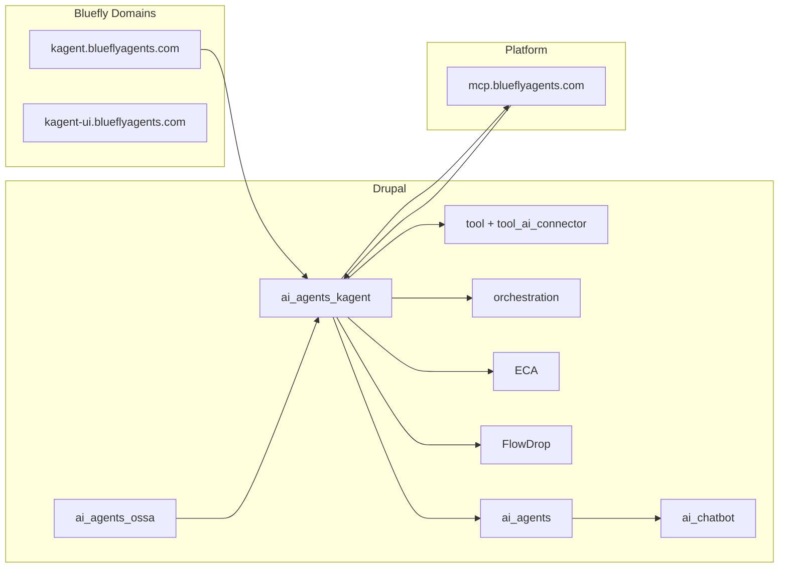

<!-- 03aec4eb-9d97-4ab7-a22f-cd24656768b6 -->
# Own Kagent End-to-End: Domains to Drupal Integration

## Current State (Summary)

- **Domains:** `kagent.blueflyagents.com` (API, port 30083), `kagent-ui.blueflyagents.com` (UI, port 30080); tunnel and NodePort config in agent-buildkit `config-templates/tunnel-routes.json` and `oracle-domains.config.ts`.
- **ai_agents_kagent:** Large module (30+ services, 10 Tool plugins, OSSA transformers, A2A/Messenger, ECA configs). **Missing:** orchestration submodule and FlowDrop submodule (documented in module AGENTS.md under `modules/` but **not present** in worktree). No native "catalog sync" entity or cron; no AiAgent plugin that invokes Kagent for chat.
- **ai_agents_ossa:** OssaAgent config entities, manifest_importer, Tool API bridge; orchestration exposes `ossa_invoke_agent`. Pattern to mirror for Kagent.
- **dragonfly_client_orchestration:** Reference implementation: `ServicesProvider` + `ToolManager`, prefix `dragonfly_client:`, GET/POST orchestration API.
- **MCP:** Platform MCP at mcp.blueflyagents.com; Drupal uses mcp_registry (remote client) and drupal/mcp for server. "Hook up MCP to Drupal" = Drupal calls platform MCP and/or exposes Kagent operations so external clients can trigger deploy/invoke via orchestration/Tool API.
- **Chat:** drupal/ai has ai_chatbot, ai_assistant_api; AgentDash uses router + Tool-based function calling. No Kagent-invoke backend yet.

## Architecture (High Level)

## Phase 1: Domains and Config (Single Source of Truth)

**Goal:** Canonical config for Kagent API and UI URLs; no hardcoded hosts in Drupal.

- **1.1** Ensure tunnel and deploy config list both hostnames with correct origins (already in `oracle-domains.config.ts` and `tunnel-routes.json`). Document in technical-docs or agent-buildkit wiki: "Kagent domains and deploy" (one-line pointer in AGENTS.md).
- **1.2** **ai_agents_kagent** settings: API base URL and UI URL must come from config (schema already has `api_url`, `ui_url` or equivalent). Default install config: empty or placeholder; site/config sync sets `https://kagent.blueflyagents.com` and `https://kagent-ui.blueflyagents.com`. Audit `config/install/*.yml` and `config/schema/*.yml`; ensure no hardcoded blueflyagents.com in install.
- **1.3** If Kagent API auth (e.g. Bearer or API key) is required, store via **drupal/key** and reference in KagentApiService; no secrets in config values.

**Deliverables:** Config schema and install defaults; wiki pointer; Key integration if needed.

---

## Phase 2: Kagent Catalog Sync in Drupal

**Goal:** Drupal holds a synced "catalog" of Kagent agents (list from Kagent API), usable by Views, ECA, and deploy flows.

- **2.1** **Catalog source:** Kagent API (e.g. GET list agents). Use existing `KagentApiService` (or http_client_manager operation) to GET agents from `api_url`. Define operation in http_client_manager or keep in KagentApiService with base_uri from config.
- **2.2** **Catalog storage:** Option A: config entity (e.g. `KagentCatalogAgent`) storing agent id, name, namespace, status, last_synced. Option B: cache or state with structured data; Option C: no persistent storage, "sync" = on-demand list from API. Prefer **config entity or dedicated cache key** so Views and ECA can reference "catalog" without calling API every time.
- **2.3** **Sync mechanism:** Cron or Drush command: `drush kagent:catalog-sync` (and/or hook_cron) that calls Kagent API, then updates config/cache. Expose as Tool plugin `ai_agents_kagent:sync_catalog` so ECA/FlowDrop can trigger sync.
- **2.4** **Integration with ai_agents_ossa:** When catalog sync runs, optionally map Kagent agents to OssaAgent entities (or link via agent id/name) so "deploy from OSSA" and "list in Kagent" stay aligned. Use existing `KagentToOssaTransformer` where applicable.

**Deliverables:** Catalog sync command + optional cron; Tool plugin; config entity or cache schema; doc in module AGENTS.md or wiki.

---

## Phase 3: Orchestration and FlowDrop Submodules

**Goal:** All Kagent Tool plugins exposed to orchestration and FlowDrop so n8n/Zapier/ECA/FlowDrop can deploy, scale, invoke, and monitor without custom code.

- **3.1** **ai_agents_kagent_orchestration (new submodule):** Create `modules/ai_agents_kagent_orchestration/` under ai_agents_kagent. Implement `ServicesProviderInterface` (same pattern as `dragonfly_client_orchestration`): id `ai_agents_kagent`, discover tools with prefix `ai_agents_kagent:` via `ToolManager`, return `Service` list with config from tool input definitions; `execute()` instantiates tool and runs. Register in `orchestration_services_provider` tag. Add `ai_agents_kagent_orchestration.info.yml` (depends on ai_agents_kagent, orchestration, tool).
- **3.2** **FlowDrop (ai_agents_kagent_flowdrop):** Create `modules/ai_agents_kagent_flowdrop/` with FlowDrop node types that wrap Kagent operations (e.g. "Kagent: Deploy Agent", "Kagent: List Agents", "Kagent: Invoke Agent"). Reuse Tool plugin logic under the hood so one implementation serves both Tool API and FlowDrop. Follow ai_agents_ossa_flowdrop pattern; depend on flowdrop, ai_agents_kagent.
- **3.3** **ECA:** Existing ECA config in `config/install/eca.model.*.yml`; ensure any new actions (e.g. "Sync Kagent catalog", "Invoke Kagent agent") are exposed as ECA actions if not already. Add ECA action plugins if needed for invoke/sync.

**Deliverables:** ai_agents_kagent_orchestration submodule (ServicesProvider); ai_agents_kagent_flowdrop submodule (FlowDrop nodes); ECA actions for sync/invoke if missing.

---

## Phase 4: MCP and Drupal

**Goal:** "Hook up MCP to Drupal" in both directions: Drupal can call platform MCP (e.g. for tools/skills), and Drupal exposes Kagent operations so MCP clients can trigger them.

- **4.1** **Drupal as MCP client:** Use **mcp_registry** (remote client) to call mcp.blueflyagents.com when Drupal needs platform tools (e.g. GitLab, skills). No change required in ai_agents_kagent for this; ensure mcp_registry is configured with MCP_URL and that ai_agents_kagent (or orchestration) can be used from flows that also call MCP.
- **4.2** **Drupal as MCP server / orchestration:** External clients (Cursor, n8n) that speak HTTP can already call Drupal **orchestration** API (GET /orchestration/services, POST /orchestration/service/execute). Once ai_agents_kagent_orchestration is in place, Kagent tools appear there. Document that "MCP users can trigger Kagent via Drupal orchestration" (same as OSSA invoke). Optional: expose Drupal orchestration or a subset of tools via drupal/mcp or mcp_registry so MCP protocol clients can list/call Kagent tools.
- **4.3** **Kagent and platform MCP:** Kagent agents can use MCP (RemoteMCPServer). ai_agents_kagent already has McpIntegrationService and KmcpService. Ensure Drupal can register or point Kagent agents at mcp.blueflyagents.com (or a per-agent MCP URL) via config so deployed agents have access to platform tools.

**Deliverables:** Orchestration provider (Phase 3) fulfills "expose Kagent to external automation"; doc in wiki for "MCP and Kagent in Drupal"; any config for Kagent->MCP URL.

---

## Phase 5: Deploy Kagent Agents from Drupal

**Goal:** Full deploy flow from Drupal UI and API: OSSA manifest or catalog selection -> deploy to Kagent (nested CRD: type + declarative).

- **5.1** **Deploy path:** Existing KagentDeploymentService, DeployAgentForm, and Tool `ai_agents_kagent:deploy_agent`. Ensure deploy uses **nested** Kagent CRD (spec.type + spec.declarative) per AGENTS.md "Kagent version compatibility". Validate with KagentApiService against live API (or mock in tests).
- **5.2** **OSSA -> Kagent:** ai_agents_ossa has OssaAgent entities; ai_agents_kagent has OssaToKagentTransformer. Add a clear path: "Deploy to Kagent" from an OssaAgent (e.g. form or Tool that takes ossa_agent_id, optional namespace/preset) -> load manifest -> transform -> POST to Kagent API. Optionally show "Deploy to Kagent" on ai_agents_ossa agent list/detail when ai_agents_kagent is enabled.
- **5.3** **Catalog -> Deploy:** From catalog-synced list, allow "Deploy" to re-deploy or scale an agent already on Kagent (idempotent). Use existing deploy Tool with agent id/name from catalog.

**Deliverables:** Documented deploy flow (OSSA + catalog); ensure nested CRD in all code paths; optional UI link from OSSA to Kagent deploy.

---

## Phase 6: Kagent Chat in Drupal (ai_chatbot / ai_agents)

**Goal:** Use Kagent agent as a "chat backend" inside Drupal so site users can converse with a Kagent-deployed agent via ai_chatbot or AI Assistant.

- **6.1** **Kagent invoke API:** Kagent exposes invoke (e.g. A2A or REST task endpoint). Confirm exact endpoint from kagent.dev (e.g. POST /api/a2a/namespace/name or invoke endpoint). Add http_client_manager operation or method in KagentApiService: `invokeAgent(namespace, name, message)` returning response/stream.
- **6.2** **AiAgent plugin:** Implement an **AiAgent** plugin (e.g. `KagentInvokeAgent`) in ai_agents_kagent that implements `AiAgentInterface`: determineSolvability() true for "chat" or task type; solve()/answerQuestion() calls KagentApiService.invokeAgent() with selected Kagent agent (namespace/name from config or entity). This makes the Kagent agent appear as a Drupal AI agent.
- **6.3** **ai_chatbot integration:** Configure an AI Assistant (drupal/ai) that uses an "agent" backend; attach the Kagent AiAgent plugin so the chatbot block can select "Kagent agent X" as the responder. Alternatively, add a custom chat block or route that calls Kagent invoke and streams response into the page (if Kagent supports streaming, map to ai_chatbot expectations).
- **6.4** **Optional embed of kagent-ui:** For "full Kagent chat UI" inside Drupal, embed kagent-ui.blueflyagents.com in an iframe (e.g. block or route) with proper sandbox/permissions. Less integrated than native AiAgent plugin but quick. Prefer **6.2–6.3** as primary; iframe as optional.

**Deliverables:** KagentApiService.invokeAgent(); AiAgent plugin KagentInvokeAgent; config/entity to select which Kagent agent(s) are available; doc for configuring ai_chatbot with Kagent.

---

## Phase 7: ECA, FlowDrop, and Tool API Consistency

**Goal:** Every Kagent capability that makes sense as automation is available as Tool, ECA action, and FlowDrop node; no duplicate logic.

- **7.1** **Tool API:** Existing 10 Tool plugins (DeployAgent, ListAgents, GetAgentStatus, ScaleAgent, TerminateAgent, RollbackAgent, SyncToKagent, BatchDeploy, GetAgentLogs, GetAgentMetrics). Add any missing: e.g. **InvokeKagentAgent** (for chat/task), **SyncCatalog** (Phase 2). Ensure all use config for API URL and Key for auth.
- **7.2** **ECA:** Audit `config/install/eca.model.*.yml`; add ECA actions that call Tool plugin execution (e.g. "Execute tool ai_agents_kagent:invoke_kagent_agent" with config mapping). Use contrib ECA "Execute Tool" action if available; otherwise custom action that calls ToolManager.
- **7.3** **FlowDrop:** Phase 3 delivers FlowDrop nodes; ensure they map 1:1 to Tool plugins so one implementation (Tool) drives both orchestration and FlowDrop.

**Deliverables:** InvokeKagentAgent + SyncCatalog Tool plugins; ECA models or actions for invoke/sync; FlowDrop nodes aligned with tools.

---

## Phase 8: Documentation and Reference Quality

**Goal:** The stack is a "shining example" for Kagent and Drupal engineers: clear docs, no hardcoded URLs, portable config.

- **8.1** **Wiki:** Publish a single GitLab Wiki page (technical-docs or ai_agents_kagent project): "Kagent-Drupal-Integration" covering: domains, config (API/UI URL, Key), catalog sync, orchestration/FlowDrop/ECA usage, deploy flow (OSSA + catalog), chat (AiAgent + ai_chatbot), MCP relationship. Link from AGENTS.md one-line pointer.
- **8.2** **Module AGENTS.md:** Update ai_agents_kagent AGENTS.md to reflect actual submodules (orchestration, flowdrop) once created; remove or mark as "planned" any that are not yet implemented.
- **8.3** **OpenAPI:** Ensure ai_agents_kagent OpenAPI spec (`openapi/ai_agents_kagent.yaml`) includes any new endpoints (invoke, catalog sync). Optionally register in api-schema-registry so api.blueflyagents.com lists Drupal Kagent bridge.

**Deliverables:** Wiki page "Kagent-Drupal-Integration"; updated module AGENTS.md; OpenAPI and api-schema-registry note.

---

## Implementation Order and Dependencies

| Phase | Depends on | Key repos/paths |
|-------|------------|------------------|
| 1 | None | ai_agents_kagent config/schema, agent-buildkit tunnel config |
| 2 | 1 | ai_agents_kagent: KagentApiService, new Tool SyncCatalog, cron/Drush |
| 3 | 1 | ai_agents_kagent/modules/ai_agents_kagent_orchestration, ai_agents_kagent_flowdrop |
| 4 | 3 | mcp_registry, orchestration; wiki |
| 5 | 2, 3 | KagentDeploymentService, OssaToKagentTransformer, ai_agents_ossa UI |
| 6 | 1, 5 | KagentApiService.invokeAgent, AiAgent plugin, ai/ai_chatbot config |
| 7 | 3, 6 | Tool InvokeKagentAgent, ECA actions, FlowDrop nodes |
| 8 | 1–7 | GitLab Wiki, AGENTS.md, openapi/ |

---

## Files and Locations (Reference)

- **Kagent config (URLs):** `worktrees/drupal/ai_agents_kagent/release-v0.1.x/config/` and `config/schema/`
- **Orchestration pattern:** `TESTING_DEMOS/.../dragonfly_client/modules/dragonfly_client_orchestration/src/ServicesProvider.php`
- **Tool plugins:** `worktrees/drupal/ai_agents_kagent/release-v0.1.x/src/Plugin/tool/Tool/`
- **OSSA transformers:** `ai_agents_kagent.ossa_to_kagent_transformer`, `ai_agents_kagent.kagent_to_ossa_transformer` in services.yml
- **AiAgent example:** `worktrees/drupal/ai_agents_kagent/release-v0.1.x/src/Plugin/AiAgent/ContentQualityAgent.php`; dragonfly_client has DragonflyOrchestratorAgent
- **Tunnel/routes:** `worktrees/agent-buildkit/.../config-templates/tunnel-routes.json`, `oracle-domains.config.ts`
- **Kagent OpenAPI (catalog):** `worktrees/agent-buildkit/.../openapi/kagent-catalog.openapi.yml`

---

## Out of Scope (Explicit)

- Changes to Kagent controller or kagent.dev upstream.
- Building a new MCP server in Drupal that duplicates agent-protocol; Drupal consumes MCP and exposes orchestration/Tool API.
- Duplicating OSSA manifest authoring in Drupal; ai_agents_ossa and openstandard-ui remain the sources; ai_agents_kagent only deploys and invokes.
