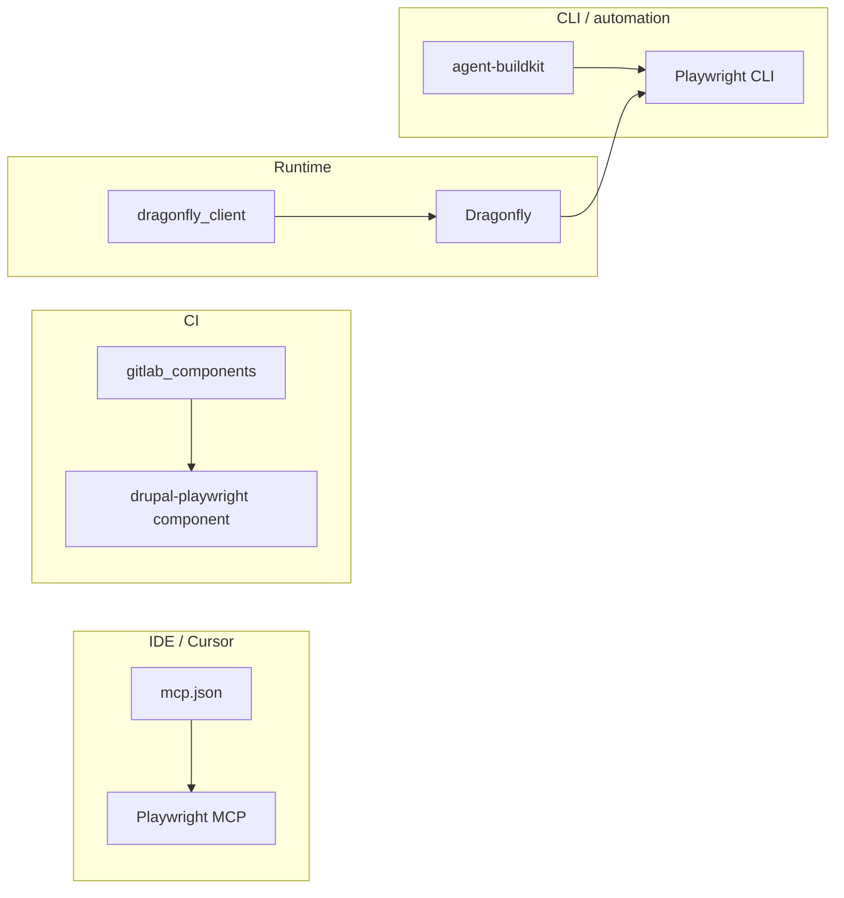

<!-- 03aec4eb-9d97-4ab7-a22f-cd24656768b6 -->
# Playwright E2E ownership and integration

## Current state

- **Playwright usage:** Many projects already use Playwright: openstandard-ui, NODE-AgentMarketplace, studio-ui, agent-buildkit, dragonfly, agent-tracer, workflow-engine, Drupal_AgentDash, api_normalization, alternative_services, recipe_secure_drupal, etc. Specs live in `e2e/`, `tests/e2e/`, or `website/tests/e2e/` with no single convention.
- **Playwright MCP:** Workspace `.mcp.json` has `playwright` with `npx -y @playwright/mcp@latest`. ide-supercharger Cursor template `templates/ide-configs/cursor/mcp.json` does **not** include Playwright. agent-protocol has optional `@executeautomation/playwright-mcp-server` and a stdio "playwright" entry in package.json.
- **Dragonfly:** `TestRunnerService.runPlaywright()` exists; trigger accepts `testTypes` (array of strings). A2A handler adds `e2e` when the user prompt mentions Playwright. No explicit `playwright` in Phase E schema; `testTypes` is free-form.
- **dragonfly_client:** Triggers Dragonfly with `testTypes` (e.g. phpunit, phpcs). No Playwright-specific Tool or config today; same trigger API can send `testTypes: ['playwright']` or `['e2e']` once Dragonfly invokes Playwright for that type.
- **CI:** gitlab_components has `examples/drupal-playwright-example.yml` referencing component `drupal-playwright@v1.0.0` (test_dir, playwright_config, base_url, browsers, etc.). Actual component template location in repo TBD; the example defines the expected contract.
- **Platform context:** MCP at mcp.blueflyagents.com, GKG at gkg.blueflyagents.com. E2E tests today do not systematically receive these URLs or a shared "platform context" (baseURL, MCP_URL, GKG_URL) for API/snapshot tests.

## Architecture (ownership per SOD)

- **ide-supercharger:** Owns Cursor/IDE MCP config (templates). Add Playwright MCP to the canonical template so every project gets it.
- **agent-buildkit:** Owns CLI and automation (SOD). Own "run Playwright with platform context": env template (MCP_URL, GKG_URL, baseURL), optional `playwright` or `e2e` subcommand that runs `playwright test` with project config and injected env. No new .sh scripts; use Node/TS or existing patterns.
- **gitlab_components:** Owns CI templates. Ensure `drupal-playwright` component exists and is the single source for Drupal + Playwright in CI; align with Dragonfly (same test_dir/playwright_config convention).
- **Dragonfly:** Already runs Playwright in containers. Treat `testTypes: ['playwright']` or `['e2e']` as first-class: when present, run Playwright from the same repo (e.g. `e2e/` or `tests/e2e/`) using a shared playwright.config that can read baseURL from env.
- **dragonfly_client:** Expose "Run E2E (Playwright)" via existing trigger Tool: add a preset or doc so testTypes include `playwright`/`e2e`; optional Drush command or block that triggers Dragonfly with Playwright test type.

## 1. Additional E2E test categories to add

Recommend adding or standardizing these **across projects** (pick per project):

| Category | Purpose | Example specs |
|----------|---------|----------------|
| **Platform connectivity** | Smoke-test MCP, GKG, health endpoints with baseURL from env | `e2e/platform-health.spec.ts`: GET MCP_URL/health, GKG_URL/api/info, optional mesh/router. |
| **Drupal login and Tool API** | For Drupal sites: login, then call a Tool or REST (e.g. Kagent sync, Dragonfly trigger) | `e2e/drupal-tool-api.spec.ts`: login, POST /api/kagent/tools/.../execute or dragonfly trigger. |
| **Marketplace / OSSA UI** | List agents, open Create, validate manifest (already in openstandard-ui/NODE-AgentMarketplace) | Extend existing homepage/features specs; add "validate manifest" and "create agent" flow. |
| **Dragonfly trigger and result** | From a test runner: trigger Dragonfly with testTypes including playwright, poll until done, assert artifacts | `e2e/dragonfly-roundtrip.spec.ts`: POST /tests/trigger with testTypes: ['playwright'], GET run status, assert summary. |
| **Accessibility (a11y)** | axe-core or Playwright a11y; run on key pages | Many projects already have accessibility.spec.ts; standardize on one config (e.g. playwright.config baseURL + a11y project). |
| **Visual / snapshot** | Optional per project; same Playwright config, add expect(page).toHaveScreenshot() where useful. | Keep in existing specs or add visual.spec.ts. |

**Where to add first:** Use **agent-buildkit** as the reference project for "platform connectivity" and "Dragonfly roundtrip" E2E (it already has e2e:playwright). Use **openstandard-ui** and **NODE-AgentMarketplace** for OSSA/marketplace flows. Use **TESTING_DEMOS/DEMO_SITE_drupal_testing** (or one Drupal demo) for Drupal login + Tool API + dragonfly_client trigger E2E.

## 2. Connect E2E to MCP, GKG, and tools (max context)

- **Environment injection:** Single source: agent-buildkit `config-templates/platform-endpoints.json` (or platform-env) already has MCP_URL, GKG_URL, etc. Playwright projects should receive these via env:
  - In **playwright.config.ts**: `process.env.MCP_URL`, `process.env.GKG_URL`, `process.env.BASE_URL` (or baseURL for Drupal/site under test).
  - In **agent-buildkit**: When running `playwright test`, ensure env is loaded (e.g. from platform .env.local or from a small helper that reads config-templates).
- **MCP/GKG inside tests:** E2E specs can call platform APIs (fetch MCP health, GKG /api/info) if tests run in Node and have network. For **agent-driven** flows (exploratory, self-healing), use **Playwright MCP** in the IDE (already in .mcp.json): agent takes snapshot, navigates, clicks; no change to Playwright CLI specs.
- **Documentation:** Add a short "E2E and platform context" section to agent-buildkit wiki (or AGENTS.md pointer): set MCP_URL, GKG_URL, BASE_URL before `playwright test`; use same env in CI (GitLab CI variables) and when Dragonfly runs Playwright.

## 3. Playwright MCP: install and integrate into our tools

- **Install:** Already in workspace `.mcp.json`: `"playwright": { "command": "npx", "args": ["-y", "@playwright/mcp@latest"] }`. No extra install step for Cursor.
- **ide-supercharger:** Add `playwright` to `templates/ide-configs/cursor/mcp.json` so any project using the canonical template gets Playwright MCP (and gitlab, gitlab-kg, etc.) by default.
- **agent-protocol:** Optional: document that when using MCP at mcp.blueflyagents.com, agents can use GitLab/GKG tools; for **browser** automation they use a local Playwright MCP (stdio) since browser runs on the client. No need to host Playwright MCP on Oracle for typical Cursor/IDE use.
- **Optional:** If a future "E2E test generator" agent is desired, that agent would use Playwright MCP (local) + MCP (remote) for context; out of scope for this plan.

## 4. Single npm project so all others can add it

**Choice:** Use **agent-buildkit** as the single place for "Playwright + platform context" **CLI and config**, not a new package. Rationale: SOD assigns CLI/automation to agent-buildkit; creating a new @bluefly/playwright-e2e would duplicate ownership. Alternative: a thin **shared config package** (e.g. `@bluefly/playwright-config`) that only exports playwright.config base and env schema; then agent-buildkit and others depend on it. Prefer **no new repo**: extend agent-buildkit with:

- **Config template:** e.g. `config-templates/playwright-base.config.ts` (or .js) that reads BASE_URL, MCP_URL, GKG_URL from env and sets baseURL, projects (smoke, a11y, default). Projects that want "platform context" copy or extend this.
- **CLI:** Optional subcommand or npm script in agent-buildkit: e.g. `buildkit e2e` or `buildkit playwright` that (1) loads platform env, (2) runs `npx playwright test` with cwd and config path (e.g. current project or a path argument). So "add to all others" = add dependency on `@bluefly/agent-buildkit` (or run via npx) and optionally use the shared config template; each project keeps its own `e2e/` and `playwright.config.ts` that can extend the template.

**Adding to other npm projects:** Each project keeps `@playwright/test` and its own specs. To "add platform context": (1) Ensure env (MCP_URL, GKG_URL, BASE_URL) is set before `playwright test` (CI and local); (2) Optionally use a shared base config from agent-buildkit (copy config-templates/playwright-base.config.ts into the project or merge its options). No need to add agent-buildkit as a runtime dependency for tests only; use npx when running from buildkit, or document env vars for each repo's CI.

## 5. Dragonfly: first-class Playwright / E2E

- **Trigger contract:** Phase E already has `testTypes: z.array(z.string()).optional()`. Standardize on `testTypes` including `'playwright'` or `'e2e'` when the run should execute Playwright (in addition to phpunit, phpcs, etc.).
- **TestRunnerService:** Already has `runPlaywright()`. Ensure the path and config are resolved from the repo (e.g. `e2e/` or `tests/e2e/`, and `playwright.config.ts` at repo root or in that dir). If not already, accept a project-relative path from trigger or config (e.g. `e2e/`).
- **Env in container:** When Dragonfly runs Playwright inside Docker/DDEV, inject BASE_URL (and optionally MCP_URL, GKG_URL) so specs can hit the site under test and platform endpoints. Document in Dragonfly README or schema.
- **Artifacts:** Playwright HTML report and traces should be collected as run artifacts (Dragonfly already has artifact handling; ensure Playwright output dir is included).

## 6. dragonfly_client (Drupal): trigger Playwright from Drupal

- **Tool:** dragonfly_client already has a Tool that triggers Dragonfly (e.g. trigger_test). Ensure it accepts or documents `testTypes` including `playwright` / `e2e`. No new Tool required if the existing trigger Tool passes through testTypes.
- **UI:** Optional: block or admin link "Run E2E (Playwright)" that calls the trigger with testTypes: ['playwright']. Document in dragonfly_client.
- **Drush:** Optional: `drush dragonfly:trigger --test-types=playwright,phpunit` (or similar) for CLI users.

## 7. gitlab_components and Drupal projects

- **Ensure drupal-playwright component exists:** In gitlab_components repo, add or locate the component template that matches `examples/drupal-playwright-example.yml` (inputs: test_dir, playwright_config, base_url, browsers, etc.). If it lives elsewhere (e.g. in a separate repo), document the canonical component URL.
- **Convention:** Drupal projects that want Playwright in CI: include the component, put specs in `tests/playwright/` or `e2e/`, and use the same layout so Dragonfly can run the same tests (same test_dir and config path).

## Implementation order

1. **ide-supercharger:** Add Playwright MCP to `templates/ide-configs/cursor/mcp.json`.
2. **agent-buildkit:** Add config-templates/playwright-base.config.ts (or equivalent) and document MCP_URL, GKG_URL, BASE_URL; optional `buildkit e2e` or script that runs Playwright with platform env.
3. **agent-buildkit E2E:** Add at least one "platform connectivity" and one "Dragonfly roundtrip" spec; wire env in playwright.config.
4. **Dragonfly:** Document and support testTypes `playwright`/`e2e`; ensure runPlaywright path and env (BASE_URL, etc.) and artifacts are correct.
5. **dragonfly_client:** Document (and if needed, add) triggering with testTypes including playwright; optional UI/Drush.
6. **gitlab_components:** Confirm or add drupal-playwright component; align example with Dragonfly test_dir/config convention.
7. **Wiki/AGENTS.md:** Short "Playwright E2E and platform context" and "Dragonfly Playwright" runbooks; link from AGENTS.md.

## Files to touch (summary)

| Location | Change |
|----------|--------|
| ide-supercharger `templates/ide-configs/cursor/mcp.json` | Add `playwright` server (npx @playwright/mcp@latest). |
| agent-buildkit `config-templates/` | Add playwright-base.config.ts (or .mjs) and env docs. |
| agent-buildkit `e2e/` or `tests/e2e/` | Add platform-health.spec.ts, dragonfly-roundtrip.spec.ts (or equivalent). |
| agent-buildkit `package.json` | Optional script e2e or playwright that loads env and runs playwright test. |
| Dragonfly trigger schema / docs | Explicitly support testTypes `playwright` / `e2e`; env and artifacts. |
| dragonfly_client | Doc and/or small change so trigger supports testTypes including playwright. |
| gitlab_components | Add or confirm drupal-playwright component template. |
| AGENTS.md / wiki | Pointers to Playwright E2E and Dragonfly Playwright runbooks. |

No new npm package or new GitLab project; extend agent-buildkit, ide-supercharger, Dragonfly, dragonfly_client, and gitlab_components only.
