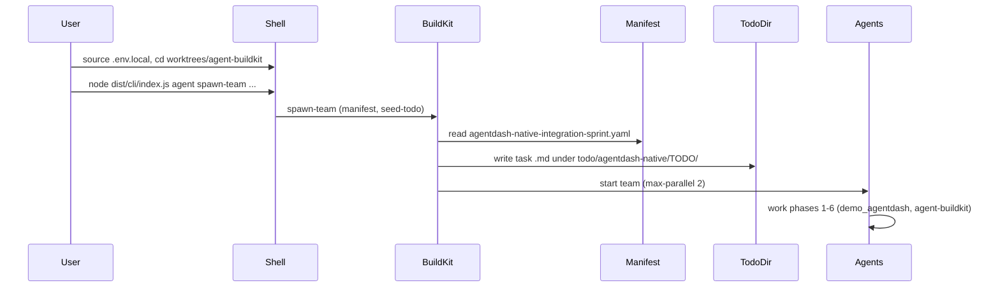

<!-- 0a794af7-6209-4bce-9406-97477c355eab -->
# Spawn agents and build AgentDash sprint

## Current state

- **Manifest:** `worktrees/agent-buildkit/.gitlab/agent-sprint/agentdash-native-integration-sprint.yaml` (6 tasks, phases 1–6).
- **Seed todo:** `~/.agent-platform/agent-buildkit/todo/agentdash-native` (created; spawn will write task `.md` files under `TODO/`).
- **CLI:** Built from `worktrees/agent-buildkit`; entry point is **`node dist/cli/index.js`** (or `bin/buildkit` which runs that after build). No need for global `buildkit` or npx for this run.

## Execution steps

### 1. Load platform token

So spawned agents can use GitLab/MCP, source the platform env before running spawn:

```bash
[ -f /Volumes/AgentPlatform/.env.local ] && source /Volumes/AgentPlatform/.env.local
```

If NAS is not mounted, ensure `GITLAB_TOKEN` (or `GITLAB_TOKEN_PAT`) is set in the shell by other means (see AGENTS.md "Single-root token").

### 2. Run spawn-team from agent-buildkit worktree

**Required:** Run from the **agent-buildkit worktree root** so the manifest path `.gitlab/agent-sprint/agentdash-native-integration-sprint.yaml` resolves.

```bash
cd $HOME/Sites/blueflyio/worktrees/agent-buildkit
WORKTREE_SOURCE_DIR=$HOME/Sites/blueflyio/worktrees \
  node dist/cli/index.js agent spawn-team \
  --manifest agentdash-native-integration-sprint \
  --seed-todo $HOME/.agent-platform/agent-buildkit/todo/agentdash-native \
  --max-parallel 2
```

- **WORKTREE_SOURCE_DIR:** So spawn finds project dirs (e.g. demo_agentdash) under `worktrees/`.
- **--seed-todo:** Tasks are written under `todo/agentdash-native/TODO/` from the manifest; then the team is started.
- **--max-parallel 2:** Limit concurrent agents (identities are finite; adjust if needed).

Optional: set `BUILDKIT_CWD=$HOME/Sites/blueflyio/worktrees/agent-buildkit` if any spawn logic uses cwd for config.

### 3. Optional: add npm script for repeat runs

In `worktrees/agent-buildkit/package.json` scripts, add:

```json
"spawn:agentdash-native": "node dist/cli/index.js agent spawn-team --manifest agentdash-native-integration-sprint --seed-todo $HOME/.agent-platform/agent-buildkit/todo/agentdash-native --max-parallel 2"
```

Then after `npm run build:cli`, run:

```bash
WORKTREE_SOURCE_DIR=$HOME/Sites/blueflyio/worktrees npm run spawn:agentdash-native
```

## Flow (high level)



## Success criteria

- Spawn command exits 0 (or runs until user interrupt).
- Under `~/.agent-platform/agent-buildkit/todo/agentdash-native/TODO/` there are task files (e.g. phase-1, phase-2, ...) generated from the manifest.
- Agents run and make progress on the six phases (repo sync, platform-import, orchestration, FlowDrop/ECA, n8n, wiki) per the plan.

## If spawn fails

- **"No available agent identities":** Reduce `--max-parallel` to 1 or use `--computer M4`/`M3` per AGENTS.md (8 identities total).
- **Token/401:** Run `buildkit gitlab token check` after sourcing `.env.local`; fix token in `/Volumes/AgentPlatform/.env.local` if invalid.
- **Module not found:** Run `npm run build:cli` from `worktrees/agent-buildkit` again so `dist/cli/index.js` is present.
