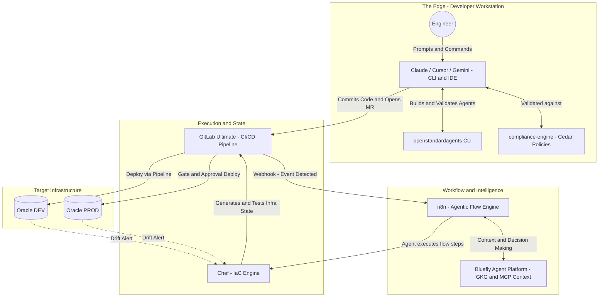
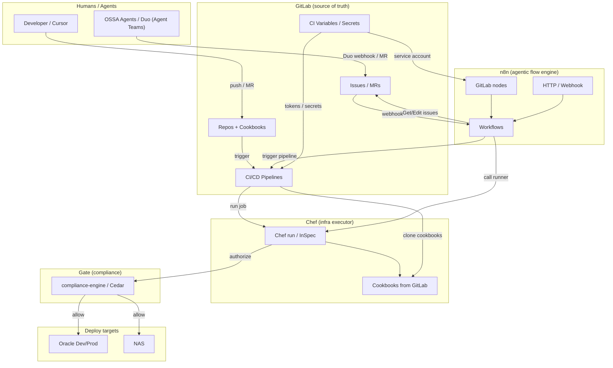

# Architecture Specification: The Unified Agentic Operations Platform

> **Authoritative version:** This page is the canonical spec. It is published from agent-buildkit to the GitLab Wiki: [Unified-Agentic-Operations-Platform](https://gitlab.com/blueflyio/agent-platform/tools/agent-buildkit/-/wikis/Unified-Agentic-Operations-Platform).

This document outlines the architectural master plan and execution specification for the Bluefly Agent Platform ecosystem: an autonomous, policy-governed system for deployment automation and infrastructure management, routed through GitLab Ultimate to Oracle (Dev and Prod) environments.

---

## 1. The Core Mission

- **Zero-Touch Deployments:** Automate all deployments to Oracle Dev and Oracle Prod for every service and domain via GitLab CI pipelines.
- **Standardized Agents:** Use the openstandardagents CLI to build, define, and cryptographically validate all agents.
- **Irrefutable Governance:** Deploy compliance-engine with Cedar policies to enforce access control and guardrails on AI agents (Claude, Cursor, Gemini, platform).
- **Agentic Orchestration:** Use n8n to construct agentic flows that direct standardized agents to use Chef for infrastructure provisioning and state management.

---

## 2. Ecosystem Components and Responsibilities

### 2.1 The Developer and AI Interface (The Edge)

- **Claude / Cursor / Gemini:** Local interfaces and CLI endpoints; work with the engineer to scaffold code, write recipes, and interact via Terminal.
- **compliance-engine (Cedar Policies):** Intercepts all actions by local AI agents. Before an agent in Cursor executes a terminal command or pushes infra code, the action is evaluated against Cedar policies.
- **openstandardagents CLI:** Required toolset to scaffold, validate, and package agent persona, tools, and capabilities.

### 2.2 n8n (The Agentic Flow Engine)

- **Orchestration of Intent:** Central nervous system for agentic flows; multi-step routing once a standardized agent determines a course of action.
- **Tool Dispatcher:** Explicit pathways to trigger Chef Automate, query external APIs, or manage GitLab Merge Requests.

### 2.3 Chef (The Infrastructure Executor)

- **State Enforcement:** Triggered by n8n flows; executes IaC recipes to change state on target compute environments.
- **Drift Remediation:** Monitors Oracle environments; on drift, Chef alerts n8n, which triggers a remediation flow handled by agents.

### 2.4 GitLab Ultimate (The Deployment Pipeline)

- **The Iron Gate to Prod:** Source of truth and deployment mechanism. Nothing goes to Oracle Dev or Prod outside GitLab CI/CD.
- **Agent Identity Management:** Every agent has a dedicated GitLab Service Account; agents authenticate only via these accounts.
- **Agent Approval Flows:** MRs from agents (via n8n and service accounts) go through security scanning and compliance checks before the pipeline promotes Chef code to Oracle.

### 2.5 Oracle Infrastructure (Dev and Prod)

- **Target Environments:** Destination for all automated deployments; segmented into Dev and Prod over Tailscale (oracle-platform.tailcf98b3.ts.net).

---

## 3. Topographical Flow Architecture

---

## 4. The Agentic Lifecycle (End-to-End Workflow)

1. **Agent Definition:** Developer uses openstandardagents CLI to generate a specialized Infrastructure Agent.
2. **Policy Compilation:** Agent identity and capabilities are registered in compliance-engine; business rules compiled into Cedar policies.
3. **Local Execution:** Developer tasks the agent (e.g. in Cursor) to build an environment on Oracle; agent generates Chef Cookbook. Before save/execute, the action is validated as ALLOW by Cedar.
4. **Flow Triggering:** Code is committed to GitLab; GitLab pings n8n.
5. **Agentic Flow (n8n):** n8n wakes the Open Standard Agent; agent defines the test matrix and triggers Chef Test Kitchen via n8n to validate Oracle Dev.
6. **Pipeline Promotion:** Once the agent verifies the Chef run in isolation, it approves the MR. GitLab Ultimate runs final security layers and deploys to Oracle Dev, then Oracle Prod.

---

## 5. Security and the Compliance Engine

- **Zero Trust for AI:** No LLM has inherent trust; every tool call and file creation is evaluated against a structured Cedar policy.
- **Dedicated GitLab Service Accounts:** Each agent has its own Service Account (e.g. srv-agent-chef-provisioner); Cedar policies can bind to specific agent identities.
- **Example Policy:** Agent X (Service Account srv-agent-x) may be ALLOWED to generate Chef code but DENIED from `git push` on branches matching `release/*` or `prod/*`.

### 5.1 The Token Policy (AGENTS.md and CLAUDE.md Governance)

The platform enforces zero-trust, verifiable token injection as defined in repo `AGENTS.md` and `CLAUDE.md`:

- **Single-Root Token Rule:** Vaults (e.g. 1Password) are the only valid secure sink. A master token must never live in `.env.local`, config trees, or the codebase.
- **Manual and Local Injection (Sinks):** When an engineer or local CLI needs Git operations, inject `GITLAB_TOKEN` or `GITLAB_REGISTRY_NPM_TOKEN` from 1Password into the sink (BuildKit/NAS or Oracle). When the shell exits, the token is not persisted.
- **Service-Driven Automation:** Automated deployments (n8n, Chef, GitLab Ultimate) use rotating **GitLab Service Account tokens** only. No manual injection; minimum required privileges per agent.

---

## 6. Gaps, Risks, and What Is Missing

### 6.1 Secret and Credential Injection

- **Gap:** Agents, n8n, and Chef need Oracle Cloud credentials, SSH keys, and database passwords without leaking them.
- **Fix:** Use a dedicated secrets manager (e.g. HashiCorp Vault or GitLab Secrets). Agents must never see raw secrets; n8n should retrieve and inject them at execution time.

### 6.2 Agent Sandbox and Verification

- **Gap:** Need to test that a Cedar policy actually stops an agent from doing something destructive before using the agent in Cursor.
- **Fix:** An isolated, ephemeral Agent Sandbox where agents run mock tasks against a simulated GitLab/Chef environment to prove policies work.

### 6.3 Automated Rollback Strategy

- **Gap:** After n8n orchestrates a Chef deployment to Oracle Prod, if the application breaks, who initiates rollback?
- **Fix:** GitLab CI must have a hardcoded, human-triggered or metric-triggered (e.g. Grafana) "revert and deploy" pipeline. Agents should not own emergency production rollbacks until proven reliable.

### 6.4 Zero Trust Ingress & Domain Management (Cloudflare Tunnels & Tailscale)

- **Gap:** Chef configures target nodes; what automates Cloudflare DNS and SSL certificate provisioning for new domains without exposing public IPs to the internet?
- **Fix:** n8n workflows must interface with the Cloudflare API to dynamically provision **Cloudflare Tunnels** (`cloudflared`) and DNS records automatically prior to Chef deploying the application payload. Simultaneously, all internal platform management, database replication, and Agent-to-Agent (A2A) MCP communication must be strictly bound to the **Tailscale** overlay network.

### 6.5 Immutable Audit Trails for AI Actions

- **Gap:** When an agent in Cursor triggers an n8n webhook, how do you audit why the agent made that decision months later?
- **Fix:** Ship agent telemetry and reasoning logs (Chain of Thought) to a centralized logging system (e.g. ELK or Datadog) alongside Chef run logs and GitLab pipeline outputs.

---

## 7. Execution: Lighting Up the Data Flow

### 7.1 n8n + Chef + GitLab Data Flow Map

**One-line summary:** GitLab is the source of truth; n8n drives workflows and talks to GitLab (and can trigger CI/Chef); Chef runs from CI and is gated by Cedar; deploy targets are Oracle/NAS.

### 7.2 Phase 1 Plan: How to Light It Up

| Phase | What | How |
| --- | --- | --- |
| **1. n8n + GitLab (now)** | Issue triage, MR triggers, no new BuildKit triage | **n8n workflow**: GitLab "Get Issues" (filter by label e.g., `needs-triage`) → "Edit issue" (set labels, assign). **Webhook**: GitLab → n8n on issue/MR events. Use service account token in n8n credentials. |
| **2. Chef in GitLab** | Cookbooks and InSpec in repos, CI runs them | Create (or move) cookbooks to a GitLab repo (e.g., `blueflyio/agent-platform/infra/chef-cookbooks`). **CI job**: `chef-run` or `inspec exec` on push to main or on tag. No new BuildKit; just GitLab CI + Chef CLI. |
| **3. n8n → CI** | Workflows trigger pipelines | n8n "HTTP Request" or GitLab node "Trigger pipeline" for a project/branch. Use for: "on issue labeled `deploy-staging` → trigger deploy pipeline" or "on schedule → run compliance InSpec". |
| **4. Cedar gate** | Every deploy/Chef run checked by compliance-engine | CI job or n8n step: POST to `compliance-engine` (Cedar) with context (who, what, target). Proceed only if allowed. Extend to Chef/Oracle deploy. |
| **5. Zero-touch deploy** | Oracle/NAS from GitLab + Chef | Pipeline on main (or release): run Chef/InSpec, pass Cedar, then deploy. Secrets from GitLab CI variables or 1Password injection; **no master token in files**. |

### 7.3 What to Do First (Concrete Next Steps)

1. **n8n Workflow Creation**: Create one workflow: "GitLab – get issues where label = `needs-triage`" → "Edit issue" (add label `triaged`, optional assign). Set a webhook in GitLab (project/group) to n8n so it runs on issue events. Use a GitLab service account token in n8n.
2. **Chef Repository Layout**: One GitLab repo for cookbooks; one CI job that runs `chef-run` or `inspec exec` on that repo. Prove "push to GitLab → Chef runs."
3. **Spawn Model-Agnostic Agent Swarms**: Instead of relying solely on Claude's `agent-teams`, build for cross-model interoperability. Use **LiteLLM** as the unified gateway to route requests to the best foundational model. Orchestrate the agents using **OpenAI Swarm** or **OpenStandardAgents (OSSA)** protocols, bridging their context via **MCP** and **A2A**. Spawn specialized sub-agents: an **"n8n Workflow Engineer"** (OpenAI), a **"Chef Architect"** (Claude), and a **"Cedar Auditor"** (Gemini). They collaborate via GitLab MRs, handing off tasks using the standardized OSSA interaction schemas.

### 7.4 Two Parallel Agent Platoons (Strictly Isolated by Domain)

Two independent, parallel agent workflows run without stepping on each other or causing race conditions. Hand these instructions directly to agent swarms or sub-agents.

**Platoon A: The n8n & GitLab Orchestrator**

- **Domain:** Webhook endpoints, n8n UI, GitLab event triggers.
- **Goal:** Prove the foundational bidirectional loop.
- **Where n8n runs:** **Oracle only (production).** n8n must run on **Oracle** so it is always available for GitLab webhooks. Do not run n8n only on NAS or local for production webhook flows; GitLab cannot reach local/NAS reliably. Production URL: **https://n8n.blueflyagents.com** (tunnel route to Oracle port 5678). NAS/local may run n8n for ad-hoc testing only; the webhook URL configured in GitLab must point at the Oracle-hosted n8n URL.
- **What this agent does:** Creates the Service Account in GitLab, injects the PAT into n8n as a credential, spins up an n8n webhook listener **on Oracle**, binds it to GitLab issue/MR events, and builds a flow where n8n catches an issue event and uses the Service Account to post a comment back to the issue declaring success.
- **Why it won't conflict:** This agent touches nothing regarding infrastructure, Cloudflare, Tailscale, or CI pipelines. It focuses entirely on establishing the API control plane.

**Platoon B: The Zero-Trust Ingress Architect**

- **Domain:** cloudflared API scripting, infrastructure YAML topologies, GitLab CI configs.
- **Goal:** Prove "Cloudflare Tunnel Config as Code."
- **What this agent does:** Locates the existing agent-docker ConfigMap (or NAS JSON reference), writes an idempotent script that reads the desired *blueflyagents.com hostnames mapped to internal Tailscale IPs, authenticates against the Cloudflare API, and automatically provisions/updates the Tunnel ingress rules and CNAMEs. It then creates the `.gitlab-ci.yml` job so this script runs on main merges.
- **Why it won't conflict:** This agent never touches webhooks, MR events, or n8n nodes. It only reads static infrastructure YAML and writes API scripts for CI.

Once both sub-agents successfully merge their branches, the platform has a verified n8n-to-GitLab loop and dynamic Zero-Trust ingress provisioning. Then bring them together so n8n can trigger the Chef pipeline knowing Cloudflare Tunnels will be securely opened beforehand.

**7.5 n8n hosting: Oracle (production), NAS/local (backup or dev only)**

- **Oracle:** n8n runs on **Oracle** for production. It is always available at **https://n8n.blueflyagents.com** (Cloudflare Tunnel to Oracle port 5678). All GitLab webhooks, Platoon A flows, and Chef-triggering workflows must use this URL so GitLab and external systems can reach n8n 24/7.
- **NAS:** May run n8n as a backup when Oracle is down; use Tailscale URL for internal testing only. Do not point GitLab webhooks at NAS unless Oracle is unavailable and you have updated DNS/tunnel to fail over.
- **Local (Mac):** Run n8n locally only for development or one-off testing. GitLab cannot deliver webhooks to localhost; do not use local n8n for any production webhook or Platoon A flow.

### 8. Canonical Reference Catalog

This is the primary source-of-truth index set for the Unified Agentic platform. *(Note: Blogs and listicles are strictly excluded from this catalog to prevent context poisoning).*

### 8.1 Agents and Interop
- **OSSA**: [openstandardagents.org](https://openstandardagents.org) | [GitHub](https://github.com/blueflyio/openstandardagents)
- **Anthropic / Claude**: [Agent SDK](https://platform.claude.com/docs/en/agent-sdk/overview) | [Claude Code Setup](https://docs.claude.com/en/docs/claude-code/setup) | [Agent Teams](https://code.claude.com/docs/en/agent-teams)
- **OpenAI**: [Agent Guides](https://platform.openai.com/docs/guides/agents) | [Swarm GitHub](https://github.com/openai/swarm) | [AgentKit Introduction](https://openai.com/index/introducing-agentkit/)
- **MCP**: [Model Context Protocol](https://modelcontextprotocol.io) | [TS SDK](https://github.com/modelcontextprotocol/sdk-typescript)
- **A2A**: [A2A NPM](https://www.npmjs.com/package/@agentic-profile/a2a) | [Google A2A Announcement](https://developers.googleblog.com/en/a2a-a-new-era-of-agent-interoperability/)
- **kagent**: [kagent.dev](https://kagent.dev) | [kmcp docs](https://kagent.dev/docs/kmcp)

### 8.2 GitLab (Agents, CI/CD, Governance)
- **Duo Agent Platform**: [Custom Agents](https://docs.gitlab.com/user/duo_agent_platform/agents/custom/) | [AI Catalog](https://docs.gitlab.com/user/duo_agent_platform/ai_catalog/)
- **GitLab Kubernetes Agent**: [Install Guide](https://docs.gitlab.com/user/clusters/agent/install/)
- **CI/CD Authoring**: [CI Components](https://docs.gitlab.com/ci/components/) | [CI Inputs](https://docs.gitlab.com/ci/inputs/)
- **Pipelines & Policy**: [Merged Results Pipelines](https://docs.gitlab.com/ci/pipelines/merged_results_pipelines/) | [Merge Trains](https://docs.gitlab.com/ci/pipelines/merge_trains/) | [Push Rules](https://docs.gitlab.com/user/project/repository/push_rules/)

### 8.3 Drupal 11 & AI Modules
- **Drupal Core**: [API Docs](https://api.drupal.org/api/drupal/11.x)
- **AI Integration**: [AI Module](https://www.drupal.org/project/ai) | [AI Agents](https://www.drupal.org/project/ai_agents) | [Drupal MCP Client](https://www.drupal.org/project/mcp_client)
- **Vector DB Providers**: [Qdrant Module](https://www.drupal.org/project/ai_vdb_provider_qdrant) | [Milvus Module](https://www.drupal.org/project/ai_vdb_provider_milvus) | [pgvector](https://github.com/pgvector/pgvector)
- **Experience Builder (Canvas)**: [Canvas Project](https://project.pages.drupalcode.org/canvas/) | [SDC Components](https://project.pages.drupalcode.org/canvas/sdc-components)

### 8.4 LLM Gateway & Service Framework
- **LiteLLM**: [Deploy Proxy](https://docs.litellm.ai/docs/proxy/deploy)
- **FastAPI**: [tiangolo.com](https://fastapi.tiangolo.com/)
- **Ollama**: [GitHub Hub](https://github.com/ollama/ollama) | [ngrok Gateway](https://ngrok.com/docs/universal-gateway/examples/ollama/)

### 8.5 Observability & Evaluation
- **Tracing**: [Langfuse Docs](https://docs.langfuse.com/) | [Helicone](https://docs.helicone.ai/) | [Arize Phoenix](https://docs.arize.com/phoenix/) | [OpenLLMetry](https://github.com/traceloop/openllmetry/)
- **Eval**: [DeepEval](https://github.com/confident-ai/deepeval) | [Ragas](https://github.com/explodinggradients/ragas)

### 8.6 API Standards & IDE Extensions
- **API Toolchain**: [OpenAPI](https://www.openapis.org/) | [Redocly](https://redocly.com/docs/redoc/) | [Zod](https://github.com/colinhacks/zod)
- **Cursor**: [Cloud Agent Docs](https://cursor.com/docs/cloud-agent) | [MCP Conf](https://cursor.com/docs/context/mcp) | [Cursor Tools NPM](https://www.npmjs.com/package/cursor-tools/v/0.0.11)

### 8.7 Infrastructure Primitives
- **Core OS**: [Kubernetes Docs](https://kubernetes.io/docs/) | [Helm](https://helm.sh/docs/) | [Istio](https://istio.io/latest/docs/)

### 8.8 Networking & Zero Trust Overlay
- **Tailscale**: The definitive secure mesh overlay for all internal environment interactions, agent context bridging, and CI/CD Oracle/NAS deployments ([Tailscale KB](https://tailscale.com/kb)).
- **Cloudflare Tunnel**: The secure ingress routing layer `cloudflared` preventing public IP exposure and providing Zero Trust outer-rim access ([Cloudflare Docs](https://developers.cloudflare.com/cloudflare-one/connections/connect-networks/)).

> **Topology Note:**
> The primary endpoints for intelligence flows remain routed through Tailscale `oracle-platform.tailcf98b3.ts.net` and `blueflynas.tailcf98b3.ts.net`.
