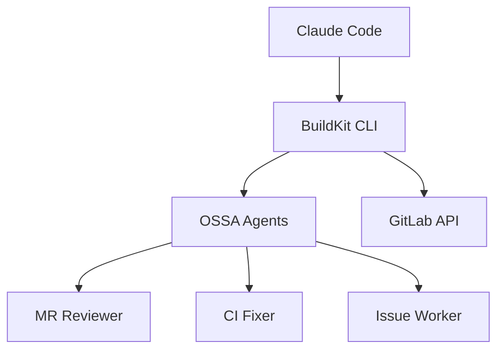
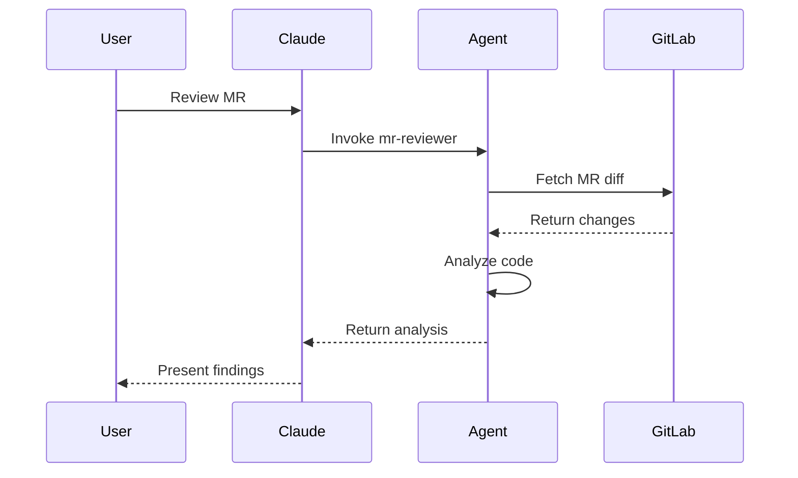
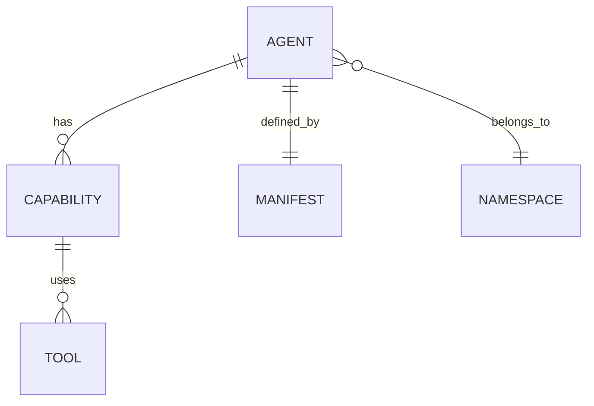

# Wiki Aggregator Agent Skill

**OSSA Agent**: `wiki-aggregator` | **Version**: 1.0.0 | **Namespace**: blueflyio

This skill invokes the **wiki-aggregator** OSSA agent for documentation aggregation and wiki management.

## Quick Start

```bash
# Clone wiki repository
git clone git@gitlab.com:blueflyio/agent-platform/technical-docs.wiki.git

# Or via API
glab api projects/:id/wikis
```

## Agent Capabilities (from OSSA Manifest)

### Wiki Management
| Capability | Category | Autonomy | Description |
|------------|----------|----------|-------------|
| `wiki_sync` | action | fully_autonomous | Sync wiki content |
| `wiki_create` | action | fully_autonomous | Create wiki pages |
| `wiki_update` | action | fully_autonomous | Update wiki pages |
| `cross_project_linking` | action | fully_autonomous | Link across projects |

### Documentation Generation
| Capability | Category | Autonomy | Description |
|------------|----------|----------|-------------|
| `doc_generation` | action | fully_autonomous | Generate docs from code |
| `api_documentation` | action | fully_autonomous | Generate API docs |
| `diagram_generation` | action | fully_autonomous | Create Mermaid diagrams |
| `changelog_generation` | action | fully_autonomous | Generate changelogs |

### Content Analysis
| Capability | Category | Autonomy | Description |
|------------|----------|----------|-------------|
| `content_analysis` | reasoning | fully_autonomous | Analyze doc quality |
| `link_validation` | reasoning | fully_autonomous | Validate links |
| `structure_audit` | reasoning | fully_autonomous | Audit wiki structure |

### Aggregation
| Capability | Category | Autonomy | Description |
|------------|----------|----------|-------------|
| `multi_project_aggregation` | action | fully_autonomous | Aggregate from projects |
| `template_application` | action | fully_autonomous | Apply doc templates |

## Wiki Operations

### GitLab Wiki API

```bash
# List wiki pages
glab api projects/:id/wikis

# Get specific page
glab api projects/:id/wikis/:slug

# Create page
glab api projects/:id/wikis --method POST \
  -f title="Page Title" \
  -f content="# Page Content"

# Update page
glab api projects/:id/wikis/:slug --method PUT \
  -f content="Updated content"

# Delete page
glab api projects/:id/wikis/:slug --method DELETE
```

### Git-Based Wiki

```bash
# Clone wiki
git clone git@gitlab.com:group/project.wiki.git
cd project.wiki

# Create/edit pages
echo "# New Page" > new-page.md

# Commit and push
git add .
git commit -m "docs: add new page"
git push origin main
```

## Documentation Structure

### Standard Wiki Layout

```
technical-docs.wiki/
├── home.md                    # Main landing page
├── _sidebar.md               # Navigation sidebar
├── 00-for-ai-assistants/     # AI instructions
│   ├── index.md
│   └── _AI-INSTRUCTIONS.md
├── standards/                 # Coding standards
│   ├── index.md
│   ├── php.md
│   ├── typescript.md
│   └── drupal.md
├── architecture/             # System architecture
│   ├── index.md
│   ├── buildkit.md
│   └── agents.md
├── developer-guides/         # How-to guides
│   ├── index.md
│   ├── drupal/
│   └── kubernetes/
└── security-and-compliance/  # Security docs
    ├── index.md
    └── ossa.md
```

### Page Template

```markdown
# Page Title

> Brief description of the page content

## Overview

Introduction paragraph explaining the topic.

## Prerequisites

- Requirement 1
- Requirement 2

## Main Content

### Section 1

Content here.

### Section 2

Content here.

## Examples

```language
code example
```

## Related Pages

- [[Related Page 1]]
- [[Related Page 2]]

## References

- [External Link](https://example.com)
```

## Mermaid Diagrams

### Architecture Diagram

```markdown

```

### Sequence Diagram

```markdown

```

### Entity Relationship

```markdown

```

## Cross-Project Aggregation

### Aggregation Config

```yaml
# aggregation.yaml
sources:
  - project: blueflyio/openstandardagents
    wiki_path: /
    include:
      - "spec/**"
      - "examples/**"
    target: ossa/

  - project: blueflyio/agent-buildkit
    wiki_path: /
    include:
      - "cli/**"
      - "commands/**"
    target: buildkit/

  - project: blueflyio/llm-platform-demo
    wiki_path: /
    include:
      - "drupal/**"
    target: drupal/
```

### Aggregation Script

```bash
#!/bin/bash
# Aggregate wikis from multiple projects

PROJECTS=(
  "blueflyio/openstandardagents"
  "blueflyio/agent-buildkit"
  "blueflyio/llm-platform-demo"
)

TARGET="blueflyio/agent-platform/technical-docs"

for project in "${PROJECTS[@]}"; do
  # Clone wiki
  git clone "git@gitlab.com:${project}.wiki.git" "/tmp/${project##*/}"

  # Copy to target
  cp -r "/tmp/${project##*/}/"* "./aggregated/${project##*/}/"
done

# Push to target wiki
cd aggregated
git add .
git commit -m "docs: aggregate from source projects"
git push
```

## Link Validation

```bash
# Validate all wiki links
find . -name "*.md" -exec grep -l "\[\[" {} \; | while read file; do
  grep -oP '\[\[\K[^\]]+' "$file" | while read link; do
    target="${link// /-}.md"
    if [[ ! -f "$target" ]]; then
      echo "Broken link in $file: $link"
    fi
  done
done
```

## Documentation from Code

### JSDoc to Markdown

```bash
# Generate API docs from TypeScript
npx typedoc --out docs/api src/

# Convert to wiki format
npx typedoc --plugin typedoc-plugin-markdown --out wiki/api src/
```

### PHPDoc to Markdown

```bash
# Generate PHP documentation
vendor/bin/phpdoc -d src/ -t docs/

# Or phpDocumentor
docker run --rm -v $(pwd):/data phpdoc/phpdoc -d src/ -t docs/
```

## Access Control (OSSA Spec)

```yaml
access:
  tier: tier_2_write_limited
  permissions:
    - read:code
    - read:wiki
    - write:wiki
    - read:repository
  prohibited:
    - write:code
    - write:repository
    - delete:wiki
```

## Observability Metrics

```yaml
custom_metrics:
  - name: pages_synced
    type: counter
    description: "Wiki pages synchronized"
  - name: broken_links
    type: gauge
    description: "Number of broken links"
  - name: doc_coverage
    type: gauge
    description: "Documentation coverage percentage"
```

## Integration with Claude Code

Triggered by:
- "Update the wiki"
- "Generate API documentation"
- "Sync docs across projects"
- "Check for broken links"
- "Create architecture diagram"

## Examples

### Sync Wiki
```
User: Sync wiki from source projects
Agent: Aggregating documentation...

       Sources:
       ✓ openstandardagents: 45 pages
       ✓ agent-buildkit: 23 pages
       ✓ llm-platform-demo: 18 pages

       Conflicts resolved: 3
       New pages: 12
       Updated: 34

       Pushed to technical-docs wiki
```

### Generate Docs
```
User: Generate API docs for src/services
Agent: Analyzing source files...

       Found: 15 services
       Documented: 12/15 (80%)

       Generating markdown...
       ✓ Created wiki/api/services/
       ✓ Generated 15 pages
       ✓ Created index with navigation

       Missing JSDoc: 3 files
       - src/services/cache.ts
       - src/services/queue.ts
       - src/services/metrics.ts
```

### Link Audit
```
User: Check for broken links in wiki
Agent: Scanning 124 wiki pages...

       Links found: 456
       Broken: 12

       Broken links:
       - architecture/index.md → [[Old Page Name]]
       - guides/setup.md → [[Deprecated Section]]
       ...

       Auto-fix available for 8 links
       Run: /wiki-aggregator fix-links
```

## Service Account

- **Account**: wiki-aggregator
- **Group**: blueflyio
- **Permissions**: Wiki read/write

## Related Agents

- `release-manager` - Changelog generation
- `code-reviewer` - Doc review
- `module-scaffolder` - README generation

## References

- [OSSA v0.3.2 Specification](https://gitlab.com/blueflyio/openstandardagents)
- [GitLab Wiki API](https://docs.gitlab.com/ee/api/wikis.html)
- [Mermaid Diagrams](https://mermaid.js.org/intro/)
