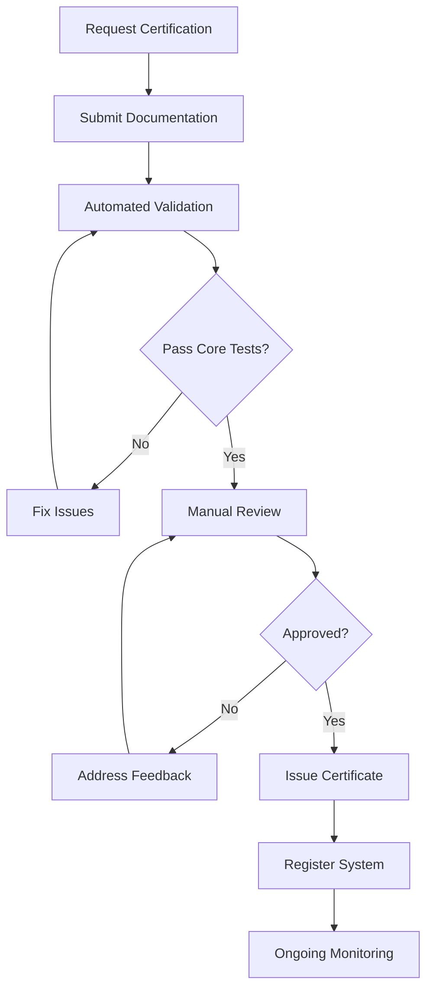

# OSSA Compliance Requirements

**Version**: 1.0.0  
**Status**: Draft  
**Last Updated**: 2024-09-26

## 1. Compliance Levels

### 1.1 Compliance Tiers

```typescript
enum ComplianceLevel {
  CORE = 'core',         // Minimum required for OSSA compliance
  STANDARD = 'standard', // Recommended for production systems
  ADVANCED = 'advanced'  // Full feature set with extensions
}
```

## 2. Core Compliance Requirements

### 2.1 Mandatory Implementation

```yaml
core_requirements:
  communication:
    - [ ] Implement OSSA message format
    - [ ] Support request-response pattern
    - [ ] Handle standard error codes
    - [ ] Implement message authentication
  
  lifecycle:
    - [ ] Support all standard agent states
    - [ ] Implement state transitions
    - [ ] Provide health check endpoints
    - [ ] Support graceful shutdown
  
  classification:
    - [ ] Declare agent type
    - [ ] Register capabilities
    - [ ] Provide agent metadata
    - [ ] Support agent discovery
  
  security:
    - [ ] Implement authentication
    - [ ] Support authorization
    - [ ] Maintain audit logs
    - [ ] Encrypt sensitive data
```

### 2.2 Core Validation Tests

```typescript
interface CoreValidation {
  // Communication tests
  testMessageFormat(): Promise<TestResult>;
  testRequestResponse(): Promise<TestResult>;
  testErrorHandling(): Promise<TestResult>;
  
  // Lifecycle tests
  testStateTransitions(): Promise<TestResult>;
  testHealthCheck(): Promise<TestResult>;
  testGracefulShutdown(): Promise<TestResult>;
  
  // Security tests
  testAuthentication(): Promise<TestResult>;
  testAuthorization(): Promise<TestResult>;
  testAuditLogging(): Promise<TestResult>;
}
```

## 3. Standard Compliance Requirements

### 3.1 Additional Requirements

```yaml
standard_requirements:
  extends: core_requirements
  
  communication:
    - [ ] Support publish-subscribe pattern
    - [ ] Implement streaming pattern
    - [ ] Support QoS levels
    - [ ] Implement retry policies
  
  observability:
    - [ ] Export OpenTelemetry metrics
    - [ ] Propagate trace context
    - [ ] Use structured logging
    - [ ] Report performance metrics
  
  action_items:
    - [ ] Support three-tier classification
    - [ ] Implement routing logic
    - [ ] Enable escalation
    - [ ] Maintain tier relationships
```

## 4. Advanced Compliance Requirements

### 4.1 Extended Features

```yaml
advanced_requirements:
  extends: standard_requirements
  
  ai_governance:
    - [ ] Implement constitutional AI principles
    - [ ] Support explainable decisions
    - [ ] Enable bias detection
    - [ ] Provide confidence scores
  
  orchestration:
    - [ ] Support multi-agent coordination
    - [ ] Implement workflow management
    - [ ] Enable parallel execution
    - [ ] Support dependency resolution
  
  resilience:
    - [ ] Implement circuit breakers
    - [ ] Support transaction management
    - [ ] Enable event sourcing
    - [ ] Provide state recovery
```

## 5. Compliance Validation Suite

### 5.1 Test Categories

```typescript
interface ComplianceTestSuite {
  // Functional tests
  functional: {
    communication: TestCase[];
    lifecycle: TestCase[];
    classification: TestCase[];
  };
  
  // Non-functional tests
  nonFunctional: {
    performance: TestCase[];
    security: TestCase[];
    reliability: TestCase[];
  };
  
  // Integration tests
  integration: {
    interoperability: TestCase[];
    compatibility: TestCase[];
    scalability: TestCase[];
  };
}

interface TestCase {
  id: string;
  name: string;
  description: string;
  category: string;
  level: ComplianceLevel;
  automated: boolean;
  validationCriteria: ValidationCriteria[];
}
```

### 5.2 Validation Process

```typescript
class ComplianceValidator {
  async validate(system: System, level: ComplianceLevel): Promise<ValidationReport> {
    const results: TestResult[] = [];
    
    // Run core tests
    if (level >= ComplianceLevel.CORE) {
      results.push(...await this.runCoreTests(system));
    }
    
    // Run standard tests
    if (level >= ComplianceLevel.STANDARD) {
      results.push(...await this.runStandardTests(system));
    }
    
    // Run advanced tests
    if (level >= ComplianceLevel.ADVANCED) {
      results.push(...await this.runAdvancedTests(system));
    }
    
    return this.generateReport(results, level);
  }
}
```

## 6. Compliance Report Format

### 6.1 Report Structure

```typescript
interface ComplianceReport {
  // Summary
  summary: {
    systemName: string;
    systemVersion: string;
    validationDate: string;
    complianceLevel: ComplianceLevel;
    overallStatus: 'compliant' | 'non_compliant' | 'partial';
    score: number; // 0-100
  };
  
  // Detailed results
  results: {
    category: string;
    tests: TestResult[];
    passRate: number;
    failures: FailureDetail[];
  }[];
  
  // Recommendations
  recommendations: {
    critical: string[];
    improvements: string[];
    nextSteps: string[];
  };
  
  // Certification
  certification?: {
    issueDate: string;
    expiryDate: string;
    certificateId: string;
    scope: string[];
  };
}
```

## 7. Implementation Checklist

### 7.1 Development Checklist

```yaml
implementation_checklist:
  planning:
    - [ ] Review OSSA specifications
    - [ ] Identify target compliance level
    - [ ] Map existing features to requirements
    - [ ] Create implementation roadmap
  
  development:
    - [ ] Implement core protocols
    - [ ] Add security features
    - [ ] Integrate observability
    - [ ] Create documentation
  
  testing:
    - [ ] Run unit tests
    - [ ] Execute integration tests
    - [ ] Perform security audit
    - [ ] Validate compliance
  
  deployment:
    - [ ] Configure production environment
    - [ ] Enable monitoring
    - [ ] Set up alerting
    - [ ] Document operations
```

## 8. Certification Process

### 8.1 Certification Steps



### 8.2 Certification Maintenance

```typescript
interface CertificationMaintenance {
  // Regular validation
  validationFrequency: 'quarterly' | 'biannual' | 'annual';
  
  // Update requirements
  updateNotification: 30; // days before expiry
  graceePeriod: 90; // days after expiry
  
  // Monitoring
  continuousMonitoring: boolean;
  complianceAlerts: boolean;
  
  // Renewal process
  autoRenewal: boolean;
  renewalTests: 'full' | 'incremental';
}
```

## 9. Non-Compliance Handling

### 9.1 Non-Compliance Categories

```typescript
enum NonComplianceCategory {
  MINOR = 'minor',       // Does not affect core functionality
  MAJOR = 'major',       // Affects functionality
  CRITICAL = 'critical', // Security or data integrity risk
  BLOCKER = 'blocker'    // System cannot be certified
}

interface NonComplianceItem {
  category: NonComplianceCategory;
  requirement: string;
  description: string;
  impact: string;
  remediation: string;
  deadline?: string;
}
```

## 10. Compliance Resources

### 10.1 Documentation

- [OSSA Specification Documents](/specifications/)
- [Implementation Guide](/guides/implementation.md)
- [API Reference](/api/)
- [Example Implementations](/examples/)

### 10.2 Tools

- **OSSA Validator**: Automated compliance testing tool
- **OSSA Inspector**: Runtime compliance monitoring
- **OSSA Certifier**: Certification management system

### 10.3 Support

- Community Forum: discuss.ossa.org
- Issue Tracker: github.com/ossa/issues
- Certification Support: cert@ossa.org