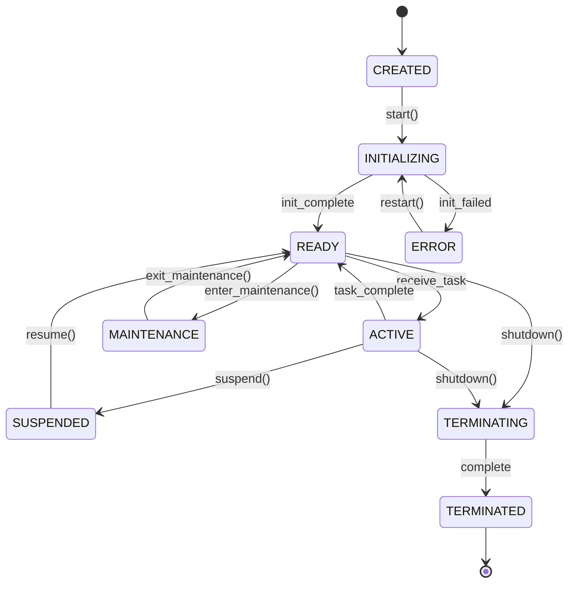

# Agent Lifecycle Management Specification

**Version**: 1.0.0  
**Status**: Draft  
**Last Updated**: 2024-09-26

## 1. Abstract

This specification defines the standard lifecycle states, transitions, and management protocols for OSSA-compliant agents.

## 2. Lifecycle States

### 2.1 State Definitions

```typescript
enum AgentState {
  // Initial state when agent is created but not started
  CREATED = 'created',
  
  // Agent is initializing (loading config, establishing connections)
  INITIALIZING = 'initializing',
  
  // Agent is ready to receive work
  READY = 'ready',
  
  // Agent is actively processing tasks
  ACTIVE = 'active',
  
  // Agent is temporarily suspended
  SUSPENDED = 'suspended',
  
  // Agent is in maintenance mode
  MAINTENANCE = 'maintenance',
  
  // Agent is shutting down
  TERMINATING = 'terminating',
  
  // Agent has been terminated
  TERMINATED = 'terminated',
  
  // Agent is in error state
  ERROR = 'error'
}
```

### 2.2 State Transition Matrix

| From State | To State | Trigger | Validation Required |
|------------|----------|---------|--------------------|
| CREATED | INITIALIZING | start() | Configuration valid |
| INITIALIZING | READY | init_complete | All dependencies available |
| INITIALIZING | ERROR | init_failed | N/A |
| READY | ACTIVE | receive_task | Task valid |
| ACTIVE | READY | task_complete | N/A |
| ACTIVE | SUSPENDED | suspend() | Current task saved |
| SUSPENDED | READY | resume() | State restored |
| ANY | MAINTENANCE | enter_maintenance() | Admin permission |
| MAINTENANCE | READY | exit_maintenance() | Health check passed |
| ANY | TERMINATING | shutdown() | N/A |
| TERMINATING | TERMINATED | shutdown_complete | Resources released |
| ANY | ERROR | fatal_error | N/A |
| ERROR | INITIALIZING | restart() | Error cleared |

## 3. Lifecycle Management Interface

```typescript
interface AgentLifecycle {
  // Current state
  readonly state: AgentState;
  
  // State history
  readonly stateHistory: StateTransition[];
  
  // Lifecycle operations
  start(): Promise<void>;
  suspend(): Promise<void>;
  resume(): Promise<void>;
  restart(): Promise<void>;
  shutdown(graceful: boolean): Promise<void>;
  
  // Maintenance operations
  enterMaintenance(): Promise<void>;
  exitMaintenance(): Promise<void>;
  
  // State queries
  canTransitionTo(state: AgentState): boolean;
  getStateMetadata(): StateMetadata;
  
  // Event handlers
  onStateChange(handler: StateChangeHandler): void;
}

interface StateTransition {
  fromState: AgentState;
  toState: AgentState;
  timestamp: string;
  trigger: string;
  metadata?: any;
}

interface StateMetadata {
  state: AgentState;
  enteredAt: string;
  duration: number; // milliseconds in current state
  taskCount?: number; // tasks processed in current session
  errorCount?: number; // errors in current session
}
```

## 4. Initialization Protocol

### 4.1 Initialization Sequence

```typescript
interface InitializationProtocol {
  // Phase 1: Configuration
  loadConfiguration(): Promise<AgentConfig>;
  validateConfiguration(config: AgentConfig): ValidationResult;
  
  // Phase 2: Dependencies
  checkDependencies(): Promise<DependencyStatus[]>;
  establishConnections(): Promise<Connection[]>;
  
  // Phase 3: Registration
  registerWithRegistry(): Promise<RegistrationToken>;
  announceCapabilities(): Promise<void>;
  
  // Phase 4: Health Check
  performSelfTest(): Promise<HealthStatus>;
  reportReady(): Promise<void>;
}
```

### 4.2 Initialization Checklist

```yaml
initialization_checklist:
  configuration:
    - [ ] Load configuration from environment
    - [ ] Validate required parameters
    - [ ] Apply security policies
  
  dependencies:
    - [ ] Verify network connectivity
    - [ ] Connect to message broker
    - [ ] Connect to data stores
    - [ ] Verify service dependencies
  
  registration:
    - [ ] Register with agent registry
    - [ ] Publish capabilities
    - [ ] Subscribe to relevant topics
  
  validation:
    - [ ] Pass self-test
    - [ ] Confirm health status
    - [ ] Report ready state
```

## 5. Shutdown Protocol

### 5.1 Graceful Shutdown Sequence

```typescript
interface ShutdownProtocol {
  // Phase 1: Preparation
  stopAcceptingWork(): Promise<void>;
  notifyShutdown(): Promise<void>;
  
  // Phase 2: Task Completion
  waitForActiveTasks(timeout: number): Promise<TaskStatus[]>;
  saveTaskState(): Promise<void>;
  
  // Phase 3: Cleanup
  closeConnections(): Promise<void>;
  releaseResources(): Promise<void>;
  
  // Phase 4: Deregistration
  deregisterFromRegistry(): Promise<void>;
  reportTerminated(): Promise<void>;
}
```

### 5.2 Shutdown Timeout Configuration

```typescript
interface ShutdownConfig {
  // Maximum time to wait for graceful shutdown
  gracefulTimeout: number; // default: 30000ms
  
  // Time to wait for active tasks to complete
  taskCompletionTimeout: number; // default: 15000ms
  
  // Force shutdown after timeout
  forceShutdownEnabled: boolean; // default: true
}
```

## 6. Health Monitoring

### 6.1 Health Check Interface

```typescript
interface HealthCheck {
  // Liveness probe - is agent alive?
  checkLiveness(): Promise<LivenessStatus>;
  
  // Readiness probe - can agent accept work?
  checkReadiness(): Promise<ReadinessStatus>;
  
  // Detailed health status
  getHealthStatus(): Promise<HealthStatus>;
}

interface HealthStatus {
  status: 'healthy' | 'degraded' | 'unhealthy';
  state: AgentState;
  uptime: number; // milliseconds
  lastActivity: string; // ISO 8601
  metrics: HealthMetrics;
  checks: HealthCheckResult[];
}

interface HealthMetrics {
  cpuUsage: number; // percentage
  memoryUsage: number; // bytes
  taskQueueSize: number;
  errorRate: number; // errors per minute
  responseTime: number; // milliseconds
}
```

### 6.2 Health Check Endpoints

| Endpoint | Method | Response | Description |
|----------|--------|----------|-------------|
| /health/live | GET | 200/503 | Liveness probe |
| /health/ready | GET | 200/503 | Readiness probe |
| /health/status | GET | JSON | Detailed status |

## 7. State Persistence

### 7.1 State Persistence Requirements

```typescript
interface StatePersistence {
  // Save current state
  saveState(): Promise<StateSnapshot>;
  
  // Restore from snapshot
  restoreState(snapshot: StateSnapshot): Promise<void>;
  
  // Query state history
  getStateHistory(from: Date, to: Date): Promise<StateTransition[]>;
}

interface StateSnapshot {
  agentId: string;
  state: AgentState;
  timestamp: string;
  metadata: StateMetadata;
  tasks: TaskSnapshot[];
  connections: ConnectionSnapshot[];
}
```

## 8. Error Recovery

### 8.1 Error Recovery Strategies

```typescript
enum RecoveryStrategy {
  // Restart agent immediately
  IMMEDIATE_RESTART = 'immediate_restart',
  
  // Restart with exponential backoff
  BACKOFF_RESTART = 'backoff_restart',
  
  // Wait for manual intervention
  MANUAL_INTERVENTION = 'manual_intervention',
  
  // Failover to backup agent
  FAILOVER = 'failover'
}

interface ErrorRecovery {
  strategy: RecoveryStrategy;
  maxRestartAttempts: number;
  restartDelay: number;
  backoffMultiplier: number;
  failoverTarget?: string;
}
```

## 9. Compliance Requirements

Systems claiming OSSA lifecycle management compliance MUST:

1. **State Management**
   - Implement all defined states
   - Follow state transition rules
   - Maintain state history

2. **Initialization**
   - Follow initialization sequence
   - Validate configuration
   - Perform health checks

3. **Shutdown**
   - Support graceful shutdown
   - Save state before termination
   - Clean up resources

4. **Health Monitoring**
   - Implement health check endpoints
   - Report accurate health metrics
   - Support liveness and readiness probes

5. **Error Recovery**
   - Implement error recovery strategies
   - Maintain error history
   - Support state restoration

## 10. Example State Machine

