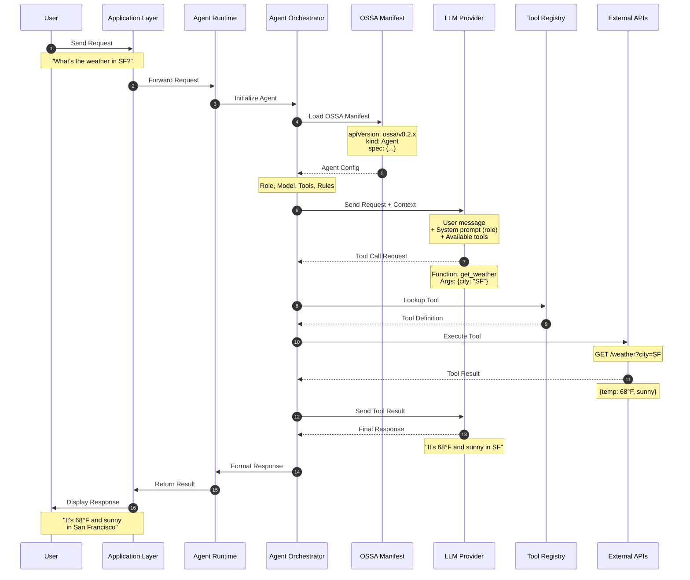
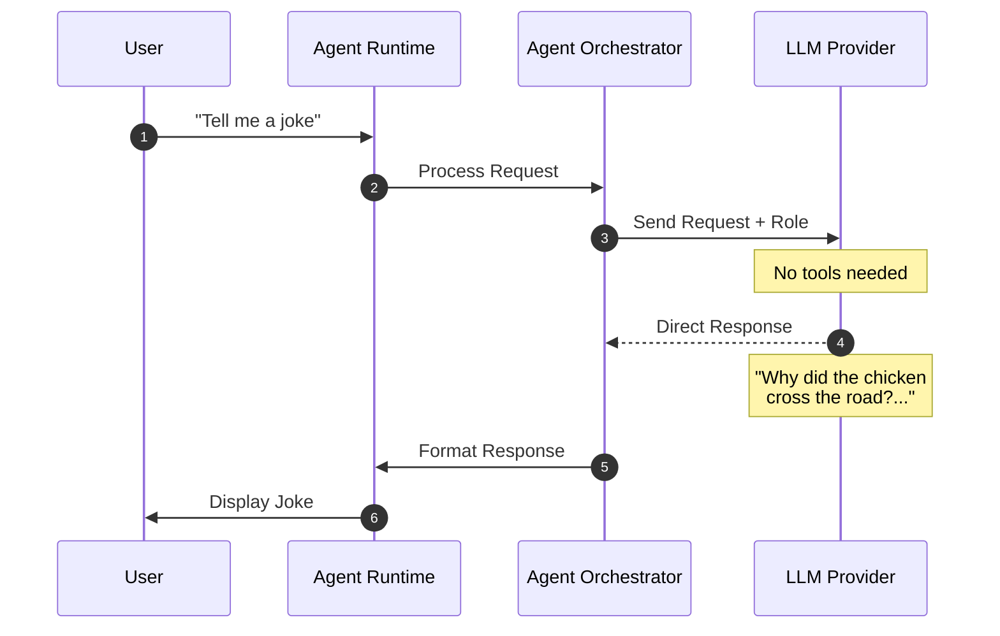
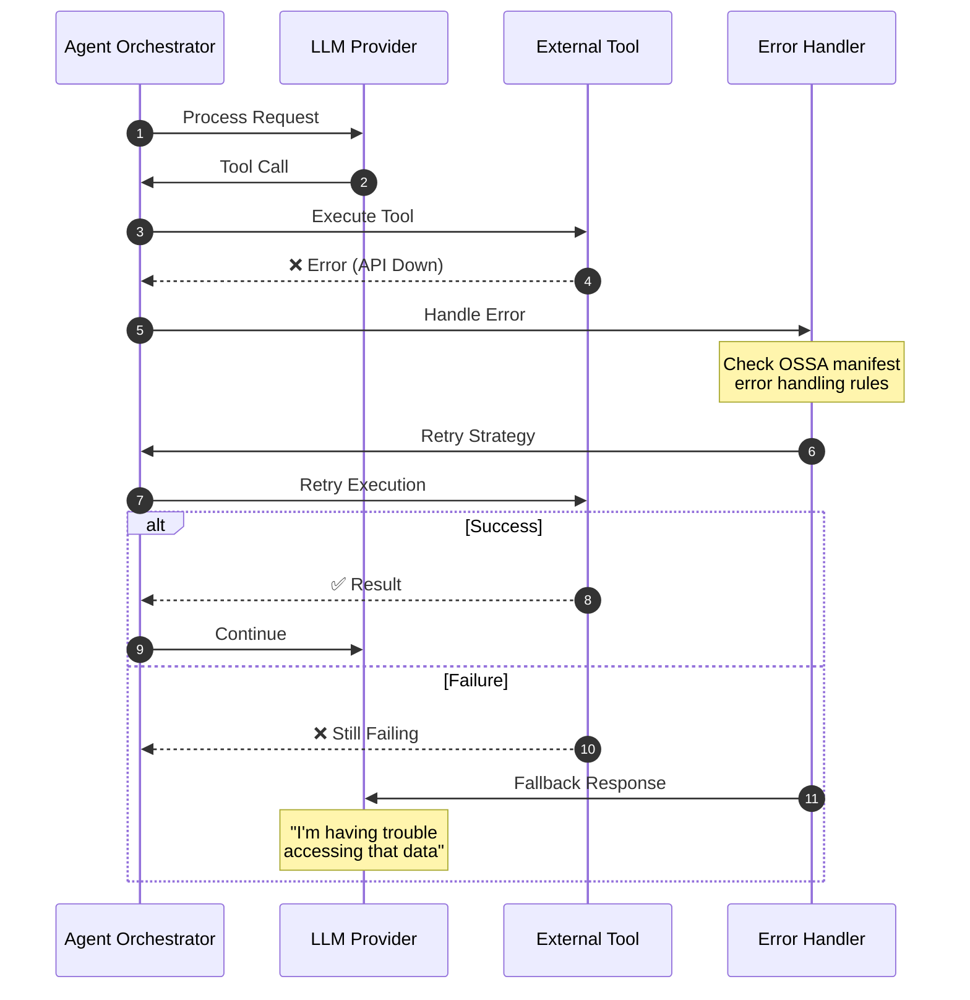

# Execution Flow Architecture

How user requests flow through an OSSA agent from start to finish.

---

## Overview

This page visualizes the complete lifecycle of a user request through an OSSA-defined agent, showing:
- User interaction points
- Agent orchestration steps
- LLM processing
- Tool execution
- Response generation

---

## Complete Execution Flow



---

## Step-by-Step Breakdown

### Step 1-3: User Request Handling
```
User → Application Layer → Agent Runtime
```

**What happens:**
- User sends a natural language request
- Application layer receives and validates the request
- Request is forwarded to the agent runtime for processing

**OSSA's role:** None yet - this is application infrastructure

---

### Step 4-6: Agent Initialization
```
Agent Runtime → Orchestrator → OSSA Manifest
```

**What happens:**
- Runtime initializes the agent orchestrator
- Orchestrator loads the OSSA manifest (YAML/JSON)
- Manifest is parsed and validated against the schema

**OSSA's role:**
- Defines agent configuration via manifest
- Provides schema validation
- Specifies role, model, tools, and constraints

**Example Manifest:**
```yaml
apiVersion: ossa/v0.2.x
kind: Agent
metadata:
  name: weather-assistant
spec:
  role: You are a helpful weather assistant
  llm:
    provider: openai
    model: gpt-3.5-turbo
  tools:
    - type: function
      name: get_weather
      description: Get current weather for a city
```

---

### Step 7-8: LLM Processing
```
Orchestrator → LLM Provider
```

**What happens:**
- Orchestrator sends the user message to the LLM
- Includes system prompt from OSSA manifest (`spec.role`)
- Includes available tools from OSSA manifest (`spec.tools`)
- LLM processes and determines if tools are needed

**OSSA's role:**
- Defines which LLM provider to use (`spec.llm.provider`)
- Defines which model to use (`spec.llm.model`)
- Defines system prompt (`spec.role`)
- Defines available tools (`spec.tools[]`)

---

### Step 9-12: Tool Execution
```
LLM → Orchestrator → Tool Registry → External API
```

**What happens:**
- LLM requests tool execution (e.g., `get_weather`)
- Orchestrator looks up tool definition
- Tool is executed against external API
- Result is returned to orchestrator

**OSSA's role:**
- Defines tool schema in manifest
- Specifies tool execution constraints
- Defines error handling rules

---

### Step 13-14: Response Generation
```
Orchestrator → LLM → Final Response
```

**What happens:**
- Tool result is sent back to LLM
- LLM generates natural language response
- Response includes tool data formatted for user

**OSSA's role:**
- Defines response formatting rules
- Specifies output constraints
- Controls token limits and timeouts

---

### Step 15-17: Response Delivery
```
LLM → Runtime → Application → User
```

**What happens:**
- Final response flows back through the stack
- Runtime formats response per OSSA spec
- Application layer delivers to user

**OSSA's role:**
- Defines response structure
- Specifies metadata to include
- Controls observability data

---

## Alternative Flow: No Tools Needed



**What's different:**
- LLM responds directly without tool execution
- Faster response time
- Simpler execution path

---

## Error Handling Flow



**OSSA's role in error handling:**
- Defines retry policies (`spec.tools[].retry`)
- Specifies timeout limits (`spec.tools[].timeout`)
- Controls fallback behavior (`spec.errorHandling`)

---

## Key Takeaways

### What OSSA Defines
- ✅ Agent configuration (role, model, tools)
- ✅ LLM provider and model selection
- ✅ Tool schemas and constraints
- ✅ Error handling policies
- ✅ Response formatting rules

### What OSSA Does NOT Define
- ❌ Application layer routing
- ❌ Runtime implementation details
- ❌ LLM API communication protocols
- ❌ External tool implementations
- ❌ User interface rendering

---

## Execution Flow Properties

| Property | Description | Defined In |
|----------|-------------|------------|
| **Role** | System prompt for LLM | `spec.role` |
| **Model** | Which LLM to use | `spec.llm.model` |
| **Tools** | Available functions | `spec.tools[]` |
| **Timeout** | Max execution time | `spec.timeout` |
| **Retries** | Error retry policy | `spec.errorHandling.retries` |
| **Memory** | Conversation history | `spec.memory` |

---

## Performance Considerations

### Latency Breakdown

```mermaid
gantt
    title Typical Request Latency
    dateFormat X
    axisFormat %Ls

    section App Layer
    Request Validation    :0, 50

    section Agent Init
    Load Manifest        :50, 100
    Parse & Validate     :100, 150

    section LLM Call
    Network Latency      :150, 300
    LLM Processing       :300, 1500

    section Tool Execution
    Tool Lookup          :1500, 1550
    API Call             :1550, 2050

    section Response
    Format Response      :2050, 2100
    Return to User       :2100, 2150
```



**Optimization tips:**
- Cache parsed OSSA manifests (Steps 5-6)
- Use streaming for LLM responses (Step 8)
- Parallelize tool calls when possible (Steps 10-12)
- Implement response caching (Step 14)

---

## Related Documentation

- [Stack Integration](stack-integration) - Where OSSA fits in your architecture
- [Schema Reference](/docs/schema-reference) - Detailed tool execution patterns
- [Specification](/docs/specification) - Full OSSA spec details
- [Ecosystem Overview](/docs/ecosystem/overview) - Framework integrations

---

**Next**: [Stack Integration Diagram](stack-integration) - See where OSSA fits in your technology stack
