# Multi-Agent Systems Architecture

How multiple OSSA agents discover, communicate, and coordinate with each other.

---

## Overview

OSSA enables **multi-agent systems** where specialized agents collaborate to solve complex problems. Just as microservices communicate via REST APIs, OSSA agents communicate via standardized manifests and messaging protocols.

---

## Multi-Agent System Topology

```mermaid
graph TB
    subgraph "Agent Registry"
        Registry[OSSA Agent Registry<br/>Discovery Service]
        Manifests[(Agent Manifests<br/>customer.ossa.yaml<br/>sales.ossa.yaml<br/>support.ossa.yaml)]
    end

    subgraph "Orchestrator Layer"
        Coordinator[Agent Coordinator]
        Router[Message Router]
        Queue[Message Queue<br/>RabbitMQ | Redis]
    end

    subgraph "Agent Layer"
        CustomerAgent[Customer Agent<br/>Handles inquiries]
        SalesAgent[Sales Agent<br/>Processes orders]
        SupportAgent[Support Agent<br/>Resolves issues]
        AnalyticsAgent[Analytics Agent<br/>Generates reports]
    end

    subgraph "Shared Resources"
        Memory[(Shared Memory<br/>PostgreSQL)]
        Vector[(Vector Store<br/>Pinecone)]
        Cache[(Cache<br/>Redis)]
    end

    Registry --> Coordinator
    Manifests --> Registry

    Coordinator --> Router
    Router --> Queue

    Queue --> CustomerAgent
    Queue --> SalesAgent
    Queue --> SupportAgent
    Queue --> AnalyticsAgent

    CustomerAgent --> Memory
    SalesAgent --> Memory
    SupportAgent --> Memory
    AnalyticsAgent --> Memory

    CustomerAgent --> Vector
    SalesAgent --> Vector

    CustomerAgent --> Cache
    SalesAgent --> Cache
    SupportAgent --> Cache

    CustomerAgent -.->|Delegate| SalesAgent
    CustomerAgent -.->|Escalate| SupportAgent
    SalesAgent -.->|Report| AnalyticsAgent

    style Registry fill:#4A90E2,stroke:#333,stroke-width:2px,color:#fff
    style Manifests fill:#4A90E2,stroke:#333,stroke-width:2px,color:#fff
```

---

## Agent Discovery Flow

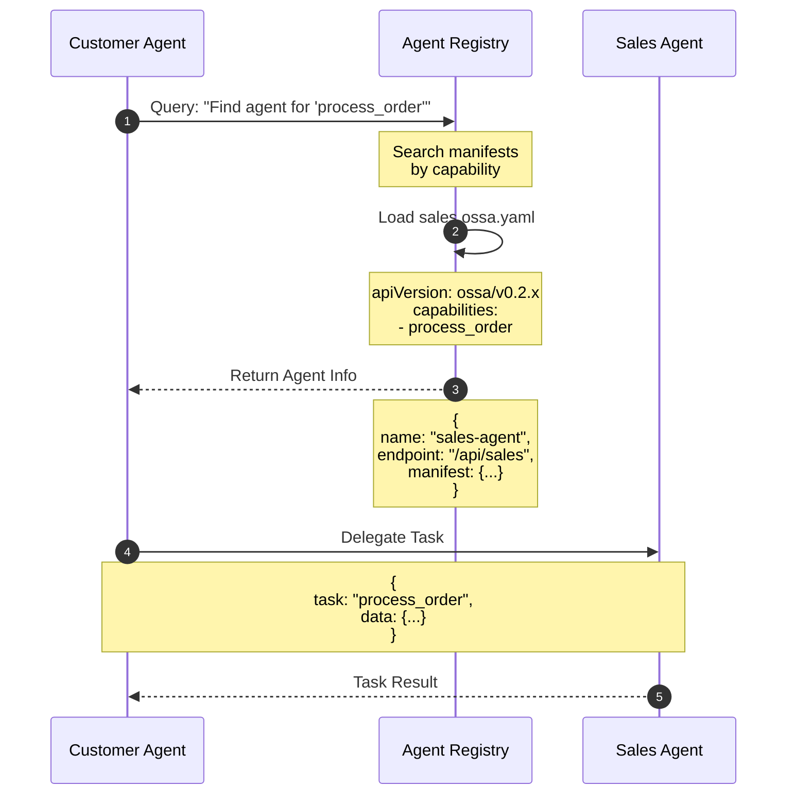

**Key Concepts:**
- **Agent Registry**: Central discovery service for OSSA agents
- **Capability Matching**: Find agents by what they can do
- **Manifest-Driven**: Agent capabilities defined in OSSA manifests

---

## Agent-to-Agent Communication

### Pattern 1: Direct Delegation

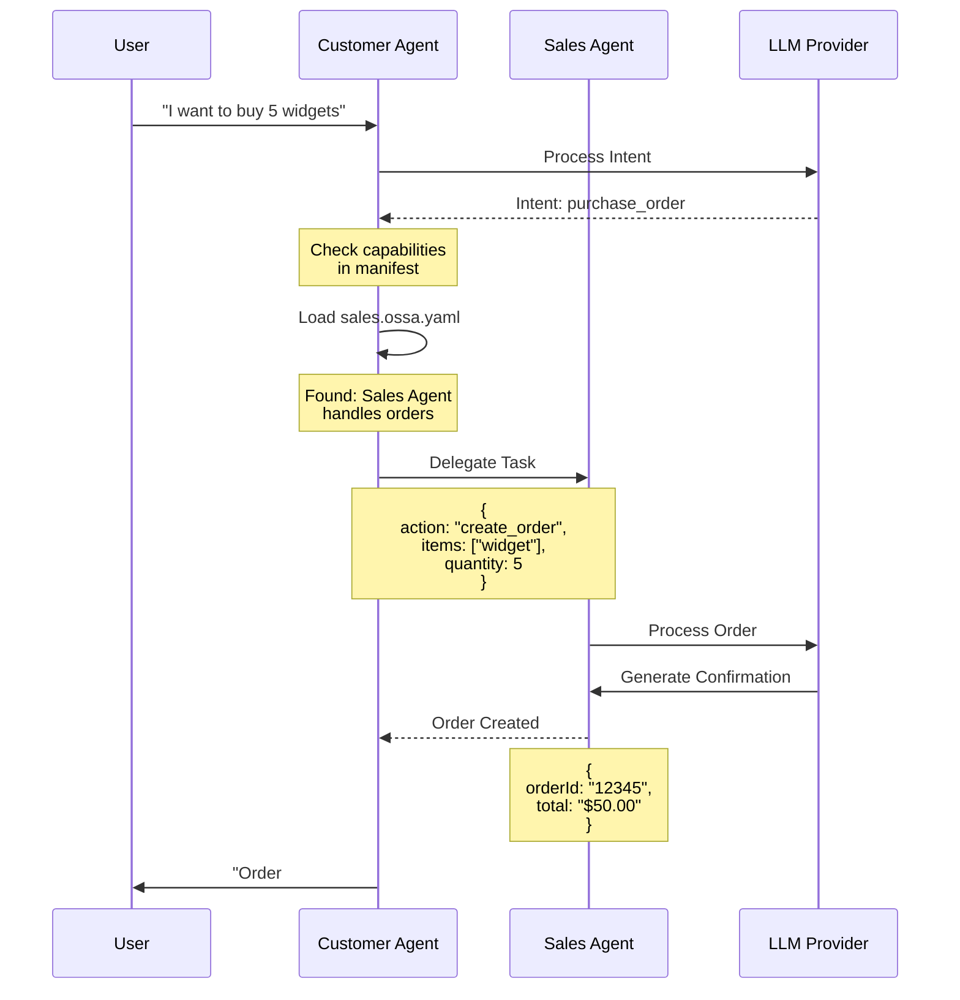

**OSSA Manifest Example (Customer Agent):**
```yaml
apiVersion: ossa/v0.2.x
kind: Agent
metadata:
  name: customer-agent
spec:
  role: You are a customer service agent
  capabilities:
    - handle_inquiries
    - delegate_to_sales
  delegationRules:
    - intent: purchase_order
      targetAgent: sales-agent
      method: direct
```

---

### Pattern 2: Event-Driven Coordination

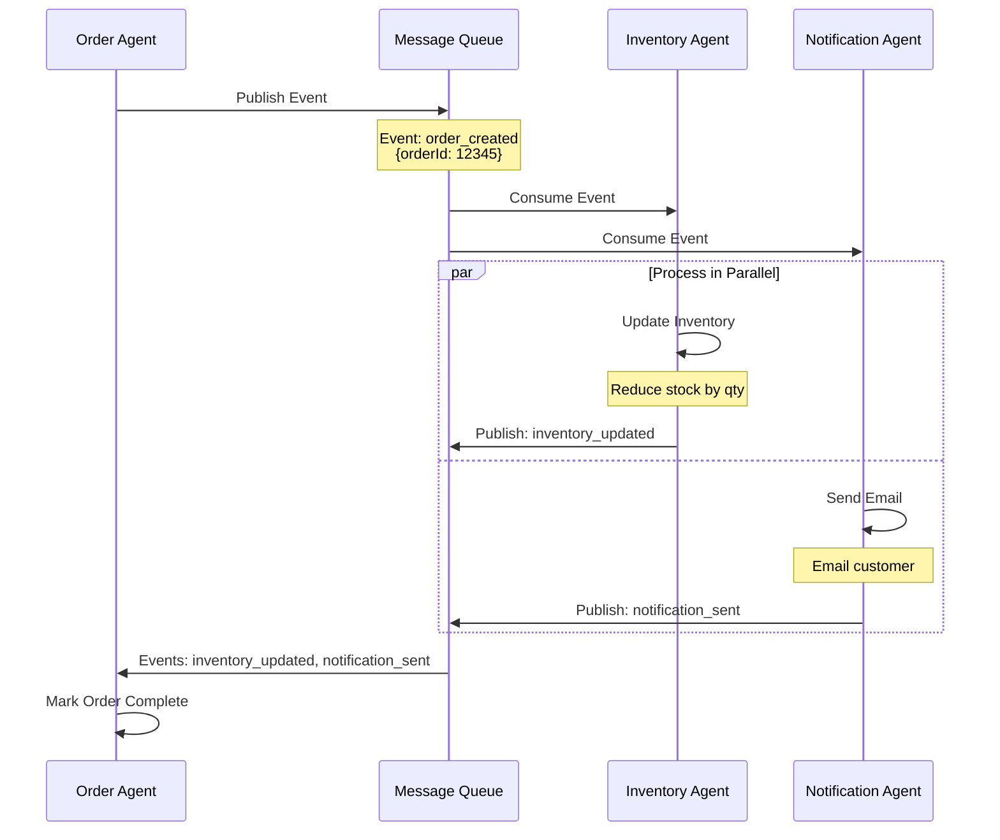

**OSSA Manifest Example (Order Agent):**
```yaml
apiVersion: ossa/v0.2.x
kind: Agent
metadata:
  name: order-agent
spec:
  role: You process customer orders
  events:
    publishes:
      - name: order_created
        schema:
          type: object
          properties:
            orderId: { type: string }
            items: { type: array }
    subscribes:
      - name: inventory_updated
        handler: update_order_status
      - name: notification_sent
        handler: mark_notified
```

---

### Pattern 3: Hierarchical Coordination

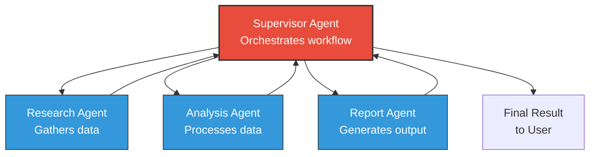

**Workflow:**
1. Supervisor receives complex task
2. Breaks task into subtasks
3. Assigns subtasks to worker agents
4. Collects results
5. Synthesizes final response

**OSSA Manifest Example (Supervisor):**
```yaml
apiVersion: ossa/v0.2.x
kind: Agent
metadata:
  name: supervisor-agent
spec:
  role: You coordinate research workflows
  workerAgents:
    - name: research-agent
      capabilities: [gather_data, web_search]
    - name: analysis-agent
      capabilities: [analyze_data, statistics]
    - name: report-agent
      capabilities: [generate_report, format_output]
  workflow:
    - step: research
      agent: research-agent
      output: raw_data
    - step: analyze
      agent: analysis-agent
      input: raw_data
      output: insights
    - step: report
      agent: report-agent
      input: insights
      output: final_report
```

---

## Agent Capability Discovery

### Capability-Based Routing

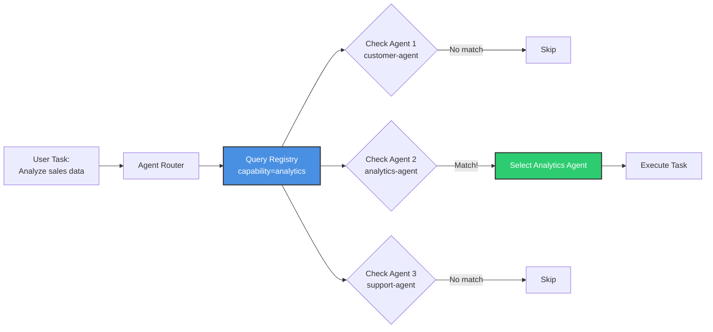

**How it works:**
1. Task comes in with required capability (e.g., "analytics")
2. Router queries agent registry
3. Registry scans all OSSA manifests
4. Returns agents with matching capabilities
5. Router selects best agent (by priority, load, etc.)

**OSSA Manifest with Capabilities:**
```yaml
apiVersion: ossa/v0.2.x
kind: Agent
metadata:
  name: analytics-agent
  version: 1.0.0
spec:
  role: You analyze business data
  capabilities:
    - name: analyze_sales_data
      description: Analyze sales trends and metrics
      priority: high
    - name: generate_charts
      description: Create data visualizations
      priority: medium
    - name: forecast_revenue
      description: Predict future revenue
      priority: high
```

---

## Multi-Agent Communication Protocols

### Protocol 1: RESTful Agent Communication

```yaml
# Agent A sends HTTP request to Agent B
POST /api/agents/sales-agent/tasks
Content-Type: application/json
X-OSSA-Agent: customer-agent
X-OSSA-Version: v0.2.2

{
  "task": "create_order",
  "parameters": {
    "customerId": "C123",
    "items": [{"sku": "W001", "quantity": 5}]
  },
  "context": {
    "conversationId": "conv-456",
    "userId": "user-789"
  }
}
```

**Response:**
```json
{
  "status": "success",
  "result": {
    "orderId": "12345",
    "total": 50.00
  },
  "metadata": {
    "agent": "sales-agent",
    "executionTime": 1230
  }
}
```

---

### Protocol 2: Message Queue (Async)

```yaml
# Agent publishes to queue
Message:
  exchange: ossa.agents
  routingKey: order.created
  body:
    event: order_created
    agent: order-agent
    data:
      orderId: "12345"
      customerId: "C123"
    timestamp: "2024-01-15T10:30:00Z"
```

**Consumer (Inventory Agent):**
```yaml
# Subscribes to order.created events
Subscription:
  queue: inventory-updates
  binding:
    exchange: ossa.agents
    routingKey: order.created
  handler: update_inventory
```

---

### Protocol 3: Shared Memory

```python
# Agent A writes to shared memory
shared_memory.set(
    key="task:order-12345",
    value={
        "status": "processing",
        "assignedTo": "inventory-agent",
        "createdBy": "order-agent",
        "data": {...}
    },
    ttl=3600  # 1 hour
)

# Agent B reads from shared memory
task = shared_memory.get("task:order-12345")
# Process task...
shared_memory.update("task:order-12345", {"status": "completed"})
```

---

## Agent Coordination Patterns

### Pattern 1: Pipeline (Sequential)

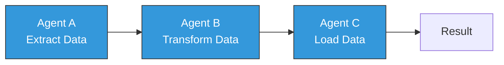

**Use case:** ETL workflows, document processing pipelines

---

### Pattern 2: Scatter-Gather (Parallel)

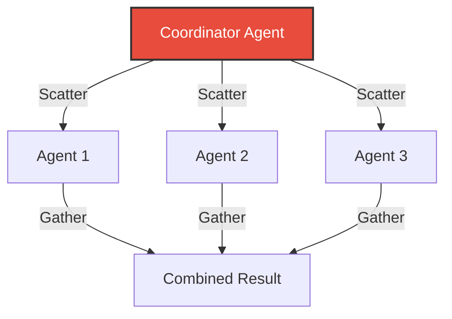

**Use case:** Research tasks, competitive analysis, multi-source data gathering

---

### Pattern 3: Request-Reply (Synchronous)

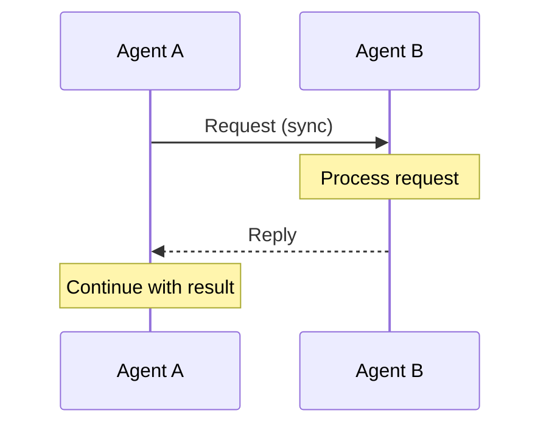

**Use case:** API calls, database queries, simple delegations

---

### Pattern 4: Publish-Subscribe (Async)

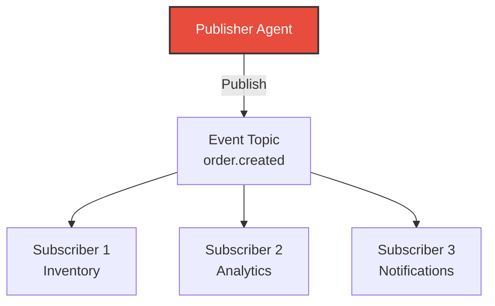

**Use case:** Event-driven systems, real-time updates, loose coupling

---

## Multi-Agent System Example

### E-Commerce Platform with 5 Agents

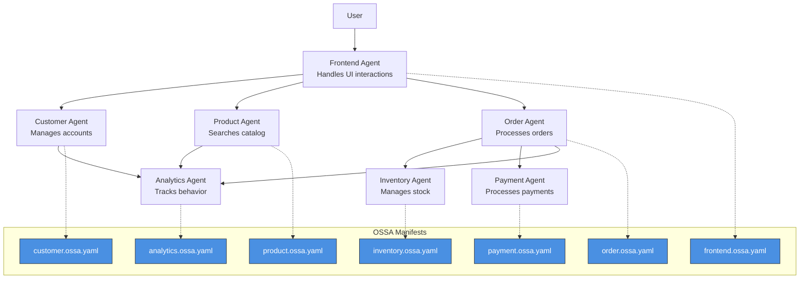

**Flow:**
1. User interacts with Frontend Agent
2. Frontend Agent delegates to specialized agents (Customer, Product, Order)
3. Order Agent coordinates with Inventory and Payment agents
4. Analytics Agent passively observes all interactions

**Benefits:**
- ✅ Each agent has a single responsibility
- ✅ Agents can be developed/deployed independently
- ✅ Easy to add new agents (e.g., Shipping Agent)
- ✅ Scales horizontally (run multiple instances)

---

## Agent Registry Implementation

### Registry Schema

```yaml
# Agent Registry Entry
agents:
  - id: customer-agent-001
    name: customer-agent
    version: 1.0.0
    manifest: s3://manifests/customer.ossa.yaml
    endpoint: https://api.example.com/agents/customer
    capabilities:
      - handle_inquiries
      - manage_accounts
    status: active
    healthCheck: https://api.example.com/agents/customer/health
    metadata:
      team: customer-experience
      environment: production

  - id: sales-agent-001
    name: sales-agent
    version: 2.1.0
    manifest: s3://manifests/sales.ossa.yaml
    endpoint: https://api.example.com/agents/sales
    capabilities:
      - process_orders
      - generate_quotes
    status: active
    healthCheck: https://api.example.com/agents/sales/health
    metadata:
      team: sales-ops
      environment: production
```

**Registry API:**
```bash
# Discover agents by capability
GET /registry/agents?capability=process_orders

# Get agent manifest
GET /registry/agents/sales-agent-001/manifest

# Register new agent
POST /registry/agents
Body: { name, version, manifest, endpoint, capabilities }

# Update agent status
PATCH /registry/agents/sales-agent-001
Body: { status: "maintenance" }
```

---

## Security in Multi-Agent Systems

### Agent Authentication

```yaml
# OSSA Manifest with Auth
apiVersion: ossa/v0.2.x
kind: Agent
metadata:
  name: secure-agent
spec:
  security:
    authentication:
      type: jwt
      issuer: https://auth.example.com
      audience: ossa-agents
    authorization:
      allowedAgents:
        - customer-agent
        - sales-agent
      deniedAgents:
        - untrusted-agent
    encryption:
      inTransit: tls1.3
      atRest: aes256
```

### Message Signing

```python
# Agent A signs message to Agent B
message = {
    "task": "create_order",
    "data": {...}
}

signature = sign_message(message, private_key)

request = {
    "message": message,
    "signature": signature,
    "agent": "customer-agent",
    "timestamp": "2024-01-15T10:30:00Z"
}

# Agent B verifies signature
if verify_signature(request, public_key):
    process_message(request["message"])
else:
    raise AuthenticationError("Invalid signature")
```

---

## Monitoring Multi-Agent Systems

### Observability Dashboard

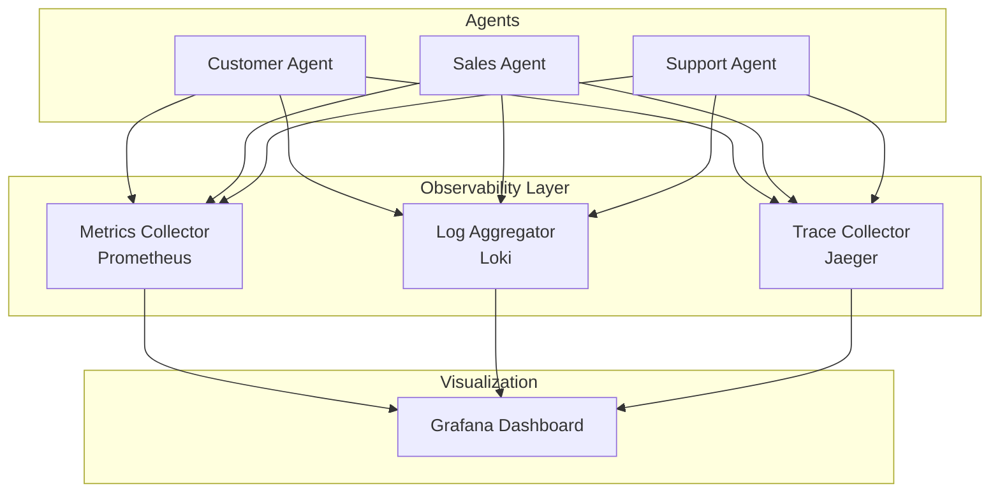

**Key Metrics:**
- Agent response times
- Inter-agent communication latency
- Task delegation counts
- Error rates per agent
- Resource utilization

---

## Key Takeaways

### What OSSA Enables
- ✅ **Agent Discovery**: Find agents by capability
- ✅ **Standard Communication**: Common protocols via manifests
- ✅ **Loose Coupling**: Agents don't need to know implementation details
- ✅ **Scalability**: Add/remove agents without system changes
- ✅ **Portability**: Move agents between environments

### Best Practices
1. **Single Responsibility**: Each agent handles one domain
2. **Capability-Driven**: Define clear capabilities in manifests
3. **Event-Driven**: Use async messaging for loose coupling
4. **Health Checks**: Monitor agent availability
5. **Versioning**: Version manifests for backward compatibility

---

## Related Documentation

- [Execution Flow](execution-flow) - How individual agents process requests
- [Stack Integration](stack-integration) - Where multi-agent systems fit
- [Ecosystem Overview](/docs/ecosystem/overview) - Real-world patterns
- [Specification](/docs/specification) - OSSA spec details

---

**Next Steps**: Explore [Ecosystem Overview](/docs/ecosystem/overview) for real-world multi-agent examples
