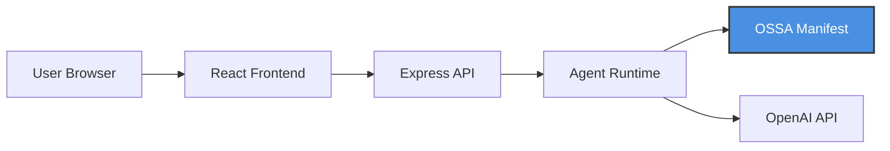
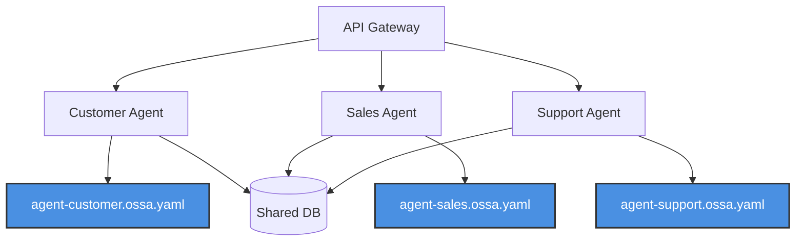
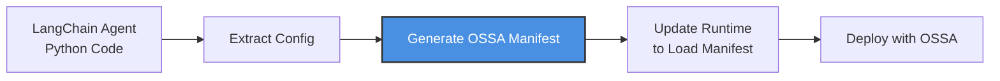

# Stack Integration Architecture

Where OSSA fits in your technology stack and infrastructure.

---

## Overview

This page shows how OSSA integrates into modern application architectures, from frontend applications down to infrastructure. OSSA sits as a **specification layer** between your application and the agent runtime.

---

## Complete Stack Diagram

```mermaid
graph TB
    subgraph "Application Layer"
        WebApp[Web Application]
        MobileApp[Mobile App]
        CLI[CLI Tools]
        API[REST/GraphQL API]
    end

    subgraph "Agent Runtime Layer"
        Runtime[Agent Runtime<br/>LangChain | LlamaIndex<br/>Anthropic SDK | OpenAI SDK<br/>Custom Runtime]
        Orchestrator[Agent Orchestrator]
        Memory[Memory Store<br/>Redis | PostgreSQL]
    end

    subgraph "OSSA Specification Layer"
        Manifest[OSSA Manifests<br/>agent.ossa.yaml]
        Schema[JSON Schema<br/>v0.2.2]
        CLI_Tool[OSSA CLI<br/>Validation]
        Registry[Agent Registry]
    end

    subgraph "Tools & APIs Layer"
        Functions[Function Tools<br/>Python | TypeScript]
        REST[REST APIs<br/>Weather | CRM]
        Database[Databases<br/>PostgreSQL | MongoDB]
        Vector[Vector DBs<br/>Pinecone | Weaviate]
    end

    subgraph "LLM Provider Layer"
        OpenAI[OpenAI<br/>GPT-3.5/4]
        Anthropic[Anthropic<br/>Claude]
        Other[Other Providers<br/>Cohere | Mistral]
    end

    subgraph "Infrastructure Layer"
        K8s[Kubernetes]
        Docker[Docker]
        Serverless[Serverless<br/>Lambda | Cloud Run]
        OnPrem[On-Premise]
    end

    WebApp --> Runtime
    MobileApp --> Runtime
    CLI --> Runtime
    API --> Runtime

    Runtime --> Orchestrator
    Runtime --> Memory

    Orchestrator --> Manifest
    Manifest --> Schema
    Manifest --> CLI_Tool
    Manifest --> Registry

    Orchestrator --> Functions
    Orchestrator --> REST
    Orchestrator --> Database
    Orchestrator --> Vector

    Orchestrator --> OpenAI
    Orchestrator --> Anthropic
    Orchestrator --> Other

    Runtime --> K8s
    Runtime --> Docker
    Runtime --> Serverless
    Runtime --> OnPrem

    style Manifest fill:#4A90E2,stroke:#333,stroke-width:4px,color:#fff
    style Schema fill:#4A90E2,stroke:#333,stroke-width:4px,color:#fff
    style CLI_Tool fill:#4A90E2,stroke:#333,stroke-width:4px,color:#fff
    style Registry fill:#4A90E2,stroke:#333,stroke-width:4px,color:#fff
```

---

## Layer-by-Layer Breakdown

### 1. Application Layer
**What it is:** Your user-facing applications

**Components:**
- Web applications (React, Vue, Angular)
- Mobile apps (iOS, Android, React Native)
- CLI tools (Node.js, Python scripts)
- REST/GraphQL APIs

**OSSA's role:**
- ❌ OSSA does NOT interact with this layer directly
- ✅ Applications call your agent runtime (which uses OSSA)

**Example:**
```typescript
// Your frontend code
const response = await fetch('/api/agent', {
  method: 'POST',
  body: JSON.stringify({ message: 'What is the weather?' })
});
```

---

### 2. Agent Runtime Layer
**What it is:** The execution environment for your agents

**Components:**
- **Agent Runtime**: Framework that executes agents (LangChain, LlamaIndex, custom)
- **Agent Orchestrator**: Coordinates agent execution lifecycle
- **Memory Store**: Conversation history, context (Redis, PostgreSQL)

**OSSA's role:**
- ✅ Runtime reads OSSA manifests to configure agents
- ✅ Orchestrator uses OSSA specs to determine execution flow
- ✅ Memory rules defined in OSSA manifest

**Example Runtime Configuration:**
```python
# Runtime loads OSSA manifest
from ossa import load_agent

agent = load_agent("agent.ossa.yaml")
response = agent.run(user_message="Hello")
```

---

### 3. OSSA Specification Layer ⭐
**What it is:** The standard layer - this is where OSSA lives

**Components:**
- **OSSA Manifests**: YAML/JSON files defining agents
- **JSON Schema**: Validation schema (v0.2.2)
- **OSSA CLI**: Validation and generation tools
- **Agent Registry**: Discovery and versioning

**OSSA's role:**
- ✅ **This IS OSSA** - the specification layer
- ✅ Defines the contract between application and runtime
- ✅ Provides validation, versioning, and discovery

**Example Manifest:**
```yaml
apiVersion: ossa/v0.2.x
kind: Agent
metadata:
  name: weather-agent
  version: 1.0.0
spec:
  role: You are a weather assistant
  llm:
    provider: openai
    model: gpt-3.5-turbo
  tools:
    - type: function
      name: get_weather
```

---

### 4. Tools & APIs Layer
**What it is:** External services agents can call

**Components:**
- **Function Tools**: Custom Python/TypeScript functions
- **REST APIs**: Third-party services (Weather, CRM, etc.)
- **Databases**: Structured data storage
- **Vector Databases**: Semantic search, RAG

**OSSA's role:**
- ✅ Tool schemas defined in OSSA manifest (`spec.tools[]`)
- ✅ Execution constraints specified in manifest
- ✅ Error handling rules defined

**Example Tool Definition:**
```yaml
tools:
  - type: function
    name: query_database
    description: Query PostgreSQL database
    parameters:
      type: object
      properties:
        query:
          type: string
    timeout: 5000
    retry:
      maxAttempts: 3
```

---

### 5. LLM Provider Layer
**What it is:** AI model APIs

**Components:**
- OpenAI (GPT-3.5, GPT-4)
- Anthropic (Claude)
- Other providers (Cohere, Mistral, etc.)

**OSSA's role:**
- ✅ Provider specified in manifest (`spec.llm.provider`)
- ✅ Model specified in manifest (`spec.llm.model`)
- ✅ Configuration (temperature, max_tokens) defined

**Example LLM Config:**
```yaml
spec:
  llm:
    provider: anthropic
    model: claude-3-sonnet-20240229
    temperature: 0.7
    maxTokens: 1000
```

---

### 6. Infrastructure Layer
**What it is:** Where your agent runtime is deployed

**Components:**
- Kubernetes clusters
- Docker containers
- Serverless functions (Lambda, Cloud Run)
- On-premise servers

**OSSA's role:**
- ❌ OSSA does NOT define infrastructure
- ✅ OSSA manifests are portable across ANY infrastructure
- ✅ Deploy the same manifest to K8s, Docker, serverless, etc.

**Deployment Examples:**
```bash
# Kubernetes
kubectl apply -f agent-deployment.yaml

# Docker
docker run -v ./agent.ossa.yaml:/config/agent.ossa.yaml my-agent-runtime

# Serverless (AWS Lambda)
aws lambda update-function-code --function-name my-agent \
  --zip-file fileb://agent.zip
```

---

## Integration Patterns

### Pattern 1: Web Application + OSSA Agent



**Use case:** Chat interface for customer support

**OSSA manifest:** Defines support agent role, tools (CRM lookup, ticket creation)

---

### Pattern 2: Microservices + Multi-Agent System



**Use case:** Specialized agents for different business functions

**OSSA manifests:** Each agent has its own manifest with specialized tools

---

### Pattern 3: Serverless Event-Driven Architecture

```mermaid
graph LR
    Event[Event Source<br/>S3 | SQS | Webhook] --> Lambda[Lambda Function]
    Lambda --> Runtime[Agent Runtime]
    Runtime --> Manifest[OSSA Manifest]
    Runtime --> Tools[External APIs]
    Lambda --> Result[Result Queue]

    style Manifest fill:#4A90E2,stroke:#333,stroke-width:2px,color:#fff
```

**Use case:** Document processing agent triggered by file uploads

**OSSA manifest:** Defines document analysis tools and LLM configuration

---

## Where OSSA Sits: Quick Reference

| Layer | OSSA's Role | Examples |
|-------|-------------|----------|
| **Application** | Not involved | React, Vue, Mobile Apps |
| **Agent Runtime** | **Configuration source** | LangChain, LlamaIndex, Custom |
| **OSSA Layer** | **This IS OSSA** | Manifests, Schema, CLI |
| **Tools/APIs** | **Schema definition** | REST APIs, Functions, DBs |
| **LLM Provider** | **Provider selection** | OpenAI, Anthropic, Cohere |
| **Infrastructure** | Not involved (portable) | K8s, Docker, Serverless |

---

## Technology Stack Examples

### Stack 1: Modern Web App
```
Frontend:      React + TypeScript
API:           Node.js + Express
Runtime:       LangChain (TypeScript)
OSSA:          agent.ossa.yaml ← OSSA HERE
LLM:           OpenAI GPT-4
Infrastructure: Kubernetes
```

### Stack 2: Enterprise Python
```
Frontend:      Internal Dashboard
API:           FastAPI
Runtime:       LlamaIndex (Python)
OSSA:          agent.ossa.yaml ← OSSA HERE
LLM:           Anthropic Claude
Infrastructure: AWS Lambda
```

### Stack 3: On-Premise
```
Frontend:      Custom Java App
API:           Spring Boot
Runtime:       Custom Runtime (Go)
OSSA:          agent.ossa.yaml ← OSSA HERE
LLM:           Self-hosted (Ollama)
Infrastructure: On-premise servers
```

**Notice:** OSSA is the same in all stacks - just the manifest file!

---

## Key Integration Points

### 1. Agent Initialization
```python
# Runtime loads OSSA manifest at startup
agent = load_agent("agent.ossa.yaml")
```

### 2. Request Processing
```python
# Runtime uses OSSA config to process requests
response = agent.run(
    message=user_input,
    # OSSA manifest defines:
    # - role/system prompt
    # - available tools
    # - LLM provider/model
)
```

### 3. Tool Execution
```python
# Runtime validates tools against OSSA schema
if tool_name in agent.manifest.tools:
    result = execute_tool(tool_name, args)
```

---

## Migration Paths

### From Framework-Specific to OSSA



**Steps:**
1. Extract agent configuration from code
2. Generate OSSA manifest using CLI: `ossa generate`
3. Update runtime to load manifest instead of hardcoded config
4. Deploy! Same runtime, now OSSA-compliant

---

## Benefits of This Architecture

### Separation of Concerns
- **Application Layer**: User experience
- **OSSA Layer**: Agent contract
- **Runtime Layer**: Execution
- **Infrastructure Layer**: Deployment

### Portability
Move the same OSSA manifest across:
- Different runtimes (LangChain → LlamaIndex)
- Different infrastructures (K8s → Serverless)
- Different teams/organizations

### Flexibility
Change any layer without affecting others:
- Swap LLM providers (OpenAI → Anthropic)
- Change runtimes (Python → TypeScript)
- Migrate infrastructure (Docker → K8s)

**OSSA manifest stays the same!**

---

## Related Documentation

- [Execution Flow](execution-flow) - How requests flow through OSSA agents
- [Specification](/docs/specification) - Deployment guides
- [Ecosystem Overview](/docs/ecosystem/overview) - Real-world examples
- [Multi-Agent Systems](multi-agent-systems) - Agent-to-agent communication

---

**Next**: [Multi-Agent Systems](multi-agent-systems) - See how multiple OSSA agents coordinate
