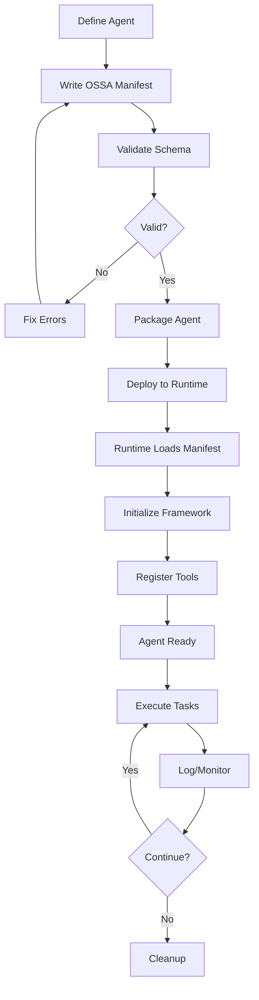

# Ecosystem Overview

The Open Standard Agents (OSSA) ecosystem encompasses a wide range of frameworks, runtimes, tools, and integrations that enable vendor-neutral AI agent orchestration. This document provides a comprehensive overview of how OSSA enables interoperability across the agent landscape.

## Architecture Model

OSSA follows a layered architecture that separates concerns and enables flexibility:

```
┌─────────────────────────────────────────────────────────────┐
│                    Application Layer                         │
│   (Your Agents - CrewAI, LangChain, kAgent, Custom, etc.)   │
└─────────────────────────────────────────────────────────────┘
                            ↕
┌─────────────────────────────────────────────────────────────┐
│                   OSSA Specification Layer                   │
│        (Standard Manifest, Schema Validation, Tools)         │
└─────────────────────────────────────────────────────────────┘
                            ↕
┌─────────────────────────────────────────────────────────────┐
│                    Framework Layer                           │
│  (LangChain, CrewAI, Anthropic MCP, OpenAI, Langflow, etc.) │
└─────────────────────────────────────────────────────────────┘
                            ↕
┌─────────────────────────────────────────────────────────────┐
│                     Runtime Layer                            │
│   (Docker, Kubernetes, Lambda, Cloud Functions, etc.)       │
└─────────────────────────────────────────────────────────────┘
                            ↕
┌─────────────────────────────────────────────────────────────┐
│                  Infrastructure Layer                        │
│      (Cloud Providers, On-Premise, Edge, Hybrid)            │
└─────────────────────────────────────────────────────────────┘
```

## Core Principles

### 1. Framework Agnostic

OSSA is designed to work with any AI agent framework. Whether you're using:

- **LangChain** for chain-based workflows
- **CrewAI** for multi-agent coordination
- **kAgent** for native OSSA implementation
- **Anthropic MCP** for Claude integration
- **OpenAI Assistants** for GPT-based agents
- **Custom frameworks** built in-house

All frameworks can produce and consume OSSA manifests, enabling seamless interoperability.

### 2. Runtime Portable

Deploy the same agent definition across:

- **Containers**: Docker, Podman
- **Orchestrators**: Kubernetes, Docker Swarm
- **Serverless**: AWS Lambda, Google Cloud Functions, Azure Functions
- **Edge**: Cloudflare Workers, AWS Lambda@Edge
- **On-Premise**: Bare metal servers, private clouds

The OSSA manifest travels with your agent, ensuring consistent behavior across environments.

### 3. Tool Extensible

OSSA supports multiple tool integration patterns:

- **MCP Servers**: Model Context Protocol for standardized tool interfaces
- **REST APIs**: OpenAPI/Swagger-based HTTP services
- **GraphQL**: Query-based data fetching
- **gRPC**: High-performance binary protocols
- **WebSockets**: Real-time bidirectional communication
- **Native Functions**: Language-specific tool implementations

### 4. Security First

Built-in security features include:

- **Capability-based permissions**: Fine-grained access control
- **Secret management**: Secure credential handling
- **Audit trails**: Complete operation logging
- **Sandboxing**: Isolated execution environments
- **Compliance**: SOC 2, HIPAA, GDPR-ready

## Integration Patterns

### Pattern 1: Direct Framework Integration

Frameworks implement OSSA manifest import/export:

```typescript
// LangChain example
import { OSSAAgent } from '@ossa/langchain';

const agent = OSSAAgent.fromManifest('agent-manifest.json');
await agent.execute({ input: 'Hello world' });
```

### Pattern 2: Runtime Adapter

Runtimes provide OSSA-to-native translation:

```yaml
# Kubernetes deployment
apiVersion: ossa.io/v1
kind: Agent
metadata:
  name: my-agent
spec:
  manifestRef:
    name: agent-manifest
    namespace: default
```

### Pattern 3: Middleware Translation

Middleware layers bridge OSSA and proprietary formats:

```bash
# Convert OpenAI Assistant to OSSA
ossa convert \
  --from openai-assistant \
  --to ossa \
  --input assistant.json \
  --output manifest.json
```

## Ecosystem Components

### Core Specification

- **Schema**: JSON Schema defining manifest structure
- **Validator**: Command-line tool for manifest validation
- **TypeScript Types**: Type definitions for TypeScript/JavaScript
- **Python Types**: Type definitions for Python (Pydantic models)

### Framework Adapters

- **@ossa/langchain**: LangChain integration
- **@ossa/crewai**: CrewAI integration
- **@ossa/mcp**: Anthropic MCP integration
- **@ossa/openai**: OpenAI Assistants integration
- **@ossa/langflow**: Langflow visual builder integration

### Runtime Support

- **Docker Images**: Pre-built containers for OSSA agents
- **Kubernetes Operators**: Custom resource definitions for K8s
- **Serverless Templates**: CloudFormation, Terraform modules
- **Edge Workers**: Cloudflare Workers, Lambda@Edge templates

### Development Tools

- **OSSA CLI**: Command-line interface for validation, conversion, deployment
- **VSCode Extension**: IntelliSense, validation, snippets
- **Playground**: Interactive web-based agent testing
- **Schema Explorer**: Visual schema documentation

### Monitoring & Observability

- **OpenTelemetry**: Distributed tracing integration
- **Prometheus**: Metrics collection and alerting
- **Structured Logging**: JSON-formatted logs with correlation IDs
- **Health Checks**: Readiness and liveness probes

## Data Flow

### Agent Lifecycle with OSSA



## Interoperability Model

### Multi-Framework Orchestration

OSSA enables coordinating agents across different frameworks:

```json
{
  "name": "hybrid-system",
  "type": "orchestrator",
  "agents": [
    {
      "id": "researcher",
      "framework": "langchain",
      "manifestRef": "./langchain-researcher.json"
    },
    {
      "id": "writer",
      "framework": "crewai",
      "manifestRef": "./crewai-writer.json"
    },
    {
      "id": "reviewer",
      "framework": "openai",
      "manifestRef": "./openai-reviewer.json"
    }
  ],
  "workflow": {
    "steps": [
      { "agent": "researcher", "output": "research_data" },
      { "agent": "writer", "input": "research_data", "output": "draft" },
      { "agent": "reviewer", "input": "draft", "output": "final" }
    ]
  }
}
```

### Cross-Runtime Deployment

Deploy agents to different runtimes based on requirements:

- **CPU-Intensive**: Kubernetes with GPU nodes
- **Event-Driven**: AWS Lambda with SQS triggers
- **Low-Latency**: Cloudflare Workers at the edge
- **Stateful**: EC2 instances with persistent storage

## Community Ecosystem

### Open Source Projects

- **kAgent**: Native OSSA framework (reference implementation)
- **OSSA Validator**: Schema validation and linting
- **OSSA Playground**: Web-based testing environment
- **OSSA CLI**: Command-line tools

### Commercial Integrations

- **LangSmith**: LangChain deployment platform
- **Crew Studio**: CrewAI management console
- **Claude for Enterprise**: Anthropic's enterprise offering
- **OpenAI Teams**: Team collaboration features

### Community Resources

- **Discord**: Real-time chat and support
- **GitLab**: Source code, issues, discussions
- **Documentation**: Comprehensive guides and references
- **Examples**: Real-world implementation patterns

## Getting Started

### For Framework Developers

Integrate OSSA into your framework:

1. **Implement Manifest Parser**: Read OSSA JSON/YAML
2. **Map to Native Types**: Convert OSSA concepts to your framework
3. **Validate Schema**: Ensure manifest compliance
4. **Export Manifest**: Generate OSSA from native definitions
5. **Document Integration**: Provide migration guides

### For Runtime Developers

Add OSSA support to your runtime:

1. **Parse Manifest**: Extract deployment requirements
2. **Provision Resources**: Create necessary infrastructure
3. **Initialize Framework**: Setup agent execution environment
4. **Monitor Lifecycle**: Track agent health and performance
5. **Handle Cleanup**: Properly tear down resources

### For Tool Developers

Create OSSA-compatible tools:

1. **Define Schema**: Describe tool inputs/outputs
2. **Implement Interface**: Follow OSSA tool protocol
3. **Add Documentation**: Provide usage examples
4. **Register Tool**: Make discoverable in ecosystem
5. **Maintain Compatibility**: Keep up with spec updates

## Best Practices

### Manifest Design

- **Keep it simple**: Start with minimal required fields
- **Document thoroughly**: Use descriptions for all properties
- **Version explicitly**: Always specify OSSA spec version
- **Validate early**: Run validation before deployment
- **Test thoroughly**: Verify behavior across target runtimes

### Integration Strategy

- **Start small**: Integrate one agent type first
- **Iterate quickly**: Get feedback from real usage
- **Document everything**: Provide clear migration paths
- **Support community**: Help users adopt your integration
- **Stay updated**: Track OSSA specification changes

### Security Considerations

- **Never embed secrets**: Use secret references only
- **Validate inputs**: Sanitize all user-provided data
- **Limit permissions**: Grant minimum necessary capabilities
- **Audit access**: Log all sensitive operations
- **Update dependencies**: Keep frameworks and tools current

## Roadmap

### Current Focus (2024)

- **Framework Parity**: Complete integrations for major frameworks
- **Runtime Support**: Expand deployment options
- **Tool Ecosystem**: Grow available OSSA-compatible tools
- **Documentation**: Comprehensive guides and examples

### Near Term (2025)

- **Advanced Orchestration**: Multi-agent coordination patterns
- **Observability**: Enhanced monitoring and debugging
- **Performance**: Optimize manifest parsing and validation
- **Security**: Enhanced secret management and access control

### Long Term (2026+)

- **Federation**: Cross-organization agent collaboration
- **Marketplace**: Centralized agent and tool registry
- **Certification**: Compliance and compatibility testing
- **Governance**: Community-driven specification evolution

## Contributing

The OSSA ecosystem thrives on community contributions:

- **Report Issues**: Help identify bugs and gaps
- **Submit PRs**: Contribute code and documentation
- **Share Examples**: Demonstrate real-world usage
- **Provide Feedback**: Guide specification evolution
- **Build Integrations**: Extend ecosystem reach

Visit [github.com/blueflyio/openstandardagents](https://github.com/blueflyio/openstandardagents) to get involved.

## Resources

- **Specification**: Full OSSA specification reference
- **Examples**: Real-world implementation examples
- **API Reference**: Detailed API documentation
- **Community**: Discord, forums, and social media
- **Blog**: Updates, tutorials, and case studies

---

**Next Steps**: Explore [Framework Support](/docs/ecosystem/framework-support) for detailed integration guides.
