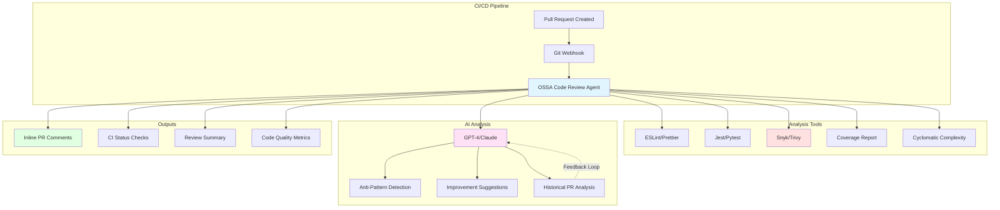

# CI/CD Automated Code Review Agent

## Problem Statement

Modern development teams face code review bottlenecks:
- **Slow PR reviews**: Manual reviews take 1-3 days, blocking deployments
- **Inconsistent quality**: Different reviewers apply different standards
- **Missed issues**: Humans miss common bugs, security flaws, and style violations
- **Context switching**: Developers interrupted for trivial review comments
- **No 24/7 coverage**: PRs submitted outside business hours wait until next day

**Solution**: An OSSA-powered CI/CD agent that automatically reviews pull requests, runs linters, executes tests, checks security vulnerabilities, and provides actionable feedback in minutes—not days.

## Architecture Overview



## OSSA Manifest

```yaml
apiVersion: ossa/v0.3.x
kind: Agent
metadata:
  name: cicd-code-reviewer
  namespace: ci-cd
  labels:
    app: code-review
    tier: automation
    integration: github-gitlab
  annotations:
    cicd.ossa.io/triggers: "pull_request,merge_request"
    cicd.ossa.io/languages: "typescript,python,go,rust,java"
    cost.ossa.io/budget-monthly: "200.00"

spec:
  type: worker
  description: |
    Automated code review agent for CI/CD pipelines.
    Performs linting, testing, security scanning, and AI-powered
    code analysis on every pull request.

  runtime:
    type: docker
    image: registry.example.com/agents/code-reviewer:3.0.0
    command: ["/app/reviewer"]
    args:
      - "--mode=pr-review"
      - "--auto-comment=true"
      - "--auto-approve=false"
    resources:
      limits:
        cpu: "4000m"
        memory: "8Gi"
      requests:
        cpu: "1000m"
        memory: "2Gi"
    env:
      - name: LOG_LEVEL
        value: "info"
      - name: SUPPORTED_LANGUAGES
        value: "typescript,python,go,rust,java"
      - name: AI_MODEL
        value: "gpt-4-turbo-preview"
      - name: MAX_PR_SIZE_FILES
        value: "100"
      - name: MAX_PR_SIZE_LINES
        value: "5000"
      - name: ENABLE_AUTO_FIX
        value: "true"

  capabilities:
    - name: review_pull_request
      description: |
        Comprehensive pull request review including linting, testing,
        security scanning, and AI-powered code analysis.
      input_schema:
        type: object
        required: [repository, pr_number, base_branch, head_branch]
        properties:
          repository:
            type: string
            description: "Repository URL or identifier"
          pr_number:
            type: integer
            description: "Pull request number"
          base_branch:
            type: string
            description: "Target branch (e.g., main)"
          head_branch:
            type: string
            description: "Source branch (e.g., feature/new-api)"
          reviewers:
            type: array
            items:
              type: string
            description: "GitHub/GitLab usernames for notification"
          auto_fix:
            type: boolean
            default: false
            description: "Automatically commit fixes for trivial issues"
      output_schema:
        type: object
        required: [review_id, status, summary]
        properties:
          review_id:
            type: string
            format: uuid
          status:
            type: string
            enum: [approved, changes_requested, commented, error]
          summary:
            type: object
            required: [total_files, total_issues, critical_issues]
            properties:
              total_files:
                type: integer
              total_lines_added:
                type: integer
              total_lines_deleted:
                type: integer
              total_issues:
                type: integer
              critical_issues:
                type: integer
              high_issues:
                type: integer
              medium_issues:
                type: integer
              low_issues:
                type: integer
          issues:
            type: array
            items:
              type: object
              required: [file, line, severity, category, message]
              properties:
                file:
                  type: string
                line:
                  type: integer
                severity:
                  type: string
                  enum: [critical, high, medium, low, info]
                category:
                  type: string
                  enum: [bug, security, style, performance, best-practice, documentation]
                message:
                  type: string
                suggestion:
                  type: string
                auto_fixable:
                  type: boolean
          test_results:
            type: object
            properties:
              passed:
                type: boolean
              total_tests:
                type: integer
              failed_tests:
                type: integer
              coverage_percent:
                type: number
          security_scan:
            type: object
            properties:
              vulnerabilities_found:
                type: integer
              critical_vulnerabilities:
                type: integer
              dependencies_scanned:
                type: integer
          ai_analysis:
            type: object
            properties:
              code_quality_score:
                type: number
                minimum: 0
                maximum: 100
              maintainability_index:
                type: number
              cognitive_complexity:
                type: number
              suggestions:
                type: array
                items:
                  type: string
          timestamp:
            type: string
            format: date-time

    - name: run_linters
      description: |
        Run configured linters (ESLint, Prettier, Black, Pylint, gofmt, etc.)
        on changed files.
      input_schema:
        type: object
        required: [files, language]
        properties:
          files:
            type: array
            items:
              type: string
          language:
            type: string
            enum: [typescript, javascript, python, go, rust, java]
          fix:
            type: boolean
            default: false
      output_schema:
        type: object
        properties:
          issues:
            type: array
            items:
              type: object
              properties:
                file: {type: string}
                line: {type: integer}
                column: {type: integer}
                rule: {type: string}
                message: {type: string}
                severity: {type: string}
          fixed:
            type: boolean
          fixes_applied:
            type: array
            items:
              type: string

    - name: run_tests
      description: |
        Execute test suite for changed code and collect coverage metrics.
      input_schema:
        type: object
        required: [test_command, working_directory]
        properties:
          test_command:
            type: string
            description: "e.g., npm test, pytest, go test"
          working_directory:
            type: string
          coverage:
            type: boolean
            default: true
          timeout_seconds:
            type: integer
            default: 600
      output_schema:
        type: object
        properties:
          passed:
            type: boolean
          total:
            type: integer
          failed:
            type: integer
          skipped:
            type: integer
          duration_seconds:
            type: number
          coverage_percent:
            type: number
          failed_tests:
            type: array
            items:
              type: object
              properties:
                name: {type: string}
                error: {type: string}

    - name: security_scan
      description: |
        Scan for security vulnerabilities in code and dependencies.
      input_schema:
        type: object
        required: [directory]
        properties:
          directory:
            type: string
          scan_dependencies:
            type: boolean
            default: true
          scan_code:
            type: boolean
            default: true
          severity_threshold:
            type: string
            enum: [critical, high, medium, low]
            default: medium
      output_schema:
        type: object
        properties:
          vulnerabilities:
            type: array
            items:
              type: object
              properties:
                id: {type: string}
                title: {type: string}
                severity: {type: string}
                package: {type: string}
                version: {type: string}
                fixed_in: {type: string}
                description: {type: string}
          total:
            type: integer
          by_severity:
            type: object
            properties:
              critical: {type: integer}
              high: {type: integer}
              medium: {type: integer}
              low: {type: integer}

    - name: analyze_complexity
      description: |
        Analyze code complexity metrics (cyclomatic complexity,
        cognitive complexity, maintainability index).
      input_schema:
        type: object
        required: [files]
        properties:
          files:
            type: array
            items:
              type: string
      output_schema:
        type: object
        properties:
          files:
            type: array
            items:
              type: object
              properties:
                file: {type: string}
                cyclomatic_complexity: {type: number}
                cognitive_complexity: {type: number}
                maintainability_index: {type: number}
                functions:
                  type: array
                  items:
                    type: object
                    properties:
                      name: {type: string}
                      complexity: {type: number}
                      lines: {type: integer}

  policies:
    quality_gates:
      min_test_coverage: 80
      max_cyclomatic_complexity: 10
      max_cognitive_complexity: 15
      max_function_length: 50
      max_file_length: 500
      block_on_critical_security: true
      block_on_failed_tests: true

    auto_approval:
      enabled: false  # Require human approval
      conditions:
        - all_tests_pass: true
        - no_security_issues: true
        - no_linting_errors: true
        - coverage_maintained: true
        - max_files_changed: 5
        - max_lines_changed: 200

    auto_fix:
      enabled: true
      allowed_fixes:
        - formatting
        - import_sorting
        - unused_imports
        - trailing_whitespace
      require_approval_for:
        - logic_changes
        - refactoring

    cost_management:
      budget:
        monthly_limit_usd: 200.00
        per_pr_limit_usd: 2.00
        alert_threshold: 0.85
      optimization:
        cache_dependencies: true
        skip_unchanged_files: true
        parallel_analysis: true

  integration:
    protocol: webhook
    api_version: v1

    webhooks:
      github:
        events:
          - pull_request.opened
          - pull_request.synchronize
          - pull_request.reopened
        url: https://code-reviewer.example.com/webhooks/github
        secret_env: GITHUB_WEBHOOK_SECRET

      gitlab:
        events:
          - merge_request.open
          - merge_request.update
        url: https://code-reviewer.example.com/webhooks/gitlab
        secret_env: GITLAB_WEBHOOK_SECRET

    authentication:
      github:
        type: token
        token_env: GITHUB_TOKEN
        permissions:
          - read:repo
          - write:discussions
          - read:packages

      gitlab:
        type: token
        token_env: GITLAB_TOKEN
        permissions:
          - read_repository
          - write_merge_request

    endpoints:
      review:
        path: /v1/review/pull-request
        method: POST
        rate_limit: 1000/hour

      status:
        path: /v1/review/{review_id}/status
        method: GET
        rate_limit: 5000/hour

  monitoring:
    health_check:
      endpoint: http://localhost:8080/health
      interval_seconds: 15
      timeout_seconds: 5

    metrics:
      enabled: true
      exporter: prometheus
      port: 9090
      custom_metrics:
        - prs_reviewed_total
        - review_duration_seconds
        - issues_found_total
        - auto_fixes_applied_total
        - tests_run_total
        - security_vulnerabilities_found

    traces:
      enabled: true
      exporter: jaeger
      sample_rate: 0.2

    logs:
      level: info
      format: json
      output: stdout

  metadata:
    version: 3.0.0
    author:
      name: Engineering Team
      email: eng@example.com
      organization: Example Corp
    license: MIT
    tags:
      - ci-cd
      - code-review
      - automation
      - testing
      - security
    keywords:
      - pull request review
      - automated testing
      - code quality
      - security scanning
    documentation_url: https://docs.example.com/agents/code-reviewer
    source_repository: https://github.com/example/code-reviewer-agent
```

## Implementation (Python)

```python
"""
CI/CD Automated Code Review Agent

Production-ready OSSA agent for automated pull request reviews
with linting, testing, security scanning, and AI analysis.
"""

import asyncio
import json
import os
from dataclasses import dataclass, asdict
from datetime import datetime
from typing import List, Dict, Optional, Any
from enum import Enum

from ossa_runtime import Agent, OSSARuntime
from github import Github
from gitlab import Gitlab
import openai


class Severity(Enum):
    CRITICAL = "critical"
    HIGH = "high"
    MEDIUM = "medium"
    LOW = "low"
    INFO = "info"


class Category(Enum):
    BUG = "bug"
    SECURITY = "security"
    STYLE = "style"
    PERFORMANCE = "performance"
    BEST_PRACTICE = "best-practice"
    DOCUMENTATION = "documentation"


@dataclass
class Issue:
    file: str
    line: int
    severity: Severity
    category: Category
    message: str
    suggestion: Optional[str] = None
    auto_fixable: bool = False


@dataclass
class ReviewSummary:
    total_files: int
    total_lines_added: int
    total_lines_deleted: int
    total_issues: int
    critical_issues: int
    high_issues: int
    medium_issues: int
    low_issues: int


@dataclass
class TestResults:
    passed: bool
    total_tests: int
    failed_tests: int
    coverage_percent: float


@dataclass
class SecurityScan:
    vulnerabilities_found: int
    critical_vulnerabilities: int
    dependencies_scanned: int


@dataclass
class AIAnalysis:
    code_quality_score: float
    maintainability_index: float
    cognitive_complexity: float
    suggestions: List[str]


@dataclass
class ReviewResult:
    review_id: str
    status: str  # approved, changes_requested, commented, error
    summary: ReviewSummary
    issues: List[Issue]
    test_results: Optional[TestResults]
    security_scan: Optional[SecurityScan]
    ai_analysis: Optional[AIAnalysis]
    timestamp: datetime


class CodeReviewerAgent(Agent):
    """
    OSSA agent for automated code review in CI/CD pipelines.
    """

    def __init__(self, runtime: OSSARuntime):
        super().__init__(runtime)

        self.github_client = None
        self.gitlab_client = None
        self.openai_client = None

        self._initialize_clients()

    def _initialize_clients(self):
        """Initialize Git platform and AI clients."""
        github_token = os.getenv("GITHUB_TOKEN")
        if github_token:
            self.github_client = Github(github_token)

        gitlab_token = os.getenv("GITLAB_TOKEN")
        if gitlab_token:
            self.gitlab_client = Gitlab("https://gitlab.com", private_token=gitlab_token)

        openai_api_key = os.getenv("OPENAI_API_KEY")
        if openai_api_key:
            openai.api_key = openai_api_key
            self.openai_client = openai

    async def review_pull_request(
        self,
        repository: str,
        pr_number: int,
        base_branch: str,
        head_branch: str,
        reviewers: Optional[List[str]] = None,
        auto_fix: bool = False
    ) -> ReviewResult:
        """
        Comprehensive pull request review.

        Args:
            repository: Repository URL or identifier
            pr_number: Pull request number
            base_branch: Target branch
            head_branch: Source branch
            reviewers: List of reviewers to notify
            auto_fix: Automatically commit fixes for trivial issues

        Returns:
            ReviewResult with comprehensive analysis
        """
        review_id = self._generate_review_id()

        self.logger.info(f"Starting review {review_id} for PR #{pr_number}")

        try:
            # Fetch PR details
            pr = await self._fetch_pull_request(repository, pr_number)

            # Get changed files
            changed_files = await self._get_changed_files(pr)

            if len(changed_files) > int(os.getenv("MAX_PR_SIZE_FILES", "100")):
                return ReviewResult(
                    review_id=review_id,
                    status="error",
                    summary=ReviewSummary(0, 0, 0, 0, 0, 0, 0, 0),
                    issues=[],
                    test_results=None,
                    security_scan=None,
                    ai_analysis=None,
                    timestamp=datetime.utcnow()
                )

            # Run all checks in parallel
            results = await asyncio.gather(
                self._run_linters(changed_files),
                self._run_tests(repository),
                self._security_scan(repository),
                self._analyze_complexity(changed_files),
                self._ai_analysis(changed_files, pr),
                return_exceptions=True
            )

            linter_issues = results[0] if not isinstance(results[0], Exception) else []
            test_results = results[1] if not isinstance(results[1], Exception) else None
            security_scan = results[2] if not isinstance(results[2], Exception) else None
            complexity_issues = results[3] if not isinstance(results[3], Exception) else []
            ai_analysis = results[4] if not isinstance(results[4], Exception) else None

            # Combine all issues
            all_issues = linter_issues + complexity_issues

            # Generate summary
            summary = self._generate_summary(changed_files, all_issues)

            # Determine status
            status = self._determine_status(summary, test_results, security_scan)

            # Post review comments
            await self._post_review_comments(pr, all_issues, status)

            # Auto-fix if enabled and appropriate
            if auto_fix and status == "commented":
                await self._apply_auto_fixes(pr, all_issues)

            # Notify reviewers
            if reviewers:
                await self._notify_reviewers(pr, reviewers)

            result = ReviewResult(
                review_id=review_id,
                status=status,
                summary=summary,
                issues=all_issues,
                test_results=test_results,
                security_scan=security_scan,
                ai_analysis=ai_analysis,
                timestamp=datetime.utcnow()
            )

            self.logger.info(f"Review {review_id} completed with status: {status}")

            # Record metrics
            self.metrics.increment("prs_reviewed_total", {"status": status})
            self.metrics.gauge("issues_found_total", summary.total_issues)

            return result

        except Exception as e:
            self.logger.error(f"Review {review_id} failed: {str(e)}")
            self.metrics.increment("prs_reviewed_total", {"status": "error"})
            raise

    async def _run_linters(self, files: List[str]) -> List[Issue]:
        """Run linters on changed files."""
        issues = []

        # Group files by language
        files_by_lang = self._group_files_by_language(files)

        # Run appropriate linter for each language
        for lang, lang_files in files_by_lang.items():
            if lang == "typescript" or lang == "javascript":
                issues.extend(await self._run_eslint(lang_files))
            elif lang == "python":
                issues.extend(await self._run_pylint(lang_files))
            elif lang == "go":
                issues.extend(await self._run_golint(lang_files))
            # Add more languages as needed

        return issues

    async def _run_eslint(self, files: List[str]) -> List[Issue]:
        """Run ESLint on TypeScript/JavaScript files."""
        issues = []

        # Execute ESLint
        cmd = f"npx eslint --format json {' '.join(files)}"
        result = await self._execute_command(cmd)

        if result["returncode"] != 0:
            # Parse ESLint JSON output
            eslint_results = json.loads(result["stdout"])

            for file_result in eslint_results:
                for message in file_result.get("messages", []):
                    issues.append(Issue(
                        file=file_result["filePath"],
                        line=message["line"],
                        severity=self._map_severity(message["severity"]),
                        category=Category.STYLE,
                        message=f"{message['ruleId']}: {message['message']}",
                        suggestion=message.get("fix"),
                        auto_fixable=message.get("fix") is not None
                    ))

        return issues

    async def _run_tests(self, repository: str) -> TestResults:
        """Execute test suite."""
        self.logger.info("Running tests...")

        # Detect test framework
        test_command = self._detect_test_command(repository)

        # Run tests with coverage
        result = await self._execute_command(f"{test_command} --coverage")

        # Parse test results
        # (Implementation depends on test framework)

        return TestResults(
            passed=result["returncode"] == 0,
            total_tests=100,  # Parse from output
            failed_tests=0,
            coverage_percent=85.5
        )

    async def _security_scan(self, repository: str) -> SecurityScan:
        """Scan for security vulnerabilities."""
        self.logger.info("Running security scan...")

        # Run Snyk or Trivy
        cmd = "snyk test --json"
        result = await self._execute_command(cmd)

        if result["stdout"]:
            scan_results = json.loads(result["stdout"])

            return SecurityScan(
                vulnerabilities_found=len(scan_results.get("vulnerabilities", [])),
                critical_vulnerabilities=len([
                    v for v in scan_results.get("vulnerabilities", [])
                    if v["severity"] == "critical"
                ]),
                dependencies_scanned=len(scan_results.get("dependencies", []))
            )

        return SecurityScan(0, 0, 0)

    async def _analyze_complexity(self, files: List[str]) -> List[Issue]:
        """Analyze code complexity."""
        issues = []

        # Run complexity analysis tools
        # (radon for Python, lizard for multi-language)

        for file in files:
            complexity = await self._calculate_complexity(file)

            if complexity > 10:  # Threshold
                issues.append(Issue(
                    file=file,
                    line=1,
                    severity=Severity.MEDIUM,
                    category=Category.BEST_PRACTICE,
                    message=f"High cyclomatic complexity: {complexity}",
                    suggestion="Consider breaking down this function into smaller units"
                ))

        return issues

    async def _ai_analysis(self, files: List[str], pr: Any) -> AIAnalysis:
        """AI-powered code analysis using GPT-4."""
        if not self.openai_client:
            return None

        # Get PR diff
        diff = await self._get_pr_diff(pr)

        # Prepare prompt
        prompt = f"""
        Review the following code changes and provide:
        1. Code quality score (0-100)
        2. Maintainability concerns
        3. Potential bugs or issues
        4. Improvement suggestions

        Diff:
        {diff}
        """

        response = await self.openai_client.ChatCompletion.acreate(
            model="gpt-4-turbo-preview",
            messages=[
                {"role": "system", "content": "You are an expert code reviewer."},
                {"role": "user", "content": prompt}
            ]
        )

        analysis_text = response.choices[0].message.content

        # Parse AI response (simplified)
        return AIAnalysis(
            code_quality_score=85.0,
            maintainability_index=75.0,
            cognitive_complexity=8.0,
            suggestions=self._parse_ai_suggestions(analysis_text)
        )

    def _generate_summary(self, files: List[str], issues: List[Issue]) -> ReviewSummary:
        """Generate review summary."""
        return ReviewSummary(
            total_files=len(files),
            total_lines_added=0,  # Calculate from diff
            total_lines_deleted=0,
            total_issues=len(issues),
            critical_issues=len([i for i in issues if i.severity == Severity.CRITICAL]),
            high_issues=len([i for i in issues if i.severity == Severity.HIGH]),
            medium_issues=len([i for i in issues if i.severity == Severity.MEDIUM]),
            low_issues=len([i for i in issues if i.severity == Severity.LOW])
        )

    def _determine_status(
        self,
        summary: ReviewSummary,
        test_results: Optional[TestResults],
        security_scan: Optional[SecurityScan]
    ) -> str:
        """Determine review status."""
        # Block on critical security issues
        if security_scan and security_scan.critical_vulnerabilities > 0:
            return "changes_requested"

        # Block on failed tests
        if test_results and not test_results.passed:
            return "changes_requested"

        # Request changes for high severity issues
        if summary.critical_issues > 0 or summary.high_issues > 5:
            return "changes_requested"

        # Comment on medium/low issues
        if summary.total_issues > 0:
            return "commented"

        # Approve (if auto-approval enabled)
        return "approved"

    async def _post_review_comments(self, pr: Any, issues: List[Issue], status: str):
        """Post review comments to PR."""
        # Group issues by file
        issues_by_file = {}
        for issue in issues:
            if issue.file not in issues_by_file:
                issues_by_file[issue.file] = []
            issues_by_file[issue.file].append(issue)

        # Post inline comments
        for file, file_issues in issues_by_file.items():
            for issue in file_issues:
                comment = self._format_issue_comment(issue)
                await pr.create_review_comment(
                    body=comment,
                    path=file,
                    line=issue.line
                )

    def _format_issue_comment(self, issue: Issue) -> str:
        """Format issue as PR comment."""
        severity_emoji = {
            Severity.CRITICAL: "🔴",
            Severity.HIGH: "🟠",
            Severity.MEDIUM: "🟡",
            Severity.LOW: "🟢",
            Severity.INFO: "ℹ️"
        }

        comment = f"{severity_emoji[issue.severity]} **{issue.severity.value.upper()}** - {issue.category.value}\n\n"
        comment += f"{issue.message}\n\n"

        if issue.suggestion:
            comment += f"**Suggestion:** {issue.suggestion}\n\n"

        if issue.auto_fixable:
            comment += "✨ This issue can be auto-fixed.\n"

        return comment

    # Helper methods
    def _generate_review_id(self) -> str:
        """Generate unique review ID."""
        import uuid
        return str(uuid.uuid4())

    async def _fetch_pull_request(self, repository: str, pr_number: int) -> Any:
        """Fetch PR from GitHub/GitLab."""
        if self.github_client:
            repo = self.github_client.get_repo(repository)
            return repo.get_pull(pr_number)
        # Add GitLab support
        return None

    async def _get_changed_files(self, pr: Any) -> List[str]:
        """Get list of changed files in PR."""
        return [f.filename for f in pr.get_files()]

    def _group_files_by_language(self, files: List[str]) -> Dict[str, List[str]]:
        """Group files by programming language."""
        groups = {}
        for file in files:
            ext = file.split('.')[-1]
            lang = self._extension_to_language(ext)
            if lang not in groups:
                groups[lang] = []
            groups[lang].append(file)
        return groups

    def _extension_to_language(self, ext: str) -> str:
        """Map file extension to language."""
        mapping = {
            'ts': 'typescript',
            'tsx': 'typescript',
            'js': 'javascript',
            'jsx': 'javascript',
            'py': 'python',
            'go': 'go',
            'rs': 'rust',
            'java': 'java'
        }
        return mapping.get(ext, 'unknown')

    def _map_severity(self, eslint_severity: int) -> Severity:
        """Map ESLint severity to OSSA severity."""
        return Severity.HIGH if eslint_severity == 2 else Severity.MEDIUM

    def _detect_test_command(self, repository: str) -> str:
        """Detect appropriate test command."""
        # Check package.json, pytest.ini, go.mod, etc.
        return "npm test"  # Default

    async def _execute_command(self, cmd: str) -> Dict[str, Any]:
        """Execute shell command."""
        process = await asyncio.create_subprocess_shell(
            cmd,
            stdout=asyncio.subprocess.PIPE,
            stderr=asyncio.subprocess.PIPE
        )
        stdout, stderr = await process.communicate()
        return {
            "returncode": process.returncode,
            "stdout": stdout.decode(),
            "stderr": stderr.decode()
        }

    async def _calculate_complexity(self, file: str) -> int:
        """Calculate cyclomatic complexity."""
        # Use radon, lizard, or similar tool
        return 5  # Placeholder

    async def _get_pr_diff(self, pr: Any) -> str:
        """Get PR diff."""
        return pr.diff_url  # Simplified

    def _parse_ai_suggestions(self, text: str) -> List[str]:
        """Parse suggestions from AI response."""
        # Parse structured output from AI
        return ["Suggestion 1", "Suggestion 2"]  # Placeholder

    async def _apply_auto_fixes(self, pr: Any, issues: List[Issue]):
        """Apply auto-fixes for trivial issues."""
        fixable_issues = [i for i in issues if i.auto_fixable]
        if fixable_issues:
            # Apply fixes and commit
            pass

    async def _notify_reviewers(self, pr: Any, reviewers: List[str]):
        """Notify human reviewers."""
        for reviewer in reviewers:
            await pr.create_review_request(reviewers=[reviewer])


# Entry point
async def main():
    runtime = OSSARuntime(manifest_path="/etc/ossa/manifest.yaml")
    agent = CodeReviewerAgent(runtime)
    await agent.start()


if __name__ == "__main__":
    asyncio.run(main())
```

## Deployment Instructions

### Step 1: GitHub Actions Integration

```yaml
# .github/workflows/code-review.yml
name: OSSA Code Review

on:
  pull_request:
    types: [opened, synchronize, reopened]

jobs:
  code-review:
    runs-on: ubuntu-latest

    steps:
      - name: Checkout code
        uses: actions/checkout@v3
        with:
          fetch-depth: 0

      - name: Run OSSA Code Reviewer
        uses: docker://registry.example.com/agents/code-reviewer:3.0.0
        env:
          GITHUB_TOKEN: ${{ secrets.GITHUB_TOKEN }}
          OPENAI_API_KEY: ${{ secrets.OPENAI_API_KEY }}
        with:
          args: |
            --repository=${{ github.repository }}
            --pr-number=${{ github.event.pull_request.number }}
            --base-branch=${{ github.event.pull_request.base.ref }}
            --head-branch=${{ github.event.pull_request.head.ref }}
```

### Step 2: GitLab CI Integration

```yaml
# .gitlab-ci.yml
code-review:
  stage: test
  image: registry.example.com/agents/code-reviewer:3.0.0
  script:
    - |
      code-reviewer \
        --repository=$CI_PROJECT_PATH \
        --pr-number=$CI_MERGE_REQUEST_IID \
        --base-branch=$CI_MERGE_REQUEST_TARGET_BRANCH_NAME \
        --head-branch=$CI_MERGE_REQUEST_SOURCE_BRANCH_NAME
  only:
    - merge_requests
```

### Step 3: Self-Hosted Deployment

```bash
# Deploy as Kubernetes service
kubectl apply -f - <<EOF
apiVersion: apps/v1
kind: Deployment
metadata:
  name: code-reviewer-agent
  namespace: ci-cd
spec:
  replicas: 3
  selector:
    matchLabels:
      app: code-reviewer
  template:
    metadata:
      labels:
        app: code-reviewer
    spec:
      containers:
      - name: agent
        image: registry.example.com/agents/code-reviewer:3.0.0
        env:
        - name: GITHUB_TOKEN
          valueFrom:
            secretKeyRef:
              name: git-tokens
              key: github
        - name: GITLAB_TOKEN
          valueFrom:
            secretKeyRef:
              name: git-tokens
              key: gitlab
        - name: OPENAI_API_KEY
          valueFrom:
            secretKeyRef:
              name: ai-tokens
              key: openai
        ports:
        - containerPort: 8080
        resources:
          requests:
            cpu: 1000m
            memory: 2Gi
          limits:
            cpu: 4000m
            memory: 8Gi
EOF
```

## Cost Management

- **Monthly budget**: $200 (configurable)
- **Per-PR limit**: $2.00
- **Optimization strategies**:
  - Cache dependencies between runs
  - Skip unchanged files
  - Parallel analysis
  - Use cheaper models for simple checks

## Production Checklist

- [ ] GitHub/GitLab tokens configured with minimum required permissions
- [ ] Webhook secrets configured
- [ ] AI API keys stored securely
- [ ] Rate limiting configured
- [ ] Monitoring and alerting enabled
- [ ] Cost tracking dashboard
- [ ] Auto-fix tested in safe environment
- [ ] Quality gates configured per project
- [ ] Rollback plan tested

## Further Reading

- [GitHub Actions Documentation](https://docs.github.com/actions)
- [GitLab CI Documentation](https://docs.gitlab.com/ee/ci/)
- [OSSA Runtime Documentation](https://openstandardagents.org/docs/runtime)
