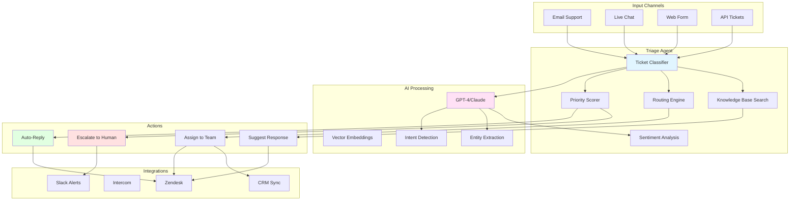

# Customer Support Ticket Triage Agent

## Problem Statement

Customer support teams face overwhelming ticket volumes:
- **Response time bottlenecks**: Average first response time 4-8 hours
- **Misrouted tickets**: 30% of tickets assigned to wrong team/person
- **Inconsistent prioritization**: Critical issues buried under low-priority requests
- **Knowledge gaps**: Support agents spend 40% of time searching for answers
- **Escalation delays**: High-value customers wait in same queue as free-tier users
- **No 24/7 coverage**: After-hours tickets pile up until next business day

**Solution**: An OSSA-powered support agent that automatically triages tickets, assigns priority and routing, surfaces relevant knowledge base articles, suggests responses, and escalates critical issues to human agents—reducing response time from hours to seconds.

## Architecture Overview



## OSSA Manifest

```yaml
apiVersion: ossa/v0.3.x
kind: Agent
metadata:
  name: support-triage-agent
  namespace: customer-support
  labels:
    app: support
    tier: customer-facing
    criticality: high
  annotations:
    support.ossa.io/sla-critical: "15m"
    support.ossa.io/sla-high: "2h"
    support.ossa.io/sla-normal: "24h"
    support.ossa.io/auto-reply-enabled: "true"
    cost.ossa.io/budget-monthly: "500.00"

spec:
  type: worker
  description: |
    Intelligent customer support ticket triage agent.
    Automatically classifies, prioritizes, routes, and responds to
    customer support tickets with knowledge base integration.

  runtime:
    type: docker
    image: registry.example.com/agents/support-triage:2.5.0
    command: ["/app/triage-agent"]
    args:
      - "--mode=realtime"
      - "--auto-reply=smart"
      - "--escalation-threshold=0.85"
    resources:
      limits:
        cpu: "2000m"
        memory: "4Gi"
      requests:
        cpu: "500m"
        memory: "1Gi"
    env:
      - name: LOG_LEVEL
        value: "info"
      - name: AI_MODEL
        value: "gpt-4-turbo-preview"
      - name: KNOWLEDGE_BASE_PROVIDER
        value: "pinecone"
      - name: ENABLE_AUTO_REPLY
        value: "true"
      - name: ENABLE_SENTIMENT_ANALYSIS
        value: "true"
      - name: MAX_AUTO_REPLY_CONFIDENCE
        value: "0.95"

  capabilities:
    - name: triage_ticket
      description: |
        Comprehensive ticket triage including classification,
        prioritization, routing, knowledge base search, and
        response suggestion.
      input_schema:
        type: object
        required: [ticket_id, subject, body, customer_id]
        properties:
          ticket_id:
            type: string
            description: "Unique ticket identifier"
          subject:
            type: string
            description: "Ticket subject line"
          body:
            type: string
            description: "Full ticket content"
          customer_id:
            type: string
            description: "Customer identifier"
          customer_tier:
            type: string
            enum: [free, basic, pro, enterprise]
            default: basic
          channel:
            type: string
            enum: [email, chat, form, api, phone]
            default: email
          attachments:
            type: array
            items:
              type: object
              properties:
                filename: {type: string}
                url: {type: string}
                content_type: {type: string}
          metadata:
            type: object
            description: "Additional ticket metadata"
      output_schema:
        type: object
        required: [ticket_id, category, priority, routing, action]
        properties:
          ticket_id:
            type: string
          category:
            type: string
            enum: [
              billing,
              technical,
              feature_request,
              bug_report,
              account_management,
              general_inquiry,
              complaint,
              feedback
            ]
          subcategory:
            type: string
          priority:
            type: string
            enum: [critical, high, normal, low]
          priority_score:
            type: number
            minimum: 0
            maximum: 100
          routing:
            type: object
            required: [team, suggested_agent]
            properties:
              team:
                type: string
                enum: [billing, engineering, sales, success, general]
              suggested_agent:
                type: string
              skills_required:
                type: array
                items: {type: string}
          sentiment:
            type: object
            properties:
              score:
                type: number
                minimum: -1
                maximum: 1
              label:
                type: string
                enum: [very_negative, negative, neutral, positive, very_positive]
              angry:
                type: boolean
              frustrated:
                type: boolean
          intent:
            type: array
            items:
              type: string
            description: "Detected customer intents"
          entities:
            type: object
            description: "Extracted entities (product names, error codes, etc.)"
          knowledge_base_matches:
            type: array
            items:
              type: object
              properties:
                article_id: {type: string}
                title: {type: string}
                url: {type: string}
                relevance_score: {type: number}
                snippet: {type: string}
          suggested_response:
            type: string
            description: "AI-generated response suggestion"
          confidence:
            type: number
            minimum: 0
            maximum: 1
            description: "Confidence in triage decisions"
          action:
            type: string
            enum: [auto_reply, escalate, assign, pending_info]
          escalation_reason:
            type: string
          sla_deadline:
            type: string
            format: date-time
          tags:
            type: array
            items: {type: string}
          timestamp:
            type: string
            format: date-time

    - name: search_knowledge_base
      description: |
        Search knowledge base for relevant articles using
        semantic search with vector embeddings.
      input_schema:
        type: object
        required: [query]
        properties:
          query:
            type: string
            description: "Search query"
          category:
            type: string
            description: "Filter by category"
          limit:
            type: integer
            default: 5
            minimum: 1
            maximum: 20
      output_schema:
        type: object
        properties:
          results:
            type: array
            items:
              type: object
              required: [id, title, content, score]
              properties:
                id: {type: string}
                title: {type: string}
                content: {type: string}
                url: {type: string}
                category: {type: string}
                score: {type: number}
                last_updated: {type: string, format: date-time}

    - name: generate_response
      description: |
        Generate contextual response suggestion based on
        ticket content and knowledge base.
      input_schema:
        type: object
        required: [ticket_content, knowledge_articles]
        properties:
          ticket_content:
            type: string
          knowledge_articles:
            type: array
            items:
              type: object
          customer_history:
            type: array
            items:
              type: object
          tone:
            type: string
            enum: [professional, friendly, empathetic, concise]
            default: professional
      output_schema:
        type: object
        properties:
          response:
            type: string
          confidence:
            type: number
          reasoning:
            type: string
          follow_up_actions:
            type: array
            items: {type: string}

    - name: escalate_ticket
      description: |
        Escalate ticket to human agent with context and reasoning.
      input_schema:
        type: object
        required: [ticket_id, reason]
        properties:
          ticket_id:
            type: string
          reason:
            type: string
            enum: [
              high_value_customer,
              angry_customer,
              complex_issue,
              low_confidence,
              legal_concern,
              security_incident
            ]
          urgency:
            type: string
            enum: [immediate, high, normal]
          suggested_team:
            type: string
          context:
            type: string
      output_schema:
        type: object
        properties:
          escalated:
            type: boolean
          assigned_to:
            type: string
          notification_sent:
            type: boolean
          escalation_id:
            type: string

    - name: analyze_sentiment
      description: |
        Analyze customer sentiment and emotional tone.
      input_schema:
        type: object
        required: [text]
        properties:
          text:
            type: string
      output_schema:
        type: object
        properties:
          sentiment_score:
            type: number
            minimum: -1
            maximum: 1
          sentiment_label:
            type: string
          emotions:
            type: object
            properties:
              angry: {type: number}
              frustrated: {type: number}
              confused: {type: number}
              satisfied: {type: number}
          urgency_indicators:
            type: array
            items: {type: string}

  policies:
    sla:
      critical: 15  # minutes
      high: 120     # minutes
      normal: 1440  # minutes (24 hours)
      low: 2880     # minutes (48 hours)

    auto_reply:
      enabled: true
      conditions:
        min_confidence: 0.95
        max_complexity: low
        exclude_categories: [complaint, legal, security]
        exclude_tiers: [enterprise]
        exclude_angry_customers: true
      approval_required: false
      human_review_sample_rate: 0.10  # Review 10% of auto-replies

    escalation:
      automatic_triggers:
        - condition: customer_tier == "enterprise"
          action: escalate_immediately
        - condition: sentiment_score < -0.7
          action: escalate_to_senior
        - condition: contains_keywords("refund", "cancel", "lawyer")
          action: escalate_to_manager
        - condition: confidence < 0.6
          action: assign_to_human
      notification_channels:
        critical: [slack, email, sms]
        high: [slack, email]
        normal: [email]

    routing:
      teams:
        billing:
          keywords: [payment, invoice, refund, subscription, billing]
          skills: [payments, accounting]
        engineering:
          keywords: [bug, error, crash, not working, technical]
          skills: [debugging, api, integration]
        sales:
          keywords: [upgrade, pricing, demo, trial, enterprise]
          skills: [sales, product_knowledge]
        success:
          keywords: [onboarding, training, best practices]
          skills: [customer_success, training]

    cost_management:
      budget:
        monthly_limit_usd: 500.00
        per_ticket_limit_usd: 0.50
        alert_threshold: 0.85
      optimization:
        cache_kb_searches: true
        batch_processing: true
        use_cheaper_model_when_possible: true

  integration:
    protocol: webhook
    api_version: v1

    webhooks:
      zendesk:
        url: https://support-triage.example.com/webhooks/zendesk
        events:
          - ticket.created
          - ticket.updated
        secret_env: ZENDESK_WEBHOOK_SECRET

      intercom:
        url: https://support-triage.example.com/webhooks/intercom
        events:
          - conversation.created
          - conversation.admin.replied
        secret_env: INTERCOM_WEBHOOK_SECRET

    apis:
      zendesk:
        base_url: https://example.zendesk.com/api/v2
        auth:
          type: bearer
          token_env: ZENDESK_API_TOKEN

      intercom:
        base_url: https://api.intercom.io
        auth:
          type: bearer
          token_env: INTERCOM_ACCESS_TOKEN

      slack:
        base_url: https://slack.com/api
        auth:
          type: bearer
          token_env: SLACK_BOT_TOKEN

    endpoints:
      triage:
        path: /v1/triage/ticket
        method: POST
        rate_limit: 1000/hour

      search_kb:
        path: /v1/knowledge-base/search
        method: GET
        rate_limit: 5000/hour

      escalate:
        path: /v1/escalate
        method: POST
        rate_limit: 500/hour

  monitoring:
    health_check:
      endpoint: http://localhost:8080/health
      interval_seconds: 30

    metrics:
      enabled: true
      exporter: prometheus
      custom_metrics:
        - tickets_triaged_total
        - tickets_auto_replied_total
        - tickets_escalated_total
        - average_confidence_score
        - average_response_time_seconds
        - sla_compliance_rate
        - customer_satisfaction_score

    traces:
      enabled: true
      exporter: jaeger

    logs:
      level: info
      format: json

  metadata:
    version: 2.5.0
    author:
      name: Support Team
      email: support@example.com
    license: Proprietary
    tags:
      - customer-support
      - ticket-triage
      - automation
      - ai-assistant
    documentation_url: https://docs.example.com/agents/support-triage
```

## Implementation (TypeScript)

```typescript
/**
 * Customer Support Ticket Triage Agent
 *
 * Production-ready OSSA agent for intelligent support ticket triage,
 * classification, routing, and automated responses.
 */

import { Agent, OSSARuntime } from '@ossa/runtime';
import { OpenAI } from 'openai';
import { Pinecone } from '@pinecone-database/pinecone';
import axios from 'axios';

interface TriageInput {
  ticketId: string;
  subject: string;
  body: string;
  customerId: string;
  customerTier?: 'free' | 'basic' | 'pro' | 'enterprise';
  channel?: string;
  attachments?: Array<{filename: string; url: string; contentType: string}>;
  metadata?: Record<string, any>;
}

interface TriageResult {
  ticketId: string;
  category: string;
  subcategory?: string;
  priority: 'critical' | 'high' | 'normal' | 'low';
  priorityScore: number;
  routing: {
    team: string;
    suggestedAgent?: string;
    skillsRequired: string[];
  };
  sentiment: {
    score: number;
    label: string;
    angry: boolean;
    frustrated: boolean;
  };
  intent: string[];
  entities: Record<string, any>;
  knowledgeBaseMatches: Array<{
    articleId: string;
    title: string;
    url: string;
    relevanceScore: number;
    snippet: string;
  }>;
  suggestedResponse?: string;
  confidence: number;
  action: 'auto_reply' | 'escalate' | 'assign' | 'pending_info';
  escalationReason?: string;
  slaDeadline: Date;
  tags: string[];
  timestamp: Date;
}

export class SupportTriageAgent extends Agent {
  private openai: OpenAI;
  private pinecone: Pinecone;
  private zendeskBaseUrl: string;
  private zendeskToken: string;

  constructor(runtime: OSSARuntime) {
    super(runtime);

    this.openai = new OpenAI({
      apiKey: process.env.OPENAI_API_KEY,
    });

    this.pinecone = new Pinecone({
      apiKey: process.env.PINECONE_API_KEY || '',
    });

    this.zendeskBaseUrl = process.env.ZENDESK_BASE_URL || '';
    this.zendeskToken = process.env.ZENDESK_API_TOKEN || '';
  }

  /**
   * Main triage capability
   */
  async triageTicket(input: TriageInput): Promise<TriageResult> {
    const startTime = Date.now();

    this.logger.info(`Starting triage for ticket ${input.ticketId}`);

    try {
      // Run classification, sentiment, and KB search in parallel
      const [classification, sentiment, kbMatches] = await Promise.all([
        this.classifyTicket(input),
        this.analyzeSentiment(input.body),
        this.searchKnowledgeBase(input.subject + ' ' + input.body),
      ]);

      // Calculate priority
      const priority = this.calculatePriority({
        classification,
        sentiment,
        customerTier: input.customerTier || 'basic',
      });

      // Determine routing
      const routing = this.determineRouting(classification, input);

      // Extract intents and entities
      const { intent, entities } = await this.extractIntentAndEntities(input.body);

      // Generate response suggestion if confidence is high
      let suggestedResponse: string | undefined;
      let confidence = classification.confidence;

      if (confidence > 0.9 && kbMatches.length > 0) {
        suggestedResponse = await this.generateResponse({
          ticketContent: input.body,
          knowledgeArticles: kbMatches,
          tone: this.selectTone(sentiment),
        });
      }

      // Determine action
      const action = this.determineAction({
        confidence,
        sentiment,
        customerTier: input.customerTier,
        category: classification.category,
      });

      // Calculate SLA deadline
      const slaDeadline = this.calculateSlaDeadline(priority.level);

      // Build result
      const result: TriageResult = {
        ticketId: input.ticketId,
        category: classification.category,
        subcategory: classification.subcategory,
        priority: priority.level,
        priorityScore: priority.score,
        routing,
        sentiment,
        intent,
        entities,
        knowledgeBaseMatches: kbMatches,
        suggestedResponse,
        confidence,
        action,
        escalationReason: action === 'escalate' ? this.getEscalationReason(sentiment, input.customerTier) : undefined,
        slaDeadline,
        tags: this.generateTags(classification, sentiment, input),
        timestamp: new Date(),
      };

      // Execute action
      await this.executeAction(result);

      // Record metrics
      const duration = Date.now() - startTime;
      this.metrics.histogram('triage_duration_seconds', duration / 1000);
      this.metrics.counter('tickets_triaged_total', { category: result.category, action: result.action });
      this.metrics.gauge('average_confidence_score', confidence);

      this.logger.info(`Triage completed for ticket ${input.ticketId}: ${action}`);

      return result;

    } catch (error) {
      this.logger.error(`Triage failed for ticket ${input.ticketId}:`, error);
      this.metrics.counter('triage_errors_total');
      throw error;
    }
  }

  /**
   * Classify ticket using GPT-4
   */
  private async classifyTicket(input: TriageInput): Promise<{
    category: string;
    subcategory?: string;
    confidence: number;
  }> {
    const prompt = `
Classify the following customer support ticket into one of these categories:
- billing (payment issues, invoices, refunds, subscriptions)
- technical (bugs, errors, crashes, not working)
- feature_request (new features, enhancements)
- bug_report (software bugs, defects)
- account_management (login, password, settings)
- general_inquiry (questions, how-to)
- complaint (dissatisfaction, problems)
- feedback (suggestions, comments)

Ticket:
Subject: ${input.subject}
Body: ${input.body}

Return JSON: {"category": "...", "subcategory": "...", "confidence": 0.0-1.0, "reasoning": "..."}
    `.trim();

    const response = await this.openai.chat.completions.create({
      model: 'gpt-4-turbo-preview',
      messages: [
        { role: 'system', content: 'You are an expert customer support ticket classifier.' },
        { role: 'user', content: prompt },
      ],
      response_format: { type: 'json_object' },
    });

    const result = JSON.parse(response.choices[0].message.content || '{}');

    return {
      category: result.category,
      subcategory: result.subcategory,
      confidence: result.confidence,
    };
  }

  /**
   * Analyze sentiment
   */
  private async analyzeSentiment(text: string): Promise<{
    score: number;
    label: string;
    angry: boolean;
    frustrated: boolean;
  }> {
    const prompt = `
Analyze the sentiment and emotional tone of this customer message:

"${text}"

Return JSON: {
  "score": -1.0 to 1.0,
  "label": "very_negative" | "negative" | "neutral" | "positive" | "very_positive",
  "angry": boolean,
  "frustrated": boolean
}
    `.trim();

    const response = await this.openai.chat.completions.create({
      model: 'gpt-4-turbo-preview',
      messages: [{ role: 'user', content: prompt }],
      response_format: { type: 'json_object' },
    });

    return JSON.parse(response.choices[0].message.content || '{}');
  }

  /**
   * Search knowledge base using vector embeddings
   */
  private async searchKnowledgeBase(query: string, limit: number = 5): Promise<any[]> {
    // Generate embedding for query
    const embeddingResponse = await this.openai.embeddings.create({
      model: 'text-embedding-ada-002',
      input: query,
    });

    const queryEmbedding = embeddingResponse.data[0].embedding;

    // Search Pinecone
    const index = this.pinecone.Index('support-kb');
    const searchResults = await index.query({
      vector: queryEmbedding,
      topK: limit,
      includeMetadata: true,
    });

    return searchResults.matches?.map(match => ({
      articleId: match.id,
      title: match.metadata?.title,
      url: match.metadata?.url,
      relevanceScore: match.score,
      snippet: match.metadata?.snippet,
    })) || [];
  }

  /**
   * Generate response suggestion
   */
  private async generateResponse(params: {
    ticketContent: string;
    knowledgeArticles: any[];
    tone: string;
  }): Promise<string> {
    const kbContext = params.knowledgeArticles
      .map(a => `Article: ${a.title}\n${a.snippet}`)
      .join('\n\n');

    const prompt = `
You are a customer support agent. Generate a helpful response to this customer ticket.

Customer message:
${params.ticketContent}

Relevant knowledge base articles:
${kbContext}

Tone: ${params.tone}

Generate a response that:
1. Addresses the customer's question/issue
2. References the knowledge base articles
3. Is clear, concise, and helpful
4. Uses the specified tone
    `.trim();

    const response = await this.openai.chat.completions.create({
      model: 'gpt-4-turbo-preview',
      messages: [
        { role: 'system', content: 'You are a helpful, empathetic customer support agent.' },
        { role: 'user', content: prompt },
      ],
    });

    return response.choices[0].message.content || '';
  }

  /**
   * Extract intent and entities
   */
  private async extractIntentAndEntities(text: string): Promise<{
    intent: string[];
    entities: Record<string, any>;
  }> {
    const prompt = `
Extract the customer's intents and entities from this message:

"${text}"

Return JSON: {
  "intent": ["intent1", "intent2"],
  "entities": {
    "product": "...",
    "error_code": "...",
    "date": "...",
    ...
  }
}
    `.trim();

    const response = await this.openai.chat.completions.create({
      model: 'gpt-4-turbo-preview',
      messages: [{ role: 'user', content: prompt }],
      response_format: { type: 'json_object' },
    });

    return JSON.parse(response.choices[0].message.content || '{}');
  }

  /**
   * Calculate priority
   */
  private calculatePriority(params: {
    classification: any;
    sentiment: any;
    customerTier: string;
  }): { level: 'critical' | 'high' | 'normal' | 'low'; score: number } {
    let score = 50; // Base score

    // Customer tier bonus
    const tierBonus = { free: 0, basic: 10, pro: 20, enterprise: 40 };
    score += tierBonus[params.customerTier] || 0;

    // Category urgency
    if (params.classification.category === 'bug_report') score += 20;
    if (params.classification.category === 'billing') score += 15;
    if (params.classification.category === 'technical') score += 10;

    // Sentiment impact
    if (params.sentiment.angry) score += 30;
    if (params.sentiment.frustrated) score += 15;
    if (params.sentiment.score < -0.5) score += 20;

    // Determine level
    let level: 'critical' | 'high' | 'normal' | 'low';
    if (score >= 80) level = 'critical';
    else if (score >= 60) level = 'high';
    else if (score >= 40) level = 'normal';
    else level = 'low';

    return { level, score };
  }

  /**
   * Determine routing
   */
  private determineRouting(classification: any, input: TriageInput): any {
    const categoryToTeam = {
      billing: 'billing',
      technical: 'engineering',
      feature_request: 'product',
      bug_report: 'engineering',
      account_management: 'success',
      general_inquiry: 'general',
      complaint: 'success',
      feedback: 'product',
    };

    return {
      team: categoryToTeam[classification.category] || 'general',
      skillsRequired: this.getRequiredSkills(classification.category),
    };
  }

  /**
   * Determine action
   */
  private determineAction(params: {
    confidence: number;
    sentiment: any;
    customerTier?: string;
    category: string;
  }): 'auto_reply' | 'escalate' | 'assign' | 'pending_info' {
    // Never auto-reply to enterprise customers
    if (params.customerTier === 'enterprise') return 'escalate';

    // Never auto-reply to angry customers
    if (params.sentiment.angry) return 'escalate';

    // Never auto-reply to complaints or legal issues
    if (['complaint', 'legal'].includes(params.category)) return 'escalate';

    // Auto-reply if high confidence
    if (params.confidence >= 0.95) return 'auto_reply';

    // Escalate if low confidence
    if (params.confidence < 0.6) return 'escalate';

    // Otherwise assign to human
    return 'assign';
  }

  /**
   * Execute action
   */
  private async executeAction(result: TriageResult): Promise<void> {
    if (result.action === 'auto_reply' && result.suggestedResponse) {
      await this.sendAutoReply(result.ticketId, result.suggestedResponse);
      this.metrics.counter('tickets_auto_replied_total');
    } else if (result.action === 'escalate') {
      await this.escalateTicket(result.ticketId, result.escalationReason || 'Unknown');
      this.metrics.counter('tickets_escalated_total');
    } else if (result.action === 'assign') {
      await this.assignTicket(result.ticketId, result.routing.team);
    }
  }

  /**
   * Send auto-reply via Zendesk
   */
  private async sendAutoReply(ticketId: string, response: string): Promise<void> {
    await axios.put(
      `${this.zendeskBaseUrl}/tickets/${ticketId}.json`,
      {
        ticket: {
          comment: {
            body: response,
            public: true,
            author_id: 'support-bot',
          },
          status: 'solved',
        },
      },
      {
        headers: {
          'Authorization': `Bearer ${this.zendeskToken}`,
          'Content-Type': 'application/json',
        },
      }
    );
  }

  /**
   * Escalate ticket
   */
  private async escalateTicket(ticketId: string, reason: string): Promise<void> {
    // Send Slack notification
    await this.sendSlackAlert({
      ticketId,
      message: `🚨 Ticket escalated: ${reason}`,
      urgency: 'high',
    });

    // Update ticket priority in Zendesk
    await axios.put(
      `${this.zendeskBaseUrl}/tickets/${ticketId}.json`,
      {
        ticket: {
          priority: 'urgent',
          tags: ['escalated', 'needs-human'],
        },
      },
      {
        headers: {
          'Authorization': `Bearer ${this.zendeskToken}`,
          'Content-Type': 'application/json',
        },
      }
    );
  }

  /**
   * Assign ticket to team
   */
  private async assignTicket(ticketId: string, team: string): Promise<void> {
    // Update ticket in Zendesk
    await axios.put(
      `${this.zendeskBaseUrl}/tickets/${ticketId}.json`,
      {
        ticket: {
          group_id: this.getTeamGroupId(team),
          tags: ['triaged', `team-${team}`],
        },
      },
      {
        headers: {
          'Authorization': `Bearer ${this.zendeskToken}`,
          'Content-Type': 'application/json',
        },
      }
    );
  }

  // Helper methods
  private selectTone(sentiment: any): string {
    if (sentiment.angry || sentiment.frustrated) return 'empathetic';
    if (sentiment.score > 0.5) return 'friendly';
    return 'professional';
  }

  private getEscalationReason(sentiment: any, customerTier?: string): string {
    if (customerTier === 'enterprise') return 'high_value_customer';
    if (sentiment.angry) return 'angry_customer';
    return 'low_confidence';
  }

  private calculateSlaDeadline(priority: string): Date {
    const slaMinutes = { critical: 15, high: 120, normal: 1440, low: 2880 };
    const minutes = slaMinutes[priority] || 1440;
    return new Date(Date.now() + minutes * 60 * 1000);
  }

  private generateTags(classification: any, sentiment: any, input: TriageInput): string[] {
    const tags = [classification.category];
    if (sentiment.angry) tags.push('angry');
    if (sentiment.frustrated) tags.push('frustrated');
    if (input.customerTier) tags.push(`tier-${input.customerTier}`);
    return tags;
  }

  private getRequiredSkills(category: string): string[] {
    const skillsMap = {
      billing: ['payments', 'accounting'],
      technical: ['debugging', 'api'],
      feature_request: ['product_knowledge'],
      bug_report: ['debugging', 'qa'],
    };
    return skillsMap[category] || [];
  }

  private getTeamGroupId(team: string): string {
    // Map team names to Zendesk group IDs
    return '12345';
  }

  private async sendSlackAlert(params: any): Promise<void> {
    // Send Slack notification
    this.logger.info(`Slack alert: ${params.message}`);
  }
}

// Entry point
async function main() {
  const runtime = new OSSARuntime({
    manifestPath: '/etc/ossa/manifest.yaml',
  });

  const agent = new SupportTriageAgent(runtime);
  await agent.start();
}

main().catch(console.error);
```

## Deployment Instructions

### Step 1: Deploy to Kubernetes

```bash
kubectl apply -f - <<EOF
apiVersion: apps/v1
kind: Deployment
metadata:
  name: support-triage-agent
  namespace: customer-support
spec:
  replicas: 3
  selector:
    matchLabels:
      app: support-triage
  template:
    metadata:
      labels:
        app: support-triage
    spec:
      containers:
      - name: agent
        image: registry.example.com/agents/support-triage:2.5.0
        env:
        - name: OPENAI_API_KEY
          valueFrom:
            secretKeyRef:
              name: ai-keys
              key: openai
        - name: ZENDESK_API_TOKEN
          valueFrom:
            secretKeyRef:
              name: support-keys
              key: zendesk
        - name: PINECONE_API_KEY
          valueFrom:
            secretKeyRef:
              name: ai-keys
              key: pinecone
        resources:
          requests:
            cpu: 500m
            memory: 1Gi
          limits:
            cpu: 2000m
            memory: 4Gi
        ports:
        - containerPort: 8080
EOF
```

### Step 2: Configure Zendesk Webhook

```bash
# In Zendesk Admin → Extensions → Webhooks
# Create webhook pointing to: https://support-triage.example.com/webhooks/zendesk
# Events: Ticket Created, Ticket Updated
```

## Production Checklist

- [ ] Knowledge base indexed in Pinecone
- [ ] Auto-reply confidence threshold tested
- [ ] Escalation rules validated with support team
- [ ] SLA deadlines configured per tier
- [ ] Slack alerts configured
- [ ] Human review sample rate set
- [ ] Cost monitoring enabled
- [ ] Sentiment analysis accuracy tested
- [ ] Team routing rules validated

## Cost Management

- **Monthly budget**: $500
- **Per-ticket limit**: $0.50
- **Optimization**: Cache KB searches, batch processing, use cheaper models when possible

## Further Reading

- [Zendesk API Documentation](https://developer.zendesk.com/)
- [OpenAI Embeddings Guide](https://platform.openai.com/docs/guides/embeddings)
- [OSSA Runtime Documentation](https://openstandardagents.org/docs/runtime)
