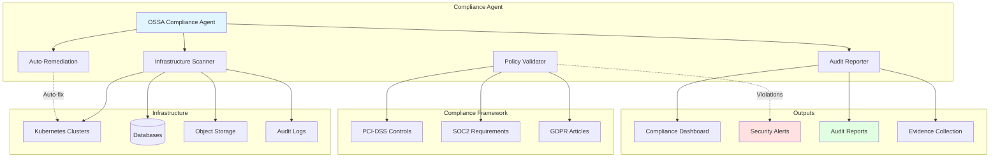

# Enterprise Financial Compliance Agent

## Problem Statement

Financial institutions must maintain continuous compliance with regulations like SOC2, PCI-DSS, and GDPR. Manual compliance audits are:
- **Slow**: Quarterly audits take weeks of manual review
- **Expensive**: Compliance teams spend 40% of time on repetitive checks
- **Error-prone**: Human reviewers miss edge cases in complex systems
- **Reactive**: Issues discovered after violations occur

**Solution**: An automated OSSA compliance agent that continuously monitors infrastructure, validates controls, generates audit trails, and enforces cost limits while maintaining strict security constraints.

## Architecture Overview



## OSSA Manifest

```yaml
apiVersion: ossa/v0.3.x
kind: Agent
metadata:
  name: financial-compliance-agent
  namespace: compliance
  labels:
    app: compliance
    tier: security
    criticality: high
  annotations:
    compliance.ossa.io/frameworks: "pci-dss,soc2,gdpr"
    compliance.ossa.io/audit-retention: "2555d"  # 7 years
    cost.ossa.io/budget-daily: "50.00"
    cost.ossa.io/alert-threshold: "0.80"

spec:
  type: worker
  description: |
    Automated financial compliance agent for continuous infrastructure
    monitoring, policy validation, and regulatory audit reporting.

    Supports PCI-DSS v4.0, SOC2 Type II, and GDPR compliance frameworks.

  runtime:
    type: kubernetes
    image: registry.example.com/agents/compliance:2.1.0
    command: ["/app/compliance-agent"]
    args:
      - "--mode=continuous"
      - "--scan-interval=3600"
      - "--auto-remediate=false"
    resources:
      limits:
        cpu: "2000m"
        memory: "4Gi"
        ephemeral-storage: "10Gi"
      requests:
        cpu: "500m"
        memory: "1Gi"
    env:
      - name: LOG_LEVEL
        value: "info"
      - name: COMPLIANCE_FRAMEWORKS
        value: "pci-dss,soc2,gdpr"
      - name: AUDIT_LOG_RETENTION_DAYS
        value: "2555"
      - name: ENABLE_AUTO_REMEDIATION
        value: "false"
      - name: COST_LIMIT_DAILY_USD
        value: "50.00"

  capabilities:
    - name: scan_infrastructure
      description: |
        Scan Kubernetes infrastructure, databases, and storage for
        compliance violations across all configured frameworks.
      input_schema:
        type: object
        required: [namespace, frameworks]
        properties:
          namespace:
            type: string
            description: Kubernetes namespace to scan
          frameworks:
            type: array
            items:
              type: string
              enum: [pci-dss, soc2, gdpr, hipaa]
            description: Compliance frameworks to validate against
          controls:
            type: array
            items:
              type: string
            description: Specific control IDs to check (optional)
          depth:
            type: string
            enum: [shallow, deep, comprehensive]
            default: deep
            description: Scan depth level
      output_schema:
        type: object
        required: [scan_id, compliant, violations, timestamp]
        properties:
          scan_id:
            type: string
            format: uuid
          compliant:
            type: boolean
          compliance_score:
            type: number
            minimum: 0
            maximum: 100
          violations:
            type: array
            items:
              type: object
              required: [control_id, severity, resource, description]
              properties:
                control_id:
                  type: string
                  description: "e.g., PCI-DSS 3.4, SOC2 CC6.1"
                framework:
                  type: string
                severity:
                  type: string
                  enum: [critical, high, medium, low, info]
                resource:
                  type: object
                  properties:
                    type: {type: string}
                    namespace: {type: string}
                    name: {type: string}
                description:
                  type: string
                remediation:
                  type: string
                evidence:
                  type: array
                  items: {type: string}
          summary:
            type: object
            properties:
              total_resources_scanned: {type: integer}
              violations_by_severity:
                type: object
                properties:
                  critical: {type: integer}
                  high: {type: integer}
                  medium: {type: integer}
                  low: {type: integer}
          timestamp:
            type: string
            format: date-time

    - name: validate_policy
      description: |
        Validate a specific resource against compliance policies
        and return detailed pass/fail results with evidence.
      input_schema:
        type: object
        required: [resource_type, resource_spec, policies]
        properties:
          resource_type:
            type: string
            enum: [deployment, service, secret, configmap, pvc, database]
          resource_spec:
            type: object
            description: Full resource specification (YAML/JSON)
          policies:
            type: array
            items:
              type: string
            description: Policy IDs to validate against
      output_schema:
        type: object
        properties:
          valid:
            type: boolean
          policy_results:
            type: array
            items:
              type: object
              properties:
                policy_id: {type: string}
                passed: {type: boolean}
                message: {type: string}
                evidence: {type: array, items: {type: string}}

    - name: generate_audit_report
      description: |
        Generate comprehensive audit report for specified time period
        with evidence collection and compliance attestation.
      input_schema:
        type: object
        required: [start_date, end_date, format]
        properties:
          start_date:
            type: string
            format: date
          end_date:
            type: string
            format: date
          format:
            type: string
            enum: [pdf, html, json, csv]
          frameworks:
            type: array
            items:
              type: string
            description: Filter by frameworks
          include_evidence:
            type: boolean
            default: true
      output_schema:
        type: object
        required: [report_id, report_url, generated_at]
        properties:
          report_id:
            type: string
            format: uuid
          report_url:
            type: string
            format: uri
          summary:
            type: object
            properties:
              period: {type: string}
              total_scans: {type: integer}
              compliance_score_avg: {type: number}
              critical_violations: {type: integer}
              remediated_violations: {type: integer}
          generated_at:
            type: string
            format: date-time
          expires_at:
            type: string
            format: date-time

    - name: auto_remediate
      description: |
        Automatically remediate approved compliance violations.
        Requires explicit approval for critical/high severity issues.
      input_schema:
        type: object
        required: [violation_id, action]
        properties:
          violation_id:
            type: string
          action:
            type: string
            enum: [apply, simulate, rollback]
          approval_token:
            type: string
            description: Required for critical/high severity
      output_schema:
        type: object
        properties:
          remediated:
            type: boolean
          actions_taken:
            type: array
            items:
              type: string
          rollback_available:
            type: boolean
          rollback_id:
            type: string

  policies:
    security:
      encryption_at_rest: required
      encryption_in_transit: required
      secrets_management: vault
      network_policies: required
      pod_security_standards: restricted

    compliance:
      frameworks:
        - pci-dss-v4.0
        - soc2-type2
        - gdpr
      data_residency: [US, EU]
      audit_logging: comprehensive
      retention_days: 2555  # 7 years for financial records

    cost_management:
      budget:
        daily_limit_usd: 50.00
        monthly_limit_usd: 1500.00
        alert_threshold: 0.80
        actions_on_limit:
          - notify_admin
          - reduce_scan_frequency
          - disable_non_critical_scans
      optimization:
        scan_scheduling: off_peak_hours
        resource_pooling: enabled
        cache_results: 3600  # 1 hour

    monitoring:
      health_checks:
        enabled: true
        interval_seconds: 30
      metrics:
        prometheus: true
        custom_metrics:
          - compliance_score
          - violations_by_severity
          - scan_duration_seconds
          - cost_per_scan_usd
      alerts:
        critical_violations: immediate
        high_violations: 15_minutes
        cost_threshold_exceeded: immediate
        agent_unhealthy: immediate

  integration:
    protocol: grpc
    api_version: v1
    endpoints:
      scan:
        path: /v1/compliance/scan
        method: POST
        rate_limit: 100/hour
      validate:
        path: /v1/compliance/validate
        method: POST
        rate_limit: 1000/hour
      report:
        path: /v1/compliance/reports
        method: GET
        rate_limit: 50/hour
      remediate:
        path: /v1/compliance/remediate
        method: POST
        rate_limit: 10/hour

    authentication:
      type: mutual-tls
      config:
        ca_cert_path: /etc/certs/ca.crt
        server_cert_path: /etc/certs/server.crt
        server_key_path: /etc/certs/server.key
        client_verification: required

    authorization:
      rbac:
        enabled: true
        roles:
          - name: compliance_admin
            permissions: [scan, validate, report, remediate]
          - name: compliance_viewer
            permissions: [report]
          - name: compliance_auditor
            permissions: [scan, report]

  monitoring:
    health_check:
      endpoint: http://localhost:8080/health
      interval_seconds: 30
      timeout_seconds: 5
      failure_threshold: 3

    readiness_check:
      endpoint: http://localhost:8080/ready
      interval_seconds: 10

    traces:
      enabled: true
      exporter: jaeger
      endpoint: http://jaeger-collector:14268/api/traces
      sample_rate: 0.1

    metrics:
      enabled: true
      exporter: prometheus
      port: 9090
      path: /metrics

    logs:
      level: info
      format: json
      output: stdout
      audit_log_path: /var/log/audit/compliance.log

  metadata:
    version: 2.1.0
    author:
      name: Security Team
      email: security@example.com
      organization: Example Corp
    license: Proprietary
    tags:
      - compliance
      - security
      - audit
      - pci-dss
      - soc2
      - gdpr
    keywords:
      - automated compliance
      - continuous monitoring
      - audit automation
      - policy validation
    documentation_url: https://docs.example.com/agents/compliance
    source_repository: https://github.com/example/compliance-agent
    issue_tracker: https://github.com/example/compliance-agent/issues
```

## Implementation (TypeScript)

```typescript
/**
 * Enterprise Financial Compliance Agent
 *
 * Production-ready OSSA agent for continuous compliance monitoring
 * with cost controls and security constraints.
 */

import { Agent, OSSARuntime } from '@ossa/runtime';
import { PrometheusMetrics } from '@ossa/monitoring';
import { VaultSecretManager } from '@ossa/security';
import { ComplianceFramework } from './frameworks';
import { CostLimiter } from './cost-management';
import { AuditLogger } from './audit';

interface ComplianceConfig {
  frameworks: string[];
  scanInterval: number;
  autoRemediate: boolean;
  costLimitDaily: number;
  auditRetentionDays: number;
}

interface ScanResult {
  scanId: string;
  compliant: boolean;
  complianceScore: number;
  violations: Violation[];
  summary: ScanSummary;
  timestamp: Date;
}

interface Violation {
  controlId: string;
  framework: string;
  severity: 'critical' | 'high' | 'medium' | 'low' | 'info';
  resource: {
    type: string;
    namespace: string;
    name: string;
  };
  description: string;
  remediation: string;
  evidence: string[];
}

interface ScanSummary {
  totalResourcesScanned: number;
  violationsBySeverity: {
    critical: number;
    high: number;
    medium: number;
    low: number;
  };
}

export class ComplianceAgent extends Agent {
  private config: ComplianceConfig;
  private frameworks: Map<string, ComplianceFramework>;
  private costLimiter: CostLimiter;
  private auditLogger: AuditLogger;
  private metrics: PrometheusMetrics;
  private secretManager: VaultSecretManager;

  constructor(runtime: OSSARuntime) {
    super(runtime);

    this.config = this.loadConfig();
    this.frameworks = this.initializeFrameworks();
    this.costLimiter = new CostLimiter({
      dailyLimit: this.config.costLimitDaily,
      alertThreshold: 0.80,
    });
    this.auditLogger = new AuditLogger({
      retentionDays: this.config.auditRetentionDays,
      encryptionEnabled: true,
    });
    this.metrics = new PrometheusMetrics();
    this.secretManager = new VaultSecretManager();
  }

  private loadConfig(): ComplianceConfig {
    return {
      frameworks: process.env.COMPLIANCE_FRAMEWORKS?.split(',') || ['pci-dss', 'soc2'],
      scanInterval: parseInt(process.env.SCAN_INTERVAL || '3600', 10),
      autoRemediate: process.env.ENABLE_AUTO_REMEDIATION === 'true',
      costLimitDaily: parseFloat(process.env.COST_LIMIT_DAILY_USD || '50.00'),
      auditRetentionDays: parseInt(process.env.AUDIT_LOG_RETENTION_DAYS || '2555', 10),
    };
  }

  private initializeFrameworks(): Map<string, ComplianceFramework> {
    const frameworks = new Map();

    for (const frameworkId of this.config.frameworks) {
      const framework = ComplianceFramework.load(frameworkId);
      frameworks.set(frameworkId, framework);
    }

    return frameworks;
  }

  /**
   * Scan infrastructure for compliance violations
   */
  async scanInfrastructure(params: {
    namespace: string;
    frameworks: string[];
    controls?: string[];
    depth?: 'shallow' | 'deep' | 'comprehensive';
  }): Promise<ScanResult> {
    const scanId = this.generateScanId();
    const startTime = Date.now();

    // Check cost limits before proceeding
    const estimatedCost = this.estimateScanCost(params.depth || 'deep');
    if (!await this.costLimiter.checkAndReserve(estimatedCost)) {
      throw new Error('Daily cost limit exceeded. Scan blocked.');
    }

    try {
      this.auditLogger.log({
        action: 'scan_started',
        scanId,
        params,
        timestamp: new Date(),
      });

      // Discover resources in namespace
      const resources = await this.discoverResources(params.namespace);
      this.metrics.recordGauge('resources_discovered', resources.length);

      // Run compliance checks across all frameworks
      const violations: Violation[] = [];

      for (const frameworkId of params.frameworks) {
        const framework = this.frameworks.get(frameworkId);
        if (!framework) {
          throw new Error(`Unknown framework: ${frameworkId}`);
        }

        const frameworkViolations = await framework.scan({
          resources,
          controls: params.controls,
          depth: params.depth || 'deep',
        });

        violations.push(...frameworkViolations);
      }

      // Calculate compliance score
      const complianceScore = this.calculateComplianceScore(violations, resources.length);

      // Generate summary
      const summary = this.generateSummary(violations, resources.length);

      const result: ScanResult = {
        scanId,
        compliant: violations.filter(v => v.severity === 'critical' || v.severity === 'high').length === 0,
        complianceScore,
        violations,
        summary,
        timestamp: new Date(),
      };

      // Record metrics
      const duration = Date.now() - startTime;
      this.metrics.recordHistogram('scan_duration_seconds', duration / 1000);
      this.metrics.recordCounter('scans_total', 1, { status: 'success' });
      this.metrics.recordGauge('compliance_score', complianceScore);
      this.metrics.recordGauge('violations_critical', summary.violationsBySeverity.critical);
      this.metrics.recordGauge('violations_high', summary.violationsBySeverity.high);

      // Log audit trail
      this.auditLogger.log({
        action: 'scan_completed',
        scanId,
        result: {
          compliant: result.compliant,
          score: complianceScore,
          violationCount: violations.length,
        },
        timestamp: new Date(),
      });

      // Send alerts for critical violations
      if (summary.violationsBySeverity.critical > 0) {
        await this.sendCriticalAlert(result);
      }

      // Record actual cost
      const actualCost = this.calculateActualCost(duration, resources.length);
      await this.costLimiter.recordActual(actualCost);
      this.metrics.recordHistogram('cost_per_scan_usd', actualCost);

      return result;

    } catch (error) {
      this.metrics.recordCounter('scans_total', 1, { status: 'error' });
      this.auditLogger.log({
        action: 'scan_failed',
        scanId,
        error: error.message,
        timestamp: new Date(),
      });
      throw error;
    }
  }

  /**
   * Validate a specific resource against policies
   */
  async validatePolicy(params: {
    resourceType: string;
    resourceSpec: any;
    policies: string[];
  }): Promise<{ valid: boolean; policyResults: any[] }> {
    this.auditLogger.log({
      action: 'policy_validation_started',
      resourceType: params.resourceType,
      policies: params.policies,
      timestamp: new Date(),
    });

    const results = [];

    for (const policyId of params.policies) {
      const policy = await this.loadPolicy(policyId);
      const result = await policy.validate(params.resourceSpec);
      results.push({
        policyId,
        passed: result.passed,
        message: result.message,
        evidence: result.evidence,
      });
    }

    const valid = results.every(r => r.passed);

    this.auditLogger.log({
      action: 'policy_validation_completed',
      valid,
      timestamp: new Date(),
    });

    return { valid, policyResults: results };
  }

  /**
   * Generate audit report
   */
  async generateAuditReport(params: {
    startDate: string;
    endDate: string;
    format: 'pdf' | 'html' | 'json' | 'csv';
    frameworks?: string[];
    includeEvidence?: boolean;
  }): Promise<any> {
    const reportId = this.generateReportId();

    this.auditLogger.log({
      action: 'report_generation_started',
      reportId,
      params,
      timestamp: new Date(),
    });

    // Retrieve scan history
    const scans = await this.auditLogger.queryScanHistory({
      startDate: new Date(params.startDate),
      endDate: new Date(params.endDate),
      frameworks: params.frameworks,
    });

    // Calculate aggregates
    const summary = {
      period: `${params.startDate} to ${params.endDate}`,
      totalScans: scans.length,
      complianceScoreAvg: this.calculateAverage(scans.map(s => s.complianceScore)),
      criticalViolations: scans.reduce((sum, s) => sum + s.violations.filter(v => v.severity === 'critical').length, 0),
      remediatedViolations: await this.countRemediatedViolations(params.startDate, params.endDate),
    };

    // Generate report in requested format
    const reportUrl = await this.formatAndStoreReport({
      reportId,
      format: params.format,
      scans,
      summary,
      includeEvidence: params.includeEvidence ?? true,
    });

    this.auditLogger.log({
      action: 'report_generation_completed',
      reportId,
      timestamp: new Date(),
    });

    return {
      reportId,
      reportUrl,
      summary,
      generatedAt: new Date().toISOString(),
      expiresAt: new Date(Date.now() + 30 * 24 * 60 * 60 * 1000).toISOString(), // 30 days
    };
  }

  /**
   * Auto-remediate violations
   */
  async autoRemediate(params: {
    violationId: string;
    action: 'apply' | 'simulate' | 'rollback';
    approvalToken?: string;
  }): Promise<any> {
    const violation = await this.loadViolation(params.violationId);

    // Check if auto-remediation is enabled
    if (!this.config.autoRemediate && params.action === 'apply') {
      throw new Error('Auto-remediation is disabled in configuration');
    }

    // Require approval for critical/high severity
    if ((violation.severity === 'critical' || violation.severity === 'high') && !params.approvalToken) {
      throw new Error('Approval token required for critical/high severity violations');
    }

    if (params.approvalToken) {
      await this.validateApprovalToken(params.approvalToken, violation);
    }

    this.auditLogger.log({
      action: 'remediation_started',
      violationId: params.violationId,
      action: params.action,
      timestamp: new Date(),
    });

    const remediation = await this.loadRemediationPlan(violation);
    const actions: string[] = [];
    let rollbackId: string | null = null;

    if (params.action === 'simulate') {
      // Dry run
      for (const step of remediation.steps) {
        actions.push(`[SIMULATED] ${step.description}`);
      }
    } else if (params.action === 'apply') {
      // Create rollback point
      rollbackId = await this.createRollbackPoint(violation.resource);

      // Apply remediation
      for (const step of remediation.steps) {
        await step.execute();
        actions.push(step.description);
      }
    } else if (params.action === 'rollback') {
      // Rollback previous remediation
      await this.executeRollback(params.violationId);
      actions.push('Rollback completed');
    }

    this.auditLogger.log({
      action: 'remediation_completed',
      violationId: params.violationId,
      actions,
      timestamp: new Date(),
    });

    return {
      remediated: params.action === 'apply',
      actionsTaken: actions,
      rollbackAvailable: rollbackId !== null,
      rollbackId,
    };
  }

  // Helper methods
  private generateScanId(): string {
    return `scan-${Date.now()}-${Math.random().toString(36).substr(2, 9)}`;
  }

  private generateReportId(): string {
    return `report-${Date.now()}-${Math.random().toString(36).substr(2, 9)}`;
  }

  private estimateScanCost(depth: string): number {
    const baseCost = 0.10; // $0.10 per scan
    const depthMultiplier = { shallow: 0.5, deep: 1.0, comprehensive: 2.0 };
    return baseCost * (depthMultiplier[depth] || 1.0);
  }

  private calculateActualCost(duration: number, resourceCount: number): number {
    const baseCost = 0.10;
    const durationCost = (duration / 1000 / 60) * 0.01; // $0.01 per minute
    const resourceCost = (resourceCount / 100) * 0.05; // $0.05 per 100 resources
    return baseCost + durationCost + resourceCost;
  }

  private calculateComplianceScore(violations: Violation[], totalResources: number): number {
    const weights = { critical: 10, high: 5, medium: 2, low: 1, info: 0 };
    const totalWeight = violations.reduce((sum, v) => sum + weights[v.severity], 0);
    const maxPossibleWeight = totalResources * weights.critical;
    return Math.max(0, 100 - (totalWeight / maxPossibleWeight) * 100);
  }

  private generateSummary(violations: Violation[], totalResources: number): ScanSummary {
    return {
      totalResourcesScanned: totalResources,
      violationsBySeverity: {
        critical: violations.filter(v => v.severity === 'critical').length,
        high: violations.filter(v => v.severity === 'high').length,
        medium: violations.filter(v => v.severity === 'medium').length,
        low: violations.filter(v => v.severity === 'low').length,
      },
    };
  }

  private async sendCriticalAlert(result: ScanResult): Promise<void> {
    // Send alerts via configured channels (email, Slack, PagerDuty, etc.)
    console.error(`CRITICAL COMPLIANCE VIOLATION DETECTED: ${result.scanId}`);
  }

  // Placeholder methods (implement based on your infrastructure)
  private async discoverResources(namespace: string): Promise<any[]> {
    // Implement Kubernetes resource discovery
    return [];
  }

  private async loadPolicy(policyId: string): Promise<any> {
    // Load policy from policy store
    return {};
  }

  private async loadViolation(violationId: string): Promise<Violation> {
    // Load violation from database
    return {} as Violation;
  }

  private async loadRemediationPlan(violation: Violation): Promise<any> {
    // Load remediation plan for violation type
    return {};
  }

  private async createRollbackPoint(resource: any): Promise<string> {
    // Create backup/snapshot for rollback
    return 'rollback-id';
  }

  private async executeRollback(violationId: string): Promise<void> {
    // Execute rollback
  }

  private async validateApprovalToken(token: string, violation: Violation): Promise<void> {
    // Validate approval token
  }

  private async countRemediatedViolations(startDate: string, endDate: string): Promise<number> {
    // Count remediated violations in period
    return 0;
  }

  private calculateAverage(numbers: number[]): number {
    return numbers.reduce((sum, n) => sum + n, 0) / numbers.length;
  }

  private async formatAndStoreReport(params: any): Promise<string> {
    // Format and store report, return URL
    return 'https://reports.example.com/report-id';
  }
}

// Entry point
async function main() {
  const runtime = new OSSARuntime({
    manifestPath: '/etc/ossa/manifest.yaml',
  });

  const agent = new ComplianceAgent(runtime);
  await agent.start();
}

main().catch(console.error);
```

## Deployment Instructions

### Prerequisites

```bash
# Kubernetes cluster (v1.24+)
# Vault for secrets management
# Prometheus for monitoring
# Jaeger for distributed tracing
```

### Step 1: Deploy Supporting Infrastructure

```yaml
# prometheus-deployment.yaml
apiVersion: v1
kind: Namespace
metadata:
  name: monitoring

---
apiVersion: apps/v1
kind: Deployment
metadata:
  name: prometheus
  namespace: monitoring
spec:
  replicas: 1
  selector:
    matchLabels:
      app: prometheus
  template:
    metadata:
      labels:
        app: prometheus
    spec:
      containers:
      - name: prometheus
        image: prom/prometheus:latest
        ports:
        - containerPort: 9090
```

### Step 2: Deploy Compliance Agent

```bash
# Create namespace
kubectl create namespace compliance

# Create secrets
kubectl create secret generic compliance-certs \
  --from-file=ca.crt=/path/to/ca.crt \
  --from-file=server.crt=/path/to/server.crt \
  --from-file=server.key=/path/to/server.key \
  -n compliance

# Deploy agent
kubectl apply -f - <<EOF
apiVersion: apps/v1
kind: Deployment
metadata:
  name: compliance-agent
  namespace: compliance
  labels:
    app: compliance
spec:
  replicas: 2
  selector:
    matchLabels:
      app: compliance
  template:
    metadata:
      labels:
        app: compliance
      annotations:
        prometheus.io/scrape: "true"
        prometheus.io/port: "9090"
    spec:
      serviceAccountName: compliance-agent
      containers:
      - name: agent
        image: registry.example.com/agents/compliance:2.1.0
        env:
        - name: COMPLIANCE_FRAMEWORKS
          value: "pci-dss,soc2,gdpr"
        - name: COST_LIMIT_DAILY_USD
          value: "50.00"
        - name: AUDIT_LOG_RETENTION_DAYS
          value: "2555"
        resources:
          requests:
            cpu: 500m
            memory: 1Gi
          limits:
            cpu: 2000m
            memory: 4Gi
        volumeMounts:
        - name: certs
          mountPath: /etc/certs
          readOnly: true
        ports:
        - containerPort: 8080
          name: http
        - containerPort: 9090
          name: metrics
        livenessProbe:
          httpGet:
            path: /health
            port: 8080
          initialDelaySeconds: 30
          periodSeconds: 30
        readinessProbe:
          httpGet:
            path: /ready
            port: 8080
          initialDelaySeconds: 10
          periodSeconds: 10
      volumes:
      - name: certs
        secret:
          secretName: compliance-certs
---
apiVersion: v1
kind: Service
metadata:
  name: compliance-agent
  namespace: compliance
spec:
  selector:
    app: compliance
  ports:
  - port: 8080
    name: http
  - port: 9090
    name: metrics
EOF
```

### Step 3: Configure RBAC

```yaml
apiVersion: v1
kind: ServiceAccount
metadata:
  name: compliance-agent
  namespace: compliance
---
apiVersion: rbac.authorization.k8s.io/v1
kind: ClusterRole
metadata:
  name: compliance-agent
rules:
- apiGroups: [""]
  resources: ["pods", "services", "secrets", "configmaps", "persistentvolumeclaims"]
  verbs: ["get", "list", "watch"]
- apiGroups: ["apps"]
  resources: ["deployments", "statefulsets", "daemonsets"]
  verbs: ["get", "list", "watch"]
- apiGroups: ["networking.k8s.io"]
  resources: ["networkpolicies"]
  verbs: ["get", "list", "watch"]
---
apiVersion: rbac.authorization.k8s.io/v1
kind: ClusterRoleBinding
metadata:
  name: compliance-agent
roleRef:
  apiGroup: rbac.authorization.k8s.io
  kind: ClusterRole
  name: compliance-agent
subjects:
- kind: ServiceAccount
  name: compliance-agent
  namespace: compliance
```

### Step 4: Verify Deployment

```bash
# Check agent status
kubectl get pods -n compliance

# View logs
kubectl logs -n compliance deployment/compliance-agent -f

# Check metrics
curl http://compliance-agent.compliance.svc.cluster.local:9090/metrics

# Run test scan
kubectl exec -n compliance deployment/compliance-agent -- \
  curl -X POST http://localhost:8080/v1/compliance/scan \
  -H "Content-Type: application/json" \
  -d '{"namespace": "default", "frameworks": ["pci-dss"]}'
```

### Step 5: Configure Monitoring

```bash
# Add Prometheus scrape config
kubectl apply -f - <<EOF
apiVersion: v1
kind: ConfigMap
metadata:
  name: prometheus-config
  namespace: monitoring
data:
  prometheus.yml: |
    global:
      scrape_interval: 15s
    scrape_configs:
    - job_name: 'compliance-agent'
      kubernetes_sd_configs:
      - role: pod
        namespaces:
          names:
          - compliance
      relabel_configs:
      - source_labels: [__meta_kubernetes_pod_annotation_prometheus_io_scrape]
        action: keep
        regex: true
EOF
```

## Production Checklist

- [ ] Secrets stored in Vault, not ConfigMaps
- [ ] Mutual TLS configured for all endpoints
- [ ] RBAC policies restricted to minimum required permissions
- [ ] Cost alerts configured in monitoring system
- [ ] Audit logs encrypted at rest
- [ ] Backup/disaster recovery plan tested
- [ ] High availability: Multiple replicas across zones
- [ ] Resource quotas configured
- [ ] Network policies enforced
- [ ] Compliance reports automatically archived to long-term storage

## Cost Management

The agent enforces daily cost limits:
- **Daily budget**: $50 (configurable)
- **Alert threshold**: 80% of budget
- **Actions on limit**: Reduce scan frequency, disable non-critical scans, notify admin
- **Actual costs logged**: Every scan records actual cost for billing

## Security Considerations

- All secrets managed via HashiCorp Vault
- Mutual TLS for all network communication
- Pod Security Standards: `restricted` profile enforced
- Network policies deny all traffic except allowed
- Audit logs encrypted with 7-year retention
- No auto-remediation without explicit approval for critical/high severity
- RBAC strictly enforced

## Further Reading

- [PCI-DSS v4.0 Requirements](https://www.pcisecuritystandards.org/)
- [SOC2 Trust Service Criteria](https://www.aicpa.org/soc)
- [GDPR Compliance Guide](https://gdpr.eu/)
- [OSSA Runtime Documentation](https://openstandardagents.org/docs/runtime)
