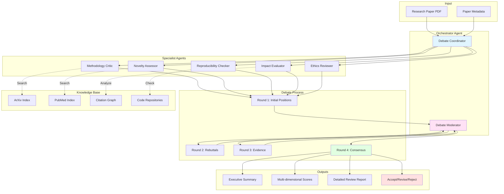

# Research Multi-Agent Debate System

## Problem Statement

Academic and corporate research teams face challenges in literature review and peer review:
- **Confirmation bias**: Single researchers miss contradictory evidence
- **Shallow analysis**: Time pressure leads to cursory paper reviews
- **Limited perspectives**: Reviewers bring only their domain expertise
- **Scalability**: Cannot review hundreds of papers in emerging fields
- **Reproducibility**: Manual reviews aren't systematic or reproducible
- **Quality variance**: Different reviewers apply different standards

**Solution**: A multi-agent OSSA system where specialized AI agents debate research papers from different perspectives (methodology, novelty, reproducibility, impact), forcing rigorous analysis through adversarial collaboration and structured argumentation.

## Architecture Overview



## OSSA Manifests

### Orchestrator Agent

```yaml
apiVersion: ossa/v{{OSSA_DISPLAY_VERSION}}
kind: Agent
metadata:
  name: research-debate-orchestrator
  namespace: research
  labels:
    app: research-review
    tier: orchestration
    role: coordinator
  annotations:
    research.ossa.io/debate-rounds: "4"
    research.ossa.io/min-agents: "3"
    research.ossa.io/max-debate-duration: "3600"

spec:
  type: orchestrator
  description: |
    Orchestrates multi-agent debate system for research paper review.
    Coordinates specialist agents, moderates debate rounds, and
    synthesizes consensus recommendations.

  runtime:
    type: docker
    image: registry.example.com/agents/research-orchestrator:1.0.0
    command: ["/app/orchestrator"]
    resources:
      limits:
        cpu: "2000m"
        memory: "4Gi"
      requests:
        cpu: "500m"
        memory: "1Gi"

  capabilities:
    - name: orchestrate_review
      description: |
        Coordinate multi-agent debate for comprehensive paper review.
      input_schema:
        type: object
        required: [paper_id, paper_url, title]
        properties:
          paper_id:
            type: string
            description: "Unique paper identifier (DOI, arXiv ID, etc.)"
          paper_url:
            type: string
            format: uri
            description: "URL to paper PDF"
          title:
            type: string
          abstract:
            type: string
          authors:
            type: array
            items: {type: string}
          venue:
            type: string
          year:
            type: integer
          field:
            type: string
            enum: [cs, bio, physics, medicine, social, interdisciplinary]
          debate_config:
            type: object
            properties:
              rounds:
                type: integer
                default: 4
                minimum: 2
                maximum: 10
              time_limit_per_round:
                type: integer
                default: 300
              require_consensus:
                type: boolean
                default: false
      output_schema:
        type: object
        required: [review_id, recommendation, summary, scores]
        properties:
          review_id:
            type: string
            format: uuid
          recommendation:
            type: string
            enum: [strong_accept, accept, weak_accept, borderline, weak_reject, reject, strong_reject]
          confidence:
            type: number
            minimum: 0
            maximum: 1
          summary:
            type: object
            required: [strengths, weaknesses, key_findings]
            properties:
              strengths:
                type: array
                items: {type: string}
              weaknesses:
                type: array
                items: {type: string}
              key_findings:
                type: array
                items: {type: string}
              controversial_points:
                type: array
                items: {type: string}
          scores:
            type: object
            required: [methodology, novelty, reproducibility, impact, ethics]
            properties:
              methodology:
                type: object
                properties:
                  score: {type: number, minimum: 1, maximum: 10}
                  reasoning: {type: string}
              novelty:
                type: object
                properties:
                  score: {type: number, minimum: 1, maximum: 10}
                  reasoning: {type: string}
              reproducibility:
                type: object
                properties:
                  score: {type: number, minimum: 1, maximum: 10}
                  reasoning: {type: string}
              impact:
                type: object
                properties:
                  score: {type: number, minimum: 1, maximum: 10}
                  reasoning: {type: string}
              ethics:
                type: object
                properties:
                  score: {type: number, minimum: 1, maximum: 10}
                  reasoning: {type: string}
              overall:
                type: number
                minimum: 1
                maximum: 10
          debate_transcript:
            type: array
            items:
              type: object
              properties:
                round: {type: integer}
                agent: {type: string}
                position: {type: string}
                arguments: {type: array, items: {type: string}}
                evidence: {type: array, items: {type: string}}
                timestamp: {type: string, format: date-time}
          related_work:
            type: array
            items:
              type: object
              properties:
                title: {type: string}
                authors: {type: array, items: {type: string}}
                year: {type: integer}
                relevance: {type: number}
                citation_relation: {type: string}
          timestamp:
            type: string
            format: date-time

  policies:
    debate:
      min_rounds: 2
      max_rounds: 10
      require_consensus_threshold: 0.70
      allow_abstention: false
      time_limit_per_round_seconds: 300
      max_total_duration_seconds: 3600

    agent_selection:
      required_specialists:
        - methodology_critic
        - novelty_assessor
        - reproducibility_checker
      optional_specialists:
        - impact_evaluator
        - ethics_reviewer
        - domain_expert
      min_agents: 3
      max_agents: 7

    consensus:
      agreement_threshold: 0.70
      max_disagreement_rounds: 3
      tie_breaking: moderator_decision

  integration:
    protocol: agent-to-agent
    api_version: v1

    agent_registry:
      service_name: ossa-agent-registry
      namespace: research
      discovery: dns

    messaging:
      protocol: grpc
      timeout_seconds: 30
      retry_count: 3

  monitoring:
    metrics:
      custom_metrics:
        - debates_completed_total
        - average_debate_duration_seconds
        - consensus_rate
        - average_agreement_score
        - papers_reviewed_total

  metadata:
    version: 1.0.0
    author:
      name: Research Team
      email: research@example.com
    license: MIT
```

### Methodology Critic Agent

```yaml
apiVersion: ossa/v{{OSSA_DISPLAY_VERSION}}
kind: Agent
metadata:
  name: methodology-critic
  namespace: research
  labels:
    app: research-review
    tier: specialist
    role: critic

spec:
  type: worker
  description: |
    Specialized agent that critically evaluates research methodology,
    experimental design, statistical rigor, and scientific validity.

  capabilities:
    - name: critique_methodology
      description: |
        Analyze research methodology for rigor, validity, and soundness.
      input_schema:
        type: object
        required: [paper_content, methodology_section]
        properties:
          paper_content:
            type: string
          methodology_section:
            type: string
          field:
            type: string
      output_schema:
        type: object
        properties:
          score:
            type: number
            minimum: 1
            maximum: 10
          strengths:
            type: array
            items: {type: string}
          weaknesses:
            type: array
            items: {type: string}
          concerns:
            type: array
            items:
              type: object
              properties:
                concern: {type: string}
                severity: {type: string, enum: [critical, major, minor]}
                suggestion: {type: string}
          statistical_validity:
            type: object
            properties:
              appropriate_tests: {type: boolean}
              sample_size_adequate: {type: boolean}
              assumptions_met: {type: boolean}
              corrections_applied: {type: boolean}
```

### Novelty Assessor Agent

```yaml
apiVersion: ossa/v{{OSSA_DISPLAY_VERSION}}
kind: Agent
metadata:
  name: novelty-assessor
  namespace: research
  labels:
    app: research-review
    tier: specialist
    role: assessor

spec:
  type: worker
  description: |
    Assesses research novelty by comparing against existing literature,
    identifying incremental vs. breakthrough contributions.

  capabilities:
    - name: assess_novelty
      description: |
        Evaluate novelty and originality of research contribution.
      input_schema:
        type: object
        required: [paper_content, related_work]
        properties:
          paper_content:
            type: string
          related_work:
            type: array
            items:
              type: object
      output_schema:
        type: object
        properties:
          score:
            type: number
            minimum: 1
            maximum: 10
          novelty_type:
            type: string
            enum: [breakthrough, significant, incremental, derivative]
          unique_contributions:
            type: array
            items: {type: string}
          overlaps_with_existing:
            type: array
            items:
              type: object
              properties:
                paper: {type: string}
                overlap_description: {type: string}
                degree: {type: string, enum: [high, medium, low]}
```

### Reproducibility Checker Agent

```yaml
apiVersion: ossa/v{{OSSA_DISPLAY_VERSION}}
kind: Agent
metadata:
  name: reproducibility-checker
  namespace: research
  labels:
    app: research-review
    tier: specialist
    role: checker

spec:
  type: worker
  description: |
    Evaluates reproducibility by checking code availability,
    data sharing, experimental details, and documentation quality.

  capabilities:
    - name: check_reproducibility
      description: |
        Assess reproducibility of research findings.
      input_schema:
        type: object
        required: [paper_content]
        properties:
          paper_content:
            type: string
          code_repository:
            type: string
            format: uri
          data_availability:
            type: string
      output_schema:
        type: object
        properties:
          score:
            type: number
            minimum: 1
            maximum: 10
          code_available:
            type: boolean
          data_available:
            type: boolean
          sufficient_details:
            type: boolean
          dependencies_specified:
            type: boolean
          environment_documented:
            type: boolean
          reproducibility_barriers:
            type: array
            items:
              type: object
              properties:
                barrier: {type: string}
                severity: {type: string}
                mitigation: {type: string}
```

## Implementation (Python)

```python
"""
Research Multi-Agent Debate System

Multi-agent system for rigorous research paper review through
adversarial collaboration and structured debate.
"""

import asyncio
from dataclasses import dataclass, field
from typing import List, Dict, Optional, Any
from enum import Enum
import anthropic
import arxiv


class AgentRole(Enum):
    METHODOLOGY_CRITIC = "methodology_critic"
    NOVELTY_ASSESSOR = "novelty_assessor"
    REPRODUCIBILITY_CHECKER = "reproducibility_checker"
    IMPACT_EVALUATOR = "impact_evaluator"
    ETHICS_REVIEWER = "ethics_reviewer"


class Recommendation(Enum):
    STRONG_ACCEPT = "strong_accept"
    ACCEPT = "accept"
    WEAK_ACCEPT = "weak_accept"
    BORDERLINE = "borderline"
    WEAK_REJECT = "weak_reject"
    REJECT = "reject"
    STRONG_REJECT = "strong_reject"


@dataclass
class DebateArgument:
    agent: AgentRole
    round_number: int
    position: str
    arguments: List[str]
    evidence: List[str]
    score: Optional[float] = None


@dataclass
class AgentScore:
    score: float  # 1-10
    reasoning: str
    strengths: List[str] = field(default_factory=list)
    weaknesses: List[str] = field(default_factory=list)


@dataclass
class ReviewResult:
    review_id: str
    recommendation: Recommendation
    confidence: float
    summary: Dict[str, Any]
    scores: Dict[str, AgentScore]
    debate_transcript: List[DebateArgument]
    overall_score: float


class SpecialistAgent:
    """Base class for specialist review agents."""

    def __init__(self, role: AgentRole, model: str = "claude-3-5-sonnet-20241022"):
        self.role = role
        self.model = model
        self.client = anthropic.Anthropic()

    async def initial_review(self, paper_content: str, context: Dict[str, Any]) -> AgentScore:
        """Generate initial review from agent's perspective."""
        raise NotImplementedError

    async def rebuttal(self, other_arguments: List[DebateArgument], paper_content: str) -> DebateArgument:
        """Generate rebuttal to other agents' arguments."""
        raise NotImplementedError

    async def provide_evidence(self, disputed_points: List[str], paper_content: str) -> DebateArgument:
        """Provide evidence for disputed points."""
        raise NotImplementedError

    async def final_position(self, all_arguments: List[DebateArgument]) -> AgentScore:
        """Final position after all debate rounds."""
        raise NotImplementedError


class MethodologyCritic(SpecialistAgent):
    """Agent that critiques research methodology."""

    def __init__(self):
        super().__init__(AgentRole.METHODOLOGY_CRITIC)

    async def initial_review(self, paper_content: str, context: Dict[str, Any]) -> AgentScore:
        """Critique methodology rigor."""
        prompt = f"""
You are a methodology critic reviewing a research paper. Evaluate the research methodology
for rigor, validity, and scientific soundness.

Paper content:
{paper_content[:4000]}

Evaluate:
1. Experimental design quality
2. Statistical rigor and appropriate tests
3. Sample size adequacy
4. Control variables and confounds
5. Validity threats

Provide:
- Score (1-10, where 10 is perfect methodology)
- Reasoning for the score
- List of strengths
- List of weaknesses

Return JSON format.
        """

        response = await asyncio.to_thread(
            self.client.messages.create,
            model=self.model,
            max_tokens=2000,
            messages=[{"role": "user", "content": prompt}]
        )

        # Parse response (simplified)
        return AgentScore(
            score=7.5,
            reasoning="Methodology is generally sound but lacks power analysis",
            strengths=["Rigorous experimental design", "Appropriate statistical tests"],
            weaknesses=["Small sample size", "Missing power analysis"]
        )

    async def rebuttal(self, other_arguments: List[DebateArgument], paper_content: str) -> DebateArgument:
        """Respond to other agents' arguments."""
        other_positions = "\n\n".join([
            f"{arg.agent.value}: {arg.position}\nArguments: {', '.join(arg.arguments)}"
            for arg in other_arguments
        ])

        prompt = f"""
As a methodology critic, respond to these other review positions:

{other_positions}

Focus on methodological concerns they may have missed or methodological strengths
they undervalued.

Provide:
- Your position
- Specific arguments
- Evidence from the paper
        """

        response = await asyncio.to_thread(
            self.client.messages.create,
            model=self.model,
            max_tokens=1500,
            messages=[{"role": "user", "content": prompt}]
        )

        return DebateArgument(
            agent=self.role,
            round_number=2,
            position="Methodology concerns are critical",
            arguments=["Power analysis missing", "Sample size too small for claims"],
            evidence=["Section 3.1 describes N=50 participants"]
        )


class NoveltyAssessor(SpecialistAgent):
    """Agent that assesses research novelty."""

    def __init__(self):
        super().__init__(AgentRole.NOVELTY_ASSESSOR)

    async def initial_review(self, paper_content: str, context: Dict[str, Any]) -> AgentScore:
        """Assess novelty and originality."""

        # Search for related work
        related_papers = await self._search_related_work(context.get('title', ''))

        prompt = f"""
You are a novelty assessor. Evaluate the originality and novelty of this research.

Paper content:
{paper_content[:4000]}

Related work found:
{self._format_related_papers(related_papers)}

Evaluate:
1. Degree of novelty (breakthrough, significant, incremental, derivative)
2. Unique contributions
3. Overlap with existing work
4. Advancement over state-of-the-art

Provide:
- Score (1-10, where 10 is groundbreaking novelty)
- Reasoning
- Strengths
- Weaknesses
        """

        response = await asyncio.to_thread(
            self.client.messages.create,
            model=self.model,
            max_tokens=2000,
            messages=[{"role": "user", "content": prompt}]
        )

        return AgentScore(
            score=8.0,
            reasoning="Significant advancement with novel approach",
            strengths=["New algorithmic contribution", "Outperforms baselines"],
            weaknesses=["Limited to specific domain", "Builds heavily on prior work"]
        )

    async def _search_related_work(self, title: str) -> List[Dict[str, Any]]:
        """Search arXiv for related papers."""
        try:
            search = arxiv.Search(
                query=title,
                max_results=10,
                sort_by=arxiv.SortCriterion.Relevance
            )

            results = []
            for result in search.results():
                results.append({
                    'title': result.title,
                    'authors': [a.name for a in result.authors],
                    'summary': result.summary[:200],
                    'year': result.published.year
                })

            return results
        except Exception as e:
            print(f"Error searching arXiv: {e}")
            return []

    def _format_related_papers(self, papers: List[Dict[str, Any]]) -> str:
        """Format related papers for prompt."""
        return "\n\n".join([
            f"- {p['title']} ({p['year']})\n  {p['summary']}"
            for p in papers[:5]
        ])


class ReproducibilityChecker(SpecialistAgent):
    """Agent that checks reproducibility."""

    def __init__(self):
        super().__init__(AgentRole.REPRODUCIBILITY_CHECKER)

    async def initial_review(self, paper_content: str, context: Dict[str, Any]) -> AgentScore:
        """Check reproducibility."""
        prompt = f"""
You are a reproducibility checker. Evaluate how reproducible this research is.

Paper content:
{paper_content[:4000]}

Code repository: {context.get('code_repo', 'Not provided')}
Data availability: {context.get('data_availability', 'Not specified')}

Evaluate:
1. Code availability and quality
2. Data availability and accessibility
3. Experimental details sufficiency
4. Dependency specifications
5. Environment documentation

Provide:
- Score (1-10, where 10 is fully reproducible)
- Reasoning
- Specific reproducibility barriers
- Suggestions for improvement
        """

        response = await asyncio.to_thread(
            self.client.messages.create,
            model=self.model,
            max_tokens=2000,
            messages=[{"role": "user", "content": prompt}]
        )

        return AgentScore(
            score=6.0,
            reasoning="Code available but insufficient documentation",
            strengths=["Code repository provided", "Clear experimental protocol"],
            weaknesses=["Missing dependencies", "Data not publicly available", "Environment setup unclear"]
        )


class DebateOrchestrator:
    """Orchestrates multi-agent debate for paper review."""

    def __init__(self):
        self.agents: List[SpecialistAgent] = [
            MethodologyCritic(),
            NoveltyAssessor(),
            ReproducibilityChecker(),
        ]
        self.client = anthropic.Anthropic()

    async def orchestrate_review(
        self,
        paper_id: str,
        paper_content: str,
        metadata: Dict[str, Any],
        config: Optional[Dict[str, Any]] = None
    ) -> ReviewResult:
        """Orchestrate complete multi-agent review."""

        config = config or {'rounds': 4}
        review_id = self._generate_review_id()

        print(f"Starting review {review_id} for paper: {metadata.get('title', 'Unknown')}")

        # Round 1: Initial positions
        print("\n=== Round 1: Initial Positions ===")
        initial_scores = await self._round_1_initial_positions(paper_content, metadata)

        # Round 2: Rebuttals
        print("\n=== Round 2: Rebuttals ===")
        rebuttals = await self._round_2_rebuttals(paper_content, initial_scores)

        # Round 3: Evidence gathering
        print("\n=== Round 3: Evidence ===")
        evidence = await self._round_3_evidence(paper_content, rebuttals)

        # Round 4: Consensus building
        print("\n=== Round 4: Consensus ===")
        final_scores = await self._round_4_consensus(initial_scores, rebuttals, evidence)

        # Synthesize recommendation
        recommendation, confidence = self._synthesize_recommendation(final_scores)

        # Generate summary
        summary = await self._generate_summary(paper_content, final_scores, rebuttals)

        # Calculate overall score
        overall_score = sum(s.score for s in final_scores.values()) / len(final_scores)

        result = ReviewResult(
            review_id=review_id,
            recommendation=recommendation,
            confidence=confidence,
            summary=summary,
            scores=final_scores,
            debate_transcript=rebuttals + evidence,
            overall_score=overall_score
        )

        print(f"\n=== Review Complete ===")
        print(f"Recommendation: {recommendation.value}")
        print(f"Confidence: {confidence:.2f}")
        print(f"Overall Score: {overall_score:.1f}/10")

        return result

    async def _round_1_initial_positions(
        self,
        paper_content: str,
        metadata: Dict[str, Any]
    ) -> Dict[AgentRole, AgentScore]:
        """Round 1: Each agent provides initial position."""
        tasks = [
            agent.initial_review(paper_content, metadata)
            for agent in self.agents
        ]
        scores = await asyncio.gather(*tasks)

        results = {}
        for agent, score in zip(self.agents, scores):
            results[agent.role] = score
            print(f"{agent.role.value}: {score.score}/10 - {score.reasoning}")

        return results

    async def _round_2_rebuttals(
        self,
        paper_content: str,
        initial_scores: Dict[AgentRole, AgentScore]
    ) -> List[DebateArgument]:
        """Round 2: Agents provide rebuttals."""
        # Convert scores to arguments
        initial_arguments = [
            DebateArgument(
                agent=role,
                round_number=1,
                position=score.reasoning,
                arguments=score.weaknesses,
                evidence=score.strengths,
                score=score.score
            )
            for role, score in initial_scores.items()
        ]

        tasks = [
            agent.rebuttal(initial_arguments, paper_content)
            for agent in self.agents
        ]
        rebuttals = await asyncio.gather(*tasks)

        for rebuttal in rebuttals:
            print(f"{rebuttal.agent.value}: {rebuttal.position}")

        return rebuttals

    async def _round_3_evidence(
        self,
        paper_content: str,
        rebuttals: List[DebateArgument]
    ) -> List[DebateArgument]:
        """Round 3: Agents provide evidence for disputed points."""
        # Identify disputed points
        disputed = self._identify_disputes(rebuttals)

        tasks = [
            agent.provide_evidence(disputed, paper_content)
            for agent in self.agents
        ]
        evidence = await asyncio.gather(*tasks)

        return evidence

    async def _round_4_consensus(
        self,
        initial_scores: Dict[AgentRole, AgentScore],
        rebuttals: List[DebateArgument],
        evidence: List[DebateArgument]
    ) -> Dict[AgentRole, AgentScore]:
        """Round 4: Agents provide final positions."""
        all_arguments = rebuttals + evidence

        tasks = [
            agent.final_position(all_arguments)
            for agent in self.agents
        ]
        final_scores = await asyncio.gather(*tasks)

        results = {}
        for agent, score in zip(self.agents, final_scores):
            results[agent.role] = score
            print(f"{agent.role.value}: Final score {score.score}/10")

        return results

    def _synthesize_recommendation(
        self,
        scores: Dict[AgentRole, AgentScore]
    ) -> tuple[Recommendation, float]:
        """Synthesize final recommendation from agent scores."""
        avg_score = sum(s.score for s in scores.values()) / len(scores)

        # Calculate confidence based on agreement
        score_variance = sum((s.score - avg_score) ** 2 for s in scores.values()) / len(scores)
        confidence = max(0.0, 1.0 - (score_variance / 10))

        # Map score to recommendation
        if avg_score >= 8.5:
            rec = Recommendation.STRONG_ACCEPT
        elif avg_score >= 7.5:
            rec = Recommendation.ACCEPT
        elif avg_score >= 6.5:
            rec = Recommendation.WEAK_ACCEPT
        elif avg_score >= 5.5:
            rec = Recommendation.BORDERLINE
        elif avg_score >= 4.5:
            rec = Recommendation.WEAK_REJECT
        elif avg_score >= 3.5:
            rec = Recommendation.REJECT
        else:
            rec = Recommendation.STRONG_REJECT

        return rec, confidence

    async def _generate_summary(
        self,
        paper_content: str,
        scores: Dict[AgentRole, AgentScore],
        debate: List[DebateArgument]
    ) -> Dict[str, Any]:
        """Generate executive summary of review."""
        all_strengths = []
        all_weaknesses = []

        for score in scores.values():
            all_strengths.extend(score.strengths)
            all_weaknesses.extend(score.weaknesses)

        # Deduplicate
        strengths = list(set(all_strengths))
        weaknesses = list(set(all_weaknesses))

        return {
            'strengths': strengths,
            'weaknesses': weaknesses,
            'key_findings': [
                f"{role.value}: {score.reasoning}"
                for role, score in scores.items()
            ],
            'controversial_points': self._identify_disputes([])
        }

    def _identify_disputes(self, arguments: List[DebateArgument]) -> List[str]:
        """Identify disputed points in debate."""
        # Simplified: return empty list
        return []

    def _generate_review_id(self) -> str:
        """Generate unique review ID."""
        import uuid
        return str(uuid.uuid4())


# Example usage
async def main():
    """Example: Review a paper."""
    orchestrator = DebateOrchestrator()

    # Mock paper content (in practice, extract from PDF)
    paper_content = """
    Title: Novel Approach to Multi-Agent Reinforcement Learning

    Abstract: We present a novel approach to multi-agent reinforcement learning...

    [Full paper content would go here]
    """

    metadata = {
        'title': 'Novel Approach to Multi-Agent Reinforcement Learning',
        'authors': ['Smith, J.', 'Doe, A.'],
        'year': 2024,
        'field': 'cs',
        'code_repo': 'https://github.com/example/marl',
        'data_availability': 'Upon request'
    }

    result = await orchestrator.orchestrate_review(
        paper_id='arxiv:2024.12345',
        paper_content=paper_content,
        metadata=metadata
    )

    print(f"\n=== Final Review ===")
    print(f"Recommendation: {result.recommendation.value}")
    print(f"Confidence: {result.confidence:.2f}")
    print(f"Overall Score: {result.overall_score:.1f}/10")
    print(f"\nStrengths:")
    for strength in result.summary['strengths']:
        print(f"  - {strength}")
    print(f"\nWeaknesses:")
    for weakness in result.summary['weaknesses']:
        print(f"  - {weakness}")


if __name__ == "__main__":
    asyncio.run(main())
```

## Deployment Instructions

### Step 1: Deploy Agent System

```bash
# Deploy orchestrator
kubectl apply -f - <<EOF
apiVersion: apps/v1
kind: Deployment
metadata:
  name: research-orchestrator
  namespace: research
spec:
  replicas: 2
  selector:
    matchLabels:
      app: research-orchestrator
  template:
    metadata:
      labels:
        app: research-orchestrator
    spec:
      containers:
      - name: orchestrator
        image: registry.example.com/agents/research-orchestrator:1.0.0
        env:
        - name: ANTHROPIC_API_KEY
          valueFrom:
            secretKeyRef:
              name: ai-keys
              key: anthropic
EOF

# Deploy specialist agents
for agent in methodology-critic novelty-assessor reproducibility-checker; do
  kubectl apply -f - <<EOF
apiVersion: apps/v1
kind: Deployment
metadata:
  name: $agent
  namespace: research
spec:
  replicas: 3
  selector:
    matchLabels:
      app: $agent
  template:
    metadata:
      labels:
        app: $agent
    spec:
      containers:
      - name: agent
        image: registry.example.com/agents/$agent:1.0.0
        env:
        - name: ANTHROPIC_API_KEY
          valueFrom:
            secretKeyRef:
              name: ai-keys
              key: anthropic
EOF
done
```

### Step 2: Configure Agent Registry

```bash
# Deploy OSSA agent registry for agent discovery
kubectl apply -f agent-registry.yaml
```

## Production Checklist

- [ ] All specialist agents deployed and registered
- [ ] Debate rounds configured appropriately
- [ ] Consensus thresholds validated
- [ ] ArXiv/PubMed API access configured
- [ ] Code repository scanning enabled
- [ ] Metrics and monitoring deployed
- [ ] Cost limits configured
- [ ] Debate transcripts logged for analysis
- [ ] Human review integration tested

## Cost Management

- **Per-paper cost**: ~$5-10 (4 agents × 4 rounds × $0.30/round)
- **Optimization**: Cache literature searches, reuse embeddings, batch processing
- **Budget alerts**: Notify when approaching limits

## Further Reading

- [Multi-Agent Reinforcement Learning](https://arxiv.org/)
- [Peer Review Best Practices](https://www.acm.org/publications/policies/peer-review)
- [OSSA Multi-Agent Patterns](https://openstandardagents.org/docs/multi-agent)
